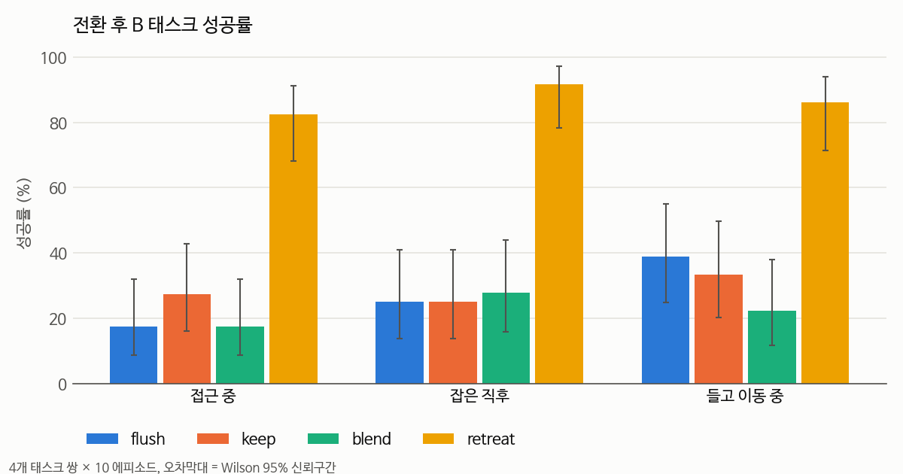
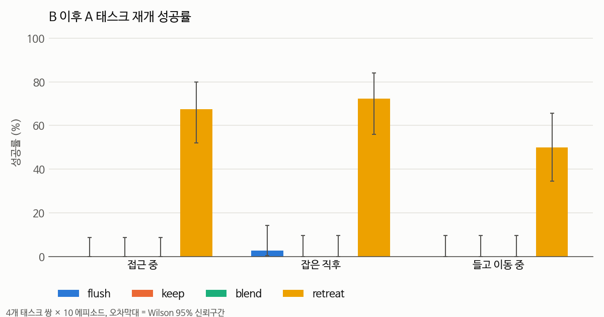
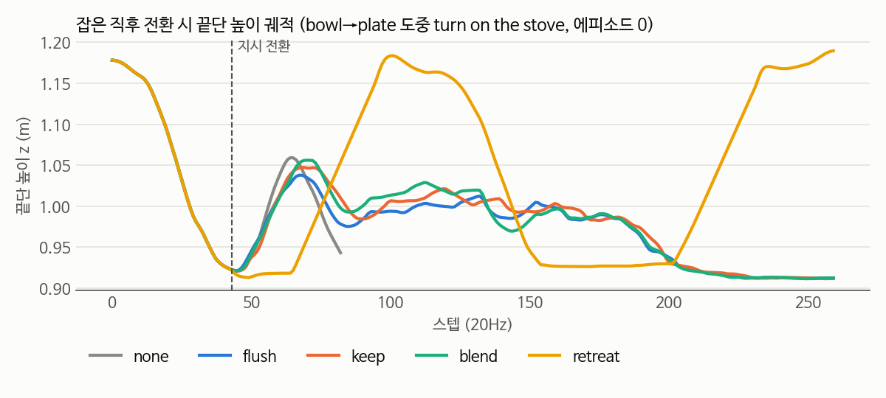
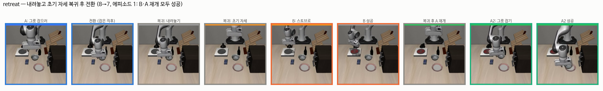
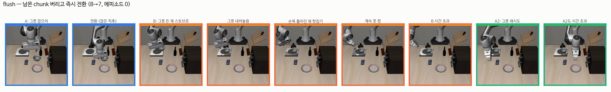
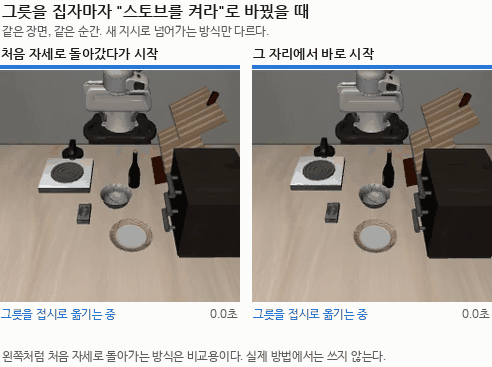
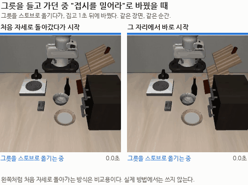

# 2026-09-14 첫 태스크 전환 실험 (LIBERO-Goal + SmolVLA)

> 한 줄 요약: 일을 하는 도중에 지시를 바꾸면 SmolVLA는 새 지시를 알아듣기는 하지만 해내지 못한다. 남은 동작을 어떻게 처리하느냐보다, 지시를 바꾸는 순간 로봇이 어떤 자세에 있느냐가 더 크게 작용하는 것으로 보인다.

## 오늘 결과 한눈에

| 무엇을 봤나 | 결과 |
|---|---|
| LIBERO-Goal 기준 성공률 | 74% (10개 태스크 × 10회) |
| 남은 동작을 버리기 / 마저 하기 / 섞기 | 새 지시 성공률 18~39%, 셋 사이 차이 없음 |
| 그릇을 내려놓고 처음 자세로 돌아간 뒤 새 지시 | 82~92% (다만 처음 자세로 돌아가는 방식이라 비교용) |
| 새 지시를 마친 뒤 원래 일로 돌아가기 | 처음 자세로 돌아간 경우만 50~72%, 나머지는 0~3% |

## 실험 설정

환경을 리셋하지 않고 **지시문만** 바꾼다. 로봇 자세와 물체 위치는 그대로 이어진다.

- 원래 하던 일을 A, 도중에 새로 시킨 일을 B라고 부른다. 예를 들어 A는 "그릇을 접시에 올려라", B는 "스토브를 켜라"
- B를 마친 뒤 다시 A를 시켜 마저 하게 하는 것을 "A 재개"라고 부른다
- LIBERO는 1초에 20번 동작을 보낸다(20Hz). 한 번을 1스텝이라고 한다

지시를 바꾸는 시점은 세 가지로 나눴다.

| 시점 | 설명 |
|---|---|
| 다가가는 중 | 아직 아무것도 안 잡았을 때 (시작 후 15스텝) |
| 잡은 직후 | 물체를 쥔 지 3스텝 뒤 |
| 들고 가는 중 | 물체를 쥔 지 20스텝(1초) 뒤 |

SmolVLA는 한 번 추론할 때 앞으로 50스텝치 동작을 한꺼번에 내놓는다(action chunk). 그중 10개를 실행하고 다시 추론하게 해 두었다. 지시를 바꾸는 순간 아직 실행하지 않은 동작이 남아 있는데, 이걸 어떻게 처리할지를 네 가지로 비교했다.

| 방식 (코드 이름) | 내용 |
|---|---|
| 버리기 (`flush`) | 남은 동작을 버리고 바로 새 지시로 다시 추론 |
| 마저 하기 (`keep`) | 남은 동작(최대 9스텝)을 다 실행한 뒤 새 지시로 |
| 섞기 (`blend`) | 이전 동작과 새 동작의 앞 10스텝을 가중평균 |
| 돌아갔다가 (`retreat`) | 쥔 물체를 내려놓고 팔을 들어 처음 자세로 돌아간 뒤 새 지시로. 이것만 모델이 아니라 직접 짠 스크립트로 움직인다 |

측정한 것: B 성공(전환 뒤 300스텝 안에 B를 해냈나), A 재개 성공, 반응 시간(지시를 바꾼 뒤 궤적이 원래 궤적에서 2cm 벌어지기까지의 스텝), 저크(동작이 얼마나 튀는지, 작을수록 부드러움), 낙하(그리퍼를 열 때 물체가 3cm 넘게 떨어졌나).

## 한 일

- 연구실 PC(GTX 1080 Ti)에 LeRobot 0.4.4와 hf-libero 환경을 만들고 SmolVLA의 LIBERO 체크포인트를 돌렸다
- LIBERO-Goal 10개 태스크를 10번씩 돌려 기준 성공률을 쟀다. 평균 74%
- 전환 실험 스크립트를 짰다. B의 성공 조건(BDDL goal)을 같은 시뮬레이션에 넣어 판정한다
- 방식 4개 × 시점 3개 × 태스크 쌍 4개 × 10회, 총 600 에피소드를 돌렸다
- 결론을 확인하려고 세 가지를 더 해 봤다: 1·5스텝에서 바로 바꾸기, 매 스텝 다시 추론하기, A 재개 영상 직접 보기
- 자세한 내용은 [전환 실험 보고서](../04_실습/05_libero/switch_experiment/README.md)에 있다

## 알게 된 것

- **남은 동작을 버리든, 마저 하든, 섞든 B 성공률은 18~39%로 비슷했다.** 신뢰구간이 모두 겹친다
- 그릇을 내려놓고 처음 자세로 돌아간 뒤 바꾸면 B가 82~92%, A 재개가 50~72%였다. 나머지 방식은 A 재개가 0~3%
- 시작하자마자(1·5스텝) 바꾸면 버리기 방식도 B가 70~100%인데, 15스텝만 지나도 20~40%로 떨어진다. 지시를 바꾸는 순간의 자세가 중요해 보인다
- SmolVLA는 새 지시를 알아듣기는 한다. B의 대상 쪽으로 움직인다. 자동 분류로 보면 "지시를 무시한" 경우는 0건이고, 실패는 전부 시간 초과였다. 낯선 자세(틀어진 손목)에서 수행을 못 하는 것으로 보인다
- 매 스텝 다시 추론해도 나아지지 않았다(25% vs 28%). 저크는 오히려 2배 가까이 커졌다
- 연구 계획에서는 "잡은 직후"가 가장 어려울 거라고 봤는데, 이 설정에서는 다가가는 중에 바꿔도 똑같이 어려웠다(18% vs 25%)
- LAB03에서는 섞기가 저크를 9배 줄였지만, 실제 시뮬레이션에서는 줄어드는 폭이 작았다
- 반응 시간은 같은 에피소드의 "안 바꿨을 때" 궤적과 비교하면 깔끔하게 잴 수 있다. 전환 전까지 두 궤적이 완전히 같기 때문이다

## 결과 그림

전환 후 B 성공률

B를 마친 뒤 A 재개 성공률

같은 에피소드에서 방식별 손 높이. 버리기·마저 하기·섞기는 전환 뒤 궤적이 거의 겹치고, 돌아갔다가(주황)만 크게 다르다. 내려놓고 위로 올라갔다가(100스텝 부근) 다시 작업한다.

## 장면

잘 되는 경우: 처음 자세로 돌아갔다가 시작

안 되는 경우: 그 자리에서 바로 시작 (같은 태스크 쌍, 같은 시점)

그릇을 든 채 스토브로 가서 그릇을 내려놓기는 하는데, 손목이 틀어진 자세 그대로 스토브 손잡이를 계속 헛집는다.

## 영상

위쪽 색 띠와 화면 아래 글자가 지금 무엇을 하는 중인지 보여준다. 파랑은 원래 일, 회색은 처음 자세로 돌아가는 스크립트, 주황은 새 지시, 초록은 원래 일로 돌아간 구간이다.

그릇을 집자마자 "스토브를 켜라"로 바꿨을 때 (그릇을 접시에 → 스토브 켜기)

왼쪽은 그릇을 내려놓고 처음 자세로 돌아간 뒤 스토브를 켜고, 다시 돌아와 원래 일까지 마친다. 오른쪽은 그릇을 든 채 스토브로 가서 내려놓지만, 손잡이를 계속 헛집고 원래 일로도 돌아가지 못한다.

그릇을 들고 가던 중 "접시를 밀어라"로 바꿨을 때 (그릇을 스토브에 → 접시 밀기)

이 에피소드에서는 왼쪽이 접시는 밀었지만 원래 일로는 돌아가지 못했고, 오른쪽은 둘 다 실패했다.

손목 카메라가 포함된 원본 영상(mp4)은 [results/videos/](../04_실습/05_libero/switch_experiment/results/videos)에 있다.

## 막힌 것과 해결

| 문제 | 원인 | 해결 |
|---|---|---|
| LeRobot main 설치 불가 | main 브랜치가 Python 3.12 이상을 요구 | Python 3.10 + LeRobot 0.4.4 사용 |
| 1080 Ti에서 PyTorch 버전 | 문서에는 2.7.1 권장 | 2.10.0+cu126도 정상 동작 확인 (cu126 빌드는 Pascal 지원) |
| evdev, egl-probe 의존성 | LIBERO 실행에는 필요 없는 패키지 | uv override로 설치에서 제외 (`sys_platform == 'never'`) |
| 물체를 쥔 채 바꾸면 B 대신 A를 마저 함 (초기 테스트 1회) | 지시보다 눈앞의 상태를 따르는 것으로 추정 | 600회 실험에서는 버리기·마저 하기·섞기 모두 "B 대신 A 완료"가 0건. 진짜 문제는 자세였다 |
| 방향 변화로 잰 반응 시간이 전환을 안 해도 튐 | 물체를 들어 올릴 때 원래 방향이 바뀜 | "안 바꿨을 때" 궤적과 2cm 벌어지는 시점으로 다시 정의 |
| 버리기 방식 A 재개 0%가 버그인지 | | 5스텝 전환(B 100% 성공) 뒤에도 0/20. 영상으로 확인해 보니 실제 현상 |
| 이 PC에 git 없음 | | `git`, `gh` 설치 후 `gh auth login` |

## 측정한 수치

| 항목 | 값 | 조건 |
|---|---|---|
| LIBERO-Goal 기준 성공률 | 74% (74/100) | 10개 태스크 × 10회, `n_action_steps=10`, 1080 Ti fp32 |
| B 성공률 (버리기 / 마저 하기 / 섞기 / 돌아갔다가) | 25 / 25 / 28 / 92% | 잡은 직후, 36회 |
| 〃 | 18 / 28 / 18 / 82% | 다가가는 중, 4쌍 × 10회 |
| 〃 | 39 / 33 / 22 / 86% | 들고 가는 중, 36회 |
| A 재개 성공률, 돌아갔다가 | 68 / 72 / 50% | 다가가는 중 / 잡은 직후 / 들고 가는 중 |
| A 재개 성공률, 나머지 방식 | 0~3% | 모든 시점 |
| 저크 (중앙값) | 안 바꿈 7.3, 버리기 9.0, 섞기 8.6, 돌아갔다가 3.4 | 잡은 직후 |
| 반응 시간 (중앙값) | 돌아갔다가 2.5~6, 버리기 3~8, 섞기 6~10, 마저 하기 5~11스텝 | 20Hz |
| 돌아갔다가 방식이 더 쓰는 시간 | 67스텝 (A→B), 76스텝 (B→A) | 중앙값 |
| 버리기 방식 B 성공, 1 / 5 / 15스텝에 전환 | 80 / 100 / 30% | 8→7, 1→5 합산, 각 20회 |
| 버리기 방식 B 성공, 매 스텝 추론 vs 10스텝마다 | 25% vs 28% | 15스텝·잡은 직후, 40회 |
| 추론 1회 VRAM | 약 2.2GB | nvidia-smi, 프로세스 1개 |
| 600 에피소드 걸린 시간 | 약 3.5시간 | 3개 병렬 (순차로는 10.3시간) |

## 읽은 논문

이번에는 실험 위주였다. 결과를 보니 동작 묶음을 매끄럽게 잇는 Real-Time Chunking 쪽보다, 상태나 계획 수준에서 개입하는 Hi Robot, RT-H 쪽 문제에 가까워 보여서 다음에 읽을 순서를 바꿨다.

## 다음에 할 것

- [ ] 처음 자세로 돌아가는 동작을 나눠 보기: 그리퍼만 열기 / 손목 방향만 / 위치만 / 물체를 든 채로. 무엇이 핵심인가
- [ ] 실패 영상에 손으로 유형을 달아 누적 막대그래프로
- [ ] 에피소드를 20~50회로 늘려 버리기·마저 하기·섞기 차이 다시 확인
- [ ] 처음 자세를 쓰지 않는 방법 구상: 돌아갔다가 방식의 궤적을 교사 삼아 전환 데모 학습
- [ ] Hi Robot, RT-H 논문 노트
