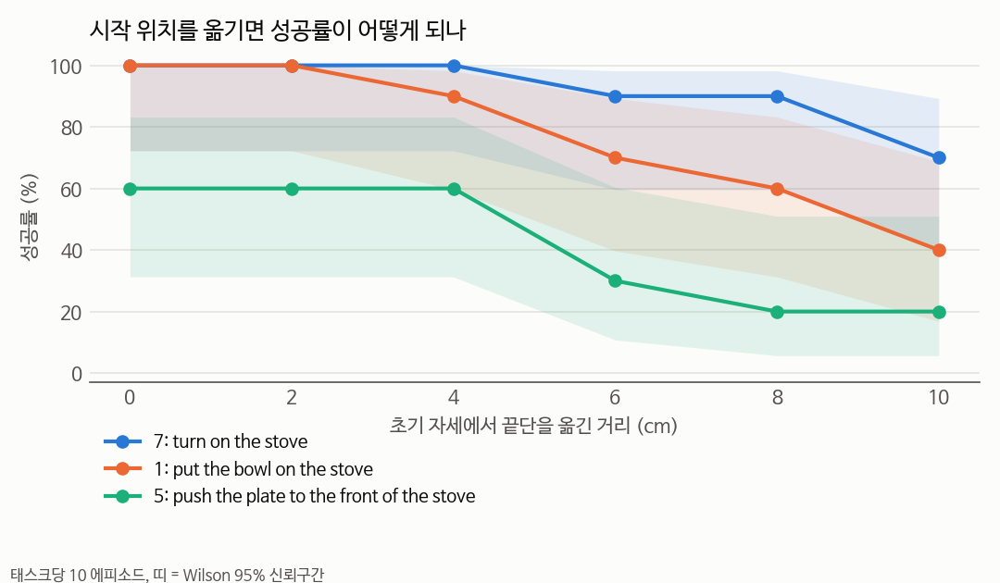
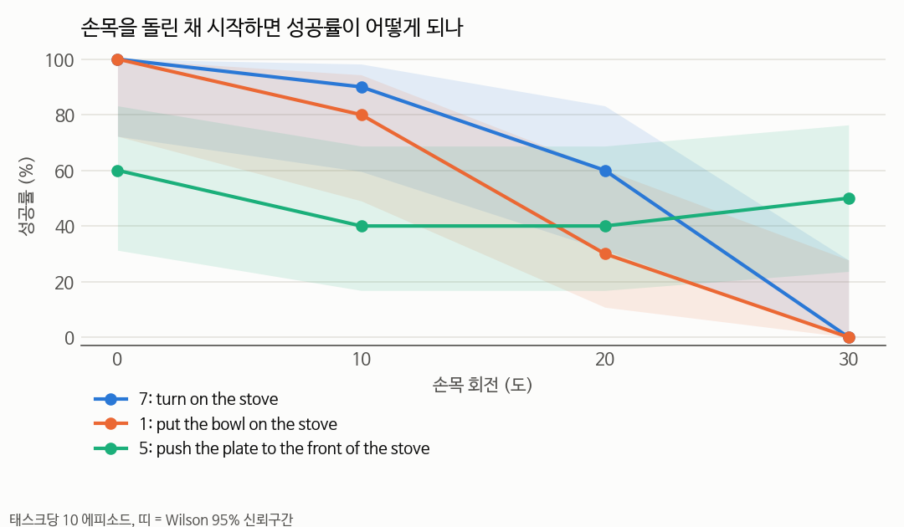

# 2026-09-16 — 자세 민감도 측정 + 선행 연구 확인

> **한 줄 요약**: 손목을 30도만 돌려놓고 시작해도 성공률이 0%가 된다. 전환이 실패하는 진짜 이유를 숫자로 확인했고, 같은 주제의 선행 연구(SwitchVLA)를 찾았다.

## 목표

- 9/14 결론("전환 실패의 원인은 전환 시점의 로봇 자세")의 근거를 직접 측정으로 굳히기
- 관련 논문 찾아 정리하기
- LIBERO + SmolVLA를 직접 돌리는 방법 문서화

## 한 일

> 코랩 공부 기록은 [공부 일지 9/16](공부/2026-09-16.md)로 분리했습니다.

- **자세 민감도 실험 270 에피소드**: 전환을 빼고, 시작 자세만 틀어놓고 태스크를 시켰음
  → [04_실습/05_libero/pose_sensitivity](../04_실습/05_libero/pose_sensitivity/README.md)
- 선행 연구 2편 정리: [SwitchVLA](../02_논문노트/SwitchVLA.md), [LIBERO-Plus](../02_논문노트/LIBERO-Plus.md)
- [실행방법 문서](../04_실습/05_libero/실행방법.md) 작성 — 빈 환경에서 설치 명령을 실제로 검증
- 영상을 바로 보는 스크립트 `watch.py` 추가 (돌리고 나면 재생기가 열림)
- 9/14 일지에 용어 설명 절 추가, 일지 목록 자동 생성 스크립트 추가

## 알게 된 것

### 1. 자세가 얼마나 틀어지면 무너지는가

- 위치는 **4cm까지 멀쩡, 6cm부터 꺾이고 10cm면 43%**
- 손목 회전은 **10도에서 이미 70%, 20도 43%, 30도 17%**
- 물체를 집는 태스크 2개는 **30도에서 0%** — 완전히 실패
- **위치보다 회전에 훨씬 약하다.** 9/14에서 retreat(위치+회전 모두 복구)만 잘 됐던 이유이고, flush 영상에서 "손목이 틀어진 채 헛집던" 장면과 정확히 맞는다

### 2. 같은 주제의 선행 연구가 있다

- **[SwitchVLA](../02_논문노트/SwitchVLA.md)** (2025-06)가 태스크 전환을 정면으로 다루고, **LIBERO-Goal**을 쓰고, 전환 시점도 접촉 전/중/후로 나눈다. 우리 실험 설계와 거의 같다
- 그 논문의 π0 기준값(Early 40.7% / Mid 8.3% / Late 10.2%)은 우리 SmolVLA 측정(18% / 25% / 39%)과 같은 이야기 → **우리 측정이 틀리지 않았다는 확인**
- 남은 차별점: ① **B 이후 A 재개**를 다루지 않음 ② SwitchVLA는 재학습 필요, 우리 retreat은 공개 체크포인트 그대로 ③ **왜 실패하는지의 설명**(자세) ④ 저사양 조건
- **[LIBERO-Plus](../02_논문노트/LIBERO-Plus.md)** (2025-10)는 관절 각도를 흔들면 95% → 30% 미만이라고 보고. 우리 결과와 같은 현상이고, 이번 실험은 그걸 거리·각도 단위로 세분화한 셈

## 막힌 것 / 해결 방법

| 문제 | 원인 | 해결 |
|---|---|---|
| 태스크 5의 0cm 기준점이 60% (9/14엔 100%) | 스크립트 구현·난수 차이 | 자세 조작 없이 같은 스크립트로 재측정 → 70%. 편차 범위로 보고 곡선 해석에 주의 표기 |
| 실시간으로 로봇팔 창을 띄우지 못함 | MuJoCo 네이티브 창이 이 PC에서 안 열림, OpenCV는 headless 빌드 | 녹화 후 재생 방식(`watch.py`)으로 대체. 실시간 창은 `python3-tk` 설치 필요 |

## 측정한 수치

| 항목 | 값 | 조건 |
|---|---|---|
| 위치 오프셋별 성공률 | **87 / 87 / 83 / 63 / 57 / 43%** | 0·2·4·6·8·10cm, 태스크 3개 합산 30회씩 |
| 손목 회전별 성공률 | **87 / 70 / 43 / 17%** | 0·10·20·30도, 태스크 3개 합산 30회씩 |
| 30도에서 물체 집는 태스크 | **0%** (태스크 7, 1) | 각 10회 |
| 실험 규모 | 270 에피소드 | 약 1.5시간, 3프로세스 병렬 |

## 읽은 논문

- **SwitchVLA** (arXiv 2506.03574) — 초록·프로젝트 페이지 수준. **본문 정독 필요**
- **LIBERO-Plus** (arXiv 2510.13626) — 초록 수준

## 다음에 할 것

- [ ] **retreat ablation**: 그리퍼만 열기 / 위치만 복귀 / 회전만 복귀 / 전부 → 이번 결과대로면 **회전 복귀가 핵심**일 것
- [ ] SwitchVLA 본문 정독 → 차별점 좁히기 (특히 재개를 정말 안 다루는지 확인)
- [ ] 오프셋 방향별(앞뒤·좌우·상하) 차이 보기
- [ ] 교수님께 중간 보고 (9/14 + 9/16 결과와 SwitchVLA 관계)
- [ ] 1-2 CNN과 ViT 진도 (9/15에서 이어서)
