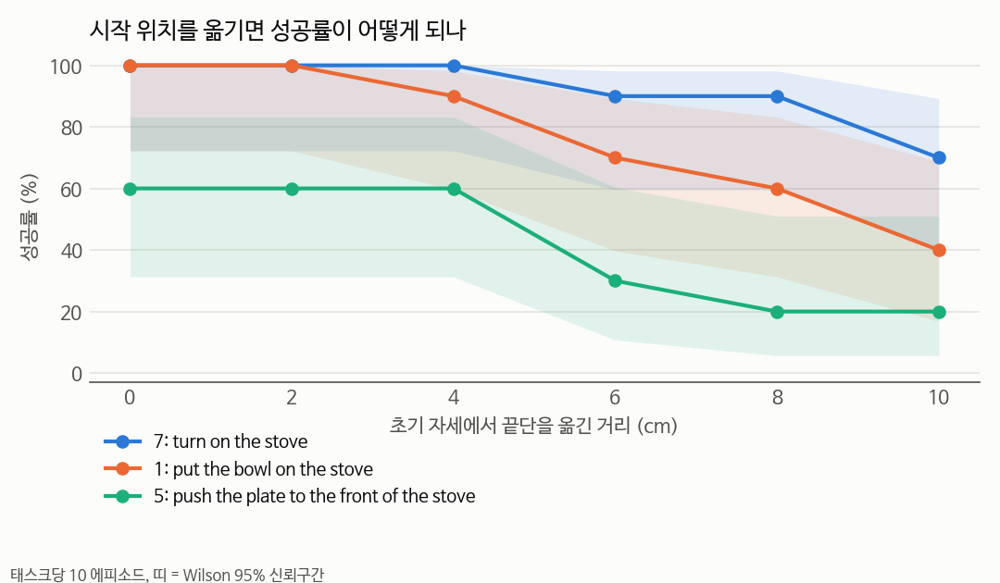
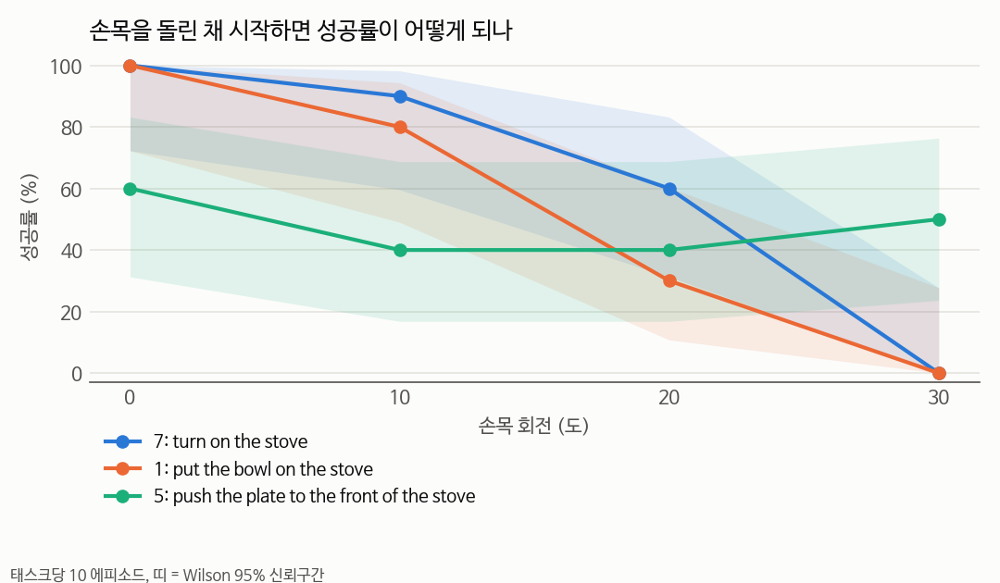

# 2026-09-16 자세 민감도 측정과 선행 연구 확인

> 한 줄 요약: 손목을 30도만 돌려놓고 시작해도 성공률이 크게 떨어진다(태스크 두 개는 0%). 전환이 실패하는 이유를 숫자로 확인했고, 같은 주제의 선행 연구(SwitchVLA)를 찾았다.

## 오늘 결과 한눈에

| 무엇을 봤나 | 결과 |
|---|---|
| 시작 위치를 옮겨 놓으면 | 4cm까지는 괜찮고, 6cm부터 떨어져 10cm에서 43% |
| 손목을 돌려 놓으면 | 10도 70%, 20도 43%, 30도 17% |
| 선행 연구 | SwitchVLA(2025-06)가 거의 같은 설정으로 전환을 다룬다. 다만 "원래 일로 돌아가기"는 다루지 않는다 |

## 목표

- 9/14에 세운 결론("전환 실패는 전환 순간의 자세 때문")을 직접 재서 확인하기
- 관련 논문 찾아 정리하기
- LIBERO와 SmolVLA를 직접 돌리는 방법 문서로 남기기

## 한 일

코랩 공부 기록은 [공부 일지 9/16](공부/2026-09-16.md)에 따로 적었다.

- 자세 민감도 실험 270 에피소드. 전환 없이 시작 자세만 틀어 놓고 태스크를 시켰다. 자세한 내용은 [자세 민감도 보고서](../04_실습/05_libero/pose_sensitivity/README.md)
- 선행 연구 2편 정리: [SwitchVLA](../02_논문노트/SwitchVLA.md), [LIBERO-Plus](../02_논문노트/LIBERO-Plus.md)
- [실행 방법 문서](../04_실습/05_libero/실행방법.md) 작성. 빈 환경에서 설치 명령을 실제로 돌려 확인했다
- 돌리고 나면 바로 영상이 열리는 `watch.py` 추가
- 9/14 일지에 용어 설명을 붙이고, 일지 목록을 자동으로 만드는 스크립트를 추가했다

## 알게 된 것

### 자세가 얼마나 틀어지면 무너지나

- 위치는 4cm까지 멀쩡하고, 6cm부터 꺾여 10cm에서 43%
- 손목 회전은 10도에서 이미 70%, 20도 43%, 30도 17%
- 태스크 7과 1은 30도에서 0%
- **위치보다 손목 방향에 훨씬 약하다.** 9/14에 처음 자세로 완전히 돌아간 경우만 잘 됐던 것, 그리고 영상에서 손목이 틀어진 채 손잡이를 헛집던 장면과 맞아떨어진다

### 같은 주제의 선행 연구가 있다

- [SwitchVLA](../02_논문노트/SwitchVLA.md)(2025-06)가 태스크 전환을 정면으로 다룬다. LIBERO-Goal을 쓰고, 전환 시점도 접촉 전·중·후로 나눈다. 우리 실험 설계와 거의 같다
- 그 논문의 π0 기준값(접촉 전 40.7%, 접촉 중 8.3%, 접촉 후 10.2%)은 우리 SmolVLA 측정(18%, 25%, 39%)과 같은 이야기를 한다. 우리 측정이 틀리지 않았다는 확인이 된다
- 우리만의 차이는 네 가지다. B를 마친 뒤 A로 돌아가는 것을 다룬다, 공개 체크포인트를 그대로 쓴다(SwitchVLA는 재학습 필요), 왜 실패하는지(자세)를 설명한다, 저사양 조건을 본다
- [LIBERO-Plus](../02_논문노트/LIBERO-Plus.md)(2025-10)는 관절 각도를 흔들면 성공률이 95%에서 30% 아래로 떨어진다고 보고했다. 같은 현상이고, 우리 실험은 그것을 거리와 각도 단위로 잘게 나눠 본 셈이다

## 막힌 것과 해결

| 문제 | 원인 | 해결 |
|---|---|---|
| 태스크 5의 0cm 기준이 60% (9/14에는 100%) | 스크립트 구현과 난수 차이 | 자세를 건드리지 않고 같은 스크립트로 다시 재니 70%. 편차 범위로 보고, 곡선을 읽을 때 주의 표시 |
| 로봇팔 창을 실시간으로 못 띄움 | MuJoCo 네이티브 창이 이 PC에서 안 열리고, OpenCV는 headless 빌드 | 녹화한 뒤 재생하는 방식(`watch.py`)으로 대신함. 실시간 창은 `python3-tk` 설치 필요 |

## 측정한 수치

| 항목 | 값 | 조건 |
|---|---|---|
| 위치 오프셋별 성공률 | 87 / 87 / 83 / 63 / 57 / 43% | 0·2·4·6·8·10cm, 태스크 3개 합산 30회씩 |
| 손목 회전별 성공률 | 87 / 70 / 43 / 17% | 0·10·20·30도, 태스크 3개 합산 30회씩 |
| 30도에서 태스크 7, 1 | 0% | 각 10회 |
| 실험 규모 | 270 에피소드 | 약 1.5시간, 3개 병렬 |

## 읽은 논문

- SwitchVLA (arXiv 2506.03574): 초록과 프로젝트 페이지까지. 본문은 다시 읽어야 한다
- LIBERO-Plus (arXiv 2510.13626): 초록까지

## 다음에 할 것

- [ ] 처음 자세로 돌아가는 동작 나눠 보기: 그리퍼만 열기 / 위치만 / 손목 방향만 / 전부. 오늘 결과대로라면 손목 방향이 핵심일 것
- [ ] SwitchVLA 본문 정독. 특히 원래 일로 돌아가기를 정말 안 다루는지 확인
- [ ] 옮기는 방향(앞뒤·좌우·위아래)별 차이 보기
- [ ] 교수님께 중간 보고 (9/14, 9/16 결과와 SwitchVLA와의 관계)
- [ ] 1-2 CNN과 ViT 진도 (9/15에서 이어서)
