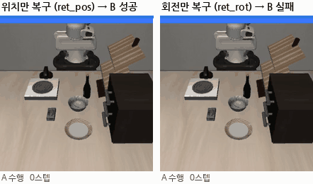
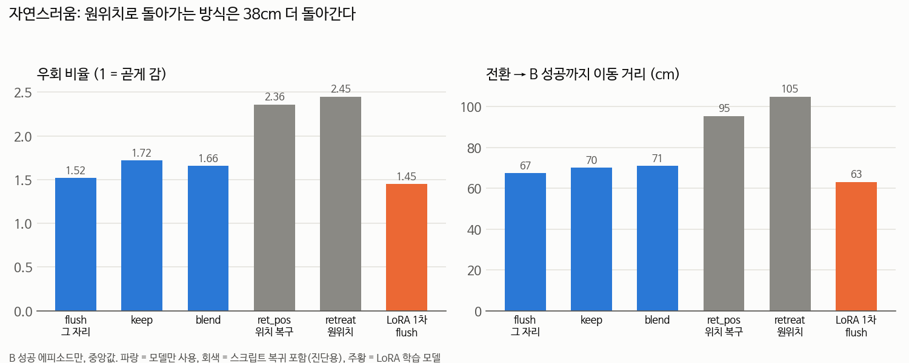
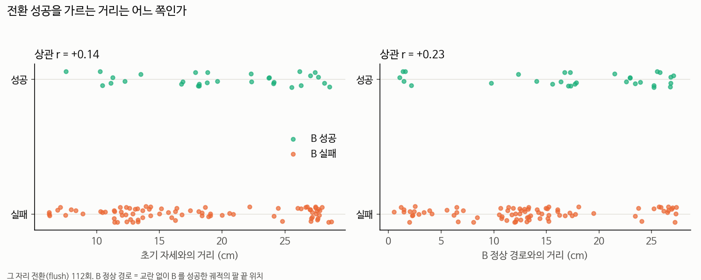

# 2026-09-17 — retreat ablation + LoRA 1차 학습 (실패 분석)

> **한 줄 요약**: 초기 위치로 되돌리면 전환이 잘 되지만(ablation), 실제 전환에서 팔 위치 차이로는 성공이 갈리지 않았다 — 시도마다 바뀌는 무작위성이 더 컸다. LoRA 1차는 데이터 편향으로 실패, 2차 진행 중.

## 이 일지에서 새로 나오는 말

| 말 | 뜻 |
|---|---|
| **ablation** | 방법의 요소를 하나씩 빼서 뭐가 효과를 내는지 보는 실험 |
| **ret_pos / ret_rot / release** | retreat 을 쪼갠 것. 위치만 복구 / 손목 회전만 복구 / 내려놓기만 |
| **LoRA** | 모델 가중치는 얼리고 작은 행렬만 붙여 학습. 우리는 전체의 0.81%만 학습 |
| **self-imitation** | 모델이 스스로 성공한 궤적만 모아 다시 학습 |
| **hindsight relabeling** | B 에 실패했어도 우연히 해낸 다른 태스크 C 로 이름표를 바꿔 학습 데이터로 씀 |
| **망각** | 새로 배우다 원래 잘하던 걸 못하게 되는 것 |
| **균형 샘플링** | 태스크마다 뽑힐 확률을 같게 맞추는 것 |

전체 용어는 [용어사전](../용어사전.md).

## 📚 이 일지에서 참고한 논문

| 어느 부분 | 참고한 논문 | 어떻게 썼나 |
|---|---|---|
| retreat 을 쪼개 요소별 기여 보기 | (방법론) [06_실험방법론 6-5 ablation](../01_공부순서/06_실험방법론.md) | 한 번에 하나만 다르게 |
| "retreat 은 최종 방법이 아니다" 판단 | [SwitchVLA](../02_논문노트/SwitchVLA.md) | 그 논문의 `advance`(기준 자세로 이동)·`rollback` 이 retreat 과 같은 발상 → 우리는 리셋 금지로 차별화 |
| 전환 실패 원인 = 자세 분포 이탈 | [LIBERO-Plus](../02_논문노트/LIBERO-Plus.md) | 초기 상태 교란에 VLA 가 무너진다는 외부 근거 |
| 1080 Ti 에서 학습 | [LoRA](../02_논문노트/LoRA-망각.md) | action expert 에만 LoRA, 0.81% 만 학습 |
| 자세를 틀어놓고 데이터 모으기 | [DART](../02_논문노트/DART.md) | 일부러 벗어난 상태를 만들어 교정 데이터 수집 |
| **LoRA 1차 실패 분석** | [Q-Planning](../02_논문노트/Q-Planning.md) | "성공만 재학습(filtered SFT)은 정체한다" — 우리 실패를 그대로 설명 |
| 2차: 망각 줄이기 (rank 16→8, lr↓, 정상 궤적 섞기) | [LoRA Learns Less and Forgets Less](../02_논문노트/LoRA-망각.md) | rank 가 작을수록 덜 잊음 |
| 2차: 실패해도 데이터 건지기 | [HER](../02_논문노트/HER.md) | B 실패 궤적에 우연히 달성한 태스크 이름표를 붙여 저장 |
| 2차: 교란 범위를 8→20cm 로 단계적 확장 | [Reverse Curriculum](../02_논문노트/Reverse-Curriculum.md) | 너무 어렵지 않은 범위부터 넓히기 |
| 학습 없는 매끄러운 전환 (`rtc` 전략 추가) | [Real-Time Chunking](../02_논문노트/Real-Time-Chunking.md) | 이전 chunk 를 guidance 로 줘서 이어 생성 |
| 사용 모델 구조 이해 | [SmolVLA](../02_논문노트/SmolVLA.md) | action expert 32층, flow matching 10단계 |

전체 목록: [참고 논문 목록](../02_논문노트/참고논문_목록.md)

## 목표

- retreat 의 어느 요소가 효과를 내는지 확인 (ablation)
- 초기 자세로 되돌리지 않고도 되게, **모델 자체를 학습** (1080 Ti, LoRA)
- 제약 확정: **전환할 때 초기 자세 복귀 금지, 사람처럼 자연스럽게** ([연구주제.md](../연구주제.md))

## 한 일

> 코랩 공부 기록은 [공부 일지 9/17](공부/2026-09-17.md)로 분리했습니다.

- **retreat ablation 240 에피소드** → [보고서](../04_실습/05_libero/retreat_ablation/README.md)
- **LoRA 1차**: 데이터 수집 → 학습 → 평가까지 자동 파이프라인 → [보고서](../04_실습/05_libero/lora_v1/README.md)
  - 성공 궤적 184 에피소드 수집 (자세 교란 148 + 전환 36), 21,428 프레임
  - LoRA 학습: 4.92M 파라미터(0.81%), 1080 Ti VRAM 2.67GB, 32분
  - 평가: 자세 민감도 180 에피소드 + 전환 80 에피소드
- **LoRA 2차** 설계 후 실행 시작 → [계획](../04_실습/05_libero/lora_v2/README.md)
- 선행 연구 [SwitchVLA](../02_논문노트/SwitchVLA.md) 본문 확인: `advance` 모드가 **기준 시작 자세로 이동** → 우리 제약("리셋 금지")이 차별점

## 알게 된 것

### 1. 핵심은 위치 복구

| 전략 | B 성공 | A 재개 |
|---|---|---|
| 그 자리에서 교체 (flush) | 32% | 1% |
| 내려놓기만 (release) | **8%** | 3% |
| 회전만 복구 (ret_rot) | **12%** | 4% |
| 위치만 복구 (ret_pos) | **64%** | 16% |
| 위치 + 회전 (retreat) | **89%** | 61% |

*같은 에피소드: 왼쪽 위치만 복구 → 성공, 오른쪽 회전만 복구 → 실패*

- 회전만 고치면 거의 효과 없음, **위치가 대부분을 설명**
- **내려놓기만 하면 오히려 더 나빠짐** — 테이블 근처 낮은 곳에 팔이 머물러 더 낯선 상태가 됨
- 9/16엔 회전이 더 치명적이었는데 모순이 아니었다. 전환 순간 팔이 초기 자세에서 **12~27cm** 떨어져 있었고, 9/16 측정 범위는 10cm까지였다. **실제 전환에서는 위치 이탈이 훨씬 크다**

### 2. LoRA 1차는 실패, 원인은 데이터

- 전환 성공률 **32% → 32%** (잡은 직후는 오르고, 들고 이동 중은 내림)
- 1→5, 2→5 는 원래 0~17%라 성공 데이터가 **0개** → 전혀 못 배움. **self-imitation 은 못하는 걸 가르칠 수 없다**
- "turn on the stove" 가 학습 데이터의 **40%** → 같은 스토브 근처의 "put the bowl on the stove" 가 100% → 60% 로 망가짐

*LoRA 가 나아진 에피소드 예시 (4→7, 그 자리에서 전환): 왼쪽 원본 실패, 오른쪽 LoRA 1차 성공. 전체 합계는 변화 없음*

### 3. 그래도 학습 자체는 정상

검증 loss 가 안정적이었고, 데이터가 있던 "잡은 직후" 전환은 50→70%, 30→60% 로 올랐다. **데이터만 맞으면 학습이 먹힌다.**

### 4. 자연스러움을 숫자로 — 원위치 방식은 38cm 더 돌아간다

| 전략 | 경로 길이 | 우회 비율 | 소요 시간 | 멈춤 |
|---|---|---|---|---|
| flush | 67cm | 1.52 | 7.7초 | 1 |
| retreat (원위치) | **105cm** | **2.45** | 9.0초 | **2** |
| LoRA 1차 flush | **63cm** | **1.45** | 8.0초 | 1 |

- **성공률과 자연스러움이 반대로 간다.** retreat 은 가장 잘 되지만 가장 돌아간다 → 리셋 금지 제약이 필요한 이유
- **LoRA 1차가 가장 곧다.** 성공률은 못 올렸지만, 리셋 없는 데이터로 배워서 돌아가지 않고 바로 간다
- 우회 비율 = 이동 거리 ÷ 직선 거리. 멈춤 = 0.25초 이상 거의 정지. 자세한 정의는 [보고서](../04_실습/05_libero/naturalness/README.md)

### 5. ⚠️ 가설 검증: 팔 위치로는 성공이 안 갈린다 (앞선 해석 수정)

"전환 순간 팔이 멀어서 실패한다"를 에피소드 112개로 직접 확인했더니 **틀렸습니다.**

| 거리 기준 | 성공과의 상관 |
|---|---|
| 초기 자세와의 거리 | r = +0.14 (오히려 멀수록 약간 더 성공) |
| B 정상 경로와의 거리 | r = +0.23, 쌍마다 방향이 제각각 |

- **장면(초기 배치)은 성공 차이의 16~31% 만 설명**. 나머지는 같은 장면에서도 **시도마다 결과가 바뀌는 무작위성**
- 앞선 결론 수정: "위치가 멀어서" 가 아니라, "초기 자세로 되돌리면 좋아진다(ablation)"까지만 사실. 되돌리기는 위치 말고도 **물체 내려놓기·멈추기·장면 정리** 효과가 섞여 있음
- **다음 방향이 바뀜**: 팔 위치 거리로 고르는 `bon` 은 약할 것으로 예상. 무작위성이 크다는 건 **좋은 후보와 나쁜 후보가 섞여 나온다**는 뜻이라, **학습한 판정기로 고르기**([V-GPS](../02_논문노트/V-GPS.md), [Q-Planning](../02_논문노트/Q-Planning.md))나 **노이즈 조종**([DSRL](../02_논문노트/DSRL.md))이 유망
- 자세한 분석: [가설 검증 보고서](../04_실습/05_libero/hypothesis_check/README.md)

## 막힌 것 / 해결 방법

| 문제 | 원인 | 해결 |
|---|---|---|
| peft 가 SmolVLA 에 안 붙음 (`SmolVLAConfig has no attribute get`) | peft 는 HF 설정 형식을 기대하는데 SmolVLA 설정은 dataclass | 정책 전체 대신 **action expert(LlamaModel)만** peft 로 감쌈 |
| 학습 중 저장하면 LoRA 가 풀림 | `merge_and_unload` 가 LoRA 를 제거하고 옵티마이저 참조가 끊김 | 학습 중엔 어댑터만 저장, 끝나고 따로 합치기 |
| forward 가 패딩 마스크를 못 읽음 | SmolVLA 가 읽는 키 이름이 `actions_id_pad` (오타 같은 이름) | 그 이름으로 넣음 |
| 1→5, 2→5 성공 데이터 0개 | 원래 성공률이 낮음 | 2차에서 hindsight relabeling |
| hindsight 모드가 태스크 짝을 못 받음 | 조건문이 `switch` 만 확인 | `switch`, `hindsight` 둘 다 처리 |
| MuJoCo 수집 중 EGL 오류 로그 | 에피소드 종료 시 렌더러 정리 경고 | 결과에 영향 없음 (수집 통계 정상) |

## 측정한 수치

| 항목 | 값 | 조건 |
|---|---|---|
| B 성공: flush / release / ret_rot / ret_pos / retreat | 32 / 8 / 12 / **64** / **89%** | 잡은 직후 + 들고 이동 중, 약 72회씩 |
| 전환 시 초기 자세로부터 거리 | 12.1 / 18.2 / **27.1cm** | 접근 중 / 들고 이동 중 / 잡은 직후, 중앙값 |
| LoRA 1차 전환 B 성공 | **32% → 32%** | flush, 8개 조건 × 10회 |
| LoRA 1차 태스크 1 (교란 없음) | 100% → **60%** | 10회 |
| LoRA 학습 파라미터 | **4.92M (0.81%)** | r=16, action expert 만 |
| LoRA 학습 VRAM / 시간 | **2.67GB / 32분** | 1080 Ti fp32, 배치 4×2, 2000 스텝 |
| 학습 데이터 중 turn on the stove 비중 | **40.1%** | 184 에피소드 |
| 우회 비율 flush / retreat / LoRA 1차 | 1.52 / **2.45** / **1.45** | B 성공 에피소드, 중앙값 |
| 이동 거리 flush / retreat / LoRA 1차 | 67 / **105** / 63cm | 전환 → B 성공 |

## 읽은 논문

- SwitchVLA 본문: 행동 모드 forward / rollback / advance. **advance 는 기준 시작 자세로 이동** → 우리가 금지한 방식. 재개(resumption)는 다루지 않음

## 다음에 할 것

- [ ] LoRA 2차 결과 확인 (진행 중: 정상 궤적 + 먼 교란 + hindsight + 균형 샘플링)
- [ ] 2차도 안 되면: **커리큘럼** — 교란 범위를 조금씩 넓혀가며 여러 번 반복 학습
- [ ] A 재개 데이터가 여전히 없음 → 재개 전용 수집 방법 설계
- [x] ~~자연스러움 지표 코드에 추가~~ → 완료. 되돌아감 지표는 구분력이 없어 정의 재검토 필요
- [ ] 1-2 CNN·ViT
