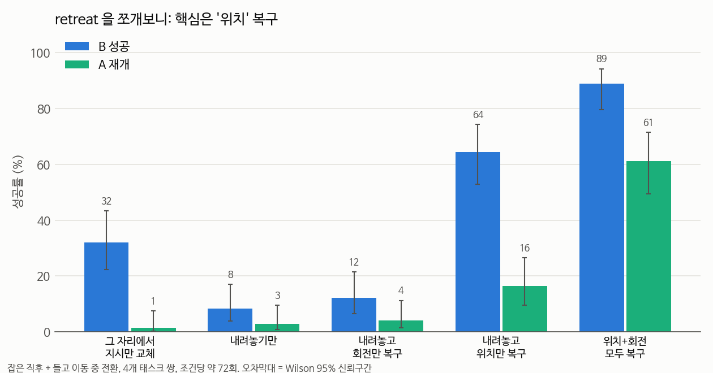
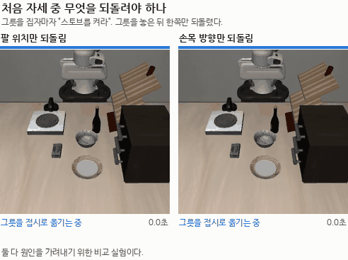
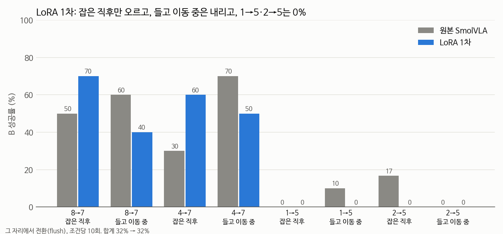
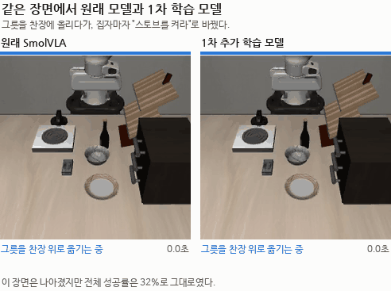
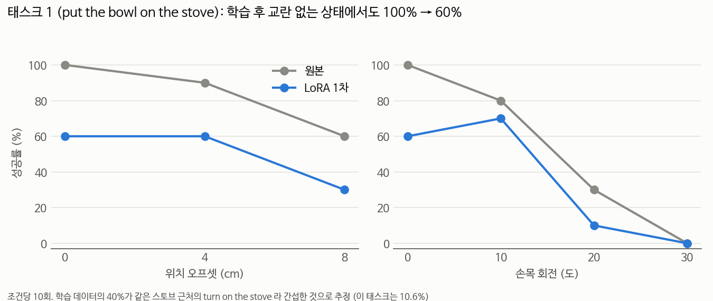
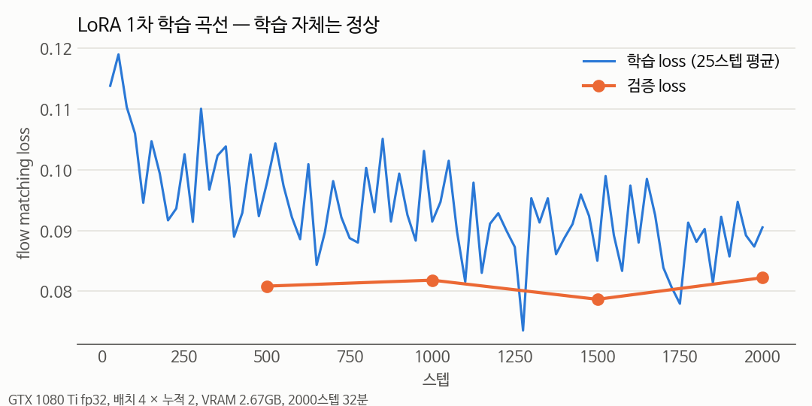
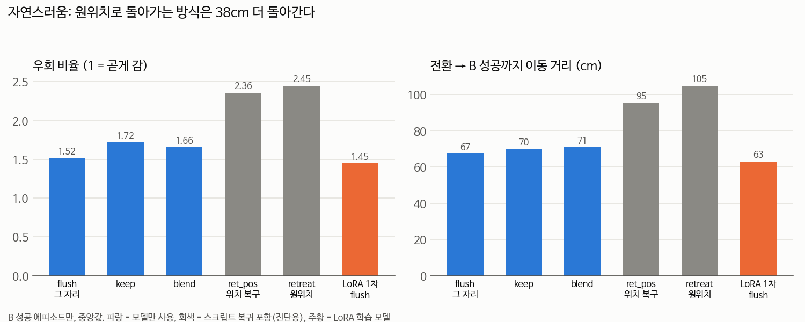
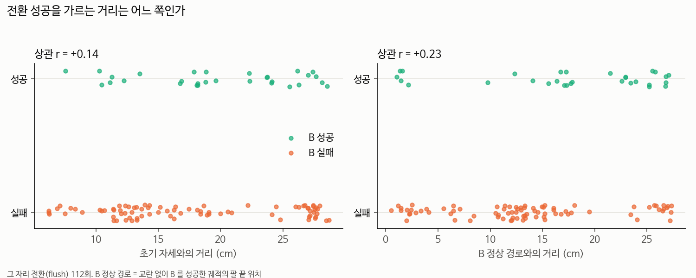
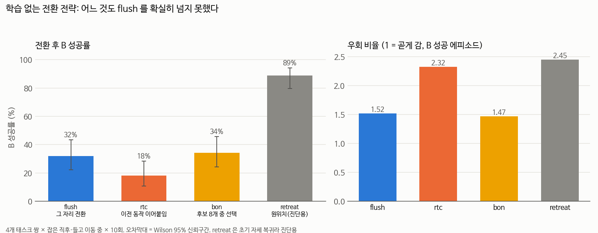

# 2026-09-17 처음 자세로 돌아가기 나눠 보기, LoRA 1차 학습

> 한 줄 요약: 팔 위치를 처음 자리로 되돌리면 전환이 잘 되지만, 실제 전환에서 팔이 얼마나 멀리 있었는지로는 성공과 실패가 갈리지 않았다. 학습 없이 추론만 바꾸는 방법 두 가지도 기준(32%)을 넘지 못했고, LoRA 1차는 데이터가 한쪽으로 치우쳐 실패했다.

## 오늘 결과 한눈에

| 무엇을 봤나 | 결과 |
|---|---|
| 처음 자세로 돌아가는 동작 중 무엇이 효과를 내나 | 팔 위치 되돌리기가 대부분 (위치만 64%, 손목만 12%, 둘 다 89%) |
| 전환 순간 팔이 멀수록 실패하나 | 아니다. 거리와 성공의 상관은 r = +0.14 |
| 동작을 매끄럽게 잇는 방법 (RTC) | 18%. 오히려 원래 하던 방향으로 끌려감 |
| 후보 8개 중 고르기 (Best-of-N) | 34%. 기준 32%와 차이 없음 |
| LoRA 1차 | 32%에서 32%. 잘 되던 태스크 하나는 100%에서 60%로 망가짐 |

## 새로 나온 말

| 말 | 뜻 |
|---|---|
| RTC (Real-Time Chunking) | 새 동작 묶음을 이전 묶음에 매끄럽게 이어지도록 만드는 방법 |
| Best-of-N | 동작 후보를 N개 뽑아 점수가 가장 좋은 것을 실행 |
| 짝 비교, 부호 검정 | 같은 에피소드에서 두 방법을 비교해, 한쪽만 성공한 횟수로 차이가 우연인지 판단 |
| ablation | 방법의 요소를 하나씩 빼서 무엇이 효과를 내는지 보는 실험 |
| LoRA | 모델 가중치는 그대로 두고 작은 행렬만 붙여 학습. 우리는 전체의 0.81%만 학습 |
| self-imitation | 모델이 스스로 성공한 궤적만 모아 다시 학습하는 것 |
| hindsight relabeling | B에 실패했어도 우연히 해낸 다른 일 C로 이름표를 바꿔 학습 데이터로 쓰는 것 |
| 망각 | 새로 배우다가 원래 잘하던 것을 못하게 되는 것 |

전체 용어는 [용어사전](../용어사전.md)에 있다.

## 참고한 논문

| 어디에 | 논문 | 어떻게 썼나 |
|---|---|---|
| 처음 자세로 돌아가기를 요소별로 나누기 | [06_실험방법론 6-5 ablation](../01_공부순서/06_실험방법론.md) | 한 번에 하나만 다르게 |
| 처음 자세로 돌아가는 방식은 최종 방법이 아니라는 판단 | [SwitchVLA](../02_논문노트/SwitchVLA.md) | 그 논문의 `advance`(기준 자세로 이동)가 같은 발상. 우리는 리셋 금지로 차별화 |
| 자세가 벗어나면 무너진다는 외부 근거 | [LIBERO-Plus](../02_논문노트/LIBERO-Plus.md) | 초기 상태를 흔들면 VLA가 무너진다 |
| 1080 Ti에서 학습 | [LoRA](../02_논문노트/LoRA-망각.md) | action expert에만 LoRA, 0.81%만 학습 |
| 자세를 틀어 놓고 데이터 모으기 | [DART](../02_논문노트/DART.md) | 일부러 벗어난 상태를 만들어 바로잡는 데이터 수집 |
| LoRA 1차 실패 분석 | [Q-Planning](../02_논문노트/Q-Planning.md) | "성공만 다시 학습하면 정체한다"가 우리 실패를 그대로 설명 |
| 2차에서 망각 줄이기 | [LoRA Learns Less and Forgets Less](../02_논문노트/LoRA-망각.md) | rank가 작을수록 덜 잊는다 |
| 2차에서 실패 데이터 건지기 | [HER](../02_논문노트/HER.md) | 실패 궤적에 우연히 해낸 일의 이름표를 붙임 |
| 2차에서 교란 범위 넓히기 | [Reverse Curriculum](../02_논문노트/Reverse-Curriculum.md) | 쉬운 범위부터 조금씩 |
| 학습 없이 매끄럽게 잇기 | [Real-Time Chunking](../02_논문노트/Real-Time-Chunking.md) | 이전 묶음을 guidance로 줘서 이어 생성 |
| 후보 중 고르기 | [Q-Planning](../02_논문노트/Q-Planning.md), [V-GPS](../02_논문노트/V-GPS.md), [RoboMonkey](../02_논문노트/RoboMonkey.md) | 정책은 그대로 두고 후보 N개 중 선택 |
| 다음 방향 | [V-GPS](../02_논문노트/V-GPS.md), [DSRL](../02_논문노트/DSRL.md) | 점수 기준을 학습해야 한다 |

전체 목록은 [참고 논문 목록](../02_논문노트/참고논문_목록.md)에 있다.

## 목표

- 처음 자세로 돌아가는 동작 중 어느 부분이 효과를 내는지 확인
- 처음 자세로 돌아가지 않고도 되도록 모델 자체를 학습 (1080 Ti, LoRA)
- 제약 확정: 전환할 때 처음 자세로 돌아가지 않고, 사람처럼 자연스럽게 ([연구주제.md](../연구주제.md))

## 한 일

코랩 공부 기록은 [공부 일지 9/17](공부/2026-09-17.md)에 따로 적었다.

- 처음 자세로 돌아가기를 나눠 본 실험 240 에피소드. [보고서](../04_실습/05_libero/retreat_ablation/README.md)
- LoRA 1차: 데이터 수집부터 학습, 평가까지 자동으로. [보고서](../04_실습/05_libero/lora_v1/README.md)
  - 성공 궤적 184 에피소드 (자세를 틀어 놓은 것 148, 전환 36), 21,428 프레임
  - 학습 파라미터 4.92M (0.81%), 1080 Ti VRAM 2.67GB, 32분
  - 평가: 자세 민감도 180 에피소드, 전환 80 에피소드
- LoRA 2차 설계 후 실행 시작. [계획](../04_실습/05_libero/lora_v2/README.md)
- SwitchVLA 본문 확인: `advance` 모드가 기준 시작 자세로 이동한다. 우리 제약(리셋 금지)이 차이점이 된다

## 알게 된 것

### 1. 핵심은 팔 위치를 되돌리는 것

| 방식 | B 성공 | A 재개 |
|---|---|---|
| 그 자리에서 바로 (`flush`) | 32% | 1% |
| 내려놓기만 (`release`) | 8% | 3% |
| 손목 방향만 되돌림 (`ret_rot`) | 12% | 4% |
| 팔 위치만 되돌림 (`ret_pos`) | 64% | 16% |
| 위치와 손목 둘 다 (`retreat`) | 89% | 61% |

같은 에피소드에서 왼쪽은 팔 위치만 되돌려 스토브를 켰고, 오른쪽은 손목 방향만 되돌려 실패했다.

- 손목만 고치면 거의 효과가 없고, 위치가 대부분을 설명한다
- 내려놓기만 하면 오히려 나빠진다. 탁자 근처 낮은 곳에 팔이 머물러 더 낯선 상태가 된다
- 9/16에는 손목 방향이 더 치명적이었는데, 모순은 아니다. 실제 전환 순간 팔은 처음 자세에서 12~27cm 떨어져 있었고, 9/16 측정 범위는 10cm까지였다. 실제 전환에서는 위치가 훨씬 많이 벗어나 있다

### 2. LoRA 1차는 실패했고, 원인은 데이터

- 전환 성공률은 32%에서 32%. 잡은 직후는 올랐고, 들고 가는 중은 내렸다
- 1→5, 2→5 쌍은 원래 0~17%라 성공 데이터가 하나도 없었다. 그래서 전혀 못 배웠다. 스스로 성공한 것만 따라 하는 방식으로는 못하는 것을 가르칠 수 없다
- "turn on the stove"가 학습 데이터의 40%를 차지했다. 그 탓에 같은 스토브 근처의 "put the bowl on the stove"가 100%에서 60%로 망가졌다

LoRA가 나아진 에피소드 예시(4→7, 그 자리에서 바로 전환). 왼쪽 원래 모델은 실패, 오른쪽 1차 학습 모델은 성공. 전체 합계는 그대로다.

### 3. 그래도 학습 자체는 정상이다

검증 loss는 안정적이었고, 데이터가 있었던 "잡은 직후" 전환은 50%에서 70%, 30%에서 60%로 올랐다. 데이터만 맞으면 학습은 먹힌다.

### 4. 자연스러움을 숫자로 보면, 처음 자세로 돌아가는 방식은 38cm를 더 돌아간다

| 방식 | 경로 길이 | 우회 비율 | 걸린 시간 | 멈춤 |
|---|---|---|---|---|
| 그 자리에서 바로 | 67cm | 1.52 | 7.7초 | 1 |
| 처음 자세로 돌아갔다가 | 105cm | 2.45 | 9.0초 | 2 |
| LoRA 1차, 그 자리에서 바로 | 63cm | 1.45 | 8.0초 | 1 |

- 성공률과 자연스러움이 반대로 간다. 처음 자세로 돌아가는 방식이 가장 잘 되지만 가장 많이 돌아간다. 리셋 금지 제약이 필요한 이유다
- LoRA 1차가 가장 곧게 간다. 성공률은 못 올렸지만, 리셋 없는 데이터로 배워서 돌아가지 않고 바로 간다
- 우회 비율은 이동 거리를 직선 거리로 나눈 값, 멈춤은 0.25초 이상 거의 정지한 횟수다. 자세한 정의는 [보고서](../04_실습/05_libero/naturalness/README.md)

### 5. 가설 확인: 팔 위치로는 성공이 갈리지 않는다 (앞선 해석을 고침)

"전환 순간 팔이 멀어서 실패한다"를 에피소드 112개로 직접 확인했더니 틀렸다.

| 거리 기준 | 성공과의 상관 |
|---|---|
| 처음 자세와의 거리 | r = +0.14 (오히려 멀수록 약간 더 성공) |
| B 정상 경로와의 거리 | r = +0.23, 쌍마다 방향이 제각각 |

- 장면(초기 배치)은 성공 차이의 16~31%만 설명한다. 나머지는 같은 장면에서도 시도마다 결과가 바뀌는 무작위성이다
- 앞선 결론을 고친다. 사실로 남는 것은 "처음 자세로 되돌리면 좋아진다"까지다. 되돌리는 동작에는 위치 말고도 물체 내려놓기, 멈추기, 장면 정리 효과가 섞여 있다
- 그래서 다음 방향이 바뀌었다. 팔 위치 거리로 후보를 고르는 방법은 약할 것 같다. 무작위성이 크다는 건 좋은 후보와 나쁜 후보가 섞여 나온다는 뜻이라, 학습한 판정기로 고르기([V-GPS](../02_논문노트/V-GPS.md), [Q-Planning](../02_논문노트/Q-Planning.md))나 노이즈 조종([DSRL](../02_논문노트/DSRL.md))이 유망하다
- 자세한 분석은 [가설 확인 보고서](../04_실습/05_libero/hypothesis_check/README.md)

### 6. 학습 없이 추론만 바꾸는 방법 두 가지, 둘 다 기준을 넘지 못했다

| 방식 | 내용 | 참고 논문 | B 성공 | A 재개 | 우회 비율 |
|---|---|---|---|---|---|
| 그 자리에서 바로 (`flush`) | 남은 동작을 버리고 바로 새 지시 | | 32% (23/72) | 1% | 1.52 |
| 매끄럽게 잇기 (`rtc`) | 새 동작을 이전 동작에 이어지게 생성 | [RTC](../02_논문노트/Real-Time-Chunking.md) | 18% (13/72) | 8% | 2.32 |
| 후보 중 고르기 (`bon`) | 후보 8개 중 성공 궤적 근처로 가는 것 | [Q-Planning](../02_논문노트/Q-Planning.md), [V-GPS](../02_논문노트/V-GPS.md), [RoboMonkey](../02_논문노트/RoboMonkey.md) | 34% (25/73) | 0% | 1.47 |
| 처음 자세로 (비교용) | | [SwitchVLA](../02_논문노트/SwitchVLA.md) | 89% | 61% | 2.45 |

**매끄럽게 잇기는 부드럽지만 틀린 방향으로 갔다.**
저크는 9.6에서 6.0으로 가장 부드러웠지만 성공률은 떨어졌다. 방식 중 유일하게 새 지시를 무시하고 A를 끝낸 경우가 4번 나왔고, 전환 직후 되돌아간 거리(1.8cm)도 가장 컸다. 새 동작을 A를 하던 방향에 맞춰 만들다 보니, 특히 들고 가는 중(70%에서 20%)에 A 쪽으로 끌려갔다. 매끄럽다고 자연스러운 것은 아니다. 사람도 일을 바꿀 때는 하던 동작을 끊는다.

**끊고 나서 이어 붙여도(`flush_rtc`) 안 됐다.**
전환 순간에는 이전 동작을 버리고, 새 지시의 첫 동작부터 매끄럽게 이었다. 지시를 무시한 경우는 0번으로 사라졌고 저크도 7.0으로 기준(9.6)보다 부드러웠다. 하지만 B 성공은 17%(12/72)였다. 같은 에피소드로 비교하면 기준만 성공 19번, 이 방식만 성공 8번(p ≈ 0.05)으로 오히려 나빴다. 이어 붙이기는 새 동작이 직전 계획을 따르도록 강제하므로, 도중에 방향을 고치는 능력이 줄어드는 것으로 보인다.

전환이 없어도 이어 붙이기를 켜면 조금 나빠진다.

| 태스크 (전환 없음, 10회씩) | 끔 | 켬 |
|---|---|---|
| 1 그릇을 스토브에 | 10 | 9 |
| 4 그릇을 찬장 위에 | 9 | 10 |
| 5 접시 밀기 | 7 | 3 |
| 7 스토브 켜기 | 10 | 10 |
| 8 그릇을 접시에 | 9 | 8 |
| 합계 | 90% | 80% |

짝 비교는 3 대 8(p ≈ 0.23)로 확실하진 않다. 차이는 대부분 계속 방향을 고쳐야 하는 접시 밀기에서 나왔다. 정리하면 이어 붙이기는 부드러움과 반응성을 맞바꾼다. 평소 수행에서는 작은 손해(90%에서 80%), 방향을 크게 바꿔야 하는 전환에서는 큰 손해(32%에서 17%)다.

공정성을 위해 적어 둔다. RTC는 원래 추론이 느려서 생기는 지연을 견디려고 만든 방법이다. 우리 실험은 지연이 없는 조건이라 장점이 드러날 수 없었다. 추론 지연을 넣은 실험에서 다시 비교해야 공정하다.

**후보 중 고르기는 가장 곧게 가지만 성공률은 같다.**
같은 에피소드로 비교하면 이 방식만 성공 10번, 기준만 성공 8번, 같음 54번(p ≈ 0.82)이다. 잡은 직후는 올랐지만(8→7 50%에서 70%, 4→7 30%에서 70%) 들고 가는 중에는 내려(4→7 70%에서 40%) 서로 상쇄됐다. 5번에서 본 대로 팔 위치 거리는 성공과 관계가 없으니, 그걸 점수로 쓴 선택도 의미가 없었다. 후보들은 실제로 서로 다르다(20스텝 뒤 위치가 약 5cm 퍼진다). 고를 거리는 있는데 고르는 기준이 틀렸다. 다음은 학습한 판정기다.

### 7. 사고: LoRA 2차가 데이터가 빠진 채 학습됐다

- `switch_experiment.py`에 새 옵션을 추가하는 사이, 그 파일을 불러 쓰는 `collect_robust_data.py`는 옛 옵션만 넘기고 있어서 수집 작업이 시작하자마자 죽었다
- 그 결과 먼 교란 7개 중 4개, hindsight 8개 전부가 데이터 0개였다. 그런데 파이프라인은 멈추지 않고 있는 데이터로 학습과 평가까지 진행했다
- 빠진 옵션을 기본값으로 채우는 `fill_defaults()`를 넣고, 이 파일을 쓰는 스크립트 4개를 모두 다시 돌려 확인했다. 잘못 학습된 모델은 `lora_v2_partial`로 보관하고 빠진 부분만 다시 모아 재학습 중이다
- 교훈: 돌고 있는 파이프라인이 쓰는 코드는 고치지 않는다. 그리고 수집 단계에서 저장 개수가 0이면 멈추게 해야 한다

## 막힌 것과 해결

| 문제 | 원인 | 해결 |
|---|---|---|
| peft가 SmolVLA에 안 붙음 (`SmolVLAConfig has no attribute get`) | peft는 HF 설정 형식을 기대하는데 SmolVLA 설정은 dataclass | 정책 전체 대신 action expert(LlamaModel)만 peft로 감쌈 |
| 학습 중 저장하면 LoRA가 풀림 | `merge_and_unload`가 LoRA를 제거하고 옵티마이저 참조가 끊김 | 학습 중에는 어댑터만 저장, 끝나고 따로 합침 |
| forward가 패딩 마스크를 못 읽음 | SmolVLA가 읽는 키 이름이 `actions_id_pad` | 그 이름으로 넣음 |
| 1→5, 2→5 성공 데이터 0개 | 원래 성공률이 낮음 | 2차에서 hindsight relabeling |
| hindsight 모드가 태스크 짝을 못 받음 | 조건문이 `switch`만 확인 | `switch`, `hindsight` 둘 다 처리 |
| LoRA 2차 수집 작업이 전부 죽음 | 실행 중에 공용 코드에 옵션 추가 | `fill_defaults()`로 빠진 옵션 자동 채움, 빠진 부분만 재수집 |
| 이어 붙이기가 inference_mode에서 동작 안 함 | 보정 과정이 자동미분을 씀 | 해당 경로만 `no_grad`로 |
| 후보 8개 동시 계산 시 메모리 부족 | 이미지 인코더도 8배 | 2개씩 나눠 계산 (`--bon-batch 2`) |
| 수집 중 EGL 오류 로그 | 에피소드 종료 시 렌더러 정리 경고 | 결과에 영향 없음 |

## 측정한 수치

| 항목 | 값 | 조건 |
|---|---|---|
| B 성공: 바로 / 내려놓기만 / 손목만 / 위치만 / 둘 다 | 32 / 8 / 12 / 64 / 89% | 잡은 직후 + 들고 가는 중, 약 72회씩 |
| 전환 순간 처음 자세와의 거리 | 12.1 / 18.2 / 27.1cm | 다가가는 중 / 들고 가는 중 / 잡은 직후, 중앙값 |
| B 성공: 바로 / 이어 잇기 / 끊고 잇기 / 후보 고르기 | 32 / 18 / 17 / 34% | 4쌍 × 2시점 × 10회 |
| 끊고 잇기 vs 바로, 짝 비교 | 8 : 19, p ≈ 0.05 (나쁨) | 같은 에피소드 |
| 전환 없이 이어 잇기 끔 / 켬 | 90% / 80% (p ≈ 0.23) | 태스크 5개 × 10회, 지연 없음 |
| 후보 고르기 vs 바로, 짝 비교 | 10 : 8, p ≈ 0.82 | 같은 에피소드 |
| 이어 잇기의 저크 / 우회 비율 | 6.0 / 2.32 (바로: 9.6 / 1.52) | |
| 후보 사이 위치 차이 (노이즈만 다르게) | 약 5cm (20스텝 뒤) | 후보 16개 |
| LoRA 1차 전환 B 성공 | 32%에서 32% | 바로 전환, 8개 조건 × 10회 |
| LoRA 1차 태스크 1 (교란 없음) | 100%에서 60% | 10회 |
| LoRA 학습 파라미터 | 4.92M (0.81%) | r=16, action expert만 |
| LoRA 학습 VRAM / 시간 | 2.67GB / 32분 | 1080 Ti fp32, 배치 4×2, 2000스텝 |
| 학습 데이터 중 "turn on the stove" 비중 | 40.1% | 184 에피소드 |
| 우회 비율: 바로 / 처음 자세로 / LoRA 1차 | 1.52 / 2.45 / 1.45 | B 성공 에피소드, 중앙값 |
| 이동 거리: 바로 / 처음 자세로 / LoRA 1차 | 67 / 105 / 63cm | 전환부터 B 성공까지 |

## 읽은 논문

- SwitchVLA 본문: 행동 모드가 forward / rollback / advance 세 가지다. advance는 기준 시작 자세로 이동하는데, 우리가 금지한 방식이다. 원래 일로 돌아가기(resumption)는 다루지 않는다

## 다음에 할 것

- [x] 끊고 잇기 결과: 17%, 기준보다 나쁨
- [x] 전환 없는 이어 잇기 비교: 90%에서 80%, 반응성 손해 확인 (p ≈ 0.23)
- [ ] 추론 지연을 넣은 조건에서 이어 잇기 다시 비교 (원래 목적에 맞는 공정한 비교)
- [ ] LoRA 2차 재학습 결과 (빠진 데이터 다시 모은 뒤)
- [ ] 학습한 판정기 V와 Q 비교. Q가 확실히 좋으면 판정기로 후보 고르기 평가
- [ ] 파이프라인에 "저장 0개면 멈춤" 안전장치
- [ ] LoRA 2차 결과 확인 (정상 궤적 + 먼 교란 + hindsight + 균형 샘플링)
- [ ] 2차도 안 되면 커리큘럼: 교란 범위를 조금씩 넓혀 가며 여러 번 학습
- [ ] 원래 일로 돌아가는 데이터가 여전히 없음. 재개 전용 수집 방법 설계
- [x] 자연스러움 지표를 코드에 추가. 되돌아감 지표는 구분력이 없어 정의를 다시 봐야 함
- [ ] 1-2 CNN, ViT
