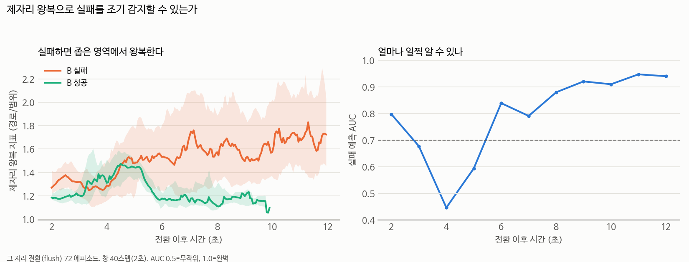
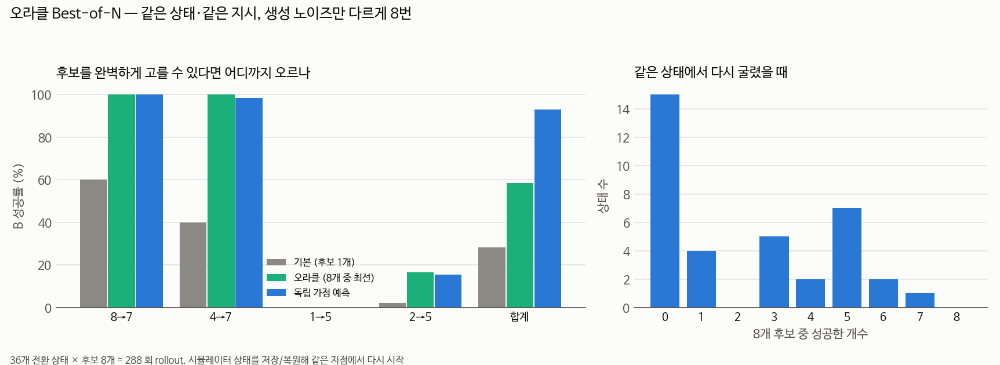
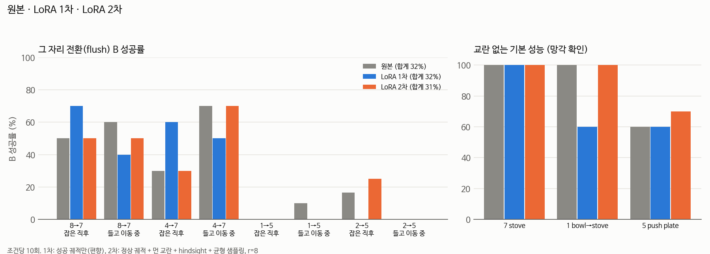

# 2026-09-18 — 실패의 정체를 찾았다: 노이즈가 "제자리 맴돌기"를 결정한다

> **한 줄 요약**: 전환 실패의 정체는 **좁은 영역에서 맴도는 것(policy idling)** 이었고(실패의 80%),
> **그 맴돌기에 빠질지 말지를 생성 노이즈가 크게 정합니다** (좋은 순서 47% vs 나쁜 순서 8%, idling 39% vs 94%).
> 그런데 **좋은 노이즈는 장면마다 달라서** 고정 시드로는 안 되고(처음 보는 쌍에서 80→20%),
> **매번 같은 노이즈를 쓰면 0%** 입니다 — 노이즈 변화 자체가 진행에 필수. 그래서 **상태를 보고 노이즈를 고르는 학습**이 답입니다.

## 오늘 알아낸 것 (한눈에)

| # | 발견 | 값 | 자세히 |
|---|---|---|---|
| 1 | **실패의 정체 = policy idling** | 실패의 80%, 성공의 22% | [실패의 정체](../04_실습/05_libero/failure_mode/README.md) |
| 2 | ⭐ **생성 노이즈가 idling 을 결정** | 좋은 시드 80% vs 나쁜 시드 20%, idling 20% vs 90% | [노이즈 시드](../04_실습/05_libero/noise_seed/README.md) |
| 3 | **문제가 두 종류** | 쉬운 쌍은 다시 뽑아 100%, 어려운 쌍은 0% (42% 는 불가) | [오라클](../04_실습/05_libero/oracle_bon/README.md) |
| 4 | 회복 시도 3건 **전부 실패** | 흔들기 4방향 ❌, rollback ❌(19% vs 32%) | [무엇이 회복시키는가](../04_실습/05_libero/recovery/README.md) |
| 5 | **A 재개가 0%** | 그 자리 전환 0/62, retreat 62% | 아래 5절 |
| 6 | LoRA 2차 — 망각만 고침 | 전환 32→31% (p=0.80), 기본 성능 73→90% | [LoRA 2차](../04_실습/05_libero/lora_v2/README.md) |
| 7 | 판정기는 후보를 못 고름 | AUC V 0.9318 vs Q 0.9321 | 아래 7절 |
| 8 | 1080 Ti 실측 지연이 붕괴 구간 | 560ms = 11.2스텝, 그 지연에서 90%→12% | [지연 실험](../04_실습/05_libero/latency/README.md) |
| 9 | 예측이 틀림 — 물체가 막는 게 아니다 | 접시를 10/10 밀지만 5cm 만 | 아래 9절 |
| 10 | ❌ **고정 좋은 노이즈는 일반화 안 됨** | 처음 보는 쌍에서 **80%→20%** (p=0.03) | [노이즈 시드](../04_실습/05_libero/noise_seed/README.md) |
| 11 | ⭐ **완전히 결정적인 정책은 0%** | 매 추론마다 같은 노이즈 → 즉시 맴돌기 | 〃 |
| 12 | ✅ **초기 위치 7cm 안까지 가야 회복** | f=0.5(14cm) 무효, f=0.75(7.4cm) 67%. 단 자연스러움은 retreat 쪽(경로 87cm) | [회복 실험](../04_실습/05_libero/recovery/README.md) |
| 13 | ⭐ **세 번째 실패 모드: B 가 A 를 망친다** | 4→7 은 A 완료 9번 중 9번 망가짐 | 아래 13절 |
| 14 | ⚠️ 정정: `retreat` 는 물체를 되돌리지 않는다 | 팔만 복귀. 지배 변수는 **팔 자세** | [회복 실험](../04_실습/05_libero/recovery/README.md) |

## 이 일지에서 새로 나오는 말

| 말 | 뜻 |
|---|---|
| **policy idling (제자리 맴돌기)** | 작은 움직임만 반복하며 진행이 없는 상태. VLA 실패의 주된 모드 |
| **오라클 (oracle)** | 정답을 미리 아는 이상적인 선택기. 실제로는 못 만들지만 **방법의 상한**을 잰다 |
| **과분산 (overdispersion)** | 관측 분산 ÷ 이항분포 분산. 1 이면 결과가 순전히 운, 크면 상태가 결정 |
| **순열 검정** | 라벨을 무작위로 섞어 "우연히 이만큼 갈릴 확률"을 직접 세는 방법 |
| **생성 노이즈 / 시드** | flow matching 이 동작을 만들 때 출발하는 무작위 값. 시드를 고정하면 순서가 정해진다 |
| **추론 지연 (latency)** | 관측을 찍고 동작이 나올 때까지 걸리는 시간 |
| **생존 편향** | 일찍 끝난(성공한) 표본이 빠져서 늦게까지 남은 것만 비교되는 편향 |

## 📚 이 일지에서 참고한 논문

| 어느 부분 | 논문 | 어떻게 썼나 |
|---|---|---|
| 실패 모드의 이름과 해결책 | [PIP — Policy Idling](../02_논문노트/PIP-Policy-Idling.md) | 우리가 찾은 "왕복"이 policy idling 임을 확인. **해결책이 초기 자세를 참조**해 우리 제약과 충돌 → 4방향 ablation 설계 |
| 조종 가능성 진단 | [ReSteer](../02_논문노트/ReSteer.md) (2026-03) | CMI 로 "지시가 동작을 가르는가"를 재는 방법. `steerability.py` 구현 |
| 전환 문제의 선행 연구 | [SwitchVLA](../02_논문노트/SwitchVLA.md) | 본문 정독 → advance 모드가 제약 위반임을 확인, 부록 C 가 우리 LoRA 정체를 설명 |
| 노이즈 공간 조종 | [DSRL](../02_논문노트/DSRL.md) | 우리 측정이 **전제(노이즈가 결과를 가름)와 한계(42%는 불가)를 둘 다 확인** |
| 후보 선택 | [V-GPS](../02_논문노트/V-GPS.md), [RoboMonkey](../02_논문노트/RoboMonkey.md) | 판정기 학습 → 우리 조건에서 재현 안 됨 |
| 자기 궤적 재학습의 한계 | [Q-Planning](../02_논문노트/Q-Planning.md) | LoRA 2차 정체가 이 예측과 일치 |
| LoRA 망각·데이터 | [LoRA 망각](../02_논문노트/LoRA-망각.md), [HER](../02_논문노트/HER.md), [DART](../02_논문노트/DART.md) | r=8·리허설·균형 샘플링 → 망각 회복 |
| 지연 대응 | [Real-Time Chunking](../02_논문노트/Real-Time-Chunking.md), [SmolVLA](../02_논문노트/SmolVLA.md) | 지연 모사와 RTC 재평가 |
| 재개 문제의 위치 | [기억·재개 조사](../02_논문노트/기억과_재개_조사.md) | MEMOBench 등 최신 벤치마크에도 **재개가 없음** 확인 |

## 한 일

- 오라클 Best-of-N 구현·실행 (`oracle_bon.py`, 36 상태 × 후보 8개 = 288 rollout)
- 궤적 분석 4종: 물체 놓기 시점, 정상 궤적 진행도, 제자리 왕복 지표, 조기 감지 AUC
- 전략 3종 구현·측정: `rollback`, `--dither-escape`(4방향), `ret_part`(용량-반응)
- 노이즈 시드 실험: `--switch-noise-seed` 구현, 미사용 에피소드에서 검증
- LoRA 2차 평가, 판정기 V vs Q 학습, 1080 Ti 단독 추론 실측
- 논문 3편 정독·정리 (PIP, ReSteer, 기억·재개 조사), SwitchVLA 본문 정독

---

## 1. 실패의 정체 — 좁은 영역에서 맴돈다

실패할 때 로봇이 정확히 무엇을 하는지 궤적으로 추적했습니다.

1. 물체는 **항상 놓습니다** (성공·실패 모두 100%)
2. B 쪽으로 **제대로 갑니다** (정상 궤적의 60~80% 까지)
3. 거기서부터 **좁은 영역(6cm)에서 왕복**합니다 (경로 24.8cm 를 6.2cm 범위 안에서)
4. 얼어붙은 건 4~6% 뿐 — **계속 움직이지만 진행이 없습니다**



이 현상의 이름은 **policy idling** 이고 [PIP 논문](../02_논문노트/PIP-Policy-Idling.md)이 같은 것을 보고했습니다.

| | 실패 중 idling | 성공 중 idling |
|---|---|---|
| PIP (ALOHA/PAC) | 84.9% | - |
| PIP (실물/ACT) | 90% | - |
| **우리 `flush`** | **80%** | 22% |
| **우리 `retreat`** (성공 89%) | - | **6%** |

**새 설정(전환 상황, SmolVLA, LIBERO-Goal)에서의 독립 재현입니다.**
그리고 `retreat` 이 왜 통했는지도 설명됩니다 — 초기 자세로 돌아가면 idling 이 거의 사라집니다.

→ [실패의 정체 보고서](../04_실습/05_libero/failure_mode/README.md)

## 2. ⭐ 생성 노이즈가 idling 을 결정한다

오라클 실험에서 **모든 상태에 같은 8개 시드**를 썼기 때문에 시드별 성공률을 비교할 수 있었습니다.

| 시드 | 0 | 1 | 2 | 3 | 4 | 5 | 6 | 7 |
|---|---|---|---|---|---|---|---|---|
| 성공률 (36상태) | 31% | 31% | 14% | 36% | 28% | 14% | 28% | **44%** |

순열 검정 **p = 0.018**. 다만 이 설계에서는 "시드 효과"와 "실행 순서 효과"가 섞여서,
**순서 없이 한 번씩만, 시드를 고를 때 안 쓴 초기상태(에피소드 10~19)** 로 다시 쟀습니다.

| 조건 | B 성공 | **idling 포함** | B 길이 | 물체 놓기까지 |
|---|---|---|---|---|
| 기본 (무작위) | 50% | 55% | 291스텝 | 78스텝 |
| **좋은 시드 10679** | **80%** | **20%** | **131스텝** | **61스텝** |
| **나쁜 시드 10485** | **15%** | **90%** | **300스텝** | **203스텝** |

(8→7 + 4→7 합계 20 에피소드. 나쁜 시드는 아직 8→7 만)

**노이즈가 "맴돌기에 빠지느냐"를 결정합니다.** 나쁜 노이즈는 물체를 10초나 들고 다니게 만듭니다.

정확히 말하면 — 짝 비교(10 에피소드, 부호 검정):

| 비교 | 결과 | p | 판단 |
|---|---|---|---|
| 좋은 시드 vs 나쁜 시드 | **13 : 0** | **0.0002** | ✅ **노이즈 선택이 결과를 가른다** |
| 나쁜 시드 vs 기본 | 1 : 8 | **0.039** | ✅ **나쁜 노이즈는 해롭다** |
| 좋은 시드 vs 기본 | 9 : 3 | 0.146 | ⏳ 경향은 뚜렷하나 아직 |

**"노이즈가 중요하다"는 확립됐고, "우리가 개선했다"는 아직입니다.**
처음 보는 태스크 쌍(9→7, 6→0, 3→5)에서의 검증이 실행 중입니다.

→ [노이즈 시드 보고서](../04_실습/05_libero/noise_seed/README.md)

## 3. ⭐ 문제가 두 종류로 갈린다

전환 시점의 시뮬레이터 상태를 저장하고 **노이즈만 바꿔 8번 다시 굴렸습니다**.



| 전략 | 8→7 | 4→7 | **1→5** | **2→5** |
|---|---|---|---|---|
| `flush` (그 자리) | 55% | 50% | 5% | 8% |
| **오라클** (8번 중 최선) | **100%** | **100%** | **0%** | **17%** |
| `release` (놓기만) | 10% | 20% | 0% | 0% |
| `ret_pos` (위치만 복귀) | 100% | 100% | 30% | 8% |
| **`retreat`** (위치+손목회전) | 100% | 100% | **75%** | **75%** |

```
쉬운 쌍   상태는 괜찮다 → 다시 뽑기만 해도 100%, 과분산 ≈ 1 (동전 던지기)
어려운 쌍 상태가 망가졌다 → 다시 뽑기 0% (후보 80개 전부 실패)
                          물체만 놓아도 0%, 위치만 되돌려도 8~30%
                          **위치 + 손목 회전을 되돌리면 75%** (+45%p)
```

전체로는 **기본 28% → 오라클 58%**, 그리고 **상태의 42% 는 어떤 노이즈로도 불가**입니다.
이건 [DSRL](../02_논문노트/DSRL.md) 의 한계("정책이 아예 못 만드는 동작은 노이즈로도 안 나옴")를 수치로 확인한 것입니다.

→ [오라클 보고서](../04_실습/05_libero/oracle_bon/README.md)

## 4. 회복 시도 3건 — 전부 실패

| 방법 | 팔이 어디로 | B 성공 |
|---|---|---|
| (기준) `flush` | 그대로 (초기 위치에서 27cm) | **32%** |
| 흔들기 4방향 (lift/reverse/random/**home**) | 아무 데나 4~10cm | 25~31% (**변화 없음**, p≥0.63) |
| `rollback` (최근 동작 역재생) | 집기 직전 (초기 위치에서 21cm) | **19%** (**더 나쁨**, p=0.064) |
| (금지) `ret_pos` | 초기 위치 (0cm) | 64% |
| (금지) `retreat` | 초기 자세 (0cm+회전) | **89%** |

- 흔들기는 **실제로 4~10cm 움직였고 효과도 50스텝 뒤까지 남았습니다** — 구현 문제가 아닙니다.
  **PIP 원본 방향(home)도 효과가 없었습니다**
- rollback 은 역재생이 **목표점과 2.4cm 오차**로 정확했지만, 되돌아간 거리가 **7.7cm 뿐**이었습니다

**부분적으로 가까워지는 것은 아무 효과가 없고, 초기 위치에 "도착"해야 살아납니다.**
2절과 합치면: **이미 맴돌기에 빠진 뒤에는 늦고, 애초에 안 빠지는 것이 중요**합니다.

→ [회복 실험 보고서](../04_실습/05_libero/recovery/README.md)

## 5. A 재개가 0% — 연구의 두 번째 목표가 전혀 안 풀렸다

| 전략 | 물체를 어떻게 했나 | B 성공 | **A 재개** | 재개 스텝 |
|---|---|---|---|---|
| `flush` / `keep` / `bon` | 쥔 채 그 자리 전환 | 23 / 21 / 25 | **0%** | **전부 300 (한도)** |
| `rollback` | 집었던 자리에 놓기 | 14 | **0%** | 300 |
| `ret_pos` | 놓고 위치만 복귀 | 47 | 9% | 300 |
| **`retreat`** | 놓고 완전 복귀 | 64 | **62%** | **중앙값 90** |

**"전부 300 스텝"이 핵심입니다.** 그 자리에서 전환하면 A 를 **한 번도** 못 끝냈습니다.
B 는 끝까지 유지됐으므로(22/23) B 를 망친 게 아니라 **A 를 못 하는 것**입니다.

물체가 아무 데나 떨어져(전환 시점보다 평균 6cm 낮은 곳) 낯선 배치가 되기 때문으로 보입니다.
스텝 부족이 아닌지 확인하는 통제 실험(`--max-steps 600`)이 예약돼 있습니다.

## 6. LoRA 2차 — 망각은 고쳤는데 전환은 그대로



| | 원본 | LoRA 1차 | **LoRA 2차** |
|---|---|---|---|
| 전환(flush) B 성공 | 32% | 32% | **31%** (짝 비교 7:9, p≈0.80) |
| 교란 없는 기본 성능 | 86.7% | 73.3% ⬇ | **90.0%** ✅ |
| 손목 20° (태스크 7) | 60% | 70% | **90%** ✅ |

리허설 + r 16→8 + 균형 샘플링으로 **망각을 되돌렸습니다.** 그런데 전환은 1%p 도 안 움직였습니다.
[SwitchVLA 부록 C](../02_논문노트/SwitchVLA.md) 도 "전환 시연을 50~100개 더 넣어도 효과가 미미"하다고 보고합니다.
→ **전환은 데이터를 더 모으면 되는 문제가 아닙니다.**

→ [LoRA 2차 보고서](../04_실습/05_libero/lora_v2/README.md)

## 7. 학습한 판정기는 후보를 못 골랐다

전환 이후의 결정 11,563개(209 에피소드)로 "이 결정 이후 B 가 성공할까"를 맞히게 학습시켰습니다.

| 입력 | AUC |
|---|---|
| V — 상태만 | 0.9318 |
| **Q — 상태 + 실행할 동작 10스텝** | **0.9321** |

**Q − V = 0.0003.** 동작을 알려줘도 예측이 나아지지 않았습니다.

2절과 합치면 설명이 됩니다 — **결과를 가른 것이 동작이 아니라 노이즈**였을 수 있습니다.
같은 노이즈에서 나온 동작들은 겉보기에 비슷하고(초반 2초 변위 22~24cm, 방향 일치도 0.99+) 뒤에서 갈립니다.

## 8. 1080 Ti 실측 지연이 정확히 "무너지는 구간"이다

| 지연 | RTC 끔 | RTC 켬 |
|---|---|---|
| 없음 | 90% | 75% |
| 0.25초 | 72% | 72% |
| **0.5초** | **12%** | **28%** (6:0, p≈0.03) |
| 1초 | 0% | 8% |

| 조건 | 1회 추론 | 20Hz 기준 |
|---|---|---|
| **GPU 단독** | **560ms** | **11.2 스텝 ≈ 0.56초** |
| GPU 공유 | 1281ms | 약 26 스텝 |

**실측 0.56초가 성능이 무너지는 0.5초 구간과 일치합니다.** 지금까지의 모든 수치는 동기 실행이라 낙관적입니다.
전환도 지연에서 절반 이하로 떨어집니다 (flush 27→10%, keep 30→13%, rtc 30→7%).

- **RTC 는 지연이 있을 때만 이득** — 9/17 의 "RTC 는 손해"는 **지연 없는 조건에 한정**된 결론이었습니다
- 시뮬 1스텝은 15.6ms 라 병목은 순수하게 모델 추론입니다

→ [지연 실험 보고서](../04_실습/05_libero/latency/README.md)

## 9. 예측이 틀린 것 — 물체가 막는 게 아니다

1→5 가 **어떤 노이즈로도 안 되는** 이유로 "놓은 그릇이 접시를 막는다"를 예측하고 기록해 두었습니다.
물체 위치를 로그에 추가해 확인하니 **틀렸습니다.**

| A1→B5 (10 에피소드, 전부 실패) | 값 |
|---|---|
| 그릇-접시 거리 (전환 시 → B 끝) | 13.8cm → 17.1cm (오히려 멀어짐) |
| **접시를 1cm 이상 민 에피소드** | **10 / 10** |
| 접시가 움직인 거리 (중앙값) | **5.1cm** (목표까지는 못 감) |

**로봇은 접시를 실제로 밉니다. 다만 끝까지 못 밉니다.**
실패는 "접근 못 함"도 "물체가 막음"도 아니라 **마지막 조작을 완수하지 못하는 것**이고,
**맴돌기가 일어나는 곳이 바로 그 마지막 조작 구간**입니다.

> 예측을 **결과가 나오기 전에 적어둔 덕분에** 틀렸다는 것도 분명히 알 수 있었습니다.
> [오라클 보고서](../04_실습/05_libero/oracle_bon/README.md)에 원래 예측과 함께 남겨 두었습니다.

## 10. ❌ 고정 좋은 노이즈는 일반화되지 않는다

시드를 고를 때 안 쓴 **세 개의 새 쌍**으로 검증했습니다.

| 쌍 | 기본 | 좋은 시드 10679 | 짝 비교 |
|---|---|---|---|
| 9→7 (와인병 → 스토브) | 0% | 0% | — |
| **6→0 (치즈 → 서랍 열기)** | **80%** | **20%** | 0 : 6, **p=0.03** |
| 3→5 (서랍 안 그릇 → 접시) | 0% | 0% | — |
| **합계** | **31%** | **7%** | 0 : 6, **p=0.031** |

**8→7·4→7 에서 +30%p 였던 시드가 6→0 에서는 80% → 20% 로 파괴적입니다.**

| 주장 | 판정 |
|---|---|
| "노이즈 선택이 결과를 크게 가른다" | ✅ **확립** (양방향 60~70%p) |
| "장면과 무관한 좋은 노이즈가 있다" | ❌ **반증** |
| "고정 시드로 학습 없이 개선" | ❌ **반증** |

→ **고정값이 아니라 상태를 보고 노이즈를 고르는 학습([DSRL](../02_논문노트/DSRL.md))이 필요**하다는 직접 근거입니다.

**덤**: 쌍 난이도가 **0%~80%** 로 훨씬 넓습니다. B 가 "놓는 위치를 안 따지는 일"(서랍 열기)이면 쉽고,
"정밀 조작"(접시 밀기·노브)이면 어렵습니다. 우리가 처음 고른 4쌍(5~55%)은 범위의 일부였습니다.

## 11. ⭐ 완전히 결정적인 정책은 0% — 노이즈 변화가 진행에 필수

| 조건 | B 성공 | idling | vs 기본 |
|---|---|---|---|
| 기본 (매번 새 노이즈) | 29% | 47% | — |
| 좋은 시드 (순서 고정) | **47%** | 39% | 9:3, p=0.15 |
| **첫 chunk 만 고정** | **29%** | 60% | 6:6, **p=1.00** |
| **매 추론마다 재시드** (완전 결정적) | **0%** | 60% | 0:10, **p=0.002** |
| 나쁜 시드 | 8% | **94%** | 1:8, p=0.039 |

1. **첫 동작 묶음만으로는 아무 차이가 없습니다** — 이득은 노이즈 **순서 전체**에서 나옵니다
2. **매번 같은 노이즈면 0%** — 같은 상태 → 같은 동작 → 같은 상태의 고리에 즉시 갇힙니다

**flow matching 의 무작위성은 "잡음"이 아니라 국소적으로 갇히지 않게 해 주는 장치**입니다.
그리고 노이즈 효과는 전환 특화가 아닙니다 — 태스크 단독에서도 태스크1 100→60%, 태스크5 70→100% 로 갈립니다.

## 12. ✅ 초기 위치에서 7cm 안까지 들어가야 회복된다

`ret_part` 로 초기 자세 쪽으로 f 만큼만 되돌렸습니다.

| f | 0 | 0.25 | 0.5 | **0.75** | 1.0 |
|---|---|---|---|---|---|
| B 성공 | 25% | 8% | 19% | **67%** | 92% |
| 초기 위치까지 | 27cm | 20.9cm | 14.1cm | **7.4cm** | 0cm |
| flush 와 짝 비교 | — | 0:6 (p=0.03) | 3:5 (p=0.73) | **15:0 (p<0.001)** | — |

**14cm 까지 들어가도 무효, 7.4cm 안이면 67%.** 곡선에 무릎이 있습니다.

단 **A 재개는 f=0.75 에서도 8%**(2/24) 로, 완전 복귀(62%)와 큰 차이가 있습니다 → 재개는 여전히 미해결.
그리고 f=0.75 가 제약("초기 자세 복귀 금지")을 지키는지는 **애매합니다** — 7.4cm 남았지만 사람이 보면 리셋처럼 보일 수 있습니다.

## 13. ⭐ 세 번째 실패 모드 — B 가 A 를 망친다

`finish_a`(하던 A 를 마저 완료하고 B 로) 를 시험하다 새 실패 모드를 찾았습니다.

| 쌍 | A 완료 | **A 가 다시 망가진 횟수** | B | 둘 다 |
|---|---|---|---|---|
| **4→7** (그릇을 캐비닛 위에 → 스토브) | 9/10 | **9 / 9** | 30% | 0% |
| 8→7 (그릇을 접시에 → 스토브) | 9/10 | 3 / 9 | 20% | 0% |
| 1→5 (그릇을 스토브에 → 접시 밀기) | 10/10 | 4 / 10 | 0% | 0% |

캐비닛 위에 놓은 그릇이 스토브로 가는 동안 떨어집니다 — **정책 한계가 아니라 태스크 간 물리적 간섭**입니다.

**함의**: **"A 먼저 → B 나중"은 깨지기 쉽고, "B 먼저 → A 나중"(우리 연구의 순서)이 구조적으로 더 안전합니다.**
`retreat` 가 "둘 다 56%" 를 해내는 것도 A 를 마지막에 하기 때문입니다.

실패 모드가 세 가지로 정리됩니다.

| # | 실패 모드 | 어디서 |
|---|---|---|
| 1 | **B 를 못 한다** (맴돌기) | 모든 제약 준수 방법 |
| 2 | **A 를 다시 못 한다** (팔이 멀고 물체도 옮겨짐) | 그 자리 전환 |
| 3 | **B 가 A 를 망친다** | A 를 먼저 끝냈을 때 |

## 막힌 것 / 해결 방법

| 문제 | 원인 | 해결 |
|---|---|---|
| 추론 시간이 부풀려짐 | 다른 평가와 GPU 공유 | 모든 작업 종료 후 단독 재측정 → 560ms |
| 대기 스크립트가 스스로를 기다림 | `pgrep -f` 패턴이 **자기 명령줄**과도 일치 | PID 목록으로 직접 확인 |
| 연쇄 대기 스크립트가 엉뚱한 PID 를 기다림 | `pgrep -f` 가 쉘 래퍼까지 잡음 | 실제 스크립트 PID 확인 후 **하나의 큐 스크립트**로 통합 |
| 판정기가 "쓸모없다"는 결론이 애매함 | 한 상태에서 **실행한 동작 하나**만 관측 | 같은 상태를 저장/복원해 후보를 여러 번 굴리는 오라클 |
| 오라클이 중간에 죽음 | 로봇수트 스텝 카운터 누적 → horizon(1000) 초과 | 상태 복원 시 `inner.timestep = 0; inner.done = False` 도 되돌림 |
| `rollback` 이 A2(재개)에서도 실행돼 B 를 망칠 뻔 | `grasp_t` 가 낡아 그리퍼를 닫은 채 B 궤적을 되짚음 | 집은 시점 자동 추적 + **빈손이면 건너뛰기** |
| 전체 비교에서 거리 지표의 방향이 뒤집힘 | 쉬운 쌍·어려운 쌍이 섞인 **Simpson's paradox** | **쌍 안에서** 다시 비교 |
| 시드 분석에서 최악 시드 라벨이 틀림 | 오라클 최악 시드가 **동점** | 데이터에 실제로 있는 시드를 오라클 성공률 순으로 이름 붙이기 |

## 측정한 수치

| 항목 | 값 | 조건 |
|---|---|---|
| **오라클 Best-of-N** 기본 / 오라클 / 전부 실패 | **28% / 58% / 42%** | 36 상태 × 후보 8개 |
| 〃 쌍별 오라클 (8→7 / 4→7 / 1→5 / 2→5) | 100 / 100 / 0 / 17% | |
| **노이즈 시드** 기본 / 좋은 / 나쁜 (미사용 에피소드) | **50 / 80 / 15%** | 8→7 + 4→7, ep 10~19 |
| 〃 짝 비교 좋은vs나쁜 / 나쁜vs기본 / 좋은vs기본 | **13:0 (p=0.0002)** / 1:8 (p=0.039) / 9:3 (p=0.15) | |
| 〃 idling 포함 비율 | 55 / 20 / 90% | 8→7 + 4→7 |
| **idling** 실패 중 / 성공 중 | **80% / 22%** (`flush`) | 2초 동안 범위 3cm 미만 |
| 왕복 지표 조기 감지 AUC (쌍 안에서) | 2초 0.66 / 6초 0.75 / 10초 0.87 | 생존 편향 주의 |
| `rollback` B 성공 / 역재생 오차 / 되돌아간 거리 | **19%** / 2.4cm / 7.7cm | flush 32%, p=0.064 |
| 흔들기 4방향 B 성공 | 25~31% (기준 25%) | 모두 p ≥ 0.63 |
| **A 재개** 그 자리 / retreat | **0% (0/62)** / 62% | |
| LoRA 2차 전환 / 기본 성능 | 31% / 90.0% | 원본 32% / 86.7% |
| 판정기 AUC (V / Q) | 0.9318 / 0.9321 | 11,563 결정 |
| SmolVLA 1회 추론 (1080 Ti 단독) | **559.9ms = 11.2 스텝** | fp32, chunk 50 |
| 태스크 성공 지연 0 / 0.25 / 0.5 / 1초 | 90 / 72 / **12** / 0% | RTC 끔 |

## 다음에 할 것

- [x] ~~오라클 Best-of-N~~ → **쉬운 쌍 100%, 어려운 쌍 0%**, 전체 28→58%
- [x] ~~실패의 정체~~ → **policy idling** (실패의 80%), PIP 재현
- [x] ~~`rollback` / 흔들기 4방향~~ → **전부 실패**. 부분 이동은 무효
- [x] ~~LoRA 2차 · 판정기 · 1080 Ti 실측~~
- [ ] ⭐ **좋은 노이즈가 처음 보는 태스크 쌍에서도 통하는가** (9→7 · 6→0 · 3→5) ← 가장 유망
- [ ] **용량-반응** — 초기 자세 쪽으로 25/50/75% 만 되돌리면? (f=0.5 로 충분하면 제약 준수 방법)
- [ ] 노이즈 ablation — **첫 chunk 만** 고정 / 매 추론마다 재시드 (결정성 자체가 좋은가)
- [ ] `finish_a` — 하던 일을 마치고 넘어가기 (즉시성의 대가)
- [ ] 데이터 수집 경계 — 큰 교란에서 정책이 성공하는가 (역커리큘럼 설계에 필요)
- [ ] 조종 가능성 CMI — 쥐면 지시가 안 들리는가
- [ ] 실측 지연 11스텝을 넣은 최종 평가
- [ ] A 재개 통제 실험 (`--max-steps 600`) — 스텝 부족이 아닌지
- [ ] 결과에 따라: **증류**(`run_distill.sh` 준비됨) 또는 **DSRL 축소판**(노이즈 공간 RL)
