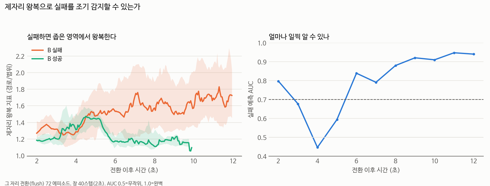
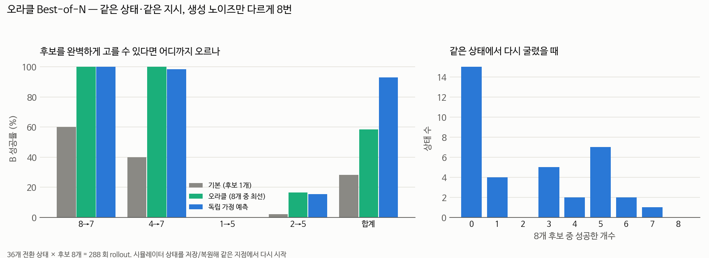
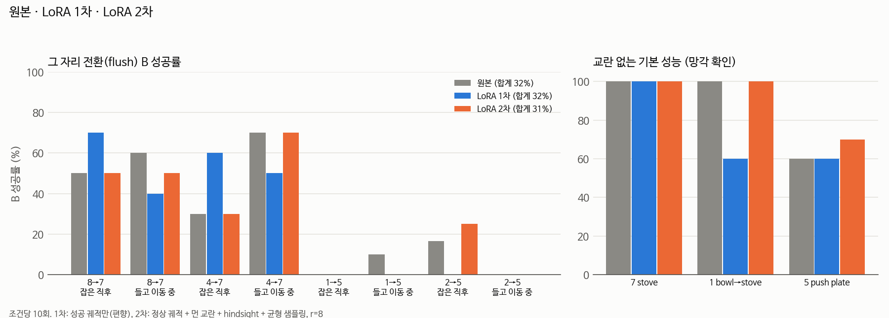

# 2026-09-18 실패의 정체: 제자리 맴돌기와 노이즈

> 한 줄 요약: 전환이 실패할 때 로봇은 좁은 곳에서 맴돈다(policy idling, 실패의 80%). 맴돌기에 빠질지는 동작을 만들 때 쓰는 노이즈가 크게 정한다(좋은 노이즈 80%, 나쁜 노이즈 15%). 하지만 좋은 노이즈는 장면마다 달라서 하나로 고정하면 안 되고, 매번 같은 노이즈를 쓰면 0%가 된다. 원래 일로 돌아가기가 0%인 이유도 찾았다. B를 마친 뒤 손목이 84도나 틀어져 있다.

## 오늘 결과 한눈에

| 무엇을 봤나 | 결과 | 자세히 |
|---|---|---|
| 실패할 때 무엇을 하나 | 좁은 영역에서 맴돈다. 실패의 80%, 성공의 22% | [실패의 정체](../04_실습/05_libero/failure_mode/README.md) |
| 노이즈가 결과를 가르나 | 좋은 노이즈 80%, 나쁜 노이즈 15% (짝 비교 13:0) | [노이즈 시드](../04_실습/05_libero/noise_seed/README.md) |
| 좋은 노이즈를 고정하면 | 처음 보는 쌍에서 80%가 20%로 (p=0.03). 고정은 안 된다 | 같은 곳 |
| 노이즈를 매번 똑같이 하면 | 0%. 바로 맴돌기에 갇힌다 | 같은 곳 |
| 노이즈만 바꿔 다시 굴리면 | 쉬운 쌍은 100%, 어려운 쌍은 0%. 상태의 42%는 어떤 노이즈로도 안 된다 | [오라클](../04_실습/05_libero/oracle_bon/README.md) |
| 맴돌기에서 빠져나오게 하기 | 흔들기, 되감기 모두 효과 없음 | [회복 실험](../04_실습/05_libero/recovery/README.md) |
| 원래 일로 돌아가기 | 그 자리 전환은 0/62. B를 마치면 손목이 84도 틀어져 있다 | 16절 |
| LoRA 2차 | 망각은 고쳤지만(73%에서 90%) 전환은 32%에서 31% | [LoRA 2차](../04_실습/05_libero/lora_v2/README.md) |
| 1080 Ti 실제 추론 시간 | 560ms. 성능이 무너지는 0.5초 지연 구간과 겹친다 | [지연 실험](../04_실습/05_libero/latency/README.md) |
| 처음 자세로 얼마나 가까이 가야 회복되나 | 7cm 안까지 들어가야 67%. 14cm로는 효과 없음 | 12절 |

## 새로 나온 말

| 말 | 뜻 |
|---|---|
| 제자리 맴돌기 (policy idling) | 작은 움직임만 반복하고 진행이 없는 상태. VLA가 실패하는 주된 모습 |
| 오라클 | 정답을 미리 아는 이상적인 선택기. 실제로는 못 만들지만 방법의 상한을 잴 수 있다 |
| 과분산 | 관측 분산을 이항분포 분산으로 나눈 값. 1이면 결과가 순전히 운, 크면 상태가 결정 |
| 순열 검정 | 라벨을 무작위로 섞어 "우연히 이만큼 갈릴 확률"을 직접 세는 방법 |
| 생성 노이즈, 시드 | flow matching이 동작을 만들 때 출발하는 무작위 값. 시드를 고정하면 순서가 정해진다 |
| 추론 지연 | 관측을 찍고 동작이 나올 때까지 걸리는 시간 |
| 생존 편향 | 일찍 끝난(성공한) 표본이 빠지고 늦게까지 남은 것만 비교되는 편향 |

## 참고한 논문

| 어디에 | 논문 | 어떻게 썼나 |
|---|---|---|
| 실패 모습의 이름과 해결책 | [PIP](../02_논문노트/PIP-Policy-Idling.md) | 우리가 찾은 왕복이 policy idling임을 확인. 그 해결책은 처음 자세를 참조해서 우리 제약과 충돌한다 |
| 지시가 동작을 가르는지 재기 | [ReSteer](../02_논문노트/ReSteer.md) (2026-03) | CMI로 재는 방법. `steerability.py`로 구현 |
| 전환 선행 연구 | [SwitchVLA](../02_논문노트/SwitchVLA.md) | advance 모드가 우리 제약 위반임을 확인. 부록 C가 우리 LoRA 정체를 설명 |
| 노이즈 조종 | [DSRL](../02_논문노트/DSRL.md) | 노이즈가 결과를 가른다는 전제와, 정책이 못 만드는 동작은 노이즈로도 안 나온다는 한계를 둘 다 확인 |
| 후보 고르기 | [V-GPS](../02_논문노트/V-GPS.md), [RoboMonkey](../02_논문노트/RoboMonkey.md) | 판정기 학습. 우리 조건에서는 재현 안 됨 |
| 자기 궤적 재학습의 한계 | [Q-Planning](../02_논문노트/Q-Planning.md) | LoRA 2차 정체가 이 예측과 맞는다 |
| LoRA 망각과 데이터 | [LoRA 망각](../02_논문노트/LoRA-망각.md), [HER](../02_논문노트/HER.md), [DART](../02_논문노트/DART.md) | r=8, 리허설, 균형 샘플링으로 망각 회복 |
| 지연 대응 | [RTC](../02_논문노트/Real-Time-Chunking.md), [SmolVLA](../02_논문노트/SmolVLA.md) | 지연을 흉내 내고 RTC 다시 평가 |
| 원래 일로 돌아가기 연구 | [기억·재개 조사](../02_논문노트/기억과_재개_조사.md) | MEMOBench 같은 최신 벤치마크에도 재개가 없다 |

## 한 일

- 오라클 Best-of-N 구현과 실행 (`oracle_bon.py`, 36 상태 × 후보 8개 = 288번)
- 궤적 분석 4가지: 물체를 놓는 시점, 정상 궤적 대비 진행도, 제자리 왕복 지표, 조기 감지 AUC
- 방법 3가지 구현과 측정: 되감기(`rollback`), 흔들기(`--dither-escape`, 4방향), 처음 자세 쪽으로 일부만 되돌리기(`ret_part`)
- 노이즈 시드 실험: `--switch-noise-seed` 구현, 시드를 고를 때 안 쓴 에피소드에서 검증
- LoRA 2차 평가, 판정기 V와 Q 학습, 1080 Ti 단독 추론 시간 측정
- 논문 정독: PIP, ReSteer, 기억·재개 조사, SwitchVLA 본문

---

## 1. 실패의 정체: 좁은 곳에서 맴돈다

실패할 때 로봇이 정확히 무엇을 하는지 궤적을 따라가 봤다.

1. 물체는 항상 놓는다 (성공이든 실패든 100%)
2. B 쪽으로 제대로 간다 (정상 궤적의 60~80%까지)
3. 거기서부터 좁은 영역(6cm) 안에서 왔다 갔다 한다. 24.8cm를 움직이는데 범위는 6.2cm
4. 멈춰 버리는 경우는 4~6%뿐이다. 계속 움직이지만 진행이 없다

이 현상은 policy idling이라는 이름으로 [PIP 논문](../02_논문노트/PIP-Policy-Idling.md)이 이미 보고했다.

| | 실패 중 맴돌기 | 성공 중 맴돌기 |
|---|---|---|
| PIP (ALOHA/PAC) | 84.9% | |
| PIP (실물/ACT) | 90% | |
| 우리, 그 자리에서 바로 | 80% | 22% |
| 우리, 처음 자세로 돌아갔다가 (성공 89%) | | 6% |

다른 설정(전환 상황, SmolVLA, LIBERO-Goal)에서 같은 현상을 독립적으로 다시 확인한 셈이다. 처음 자세로 돌아가는 방식이 왜 통했는지도 설명된다. 처음 자세로 돌아가면 맴돌기가 거의 사라진다.

## 2. 노이즈가 맴돌기를 정한다

오라클 실험에서 모든 상태에 같은 시드 8개를 썼기 때문에 시드별 성공률을 비교할 수 있었다.

| 시드 | 0 | 1 | 2 | 3 | 4 | 5 | 6 | 7 |
|---|---|---|---|---|---|---|---|---|
| 성공률 (36상태) | 31% | 31% | 14% | 36% | 28% | 14% | 28% | 44% |

순열 검정 p = 0.018이다. 다만 이 설계에서는 시드 효과와 실행 순서 효과가 섞이므로, 순서 없이 한 번씩, 시드를 고를 때 쓰지 않은 초기 배치(에피소드 10~19)로 다시 쟀다.

| 조건 | B 성공 | 맴돌기 있음 | B 걸린 시간 | 물체를 놓기까지 |
|---|---|---|---|---|
| 기본 (무작위) | 50% | 55% | 291스텝 | 78스텝 |
| 좋은 시드 10679 | 80% | 20% | 131스텝 | 61스텝 |
| 나쁜 시드 10485 | 15% | 90% | 300스텝 | 203스텝 |

(8→7과 4→7 합계 20 에피소드. 나쁜 시드는 아직 8→7만)

노이즈가 맴돌기에 빠지느냐를 결정한다. 나쁜 노이즈는 물체를 10초 동안 들고 다니게 만든다.

같은 에피소드끼리 짝 비교(10 에피소드, 부호 검정)로 보면 이렇다.

| 비교 | 결과 | p | 판단 |
|---|---|---|---|
| 좋은 시드 vs 나쁜 시드 | 13 : 0 | 0.0002 | 노이즈 선택이 결과를 가른다 |
| 나쁜 시드 vs 기본 | 1 : 8 | 0.039 | 나쁜 노이즈는 해롭다 |
| 좋은 시드 vs 기본 | 9 : 3 | 0.146 | 경향은 뚜렷하지만 아직 확실하지 않다 |

"노이즈가 중요하다"는 확인됐고, "우리가 개선했다"는 아직이다. 처음 보는 쌍(9→7, 6→0, 3→5)에서 검증을 돌렸다(10절).

## 3. 문제가 두 종류로 갈린다

전환 순간의 시뮬레이터 상태를 저장해 두고, 노이즈만 바꿔 8번 다시 굴렸다.

| 방식 | 8→7 | 4→7 | 1→5 | 2→5 |
|---|---|---|---|---|
| 그 자리에서 바로 | 55% | 50% | 5% | 8% |
| 오라클 (8번 중 최선) | 100% | 100% | 0% | 17% |
| 내려놓기만 | 10% | 20% | 0% | 0% |
| 위치만 되돌림 | 100% | 100% | 30% | 8% |
| 위치와 손목 둘 다 되돌림 | 100% | 100% | 75% | 75% |

- 쉬운 쌍은 상태가 괜찮다. 다시 뽑기만 해도 100%이고, 과분산이 1 정도라 동전 던지기에 가깝다
- 어려운 쌍은 상태 자체가 망가져 있다. 다시 뽑아도 0%(후보 80개 전부 실패), 물체만 놓아도 0%, 위치만 되돌려도 8~30%다. 위치와 손목을 둘 다 되돌려야 75%

전체로는 기본 28%에서 오라클 58%이고, 상태의 42%는 어떤 노이즈로도 안 된다. [DSRL](../02_논문노트/DSRL.md)이 말한 한계("정책이 아예 못 만드는 동작은 노이즈로도 안 나온다")를 숫자로 확인한 셈이다. 자세한 내용은 [오라클 보고서](../04_실습/05_libero/oracle_bon/README.md).

## 4. 맴돌기에서 빼내려는 시도, 전부 실패

| 방법 | 팔이 어디로 가나 | B 성공 |
|---|---|---|
| 기준: 그 자리에서 바로 | 그대로 (처음 위치에서 27cm) | 32% |
| 흔들기 4방향 (위로, 뒤로, 무작위, 처음 자세 쪽) | 4~10cm 아무 데나 | 25~31% (변화 없음, p ≥ 0.63) |
| 되감기 (최근 동작을 거꾸로) | 집기 직전 자리 (처음 위치에서 21cm) | 19% (오히려 나쁨, p=0.064) |
| 비교용: 위치만 처음으로 | 처음 위치 (0cm) | 64% |
| 비교용: 처음 자세로 완전히 | 처음 자세 | 89% |

- 흔들기는 실제로 4~10cm 움직였고 효과가 50스텝 뒤까지 남았다. 구현 문제가 아니다. PIP 원래 방향(처음 자세 쪽)도 효과가 없었다
- 되감기는 목표 지점과 2.4cm 오차로 정확했지만, 되돌아간 거리가 7.7cm뿐이었다

조금 가까워지는 것은 효과가 없고, 처음 위치에 거의 도착해야 살아난다. 2절과 합치면, 이미 맴돌기에 빠진 뒤에는 늦고 애초에 빠지지 않는 것이 중요하다.

## 5. 원래 일로 돌아가기가 0%

| 방식 | 물체를 어떻게 했나 | B 성공 | A 재개 | 재개에 걸린 스텝 |
|---|---|---|---|---|
| 바로 / 마저 하기 / 후보 고르기 | 쥔 채 그 자리에서 전환 | 23 / 21 / 25% | 0% | 전부 300 (한도) |
| 되감기 | 집었던 자리에 놓기 | 14% | 0% | 300 |
| 위치만 되돌림 | 놓고 위치만 | 47% | 9% | 300 |
| 처음 자세로 완전히 | 놓고 완전히 | 64% | 62% | 중앙값 90 |

그 자리에서 전환하면 A를 한 번도 끝내지 못했다. B는 끝까지 유지됐으므로(22/23), B를 망친 게 아니라 A를 못 하는 것이다. 물체가 아무 데나 떨어져(전환 때보다 평균 6cm 낮은 곳) 낯선 배치가 되기 때문으로 보인다. 시간이 모자라서인지 확인하는 실험(`--max-steps 600`)을 예약해 두었다.

## 6. LoRA 2차: 망각은 고쳤는데 전환은 그대로

| | 원래 모델 | LoRA 1차 | LoRA 2차 |
|---|---|---|---|
| 전환 B 성공 | 32% | 32% | 31% (짝 비교 7:9, p ≈ 0.80) |
| 교란 없는 기본 성능 | 86.7% | 73.3% | 90.0% |
| 손목 20도 (태스크 7) | 60% | 70% | 90% |

리허설, rank 16에서 8로, 균형 샘플링으로 망각은 되돌렸다. 그런데 전환은 1%p도 움직이지 않았다. [SwitchVLA 부록 C](../02_논문노트/SwitchVLA.md)도 전환 시연을 50~100개 더 넣어도 효과가 미미하다고 보고한다. 전환은 데이터를 더 모은다고 풀리는 문제가 아닌 것 같다. [LoRA 2차 보고서](../04_실습/05_libero/lora_v2/README.md)

## 7. 학습한 판정기는 후보를 고르지 못했다

전환 뒤의 결정 11,563개(209 에피소드)로 "이 결정 뒤에 B가 성공할까"를 맞히도록 학습시켰다.

| 입력 | AUC |
|---|---|
| V: 상태만 | 0.9318 |
| Q: 상태와 앞으로 실행할 동작 10스텝 | 0.9321 |

차이가 0.0003이다. 동작을 알려줘도 예측이 나아지지 않았다. 2절과 합치면 설명이 된다. 결과를 가른 것은 동작이 아니라 노이즈였을 수 있다. 같은 노이즈에서 나온 동작들은 처음에는 비슷해 보이고(처음 2초 변위 22~24cm, 방향 일치도 0.99 이상) 뒤에서 갈린다.

## 8. 1080 Ti 실제 추론 시간이 딱 무너지는 구간이다

| 지연 | 이어 잇기 끔 | 이어 잇기 켬 |
|---|---|---|
| 없음 | 90% | 75% |
| 0.25초 | 72% | 72% |
| 0.5초 | 12% | 28% (6:0, p ≈ 0.03) |
| 1초 | 0% | 8% |

| 조건 | 추론 1회 | 20Hz로 치면 |
|---|---|---|
| GPU 혼자 | 560ms | 11.2스텝, 약 0.56초 |
| GPU 공유 | 1281ms | 약 26스텝 |

실제로 잰 0.56초가 성능이 무너지는 0.5초 구간과 겹친다. 지금까지의 수치는 지연 없이 돌린 것이라 낙관적이다. 전환도 지연이 있으면 절반 아래로 떨어진다(바로 27%에서 10%, 마저 하기 30%에서 13%, 이어 잇기 30%에서 7%).

- 이어 잇기(RTC)는 지연이 있을 때만 이득이다. 9/17의 "RTC는 손해"는 지연 없는 조건에 한한 결론이었다
- 시뮬레이션 1스텝은 15.6ms라 병목은 순수하게 모델 추론이다

[지연 실험 보고서](../04_실습/05_libero/latency/README.md)

## 9. 예측이 틀린 것: 물체가 막는 게 아니다

1→5가 어떤 노이즈로도 안 되는 이유로 "내려놓은 그릇이 접시를 막는다"고 예측해 적어 두었다. 물체 위치를 기록해 확인해 보니 틀렸다.

| A1→B5 (10 에피소드, 전부 실패) | 값 |
|---|---|
| 그릇과 접시 거리 (전환 때에서 B 끝까지) | 13.8cm에서 17.1cm (오히려 멀어짐) |
| 접시를 1cm 이상 민 에피소드 | 10 / 10 |
| 접시가 움직인 거리 (중앙값) | 5.1cm (목표까지는 못 감) |

로봇은 접시를 실제로 민다. 다만 끝까지 밀지 못한다. 실패는 "다가가지 못함"도 "물체가 막음"도 아니고 마지막 조작을 완수하지 못하는 것이며, 맴돌기가 일어나는 곳이 바로 그 마지막 조작 구간이다. 예측을 결과보다 먼저 적어 둔 덕분에 틀렸다는 것도 분명히 알 수 있었다. [오라클 보고서](../04_실습/05_libero/oracle_bon/README.md)에 원래 예측과 함께 남겨 두었다.

## 10. 좋은 노이즈를 고정하면 다른 쌍에서는 안 된다

시드를 고를 때 쓰지 않은 새 쌍 세 개로 검증했다.

| 쌍 | 기본 | 좋은 시드 10679 | 짝 비교 |
|---|---|---|---|
| 9→7 (와인병에서 스토브로) | 0% | 0% | |
| 6→0 (치즈에서 서랍 열기로) | 80% | 20% | 0 : 6, p=0.03 |
| 3→5 (서랍 안 그릇에서 접시 밀기로) | 0% | 0% | |
| 합계 | 31% | 7% | 0 : 6, p=0.031 |

8→7과 4→7에서 30%p를 올렸던 시드가 6→0에서는 80%를 20%로 떨어뜨렸다.

| 주장 | 판정 |
|---|---|
| 노이즈 선택이 결과를 크게 가른다 | 맞다 (양쪽으로 60~70%p) |
| 장면과 상관없이 좋은 노이즈가 있다 | 틀렸다 |
| 시드 고정만으로 학습 없이 개선된다 | 틀렸다 |

고정값이 아니라 상태를 보고 노이즈를 고르는 학습([DSRL](../02_논문노트/DSRL.md))이 필요하다는 직접 근거다.

덤으로 알게 된 것: 쌍마다 난이도가 0%에서 80%까지 훨씬 넓다. B가 서랍 열기처럼 정밀하지 않은 일이면 쉽고, 접시 밀기나 손잡이 돌리기처럼 정밀한 조작이면 어렵다. 처음 고른 4쌍(5~55%)은 전체 범위의 일부였다.

## 11. 노이즈를 매번 똑같이 하면 0%

| 조건 | B 성공 | 맴돌기 | 기본과 비교 |
|---|---|---|---|
| 기본 (매번 새 노이즈) | 29% | 47% | |
| 좋은 시드 (순서 고정) | 47% | 39% | 9:3, p=0.15 |
| 첫 동작 묶음만 고정 | 29% | 60% | 6:6, p=1.00 |
| 추론할 때마다 같은 노이즈 | 0% | 60% | 0:10, p=0.002 |
| 나쁜 시드 | 8% | 94% | 1:8, p=0.039 |

1. 첫 동작 묶음만 고정하면 차이가 없다. 이득은 노이즈 순서 전체에서 나온다
2. 매번 같은 노이즈면 0%다. 같은 상태, 같은 동작, 다시 같은 상태로 이어지는 고리에 바로 갇힌다

flow matching의 무작위성은 쓸모없는 잡음이 아니라, 한곳에 갇히지 않게 해 주는 장치다. 이 노이즈 효과는 전환에만 있는 것도 아니다. 전환 없이 태스크만 해도 태스크 1은 100%에서 60%, 태스크 5는 70%에서 100%로 갈린다.

## 12. 처음 자세에서 7cm 안까지 들어가야 회복된다

처음 자세 쪽으로 일정 비율(f)만 되돌려 봤다.

| f | 0 | 0.25 | 0.5 | 0.75 | 1.0 |
|---|---|---|---|---|---|
| B 성공 | 25% | 8% | 19% | 67% | 92% |
| 처음 위치까지 남은 거리 | 27cm | 20.9cm | 14.1cm | 7.4cm | 0cm |
| 그 자리 전환과 짝 비교 | | 0:6 (p=0.03) | 3:5 (p=0.73) | 15:0 (p<0.001) | |

14cm까지 들어가도 효과가 없고, 7.4cm 안이면 67%다. 곡선이 한 지점에서 꺾인다. 다만 원래 일로 돌아가기는 f=0.75에서도 8%(2/24)로, 완전히 되돌렸을 때(62%)와 차이가 크다. 그리고 f=0.75가 제약을 지키는지는 애매하다. 7.4cm가 남았지만 사람이 보면 리셋처럼 보일 수 있다.

## 13. 세 번째 실패: B가 A를 망친다

하던 A를 마저 끝내고 B로 넘어가는 방식(`finish_a`)을 시험하다 새 실패를 찾았다.

| 쌍 | A 완료 | 완료한 A가 다시 망가진 횟수 | B | 둘 다 |
|---|---|---|---|---|
| 4→7 (그릇을 찬장 위에, 스토브 켜기) | 9/10 | 9 / 9 | 30% | 0% |
| 8→7 (그릇을 접시에, 스토브 켜기) | 9/10 | 3 / 9 | 20% | 0% |
| 1→5 (그릇을 스토브에, 접시 밀기) | 10/10 | 4 / 10 | 0% | 0% |

찬장 위에 올린 그릇이 스토브로 가는 동안 떨어진다. 정책의 한계가 아니라 태스크 사이의 물리적 간섭이다. 그래서 "A 먼저, B 나중"은 깨지기 쉽고, 우리 연구의 순서인 "B 먼저, A 나중"이 구조적으로 더 안전하다. 처음 자세로 돌아가는 방식이 둘 다 성공 56%를 내는 것도 A를 마지막에 하기 때문이다.

실패는 세 가지로 정리된다.

| 실패 | 어디서 |
|---|---|
| B를 못 한다 (맴돌기) | 제약을 지키는 모든 방법 |
| A로 돌아가지 못한다 (팔이 멀고 물체도 옮겨짐) | 그 자리 전환 |
| B가 A를 망친다 | A를 먼저 끝냈을 때 |

## 14. 하루 만에 뒤집힌 결론: 전환은 아무렇게나 옮겨 놓은 것보다 쉽다

전환 순간 팔은 처음 위치에서 27cm 떨어져 있다. 그냥 27cm 옮겨 놓은 것과 같을까.

| 처음 위치에서 (태스크 7, 깨끗한 장면) | 성공률 |
|---|---|
| 12cm | 80% |
| 16cm | 60% |
| 20cm | 50% |
| 25cm | 29% |

| 쌍 | 실제 전환 (27cm) | 깨끗한 장면 27cm | 차이 |
|---|---|---|---|
| 8→7 | 55% | 29% | +26%p |
| 4→7 | 50% | 29% | +21%p |

전환이 오히려 쉽다. 전환 순간의 팔은 태스크를 하다가 도달한 자연스러운 자세라, 아무 방향으로 옮겨 놓은 자세보다 학습 데이터에 가깝다.

20cm까지만 보고 "전환은 27cm 떨어진 것과 같다"고 썼다가 25cm를 재 보고 뒤집혔다. 곡선의 끝을 늘여 짐작하면 안 된다.

이 결과로 보면 [LoRA 2차](../04_실습/05_libero/lora_v2/README.md)는 아무렇게나 옮겨 놓은 자세(8~20cm)로 학습해서 전환 자세로 옮겨 가지 못했을 수 있다. 그래서 LoRA 3차는 전환 자세 데이터를 5배로 늘려 학습하도록 다시 설계했다.

## 15. 위치는 완만하고 손목은 급하다

손목 회전 곡선을 끝까지 채우니 두 축의 성질이 전혀 달랐다.

| 교란 | 성공률 곡선 | 25%를 지키는 한계 |
|---|---|---|
| 위치 | 100, 100, 90, 80, 60, 50, 29% (0·4·8·12·16·20·25cm) | 25cm |
| 손목 | 100, 90, 60, 0, 0, 0% (0·10·20·30·40·50도) | 20도 |

위치는 25cm에서도 29%지만, 손목은 20도와 30도 사이에서 뚝 떨어진다.

전환은 손목 문제가 아니라 위치 문제다. 전환 순간의 실제 이탈은 위치 27cm, 손목 8도다. 손목 8도는 거의 100% 구간이고, 위치 27cm는 한계 바로 바깥이다.

그런데 원래 일로 돌아가기는 반대다.

| 방식 | 위치 되돌림 | 손목 되돌림 | A 재개 |
|---|---|---|---|
| 위치만 | 1.1cm까지 | 안 함 | 7% |
| 둘 다 | 1.3cm까지 | 함 | 62% |

위치를 1.1cm까지 되돌려도 7%다. 손목이 틀어져 있으면 소용이 없다. 그래서 검증하기 전에 예측을 먼저 적어 두었다. "B를 끝낸 시점의 손목은 30도 넘게 틀어져 있을 것이다." 16:04에 궤적 기록에 손목 회전(`eef_rotvec`)을 추가했다. 30도를 넘으면 예측이 맞고, 20도 안이면 이 설명은 틀린 것이다. [경계 보고서](../04_실습/05_libero/boundary/README.md)

## 16. 예측을 먼저 적고, 같은 날 맞혔다

손목 회전을 기록한 뒤 돈 지연 실험 궤적 116개로 쟀다.

| 시점 | 손목 회전 이탈 | 위치 이탈 |
|---|---|---|
| 전환 (B 시작) | 4.9도 | 24.6cm |
| 재개 (A로 돌아갈 때) | 83.6도 | 32.5cm |

예측이 맞았다. 중앙값 84도이고, 66%가 30도를 넘는다.

전환과 재개는 처음부터 다른 문제였다. 전환은 손목 5도(안전)에 위치 25cm(경계)라 한 축만 경계에 걸쳐 있어 고칠 여지가 있다(32~55%). 재개는 손목 84도, 위치 33cm로 두 축이 동시에 범위 밖이라 하나만 고쳐서는 소용이 없다(0%). 위치만 되돌린 방식이 7%에 그친 것(손목은 84도 그대로)과, 둘 다 되돌린 방식이 62%인 것을 정확히 설명한다.

왜 84도나 틀어져 있을까. A에서 쥔 물체를 내려놓고 B를 하는 동안 손목이 계속 돌아간다. 위치는 되돌려도 그 비틀림은 남는다. 이 값은 손목 한계가 정확히 몇 도인지와 상관없이 유효하다. 우리가 재 본 어떤 조건(60도 단독 0%, 25cm와 45도 0%)보다도 훨씬 바깥이다.

## 17. 또 하나 정정: "손목 30도 절벽"은 보류

위치와 손목을 함께 틀어 놓은 조건이 나오자 15절의 그림이 흔들렸다.

| 조건 | 성공률 | 위치만 틀었을 때 |
|---|---|---|
| 16cm + 30도 | 20% (2/10) | 60% |
| 20cm + 30도 | 43% (3/7) | 50% |
| 25cm + 45도 | 0% (0/8) | 29% |

손목 30도가 정말 치명적이라면 20cm와 30도를 함께 준 조건이 43%일 수 없다(20cm 단독 50%와 거의 같다). 30도 단독 0%는 9/16에 잰 값이라 지금 조건과 같다고 보장할 수 없다(Fisher p=0.051, 경계). 월요일에 30도 단독을 20회로 다시 잰다. 40~60도가 0%인 것은 새로 잰 값이라 확실하다.

오늘 두 번째 정정이다. 14절의 교훈(곡선 끝을 늘여 짐작하지 말 것)과 같은 실수를, 한 축만 보고 다른 축과의 조합을 보지 않는 식으로 반복했다.

## 막힌 것과 해결

| 문제 | 원인 | 해결 |
|---|---|---|
| 추론 시간이 부풀려짐 | 다른 평가와 GPU를 같이 씀 | 모든 작업을 멈추고 혼자 다시 재니 560ms |
| 대기 스크립트가 자기 자신을 기다림 | `pgrep -f` 패턴이 자기 명령줄과도 일치 | PID 목록으로 직접 확인 |
| 이어 대기하는 스크립트가 엉뚱한 PID를 기다림 | `pgrep -f`가 셸 래퍼까지 잡음 | 실제 PID를 확인하고 큐 스크립트 하나로 합침 |
| 판정기가 쓸모없다는 결론이 애매함 | 한 상태에서 실행한 동작 하나만 관측됨 | 상태를 저장·복원해 후보를 여러 번 굴리는 오라클로 확인 |
| 오라클이 도중에 죽음 | robosuite 스텝 카운터가 누적되어 horizon(1000) 초과 | 상태를 복원할 때 `inner.timestep = 0; inner.done = False`도 되돌림 |
| 되감기가 재개 구간에서도 실행돼 B를 망칠 뻔 | 집은 시점 기록이 낡아 그리퍼를 닫은 채 B 궤적을 되짚음 | 집은 시점을 자동으로 추적하고, 빈손이면 건너뜀 |
| 전체 비교에서 거리 지표의 방향이 뒤집힘 | 쉬운 쌍과 어려운 쌍이 섞인 Simpson의 역설 | 쌍 안에서 다시 비교 |
| 시드 분석에서 최악 시드 이름이 틀림 | 오라클 최악 시드가 동점 | 데이터에 실제로 있는 시드를 성공률 순으로 이름 붙임 |

## 측정한 수치

| 항목 | 값 | 조건 |
|---|---|---|
| 오라클: 기본 / 오라클 / 전부 실패 | 28% / 58% / 42% | 36 상태 × 후보 8개 |
| 노이즈 시드: 기본 / 좋은 / 나쁜 | 50 / 80 / 15% | 8→7 + 4→7, 에피소드 10~19 |
| 짝 비교: 좋은 vs 나쁜 / 나쁜 vs 기본 / 좋은 vs 기본 | 13:0 (p=0.0002) / 1:8 (p=0.039) / 9:3 (p=0.15) | |
| 쌍별 오라클 (8→7 / 4→7 / 1→5 / 2→5) | 100 / 100 / 0 / 17% | |
| 맴돌기 비율: 기본 / 좋은 / 나쁜 | 55 / 20 / 90% | 8→7 + 4→7 |
| 맴돌기: 실패 중 / 성공 중 | 80% / 22% | 그 자리 전환, 2초 동안 범위 3cm 미만 |
| 왕복 지표 조기 감지 AUC (쌍 안에서) | 2초 0.66 / 6초 0.75 / 10초 0.87 | 생존 편향 주의 |
| 되감기: B 성공 / 오차 / 되돌아간 거리 | 19% / 2.4cm / 7.7cm | 기준 32%, p=0.064 |
| 흔들기 4방향 B 성공 | 25~31% (기준 25%) | 모두 p ≥ 0.63 |
| A 재개: 그 자리 / 처음 자세로 | 0% (0/62) / 62% | |
| LoRA 2차: 전환 / 기본 성능 | 31% / 90.0% | 원래 모델 32% / 86.7% |
| 판정기 AUC (V / Q) | 0.9318 / 0.9321 | 결정 11,563개 |
| SmolVLA 추론 1회 (1080 Ti 혼자) | 559.9ms = 11.2스텝 | fp32, chunk 50 |
| 지연 0 / 0.25 / 0.5 / 1초일 때 태스크 성공 | 90 / 72 / 12 / 0% | 이어 잇기 끔 |
| 위치 교란 12 / 16 / 20 / 25cm | 80 / 60 / 50 / 29% | 태스크 7, 조건당 10회 |
| 손목 교란 40 / 50 / 60도 | 0 / 0 / 0% | 태스크 7, 조건당 10회 |
| 위치+손목 16+30 / 20+30 / 25+45 | 20 / 43 / 0% | 30도 단독 0%(9/16)와 충돌, 다시 재야 함 |
| 손목 이탈: 전환 때 / 재개 때 | 4.9도 / 83.6도 | 궤적 116개 (`outputs/latency`) |
| 위치 이탈: 전환 때 / 재개 때 | 24.6cm / 32.5cm | 같은 궤적 |

## 다음에 할 것

- [x] 오라클 Best-of-N: 쉬운 쌍 100%, 어려운 쌍 0%, 전체 28%에서 58%
- [x] 실패의 정체: 제자리 맴돌기 (실패의 80%), PIP 결과 재현
- [x] 되감기, 흔들기 4방향: 전부 실패. 조금 옮기는 것은 효과 없음
- [x] LoRA 2차, 판정기, 1080 Ti 추론 시간
- [ ] 좋은 노이즈가 처음 보는 쌍에서도 통하는지 (9→7, 6→0, 3→5)
- [ ] 처음 자세 쪽으로 25/50/75%만 되돌리면? (f=0.5로 충분하면 제약을 지키는 방법)
- [ ] 노이즈 비교: 첫 묶음만 고정 / 추론할 때마다 같은 노이즈
- [ ] 하던 일을 마치고 넘어가기 (즉시 바꾸지 않는 대가)
- [ ] 큰 교란에서 정책이 성공하는지 (데이터를 모을 수 있는 경계)
- [ ] 물체를 쥐면 지시가 덜 들리는지 (CMI)
- [ ] 실제 지연 11스텝을 넣은 최종 평가
- [ ] 원래 일로 돌아가기 통제 실험 (`--max-steps 600`): 시간이 모자라서가 아닌지
- [ ] 결과에 따라 증류(`run_distill.sh` 준비됨) 또는 노이즈 공간 강화학습(DSRL 축소판)
