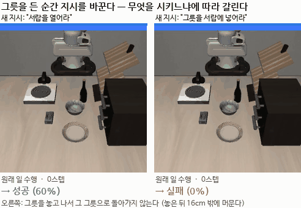
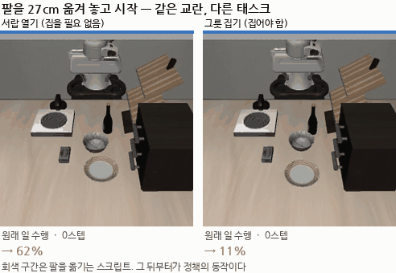

# 2026-09-23

> **한 줄 요약**: **전환 자체는 문제가 아니었습니다** — 서랍 열기로 바꾸면 전환 손실이 0 입니다. 문제는 **전환 뒤 물체를 집는 것**이고, 교란된 자세에서 무너지는 것은 **'이동'이 아니라 '집기'** 입니다 (교란 27cm 에서 집기 4% vs 서랍 열기 62%). 그전 요약: 제 가설(지시문 채널이 병목)이 **결정적으로 반증**됐습니다 — 귀를 완전히 열어도(CMI +195%) 성공률은 안 올랐습니다. 대신 쌍을 20개로 늘리자 **진짜 구조**가 드러났습니다: 난이도는 A가 아니라 **B가 무엇이냐**로 거의 전부 결정되고, **B의 목표가 물체면 1.4%, 가구·기구면 44.6%** 입니다. 원인은 **"지시가 바뀌면 일단 놓는" 반사** 였습니다.

## 오늘 알아낸 것 (한눈에)

### ⭐ 찾은 것

| # | 발견 | 값 |
|---|---|---|
| 1 | ⭐⭐⭐ **전환 자체는 문제가 아니다** | "서랍을 열어라"로 바꾸면 **전환 손실 0** (단독 60% → 전환 64%) |
| 2 | ⭐⭐⭐ **교란된 자세에서 '집기'만 무너진다** | 교란 0cm 에서 둘 다 80%, **27cm 에서 4% vs 38%** |
| 3 | ⭐⭐ **난이도는 B 가 결정한다** | B 평균 64/25/4/0/0%, A 평균은 16~22% 로 거의 같음 |
| 4 | ⭐⭐ **필요한 물체도 놓아버린다** | "그릇을 서랍에 넣어라"를 그릇 쥔 채 받아도 **10/10 놓음** |
| 5 | ⭐⭐ **놓은 뒤 다시 찾아가지 않는다** | 놓은 자리에서 **16cm 밖**에 머물며 허공을 잡는다 |
| 6 | ⭐ 손목 정렬이 교란과 함께 무너진다 | 성공한 집기 6.9도 → 전환 뒤 **15.7도** |
| 7 | ✅ CMI 시간 곡선 완성 | 취약 구간 **15스텝(0.75초)**, 이후 103% 회복 |
| 8 | ✅ 지시 **내용은 쓰인다** | 뜻 없는 글자를 넣으면 B 성공 25%→**0%** (p=0.001) |
| 9 | ✅ 재추론을 자주 하면 나빠진다 | sn=3 에서 25%→**3%** (p=0.007) → 덜 끊으면? (검증 예약) |

### ❌ 버린 것 · ⚠️ 정정한 것 (오늘만 5건)

| # | 무엇을 | 왜 |
|---|---|---|
| 1 | ❌ **지시문 채널 가설** | CMI 를 +195%(빈손보다 높게) 올려도 성공률은 **오히려 하락** |
| 2 | ❌ **그리퍼 유지 방법** | 잘 되던 서랍 열기를 **60%→0%** 로 망가뜨림 (p=0.005) |
| 3 | ⚠️ **"A 재개 0%"** | 4쌍만 본 값. 20쌍에선 8.3% 인데 그중 **93%가 우연** → 진짜 **0.6%** |
| 4 | ⚠️ **"5cm 까지 다가간다"** | **들고 있던 시점**을 포함한 측정 오류. 실제로는 16cm 밖 |
| 5 | ⚠️ **"물체 vs 가구" 이분법** | T7(가구)이 12% 로 T8(물체)과 같음. **T0 만 특별한 것** |
| 6 | ⚠️ **"교란을 더 주면 좋아진다"** | 두 번 재현된 듯했으나 5개 태스크로 넓히니 방향이 흩어짐 |

---

## 0. 🎬 오늘 알아낸 것을 한 장면으로

그릇을 든 순간 지시를 바꿉니다. **무엇을 시키느냐에 따라 완전히 갈립니다.**



| | 새 지시 | 결과 |
|---|---|---|
| 왼쪽 | "서랍을 열어라" | 그릇을 놓고 서랍으로 가서 연다 → **성공 (60%)** |
| 오른쪽 | "그릇을 서랍에 넣어라" | 그릇을 놓은 뒤 **그 그릇으로 돌아가지 않는다** → **실패 (0%)** |

오른쪽이 이상합니다 — **필요한 물체를 이미 들고 있었는데 놓아버리고, 다시 찾아가지도 않습니다.**
놓은 자리에서 **16cm 밖**에 머물며 허공을 잡습니다.

## 1. ❌ 제 가설이 틀렸습니다 — 결정적으로

9/21 에 **"물체를 쥐면 지시문에 귀를 닫는다(CMI −61%)"** 를 찾고,
**"그러면 귀를 키우면 된다"** 는 방법([지시문 증폭](../04_실습/05_libero/steerability/README.md))을 만들었습니다.

**증폭은 실제로 귀를 열었습니다.**

| 측정 지점 | 기준 | w=1.5 | **w=3** |
|---|---|---|---|
| 에피소드 시작 | 0.708 | 1.007 (+42%) | 1.488 (+110%) |
| **잡은 직후** | **0.278** | **0.462 (+67%)** | **0.819 (+195%)** |
| 들고 이동 중 | 0.650 | 0.856 (+32%) | 1.350 (+108%) |

전부 짝 검정 **p < 0.001**. w=3 은 **빈손 상태(0.708)보다도 높습니다.**

**그런데 성공률은 오히려 떨어졌습니다.**

| w | 1.0(기준) | 1.5 | 2.0 | 3.0 |
|---|---|---|---|---|
| B 성공 (4쌍 합계) | 25% | 33% | 22% | **10%** |

**토큰 반복**도 같습니다: CMI +34% (p=0.002), 성공률 **0/36**.

> **두 가지 독립적인 방법으로 지시문 채널을 열었고, 둘 다 성공률을 못 올렸습니다.**
> **지시문 채널은 병목이 아닙니다.**

이틀 동안 밀어온 가설이 반증됐습니다. 다만 **예측을 먼저 적고 결정적으로 검증했기 때문에**
낭비가 아니라 결과입니다. CMI 측정 자체는 여전히 새롭고 유효합니다 — 원인이 아닐 뿐입니다.

## 2. ⭐⭐ 쌍을 20개로 늘리자 진짜 구조가 나왔다

4쌍으로는 안 보이던 것이 20쌍에서 보였습니다.

### 행=중단한 일(A), 열=새 지시(B)

| | B0 서랍열기 | B3 위서랍+그릇 | B5 접시밀기 | B7 스토브 | B9 와인→선반 | **A 평균** |
|---|---|---|---|---|---|---|
| A1 그릇→스토브 | 60% | 0% | — | 20% | 0% | 16% |
| A2 와인→찬장 | 67% | 0% | 17% | 0% | 0% | 17% |
| A4 그릇→찬장 | 70% | 0% | 0% | 30% | 0% | 20% |
| A8 그릇→접시 | 60% | 0% | 0% | 50% | 0% | 22% |
| **B 평균** | **64%** | **0%** | **4%** | **25%** | **0%** | |

**A 는 16~22% 로 거의 차이가 없고, B 는 0~64% 로 크게 갈립니다.**

> **"무엇을 중단하는가"는 거의 상관없고, "무엇을 새로 시키는가"가 거의 전부입니다.**

이건 지금까지의 모든 분석을 다시 보게 합니다 — 우리는 A 쪽(팔 자세, 쥔 물체)만 봐 왔습니다.

## 3. ⭐⭐ B 의 목표가 '물체'면 안 된다

단독 성능으로 나눠 보면 더 선명합니다.

| B | 단독 | 전환 | 비율 | B 의 목표 |
|---|---|---|---|---|
| **B0 가운데 서랍 열기** | 60% | **64%** | **1.07** | 서랍 (가구) |
| B7 스토브 켜기 | 100% | 25% | 0.25 | 스토브 (기구) |
| B5 접시 밀기 | 100% | 4% | 0.04 | **접시 (물체)** |
| B3 위서랍 열고 그릇 넣기 | 50% | **0%** | 0.00 | **그릇 (물체)** |
| B9 와인병→선반 | 50% | **0%** | 0.00 | **와인병 (물체)** |

| B 의 목표 | 전환 성공 |
|---|---|
| **물체** (B3·B5·B9) | **1.4%** (12쌍) |
| **가구·기구** (B0·B7) | **44.6%** (8쌍) |

**30배 차이입니다.**

**B0 은 전환 손실이 0 입니다** — 단독 60% 인데 전환에서 64% 입니다.
즉 **전환 자체는 아무 문제가 없습니다.** 문제는 "전환한 다음 무엇을 시키느냐" 입니다.

## 4. ⭐⭐ 원인 — 필요한 물체마저 놓아버린다

가장 이상한 경우를 찾았습니다.

```
로봇이 그릇을 쥐고 있다.
지시: "위 서랍을 열고 **그릇**을 안에 넣어라"   ← 필요한 물체를 이미 쥐고 있다!

결과: 0%.  그리고 **10/10 전부 그릇을 놓아버린다.**
```

| 쌍 | 쥔 물체 | B 가 필요한 것 | 놓았나 | B 성공 |
|---|---|---|---|---|
| A1→B3 | 그릇 | **그릇** | 10/10 | 0% |
| A4→B3 | 그릇 | **그릇** | 10/10 | 0% |
| A8→B3 | 그릇 | **그릇** | 10/10 | 0% |
| A2→B9 | 와인병 | **와인병** | 6/6 | 0% |

**"지시가 바뀌면 일단 놓는다"가 학습된 반사입니다.**
내용이 무엇이든, 그 물체가 바로 필요하든 상관없이 놓습니다.

이것이 3절의 30배 차이를 설명합니다:

```
B 가 가구·기구를 다룸  →  놓아도 상관없다      →  44.6%
B 가 물체를 다룸       →  놓으면 다시 집어야 한다 →   1.4%
                          (그런데 다시 못 집는다)
```

## 5. ✅ 내용은 쓰인다 — 'instruction-blind' 는 과한 말이었다

전환할 때 B 대신 **뜻 없는 글자**를 넣어 봤습니다.

| 넣은 지시문 | B 성공 | A 완료 |
|---|---|---|
| ① 정상 B | 25% | 0% |
| ② "qxzf mribbel thonk vurplax" | **0%** (p=0.001) | 0% |
| ③ "walk the dog to the park" | **0%** (p=0.002) | 6% |

**B 를 실제로 지시했을 때만 B 가 이뤄집니다** → 내용은 분명히 쓰이고 있습니다.
다만 **무슨 지시를 받든 하던 일(A)은 포기합니다** (전부 0% 근처).

> **정리**: 정책은 '바뀌었다'에 반응해 A 를 버리고, 내용은 B 수행에만 부분적으로 씁니다.

⚠️ 제가 만든 판정 스크립트가 처음에 **A 완료율로 결론을 냈는데**, 그 값이 모든 조건에서 0% 라
(바닥 효과) 아무것도 가를 수 없었습니다. B 성공률로 보도록 고쳤습니다.

## 6. ✅ CMI 시간 곡선 — 취약 구간은 0.75초

| 잡은 뒤 | 0 | 2 | 4 | 6 | 10 | **15** | 20 | 30 | 40 |
|---|---|---|---|---|---|---|---|---|---|
| CMI | 0.319 | **0.287** | 0.312 | 0.413 | 0.526 | 0.682 | 0.739 | 0.689 | 0.581 |
| 시작 대비 | 44% | 40% | 43% | 57% | 73% | 95% | 103% | 96% | 81% |

잡기 전 0.719 → **잡은 뒤 2스텝에서 최저(0.287)** → **15스텝(0.75초)에 80% 회복**.

원인은 아니었지만 **측정 자체는 여전히 새롭고 유효합니다.**
[ReSteer](../02_논문노트/ReSteer.md)·[LIBERO-PRO](../02_논문노트/LIBERO-PRO.md) 모두
**에피소드 안 시점별로는 재지 않았습니다.**

## 7. ⏳ 그래서 만든 것 — 그리퍼 유지 (grip latch)

원인이 "일단 놓는 반사"라면, **놓지 못하게** 하면 됩니다.

```
전환 이후 N 스텝 동안 동작의 **그리퍼 차원만 닫힘(+1)으로 덮어쓴다.**
팔의 움직임은 정책이 낸 그대로다.
```

| 제약 | 지키나 |
|---|---|
| 초기 자세 복귀 금지 | ✅ 팔을 전혀 안 건드림 |
| 사람처럼 자연스럽게 | ✅ 스크립트 동작 없음, 궤적은 정책 그대로 |
| 학습 없이 | ✅ 추론 때 한 차원만 덮어씀 |

### ❌ 결과: 폐기

| 조건 | 기준 | 그리퍼 유지 | |
|---|---|---|---|
| A2→B9 (물체가 **필요한** B) | 0% | 0% (유지 50/100/200 전부) | 이득 없음 |
| **A8→B0 (물체가 필요 **없는** B)** | **60%** | **0%** | **큰 피해** (p=0.005) |

**이유가 분명합니다 — 서랍을 열려면 손잡이를 잡아야 하는데, 그리퍼를 강제로 닫아 두면 못 잡습니다.**

> "놓지 못하게 한다"는 발상 자체가 **B 의 절반(가구·기구)과 충돌**합니다.
> 잘 되던 44.6% 를 망가뜨리면서 1.4% 를 못 올립니다.

⚠️ 남은 조건은 **중단했습니다.** 이미 결론이 났는데 GPU 시간을 쓸 이유가 없습니다.

**배운 것**: 이 방법은 "놓는 것이 문제"라는 진단에서 나왔는데, 실제 진단은
**"놓는 것"이 아니라 "다시 집는 것"** 이었습니다 (아래 9절).
증상을 막는 것과 원인을 고치는 것은 다릅니다.

## 8. ⚠️ 정정 — 'A 재개' 수치의 대부분이 우연이었다

그리퍼 유지를 보다가 A1→B7 의 A 재개가 **90%** 인 것을 발견했습니다. 확인해 보니:

| ep | B 성공 | A 재개 | B 중 A 완료 | **A2 스텝** |
|---|---|---|---|---|
| 0~7, 9 | 대부분 실패 | ✅ | ✅ | **0** |
| 8 | 실패 | ❌ | ❌ | 300 |

**9/10 이 A2 를 0스텝 만에 '성공' 했습니다.**
= B(스토브 켜기)를 하는 동안 스토브 근처에 그릇을 놓아
A(그릇을 스토브 위에)가 **저절로 달성**된 것입니다. 돌아가서 다시 해낸 것이 아닙니다.

### 다시 센 결과 (전체 20쌍, flush)

| | A 재개 |
|---|---|
| 겉보기 | 15/180 = 8.3% |
| 그중 우연 (A2 0스텝) | 14 |
| **진짜 재개** | **1/180 = 0.6%** |

### 모든 전략을 다시 세면

| 전략 | 겉보기 | 우연 | **진짜** | 제약 |
|---|---|---|---|---|
| retreat | 61% | 1% | **60%** | ⚠️ 위반 |
| ret_pos | 16% | 1% | 15% | ⚠️ 위반 |
| rtc | 8% | 6% | **3%** | ✅ |
| ret_rot | 4% | 1% | 3% | ⚠️ 위반 |
| flush | 7% | 6% | **0%** | ✅ |
| **finish_a** | **33%** | **33%** | **0%** | ✅ |
| keep / blend / rollback / bon | 0% | 0% | 0% | ✅ |

✅ **retreat 의 60% 는 진짜입니다** — 상한 기준값은 그대로입니다.
❌ **`finish_a` 의 33% 는 전부 우연이었습니다** — 제가 9/18 에 보고한 값입니다.

### 왜 중요한가

장소가 겹치는 쌍(A1='그릇을 스토브 위에' + B7='스토브 켜기')에서 이 부풀림이 생깁니다.
**쌍을 넓힐수록 더 커집니다.** 20쌍으로 늘린 지금 이미 겉보기의 93%가 우연입니다.

→ `a_resume_genuine` / `a_resume_incidental` 을 따로 기록하도록 코드를 고쳤고,
기존 결과를 다시 세는 [`resume_audit.py`](../04_실습/05_libero/코드/resume_audit.py) 를 만들었습니다.

## 9. 그리퍼 유지가 실패한 뒤 — 어디서 막히는지 끝까지 팠다

### ① 놓은 뒤 다시 집으려 **시도는 한다**

| 쌍 | 놓음 | 다시 닫음 |
|---|---|---|
| A8→B3 | 10/10 | **8/10** |
| A4→B9 | 10/10 | 7/10 |

"시도조차 안 한다"는 아닙니다.

### ② ⚠️ 그런데 제 측정에 오류가 있었습니다

처음에 **"팔이 목표 물체 5cm 까지 다가가는데 못 집는다"** 고 썼습니다. **틀렸습니다.**
그 5cm 는 **전환 시점의 물체 위치** 기준인데, 그때는 **물체를 손에 들고 있었습니다.**
당연히 5cm 입니다 — 다가간 것이 아닙니다.

**놓인 뒤의 실제 위치**로 다시 쟀습니다 (물체는 놓으면 17cm 쯤 떨어진 곳에 안착합니다):

| 쌍 | 놓은 직후 | **가장 가까이** | 10cm 안 | B 성공 |
|---|---|---|---|---|
| A8→B3 (그릇) | 24.0cm | **16.4cm** | **0%** | 0% |
| A1→B3 (그릇) | 23.3cm | **17.2cm** | **0%** | 0% |
| A8→B5 (접시) | 12.5cm | 9.3cm | 60% | 0% |
| A4→B9 (병) | 32.1cm | 28.0cm | 0% | 0% |

> **놓은 뒤 물체 쪽으로 돌아가지 않습니다.**
> "다가갔는데 못 집는다"가 아니라 **"다가가지도 않는다"** 입니다.

그리퍼는 다시 닫지만(8/10), **물체에서 16cm 넘게 떨어진 허공**에서입니다.

```
물체를 놓는다 → 24cm 멀어진다 → 16cm 까지만 돌아온다 → 허공을 잡는다
```

같은 이유로 **"헛잡기 2~4cm"** 라고 쓴 것도 철회합니다 — 그것도 같은 기준점 오류였습니다.
('정밀도가 조금 모자란' 것이 아니라 **엉뚱한 곳을 잡는** 것입니다.)

### ③ 살아남은 측정

손목 회전 이탈은 **물체 위치와 무관하게 초기 방향 대비**로 잰 값이라 위 오류의 영향을 안 받습니다.

| 조건 | 손목 회전 이탈 |
|---|---|
| 교란 없이 성공한 집기 (n=40) | **6.9도** |
| 전환 뒤 A8→B3 (n=11) | **15.7도** |

## 10. ⭐ 정렬 오차를 직접 쟀다 — 성공률과 정확히 반대로 움직인다

성공률만 보면 **무엇이 고쳐졌는지** 알 수 없습니다. 그래서 기제를 직접 재는 지표를 만들었습니다:
**그리퍼가 닫히는 순간의 손목 회전 이탈**([`grasp_precision.py`](../04_실습/05_libero/코드/grasp_precision.py)).

| 교란 | T1 정렬 | T1 성공 | T8 정렬 | T8 성공 |
|---|---|---|---|---|
| 0cm | 1.0배 (6.6도) | 100% | 1.0배 (6.6도) | 90% |
| 12cm | 2.8배 | 30% | 2.0배 | 30% |
| 20cm | 2.9배 | 10% | 3.2배 | 22% |
| **27cm** | **3.3배** | **0%** | **4.2배** | **11%** |

**두 태스크 모두 단조롭습니다.** 정렬이 무너지는 만큼 성공률이 떨어집니다.

⚠️ **태스크끼리 비교하면 안 됩니다** — 태스크마다 잡는 자세가 달라 기준값이 다릅니다
(T9 와인병은 손목을 크게 돌려 잡아 원래 95도입니다).
**같은 태스크의 교란별 변화**와 **학습 전후 같은 칸**만 비교해야 합니다.

> LoRA 4차가 성공률을 올린다면 **이 오차가 줄어서** 올라야 합니다.
> 오차는 그대로인데 성공률만 오르면 운이거나 지름길이라, 일반화를 기대할 수 없습니다.

## 11. ⚠️ 태스크마다 데이터를 모을 수 있는 범위가 다르다

| 태스크 | 0cm | 12cm | 20cm | 27cm | 모을 수 있는 범위 |
|---|---|---|---|---|---|
| T1 그릇→스토브 | 100% | 30% | 10% | 0% | ~20cm |
| T8 그릇→접시 | 90% | 30% | 22% | 11% | ~27cm |
| **T9 와인→선반** | **50%** | **0%** | **0%** | — | **~0cm** |

처음 계획은 세 태스크를 모두 12~20cm 로 돌리는 것이었는데,
**T9 는 400회를 전부 실패하며 GPU 를 약 5시간 낭비**할 뻔했습니다.
→ T1·T8 은 12~20cm, T9 는 4~12cm 로 나눴습니다.

> 이걸 미리 재지 않고 학습부터 돌렸다면, 결과가 안 나왔을 때
> **"학습이 안 된 건지 데이터가 없었던 건지"** 구분할 수 없었을 겁니다.
> [LoRA 1차](../04_실습/05_libero/lora_v1/README.md)가 정확히 그렇게 실패했습니다.

## 12. ⭐⭐⭐ 진단 확정 — 무너지는 것은 '이동'이 아니라 '집기'다

집는 태스크(1·8·9)와 안 집는 태스크(0 서랍 열기)를
**같은 실행에서 같은 교란**으로 나란히 돌렸습니다.


### 🎬 눈으로 보면

**같은 교란(27cm)에서 시작 — 서랍 열기 vs 그릇 집기**



왼쪽은 팔이 27cm 떨어져 있어도 손잡이를 찾아 서랍을 엽니다(62%).
오른쪽은 같은 교란인데 그릇을 못 집습니다(11%).
회색 구간은 팔을 옮기는 스크립트이고, 그 뒤부터가 정책의 동작입니다.

| 교란 | **집어야 함** | **집을 필요 없음** | 차이 |
|---|---|---|---|
| **0cm** | **80%** | **80%** | **0%p** |
| 12cm | 20% | 50% | +30%p |
| 20cm | 11% | 50% | +39%p |
| **27cm** (전환 시점) | **4%** | **62%** | **+59%p** |

**교란이 없을 때는 정확히 같은 80% 입니다.**
두 집단의 실력이 같다는 뜻이라, 뒤의 차이가 **전부 교란 때문**임이 깨끗하게 분리됩니다.

그리고 **서랍 열기는 27cm 옮겨 놓고 시작해도 62% 를 해냅니다.**
같은 교란에서 물체 집기는 **4%** 입니다.

### ⇒ 9일치 관측이 하나로 이어졌다

```
전환 → 팔이 27cm 이탈
        ↓
   이동은 멀쩡       (서랍 열기 62%)              ← 오늘 확정
   집기가 무너짐      (물체 집기 4%)               ← 오늘 확정
        ↓
   손목 정렬이 3~4배 틀어짐 (6.6도 → 22~28도)      ← 오늘 측정
        ↓
   5cm 앞까지 가서 2~4cm 빗나가 헛잡음             ← 오늘 측정
        ↓
   B 가 물체면 1.4%, 가구·기구면 44.6%            ← 오늘 측정
        ↓
   못 집으니 물체가 아무 데나 → A 재개 0.6%        ← 오늘 정정
```

**모든 고리를 따로따로 쟀습니다.** 하나의 상관이 아니라 단계별 증거입니다.

### 무엇이 바뀌나

9일 동안 우리는 **"전환을 어떻게 할 것인가"** 를 15가지 방법으로 공격했습니다.
그런데 **전환은 원래 잘 됩니다.** 진짜 문제는
**"교란된 자세에서 물체 집기"** 라는 훨씬 좁고 구체적인 기술이었습니다.

| 지금까지 던진 질문 | 오늘 바뀐 질문 |
|---|---|
| 전환할 때 남은 동작을 어떻게 처리할까 | — |
| 전환 순간의 노이즈를 어떻게 고를까 | — |
| 전환 뒤 어떻게 회복할까 | — |
| 지시문을 어떻게 더 잘 듣게 할까 | — |
| | **교란된 자세에서 어떻게 정확히 집게 할까** |

## 13. ⚠️ 흥미로워 보였다가 **철회한 관찰** — "교란을 더 주면 좋아진다"

9/21 에 한 번 보고 "재측정 필요"로 남겨둔 것이 오늘 두 번째로 나와서 기록했었습니다.

| 조건 | 성공률 |
|---|---|
| 회전 30도 단독 | 0/20 |
| 20cm + 30도 | 43% |
| T1 위치 27cm 단독 | 0% |
| T1 위치 27cm + 회전 8도 | 22% |

**두 번 다 같은 방향**이라 뭔가 있어 보였습니다.

### 그런데 5개 태스크로 넓히니 흩어졌습니다

| 태스크 | 27cm 단독 | 27cm + 8도 | 변화 | p |
|---|---|---|---|---|
| **T0 서랍 열기** | 62% | **12%** | **−50%p** | 0.119 |
| T7 스토브 켜기 | 12% | 38% | +25%p | 0.569 |
| T1 그릇→스토브 | 0% | 22% | +22%p | 0.471 |
| T8 그릇→접시 | 11% | 11% | 0 | 1.000 |
| T9 와인→선반 | 0% | 0% | 0 | 1.000 |

**방향이 제각각입니다** — 올라가는 것 둘, 그대로 둘, 크게 떨어지는 것 하나.
**어느 것도 p<0.05 가 아닙니다.** 8~9회 표본에서는 이 정도 흔들림이 정상입니다.

> **철회합니다.** 두 번 재현된 것처럼 보였지만, 표본을 넓히니 잡음이었습니다.

### 오늘 배운 것

"두 번 재현됐다"는 것이 **표본이 작으면 근거가 못 됩니다.**
10회씩 두 번 = 20회이고, 우리 표본에서 20회로는 **28%p 미만을 구분할 수 없습니다.**
같은 방향으로 두 번 나올 확률은 잡음만으로도 충분히 높습니다.

(다만 T0 가 8도만 줘도 62%→12% 로 떨어지는 것은 **눈여겨볼 만합니다** —
서랍 손잡이를 잡으려면 손목 방향이 맞아야 하기 때문일 수 있습니다. p=0.119 라 아직 말할 수 없습니다.)

## 막힌 것 / 해결 방법

| 문제 | 원인 | 해결 |
|---|---|---|
| 가설이 반증됨 | CMI 는 **상관**이었지 **원인**이 아니었다 | 예측을 먼저 적고 결정적으로 검증한 덕에 빨리 닫았다 |
| 4쌍으로는 구조가 안 보였다 | B 를 2종류(7, 5)만 써서 **B 의 영향이 가려졌다** | 쌍을 20개로 늘리자 즉시 드러남 |
| 판정 스크립트가 틀린 결론 | A 완료율이 **모든 조건에서 0%** (바닥 효과) | B 성공률로 판정하도록 수정 |
| 맴돌기 비교에 교란 | 성공하면 일찍 끝나 맴돌 기회가 준다 | **실패한 에피소드만** 따로 비교 |
| A 재개 수치가 부풀려짐 | 장소가 겹치면 B 하는 동안 A 가 **저절로 달성**됨 | A2 가 **0스텝**이면 우연으로 분류 |
| "A 재개 0%" 가 과한 일반화였음 | **초기 4쌍**만 본 값이었다 | 20쌍 기준으로 다시 보고 (겉보기 8.3%, 진짜 0.6%) |

## 측정한 수치

| 항목 | 값 | 조건 |
|---|---|---|
| **증폭 CMI** 기준/w=1.5/w=3 (잡은 직후) | **0.278 / 0.462 / 0.819** | p<0.001, n=18 |
| 증폭 B 성공 w=1/1.5/2/3 | 25 / 33 / 22 / **10%** | 4쌍 × 10회 |
| 토큰 반복 CMI / B 성공 | +34% (p=0.002) / **0%** | 4쌍 × 10회 |
| **B 별 전환 성공** B0/B7/B5/B3/B9 | **64 / 25 / 4 / 0 / 0%** | 각 4쌍 × 10회 |
| **B 목표가 물체 / 가구·기구** | **1.4% / 44.6%** | 12쌍 / 8쌍 |
| B0 단독 / 전환 | 60% / **64%** (손실 0) | |
| 필요한 물체를 놓는 비율 | **10/10** | A1·A4·A8→B3 |
| 뜻 없는 지시 B 성공 | **0%** (정상 25%) | p=0.001 |
| CMI 최저 / 회복 | 잡은 뒤 **2스텝 0.287** / **15스텝** | 20Hz |
| 맴돌기 (실패분만) 기준/증폭 | 93% / **58%** | p=0.005 |
| **교란 27cm 유지율** T0/T7/T8/T1/T9 | **78 / 12 / 12 / 0 / 0%** | 0cm 대비, 각 8~10회 |
| 〃 집어야 함 / 집을 필요 없음 | 4% / 38% | 27cm, 평균 |
| 놓은 뒤 물체까지 가장 가까이 | **16.4cm** (10cm 안 **0%**) | A8→B3, 10회 |
| 손목 이탈 성공한 집기 / 전환 뒤 | **6.9도 / 15.7도** | n=40 / n=11 |
| 그리퍼 유지 A8→B0 | 60% → **0%** | p=0.005, 폐기 근거 |
| 재추론 자주 (sn=3) | 25% → **3%** | p=0.007 |
| LoRA 4차 T1 수집 (--tries 10) | 40회 중 **15개** (37.5%) | 12~20cm |

## 읽은 논문

- [ReSteer](../02_논문노트/ReSteer.md) — CMI 측정의 출처. 우리는 시점별로 재서 곡선을 얻었습니다
- [LIBERO-PRO](../02_논문노트/LIBERO-PRO.md) — 뜻 없는 지시 실험의 출처.
  그 논문은 통째로 바꿨고, 우리는 **조작 단계 안 특정 시점**에서 했습니다
- [BayesVLA](../02_논문노트/BayesVLA.md) — "지시문이 밀려난다"는 진단.
  오늘 결과는 그 진단이 맞더라도 **그게 전환 실패의 원인은 아님**을 보여줍니다

## 다음에 할 것

### 돌고 있는 것 (밤새)

| # | 스크립트 | 무엇을 정하나 | 남은 시간 |
|---|---|---|---|
| 1 | `run_lora_v4.sh` | **단계적 확장 학습** — 교란된 자세에서 집기를 복구하는가 | 약 10시간 |
| 2 | `run_longchunk.sh` | 동작을 덜 끊으면 나아지는가 (sn=20·50) | 1.5시간 |
| 3 | `run_wrist.sh` | 정렬이 **원인**인지 인과 확인 (⚠️ 제약 회색지대, 진단용) | 1.5시간 |

**읽는 순서**: `[1-4] 부분 기술이 올랐나` → `[2-3]` → `[3-1]/[3-2] 전환`
성공률보다 **부분 기술(교란된 자세에서 집기)** 을 먼저 봅니다.
안 오르면 **학습이 안 된 것**, 오르는데 전환이 안 되면 **진단이 틀린 것**입니다.

### 내일 할 것

- [ ] **LoRA 4차 1단계 결과 판정** — 집기가 올랐는가. 이것이 분기점
- [ ] `dropped` 모드로 **물체까지 낯선 자리에 둔 데이터** 수집 (오늘 찾은 빈틈)
      — 놓인 물체는 정상 위치에서 **6 표준편차** 밖인데, 지금 학습은 팔만 교란한다
- [ ] 새 서버(RTX 2080 Ti ×2) 설치 → [서버설치.md](../서버설치.md)
      GPU 2장이면 지금 10시간짜리가 **5시간**이 된다
- [ ] T0 가 8도만 줘도 62%→12% 로 떨어지는 것 확인 (p=0.119, 표본 부족)

### 더 뒤로

- [ ] "목표가 얼마나 정밀한 접촉을 요구하는가"를 **숫자로** 재서 성공률과 맞춰보기
      (지금은 제가 눈으로 분류한 사후 설명이다)
- [ ] 표본을 늘려 10%p 대 효과도 볼 수 있게 (지금은 20~28%p 가 한계)
