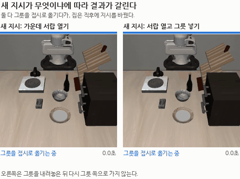
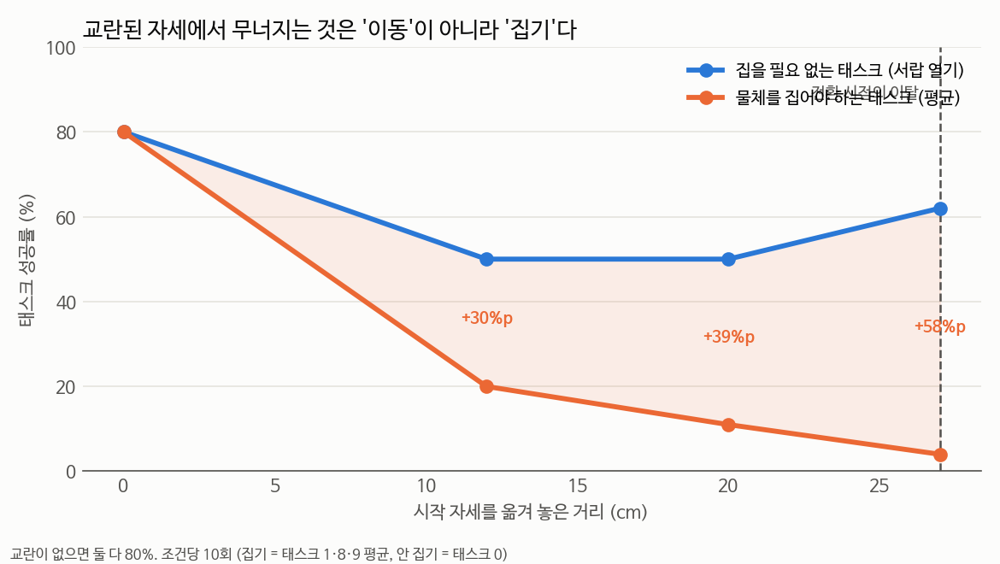
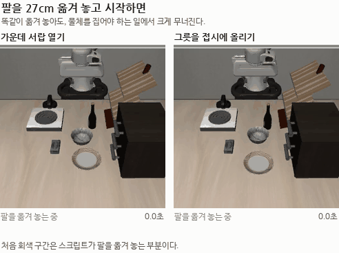

# 2026-09-23 전환이 아니라 집기가 문제였다

> 한 줄 요약: 전환 자체는 문제가 아니었다. "서랍을 열어라"로 바꾸면 전환 때문에 잃는 성공률이 없다. 문제는 전환 뒤 물체를 다시 집는 것이다. 팔을 27cm 옮겨 놓고 시작하면 서랍 열기는 62%인데 물체 집기는 4%다. 9/21에 세운 가설(지시문의 영향이 줄어드는 것이 원인)은 틀렸다. 지시문의 영향을 세 배로 키워도 성공률이 오르지 않았다.

## 오늘 결과 한눈에

| 무엇을 봤나 | 결과 |
|---|---|
| 전환 자체가 문제인가 | 아니다. 서랍 열기는 혼자 할 때 60%, 전환해서 64% |
| 팔을 옮겨 놓으면 무엇이 무너지나 | 집기. 27cm에서 집기 4%, 서랍 열기 62%. 옮기지 않으면 둘 다 80% |
| 난이도를 무엇이 정하나 | 새로 시킨 일(B). B 평균은 0~64%로 갈리고, 중단한 일(A)은 16~22%로 거의 같다 |
| B의 목표가 물체일 때와 가구일 때 | 물체 1.4%, 서랍·스토브 44.6% |
| 쥐고 있던 물체가 B에 필요해도 놓나 | "그릇을 서랍에 넣어라"를 그릇을 쥔 채 받아도 10/10 놓는다 (9/28 정정 참고) |
| 놓은 뒤 다시 찾아가나 | 가지 않는다. 놓은 물체에서 16cm 밖에 머물며 허공을 잡는다 |
| 지시문의 영향을 키우면 | CMI를 195% 올려도 성공률은 25%에서 10%로 오히려 떨어진다. 가설 기각 |
| 지시 내용이 쓰이기는 하나 | 쓰인다. 뜻 없는 글자를 넣으면 B 성공 25%에서 0% (p=0.001) |

(9/28 정정: 쥐고 있던 그릇을 그대로 다른 곳에 옮기라고 하면 정책은 놓지 않고 90~100% 해낸다. "지시가 바뀌면 무조건 놓는다"는 틀렸고, 다른 조작이 필요할 때만 놓는다. [9/28 일지](2026-09-28.md) 참고)

오늘 버리거나 고친 것도 많다.

| 무엇을 | 왜 |
|---|---|
| 지시문의 영향이 원인이라는 가설 | CMI를 빈손 상태보다 높게 올려도 성공률이 오히려 떨어짐 |
| 그리퍼를 강제로 닫아 두는 방법 | 잘 되던 서랍 열기를 60%에서 0%로 망가뜨림 (p=0.005) |
| "원래 일로 돌아가기 0%" | 4쌍만 본 값. 20쌍에서는 8.3%인데 그중 93%가 우연이라 실제로는 0.6% |
| "물체 5cm 앞까지 다가간다" | 물체를 들고 있던 시점을 기준으로 잰 측정 오류. 실제로는 16cm 밖 |
| "물체 대 가구"로 딱 나누기 | 스토브 켜기(가구)도 교란에서는 12%로 그릇 옮기기와 같다. 서랍 열기만 특별하다 |
| "교란을 더 주면 좋아진다" | 두 번 재현된 듯했지만 5개 태스크로 넓히니 방향이 흩어짐 |

---

## 한 장면으로 보기

그릇을 집은 직후 지시를 바꾼다. 무엇을 시키느냐에 따라 완전히 갈린다.

왼쪽은 "가운데 서랍을 열어라". 그릇을 놓고 서랍으로 가서 연다(이 조합 60%). 오른쪽은 "위 서랍을 열고 그릇을 넣어라". 필요한 그릇을 이미 들고 있었는데 놓아 버리고, 다시 찾아가지도 않는다(0%). 놓은 자리에서 16cm 밖에 머물며 허공을 잡는다.

## 1. 가설이 틀렸다

9/21에 "물체를 쥐면 지시문의 영향이 줄어든다(CMI −61%)"를 찾고, 그렇다면 지시문의 영향을 키우면 된다는 방법([지시문 증폭](../04_실습/05_libero/steerability/README.md))을 만들었다. 증폭은 실제로 지시문의 영향을 키웠다.

| 재는 시점 | 기준 | w=1.5 | w=3 |
|---|---|---|---|
| 에피소드 시작 | 0.708 | 1.007 (+42%) | 1.488 (+110%) |
| 잡은 직후 | 0.278 | 0.462 (+67%) | 0.819 (+195%) |
| 들고 가는 중 | 0.650 | 0.856 (+32%) | 1.350 (+108%) |

전부 짝 검정 p < 0.001이다. w=3은 빈손 상태(0.708)보다도 높다. 그런데 성공률은 오히려 떨어졌다.

| w | 1.0 (기준) | 1.5 | 2.0 | 3.0 |
|---|---|---|---|---|
| B 성공 (4쌍 합계) | 25% | 33% | 22% | 10% |

지시문 토큰을 반복해 넣는 방법도 같았다. CMI는 34% 올랐지만(p=0.002) 성공은 0/36이었다.

서로 다른 두 방법으로 지시문의 영향을 키웠고, 둘 다 성공률을 올리지 못했다. 지시문은 병목이 아니다. 이틀 동안 밀어 온 가설이 기각됐지만, 예측을 먼저 적고 결정적으로 확인했기 때문에 헛수고가 아니라 결과로 남는다. CMI 측정 자체는 여전히 새롭고 유효하다. 원인이 아니었을 뿐이다.

## 2. 쌍을 20개로 늘리자 구조가 보였다

4쌍으로는 안 보이던 것이 20쌍에서 보였다. 행은 중단한 일(A), 열은 새로 시킨 일(B)이다.

| | B0 서랍 열기 | B3 위 서랍+그릇 | B5 접시 밀기 | B7 스토브 | B9 와인병→선반 | A 평균 |
|---|---|---|---|---|---|---|
| A1 그릇→스토브 | 60% | 0% | | 20% | 0% | 16% |
| A2 와인병→찬장 | 67% | 0% | 17% | 0% | 0% | 17% |
| A4 그릇→찬장 | 70% | 0% | 0% | 30% | 0% | 20% |
| A8 그릇→접시 | 60% | 0% | 0% | 50% | 0% | 22% |
| B 평균 | 64% | 0% | 4% | 25% | 0% | |

A는 16~22%로 거의 차이가 없고, B는 0~64%로 크게 갈린다. 무엇을 중단했는지는 거의 상관없고, 무엇을 새로 시켰는지가 거의 전부다. 지금까지는 A 쪽(팔 자세, 쥔 물체)만 봐 왔으니 분석을 다시 봐야 한다.

## 3. B의 목표가 물체면 안 된다

혼자 할 때 성능과 나란히 보면 더 선명하다.

| B | 혼자 | 전환 | 비율 | B의 목표 |
|---|---|---|---|---|
| B0 가운데 서랍 열기 | 60% | 64% | 1.07 | 서랍 (가구) |
| B7 스토브 켜기 | 100% | 25% | 0.25 | 스토브 (기구) |
| B5 접시 밀기 | 100% | 4% | 0.04 | 접시 (물체) |
| B3 위 서랍 열고 그릇 넣기 | 50% | 0% | 0.00 | 그릇 (물체) |
| B9 와인병을 선반에 | 50% | 0% | 0.00 | 와인병 (물체) |

| B의 목표 | 전환 성공 |
|---|---|
| 물체 (B3, B5, B9) | 1.4% (12쌍) |
| 가구·기구 (B0, B7) | 44.6% (8쌍) |

30배 차이다. 서랍 열기는 혼자 60%, 전환해서 64%로 전환 때문에 잃는 것이 없다. 전환 자체는 문제가 아니고, 전환한 다음 무엇을 시키느냐가 문제다.

## 4. 필요한 물체까지 놓아 버린다

가장 이상한 경우를 찾았다. 로봇이 그릇을 쥐고 있는데 "위 서랍을 열고 그릇을 안에 넣어라"를 받는다. 필요한 물체를 이미 쥐고 있는데도 결과는 0%이고, 10번 모두 그릇을 놓아 버린다.

| 쌍 | 쥔 물체 | B에 필요한 것 | 놓았나 | B 성공 |
|---|---|---|---|---|
| A1→B3 | 그릇 | 그릇 | 10/10 | 0% |
| A4→B3 | 그릇 | 그릇 | 10/10 | 0% |
| A8→B3 | 그릇 | 그릇 | 10/10 | 0% |
| A2→B9 | 와인병 | 와인병 | 6/6 | 0% |

오늘은 이것을 "지시가 바뀌면 일단 놓는" 학습된 반사로 해석했다. 이게 3절의 30배 차이를 설명한다고 봤다. B가 서랍이나 스토브를 다루면 놓아도 상관없지만(44.6%), B가 물체를 다루면 놓은 것을 다시 집어야 하는데 다시 못 집는다(1.4%).

(9/28에 고쳤다. 같은 그릇을 쥔 채 목적지만 바꾸면 놓지 않는다. B3은 서랍을 먼저 열어야 해서 놓는 것이고, "무조건 놓는다"는 과한 말이었다.)

## 5. 지시 내용은 쓰인다

전환할 때 B 대신 뜻 없는 글자를 넣어 봤다.

| 넣은 지시문 | B 성공 | A 완료 |
|---|---|---|
| 정상 B | 25% | 0% |
| "qxzf mribbel thonk vurplax" | 0% (p=0.001) | 0% |
| "walk the dog to the park" | 0% (p=0.002) | 6% |

B를 실제로 지시했을 때만 B가 이뤄지므로 내용은 분명히 쓰인다. 다만 무슨 지시를 받든 하던 일(A)은 포기한다. 정책은 지시가 바뀌었다는 것에 반응해 A를 버리고, 내용은 B를 하는 데 쓴다.

처음에 판정 스크립트가 A 완료율로 결론을 냈는데, 그 값이 모든 조건에서 0%라 아무것도 가를 수 없었다. B 성공률로 보도록 고쳤다.

## 6. CMI 시간 곡선: 약한 구간은 0.75초

| 잡은 뒤 스텝 | 0 | 2 | 4 | 6 | 10 | 15 | 20 | 30 | 40 |
|---|---|---|---|---|---|---|---|---|---|
| CMI | 0.319 | 0.287 | 0.312 | 0.413 | 0.526 | 0.682 | 0.739 | 0.689 | 0.581 |
| 시작 대비 | 44% | 40% | 43% | 57% | 73% | 95% | 103% | 96% | 81% |

잡기 전 0.719에서, 잡은 뒤 2스텝에 가장 낮고(0.287), 15스텝(0.75초)이면 다시 올라온다. 원인은 아니었지만 측정 자체는 새롭다. [ReSteer](../02_논문노트/ReSteer.md)도 [LIBERO-PRO](../02_논문노트/LIBERO-PRO.md)도 에피소드 안에서 시점별로 재지는 않았다.

## 7. 그리퍼를 강제로 닫아 두기, 폐기

원인이 "일단 놓는 반사"라면 놓지 못하게 하면 된다고 생각했다. 전환 뒤 N스텝 동안 동작의 그리퍼 값만 닫힘(+1)으로 덮어쓰고, 팔의 움직임은 정책 그대로 둔다. 팔을 건드리지 않으니 제약도 지킨다.

| 조건 | 기준 | 그리퍼 닫아 두기 | |
|---|---|---|---|
| A2→B9 (물체가 필요한 B) | 0% | 0% (50·100·200스텝 모두) | 이득 없음 |
| A8→B0 (물체가 필요 없는 B) | 60% | 0% | 크게 나빠짐 (p=0.005) |

서랍을 열려면 손잡이를 잡아야 하는데, 그리퍼를 닫아 두면 잡을 수가 없다. 놓지 못하게 한다는 발상 자체가 B의 절반(서랍·스토브)과 부딪힌다. 잘 되던 44.6%를 망가뜨리면서 1.4%도 못 올리므로 남은 조건은 돌리지 않고 멈췄다.

이 방법은 "놓는 것이 문제"라는 진단에서 나왔는데, 실제 문제는 놓는 것이 아니라 다시 집는 것이었다(9절). 증상을 막는 것과 원인을 고치는 것은 다르다.

## 8. 정정: "원래 일로 돌아가기" 수치 대부분이 우연이었다

A1→B7에서 원래 일로 돌아가기가 90%인 것을 보고 확인해 봤다.

| 에피소드 | B 성공 | A 재개 | B 하는 중 A 완료 | 재개에 걸린 스텝 |
|---|---|---|---|---|
| 0~7, 9 | 대부분 실패 | 성공 | 성공 | 0 |
| 8 | 실패 | 실패 | 실패 | 300 |

10번 중 9번이 재개 0스텝 만에 "성공"했다. B(스토브 켜기)를 하는 동안 스토브 근처에 그릇을 내려놓아서 A(그릇을 스토브 위에)가 저절로 달성된 것이다. 돌아가서 다시 해낸 게 아니다.

전체 20쌍을 다시 세면 겉보기로는 15/180 = 8.3%인데, 그중 14번이 0스텝 우연이고 진짜 재개는 1/180 = 0.6%다.

| 방식 | 겉보기 | 우연 | 진짜 | 제약 |
|---|---|---|---|---|
| 처음 자세로 완전히 | 61% | 1% | 60% | 위반 |
| 위치만 되돌림 | 16% | 1% | 15% | 위반 |
| 이어 잇기 | 8% | 6% | 3% | 지킴 |
| 손목만 되돌림 | 4% | 1% | 3% | 위반 |
| 그 자리에서 바로 | 7% | 6% | 0% | 지킴 |
| 하던 일 먼저 끝내기 | 33% | 33% | 0% | 지킴 |
| 마저 하기 / 섞기 / 되감기 / 후보 고르기 | 0% | 0% | 0% | 지킴 |

처음 자세로 돌아가는 방식의 60%는 진짜라 상한 기준값은 그대로다. 반면 9/18에 보고한 "하던 일 먼저 끝내기 33%"는 전부 우연이었다.

장소가 겹치는 쌍(A1 "그릇을 스토브 위에"와 B7 "스토브 켜기")에서 이렇게 부풀려지고, 쌍을 넓힐수록 더 커진다. 20쌍인 지금 겉보기의 93%가 우연이다. 코드가 진짜 재개와 우연을 따로 기록하게 고쳤고, 기존 결과를 다시 세는 [`resume_audit.py`](../04_실습/05_libero/코드/resume_audit.py)를 만들었다.

## 9. 어디서 막히는지 끝까지 파 봤다

놓은 뒤 다시 집으려는 시도는 한다. 그리퍼를 다시 닫은 경우가 A8→B3 8/10, A4→B9 7/10이다.

그런데 처음에 쓴 측정에 오류가 있었다. "팔이 목표 물체 5cm까지 다가가는데 못 집는다"고 썼는데, 그 5cm는 전환 순간의 물체 위치 기준이었고, 그때는 물체를 손에 들고 있었다. 당연히 5cm다. 놓인 뒤의 실제 위치로 다시 쟀다(물체는 놓으면 17cm쯤 떨어진 곳에 자리 잡는다).

| 쌍 | 놓은 직후 거리 | 가장 가까이 간 거리 | 10cm 안에 들어간 비율 | B 성공 |
|---|---|---|---|---|
| A8→B3 (그릇) | 24.0cm | 16.4cm | 0% | 0% |
| A1→B3 (그릇) | 23.3cm | 17.2cm | 0% | 0% |
| A8→B5 (접시) | 12.5cm | 9.3cm | 60% | 0% |
| A4→B9 (병) | 32.1cm | 28.0cm | 0% | 0% |

놓은 뒤 물체 쪽으로 돌아가지 않는다. "다가갔는데 못 집는다"가 아니라 다가가지도 않는다. 물체를 놓고, 24cm 멀어지고, 16cm까지만 돌아와서, 그 자리에서 허공을 잡는다. 같은 이유로 "2~4cm 빗나가 헛잡는다"고 쓴 것도 철회한다. 조금 모자란 게 아니라 엉뚱한 곳을 잡는 것이다.

손목 회전 이탈은 물체 위치와 상관없이 처음 방향 대비로 잰 값이라 이 오류의 영향을 받지 않는다.

| 조건 | 손목 회전 이탈 |
|---|---|
| 교란 없이 성공한 집기 (n=40) | 6.9도 |
| 전환 뒤 A8→B3 (n=11) | 15.7도 |

## 10. 집는 순간의 손목 정렬을 직접 쟀다

성공률만 보면 무엇이 좋아졌는지 알 수 없어서, 그리퍼가 닫히는 순간의 손목 회전 이탈을 재는 지표를 만들었다([`grasp_precision.py`](../04_실습/05_libero/코드/grasp_precision.py)).

| 교란 | T1 정렬 | T1 성공 | T8 정렬 | T8 성공 |
|---|---|---|---|---|
| 0cm | 1.0배 (6.6도) | 100% | 1.0배 (6.6도) | 90% |
| 12cm | 2.8배 | 30% | 2.0배 | 30% |
| 20cm | 2.9배 | 10% | 3.2배 | 22% |
| 27cm | 3.3배 | 0% | 4.2배 | 11% |

두 태스크 모두 정렬이 무너지는 만큼 성공률이 떨어진다. 다만 태스크끼리 비교하면 안 된다. 태스크마다 잡는 자세가 달라 기준값이 다르다(와인병은 원래 손목을 크게 돌려 95도로 잡는다). 같은 태스크 안에서 교란별 변화, 그리고 학습 전후 같은 칸만 비교해야 한다. LoRA 4차가 성공률을 올린다면 이 오차가 줄어서 올라야 한다. 오차는 그대로인데 성공률만 오르면 운이거나 지름길이라 일반화를 기대할 수 없다.

## 11. 태스크마다 데이터를 모을 수 있는 범위가 다르다

| 태스크 | 0cm | 12cm | 20cm | 27cm | 모을 수 있는 범위 |
|---|---|---|---|---|---|
| T1 그릇→스토브 | 100% | 30% | 10% | 0% | 20cm 정도까지 |
| T8 그릇→접시 | 90% | 30% | 22% | 11% | 27cm 정도까지 |
| T9 와인병→선반 | 50% | 0% | 0% | | 거의 0cm |

처음 계획은 세 태스크 모두 12~20cm로 돌리는 것이었는데, 그랬다면 T9는 400번을 전부 실패하며 GPU를 5시간쯤 낭비했을 것이다. T1과 T8은 12~20cm, T9는 4~12cm로 나눴다. 미리 재지 않고 학습부터 돌렸다면, 결과가 안 나왔을 때 학습이 안 된 건지 데이터가 없었던 건지 구분할 수 없었을 것이다. [LoRA 1차](../04_실습/05_libero/lora_v1/README.md)가 정확히 그렇게 실패했다.

## 12. 확인: 무너지는 것은 이동이 아니라 집기다

집는 태스크(1, 8, 9)와 집지 않는 태스크(0, 서랍 열기)를 같은 실행에서 같은 교란으로 나란히 돌렸다.

왼쪽은 팔이 27cm 떨어진 곳에서 시작해도 손잡이를 찾아 서랍을 연다(62%). 오른쪽은 같은 조건에서 그릇을 집지 못한다(11%). 처음 회색 구간은 스크립트가 팔을 옮겨 놓는 부분이다.

| 교란 | 집어야 함 | 집을 필요 없음 | 차이 |
|---|---|---|---|
| 0cm | 80% | 80% | 0%p |
| 12cm | 20% | 50% | +30%p |
| 20cm | 11% | 50% | +39%p |
| 27cm (전환 때와 같은 거리) | 4% | 62% | +59%p |

교란이 없을 때는 정확히 같은 80%다. 두 집단의 실력이 같다는 뜻이라, 뒤에서 벌어지는 차이는 전부 교란 때문이라고 깨끗하게 나눠 볼 수 있다.

9일 동안 본 것을 이어 보면 이렇다.

| 단계 | 근거 |
|---|---|
| 전환하면 팔이 처음 위치에서 27cm 벗어나 있다 | 9/17 측정 |
| 이동은 멀쩡하다 | 27cm에서 서랍 열기 62% (오늘) |
| 집기가 무너진다 | 27cm에서 물체 집기 4% (오늘) |
| 집는 순간 손목 정렬이 3~4배 틀어진다 | 6.6도에서 22~28도 (오늘) |
| 놓은 물체에서 16cm 밖에 머물며 허공을 잡는다 | 오늘 다시 잰 값 |
| B가 물체면 1.4%, 서랍·스토브면 44.6% | 오늘 |
| 물체가 아무 데나 놓여 원래 일로 돌아가기 0.6% | 오늘 정정 |

단계마다 따로 쟀다. 상관 하나가 아니라 단계별 증거다.

9일 동안 "전환을 어떻게 할 것인가"를 15가지 방법으로 공략했다. 남은 동작 처리, 전환 순간의 노이즈, 전환 뒤 회복, 지시문 강화. 그런데 전환은 원래 잘 된다. 진짜 문제는 "교란된 자세에서 물체를 정확히 집는 것"이라는 훨씬 좁고 구체적인 기술이었다.

## 13. 흥미로워 보였다가 철회한 관찰: "교란을 더 주면 좋아진다"

9/21에 한 번 보고 다시 재야 한다고 남긴 것이 오늘 또 나와서 기록해 뒀었다.

| 조건 | 성공률 |
|---|---|
| 손목 30도만 | 0/20 |
| 20cm + 30도 | 43% |
| T1 위치 27cm만 | 0% |
| T1 위치 27cm + 손목 8도 | 22% |

두 번 다 같은 방향이라 무언가 있어 보였다. 그런데 5개 태스크로 넓히니 흩어졌다.

| 태스크 | 27cm만 | 27cm + 8도 | 변화 | p |
|---|---|---|---|---|
| T0 서랍 열기 | 62% | 12% | −50%p | 0.119 |
| T7 스토브 켜기 | 12% | 38% | +25%p | 0.569 |
| T1 그릇→스토브 | 0% | 22% | +22%p | 0.471 |
| T8 그릇→접시 | 11% | 11% | 0 | 1.000 |
| T9 와인병→선반 | 0% | 0% | 0 | 1.000 |

오르는 것 둘, 그대로인 것 둘, 크게 떨어지는 것 하나로 방향이 제각각이고, 어느 것도 p<0.05가 아니다. 8~9회 표본에서는 이 정도 흔들림이 정상이다. 철회한다.

"두 번 재현됐다"는 것도 표본이 작으면 근거가 되지 못한다. 10회씩 두 번이면 20회이고, 20회로는 28%p보다 작은 차이를 구분할 수 없다. 잡음만으로도 같은 방향이 두 번 나올 확률은 충분히 높다. 다만 서랍 열기가 손목 8도만으로 62%에서 12%로 떨어지는 것은 눈여겨볼 만하다. 손잡이를 잡으려면 손목 방향이 맞아야 하기 때문일 수 있다. p=0.119라 아직 말할 수 없다.

## 막힌 것과 해결

| 문제 | 원인 | 해결 |
|---|---|---|
| 가설이 기각됨 | CMI는 함께 나타나는 현상이었지 원인이 아니었다 | 예측을 먼저 적고 결정적으로 확인해서 빨리 정리했다 |
| 4쌍으로는 구조가 안 보임 | B를 두 종류(7, 5)만 써서 B의 영향이 가려짐 | 쌍을 20개로 늘리자 바로 드러남 |
| 판정 스크립트가 틀린 결론을 냄 | A 완료율이 모든 조건에서 0% (바닥 효과) | B 성공률로 판정하도록 수정 |
| 맴돌기 비교가 치우침 | 성공하면 일찍 끝나 맴돌 기회가 줄어든다 | 실패한 에피소드만 따로 비교 |
| 원래 일로 돌아가기 수치가 부풀려짐 | 장소가 겹치면 B를 하는 동안 A가 저절로 달성됨 | 재개가 0스텝이면 우연으로 분류 |
| "원래 일로 돌아가기 0%"가 과한 일반화였음 | 처음 4쌍만 본 값 | 20쌍 기준으로 다시 보고 (겉보기 8.3%, 진짜 0.6%) |

## 측정한 수치

| 항목 | 값 | 조건 |
|---|---|---|
| B 목표가 물체 / 가구·기구 | 1.4% / 44.6% | 12쌍 / 8쌍 |
| 교란 27cm: 집어야 함 / 집을 필요 없음 | 4% / 62% | 같은 실행, 각 8~10회 |
| 증폭 CMI: 기준 / w=1.5 / w=3 (잡은 직후) | 0.278 / 0.462 / 0.819 | p<0.001, n=18 |
| 증폭 B 성공: w=1 / 1.5 / 2 / 3 | 25 / 33 / 22 / 10% | 4쌍 × 10회 |
| 토큰 반복: CMI / B 성공 | +34% (p=0.002) / 0% | 4쌍 × 10회 |
| B별 전환 성공: B0 / B7 / B5 / B3 / B9 | 64 / 25 / 4 / 0 / 0% | 각 4쌍 × 10회 |
| 서랍 열기: 혼자 / 전환 | 60% / 64% | 전환 손실 없음 |
| 필요한 물체를 놓는 비율 | 10/10 | A1·A4·A8→B3 |
| 뜻 없는 지시일 때 B 성공 | 0% (정상 25%) | p=0.001 |
| CMI 최저 / 회복 | 잡은 뒤 2스텝 0.287 / 15스텝 | 20Hz |
| 맴돌기 (실패만): 기준 / 증폭 | 93% / 58% | p=0.005 |
| 교란 27cm 유지율: T0 / T7 / T8 / T1 / T9 | 78 / 12 / 12 / 0 / 0% | 0cm 대비, 각 8~10회 |
| 놓은 물체까지 가장 가까이 간 거리 | 16.4cm (10cm 안 0%) | A8→B3, 10회 |
| 손목 이탈: 성공한 집기 / 전환 뒤 | 6.9도 / 15.7도 | n=40 / n=11 |
| 그리퍼 닫아 두기, A8→B0 | 60%에서 0% | p=0.005, 폐기 근거 |
| 자주 다시 추론 (3스텝마다) | 25%에서 3% | p=0.007 |
| LoRA 4차 T1 수집 (10번까지 재시도) | 40회 중 15개 (37.5%) | 12~20cm |

## 읽은 논문

- [ReSteer](../02_논문노트/ReSteer.md): CMI 측정의 출처. 우리는 시점별로 재서 곡선을 얻었다
- [LIBERO-PRO](../02_논문노트/LIBERO-PRO.md): 뜻 없는 지시 실험의 출처. 그 논문은 지시를 통째로 바꿨고, 우리는 조작 도중 특정 시점에 바꿨다
- [BayesVLA](../02_논문노트/BayesVLA.md): "지시문이 밀려난다"는 진단. 오늘 결과는 그 진단이 맞더라도 그것이 전환 실패의 원인은 아니라는 것을 보여 준다

## 다음에 할 것

밤새 도는 것

| 스크립트 | 무엇을 정하나 | 남은 시간 |
|---|---|---|
| `run_lora_v4.sh` | 단계적으로 넓혀 가는 학습. 교란된 자세에서 집기가 살아나는가 | 약 10시간 |
| `run_longchunk.sh` | 동작을 덜 끊으면 나아지는가 (20·50스텝마다 추론) | 1.5시간 |
| `run_wrist.sh` | 손목 정렬이 원인인지 확인 (제약상 애매해서 진단용으로만) | 1.5시간 |

결과를 볼 때는 전환 성공률보다 부분 기술(교란된 자세에서 집기)을 먼저 본다. 이게 안 오르면 학습이 안 된 것이고, 이건 오르는데 전환이 안 되면 진단이 틀린 것이다.

- [ ] LoRA 4차 1단계 결과 판정: 집기가 올랐나. 이것이 갈림길이다
- [ ] 물체까지 낯선 자리에 둔 데이터 수집 (`dropped` 모드). 놓인 물체는 정상 위치에서 6 표준편차 밖인데, 지금 학습은 팔만 옮겨 놓는다
- [ ] 새 서버(RTX 2080 Ti ×2) 설치, [서버설치.md](../서버설치.md). GPU 두 장이면 10시간짜리가 5시간이 된다
- [ ] 서랍 열기가 손목 8도에 62%에서 12%로 떨어지는 것 확인 (p=0.119, 표본 부족)
- [ ] 목표가 얼마나 정밀한 접촉을 요구하는지 숫자로 재서 성공률과 맞춰 보기. 지금은 눈으로 분류한 사후 설명이다
- [ ] 표본을 늘려 10%p 수준 효과도 볼 수 있게 (지금은 20~28%p가 한계)
