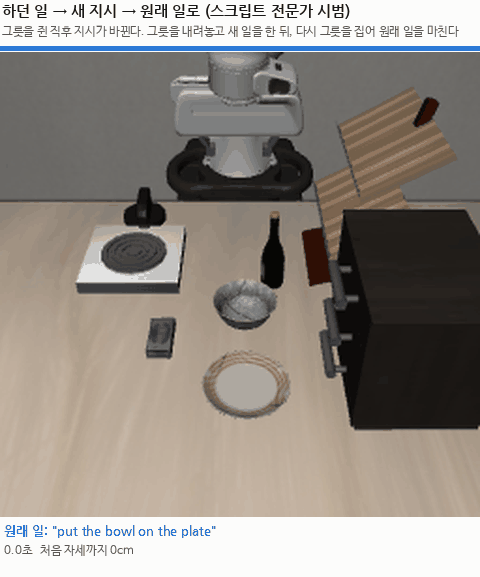
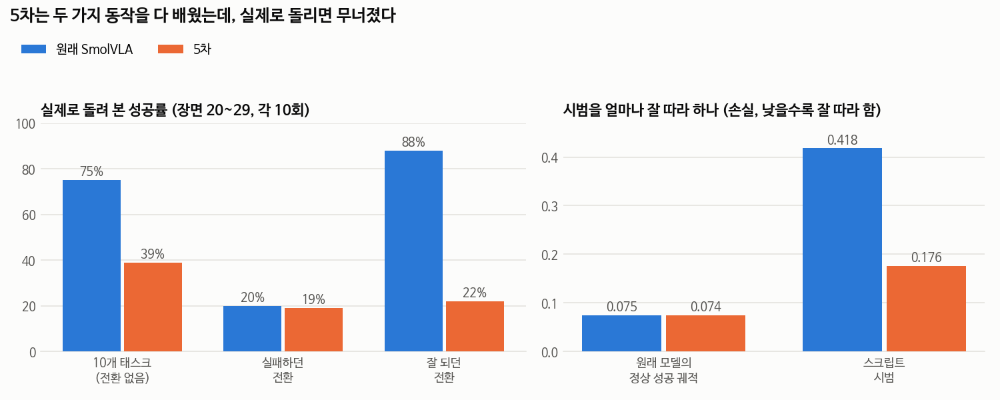
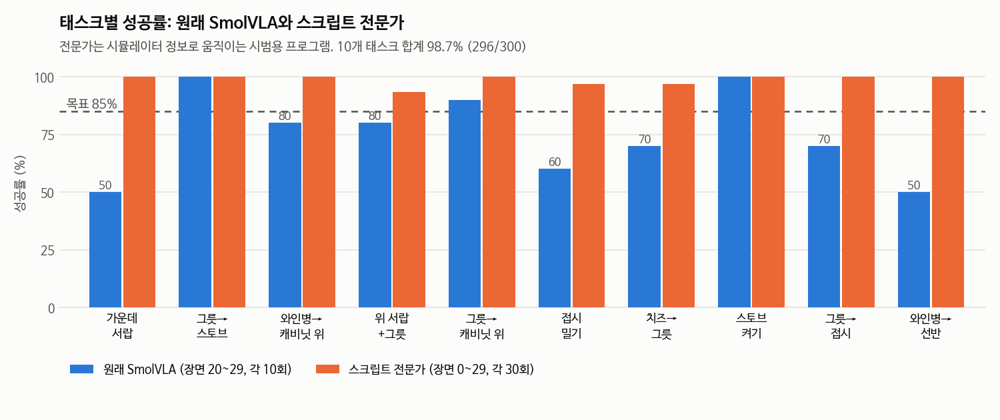
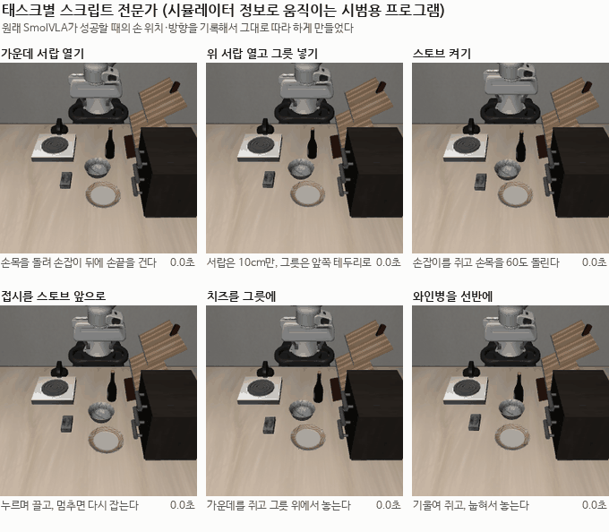
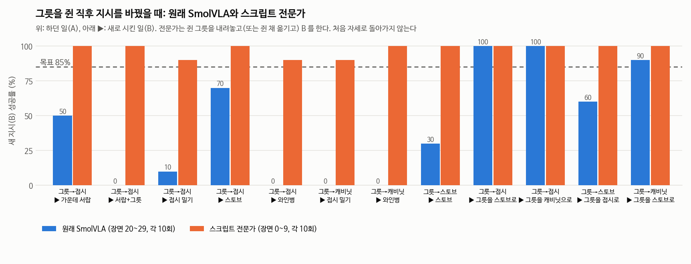
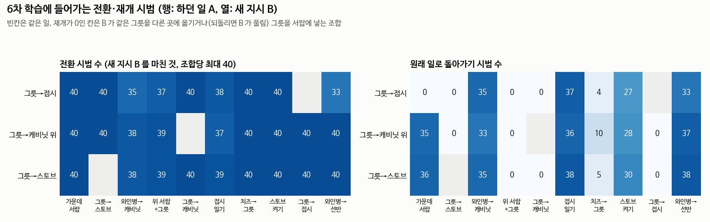

# 2026-10-01 5차 실패, 그리고 10개 태스크 전문가 완성

> 한 줄 요약: LoRA 5차는 실패했다(10개 태스크 75%에서 39%). 손실을 재 보니 모델은 정상 동작과 스크립트 시범을 둘 다 배웠는데, 두 방식이 같은 지시문에 섞여 실제로 돌리면 오락가락했다. 그래서 정상·전환·재개를 모두 한 가지 방식(스크립트 전문가)으로 통일하기로 하고, 10개 태스크 전문가를 모두 만들었다. 합계 98.7%(296/300)다. 이 시범으로 6차를 밤새 학습한다.

## 오늘 결과 한눈에

| 무엇을 봤나 | 결과 |
|---|---|
| LoRA 5차 | 10개 태스크 75%에서 39%, 잘 되던 전환 88%에서 22%. 실패 |
| 5차가 무너진 이유 | 동작 방식 두 가지가 같은 지시문에 섞임 (모델은 둘 다 배웠다) |
| 10개 태스크 전문가 | 합계 98.7%. 가장 낮은 위 서랍+그릇도 93% |
| 6차 데이터 | 정상 10개 태스크 × 110장면 + 전환·재개 27쌍 × 40장면, 수집 중 |
| 사고 | 수집기 16개를 한꺼번에 돌려 메모리가 차서 PC가 재부팅됨 |

목표는 모든 조건에서 85% 이상(최대 95%)이다. 기한은 10/8로 잡았다(10/9 한글날).

6차가 배울 시범 한 번. "그릇을 접시에"(파랑)를 하다 그릇을 쥔 직후 "스토브를 켜라"(주황)로 바뀐다. 그릇을 그 자리에 내려놓고 스토브를 켠 뒤, 다시 "그릇을 접시에"(초록)로 돌아가 내려놓았던 그릇을 집어 접시에 올린다. 아래 숫자는 처음 자세까지의 거리로, 끝까지 27cm 이상 떨어져 있다.

---

## 1. LoRA 5차는 실패했다

원래 모델과 같은 장면(20~29)에서 나란히 돌렸다.

| | 원래 SmolVLA | 5차 |
|---|---|---|
| 10개 태스크 (전환 없음) | 75% | 39% |
| 원래 실패하던 전환 8쌍 | 20% | 19% |
| 원래 잘 되던 전환 4쌍 | 88% | 22% |

4차처럼 전반적으로 망가졌다. 그런데 이번에는 정상 리허설을 지시문마다 절반씩 섞었고, 전환과 상관없는 태스크(그릇→스토브 100%에서 40%)까지 무너졌다. 그래서 먼저 데이터 형식 버그를 의심했지만, 2차 때 기록 방식과 똑같았고 저장된 모델 파일도 정상이었다.

원인은 손실을 직접 재 보고 알았다(오른쪽 그래프, `eval_loss.py`).

- 원래 모델의 정상 성공 궤적: 원래 0.075, 5차 0.074. 정상 동작을 잊지 않았다
- 스크립트 시범: 원래 0.418, 5차 0.176. 스크립트 동작도 배웠다

둘 다 배웠는데 실제로 돌리면 무너진다. 스크립트 시범은 원래 모델 동작과 전혀 다르다(손실 0.418). 같은 지시문, 비슷한 장면에 두 가지 방식이 섞여 있으니, 실행할 때 스텝마다 두 방식 사이를 오가다 엉뚱한 곳으로 간다.

## 2. 그래서 바꾼 방향: 모든 동작을 한 가지 방식으로

정상 수행, 전환, 재개를 모두 스크립트 전문가로 만들고, 모델이 그 한 가지 방식만 배우게 한다. 그러려면 10개 태스크 전부에 전문가가 있어야 한다. 어제까지는 그릇 옮기기와 서랍뿐이었다.

방법은 서랍 때 통했던 것 그대로다. 원래 모델이 성공하는 순간을 다시 돌려 손 위치, 손 방향, 그리퍼, 접촉을 한 스텝씩 기록하고(`diag_policy_contact.py`), 그대로 따라 하게 만든다.

## 3. 10개 태스크 전문가

| 태스크 | 원래 모델이 하는 방법 (기록해서 알아낸 것) | 전문가 성공 (30회) |
|---|---|---|
| 가운데 서랍 열기 | 손목을 90도 돌려 손끝을 손잡이 뒤 틈에 걸고 당긴다 | 30/30 |
| 그릇→스토브, 캐비닛 위, 접시 | 그릇 테두리를 쥐고 옮긴다 (9/28에 만든 것) | 30/30, 30/30, 30/30 |
| 와인병→캐비닛 위 | 손목을 60도 기울여 병 위쪽을 쥐고, 선 채로 놓는다 | 30/30 |
| 와인병→선반 | 같은 방법으로 쥐고, 손목을 더 눕혀 선반에 놓는다 | 30/30 |
| 스토브 켜기 | 손잡이를 쥐고 손목을 돌린다 | 30/30 |
| 위 서랍 열고 그릇 넣기 | 서랍은 10cm만 열고, 그릇은 앞쪽 테두리로 | 28/30 |
| 접시 밀기 | 벌린 손을 접시 안쪽에 넣고 누르며 끈다 | 29/30 |
| 치즈→그릇 | 치즈 가운데를 쥐고 그릇 위에서 놓는다 | 29/30 |

### 만들면서 고친 것

처음 버전이 바로 된 것은 와인병 두 개와 치즈였다. 나머지는 실패 장면을 하나씩 찍어 보며 고쳤다.

| 태스크 | 처음 | 막힌 이유 | 고친 뒤 |
|---|---|---|---|
| 스토브 | 7/20 | 손목을 40도 돌리면 손잡이는 27~29도만 돌아 켜짐 기준(약 0.5라디안)에 걸린다 | 60도 돌리기, 30/30 |
| 접시 밀기 | 0/20 | 손을 접시보다 3cm만 앞세워 테두리에 걸리지 않고 혼자 미끄러졌다 | 5cm 앞세우기 + 일정한 속도로 끌기 26/30, 멈추면 다시 잡기 29/30 |
| 위 서랍+그릇 | 22/30 | 그릇이 캐비닛에 가까운 배치(손잡이보다 13cm 안쪽)에서 실패 | 옆 테두리로 집어 앞으로 옮겨 놓고 다시 잡기 24/30, 서랍으로 옮길 때 더 높이 들기 28/30 |

위 서랍+그릇에서 마지막으로 찾은 원인은 의외였다. 고쳐 잡은 그릇이 32도 기울어 손 아래로 처져 있었고, 서랍으로 옮기는 도중 그릇이 서랍 앞판에 부딪혀 **서랍을 도로 닫아 버렸다**(서랍 0.4cm). 더 높이 들고 넘어가게 하니 해결됐다.

## 4. 6차 데이터: 전부 전문가 방식

전문가는 모델 없이 시뮬레이터만 돌리므로 GPU 없이 CPU로 시범을 모은다(`collect_v6.py`, `switch_v6.py`). 평가용 장면 20~49는 쓰지 않는다.

| 종류 | 내용 | 규모 |
|---|---|---|
| 정상 | 10개 태스크를 처음 자세에서 | 태스크당 110장면 |
| 전환 | A(그릇 태스크 3개)를 하다 그릇을 쥔 지 3스텝째에 B로. 같은 그릇을 다른 곳에 놓는 일이면 쥔 채 옮기고, 아니면 바로 세워 내려놓은 뒤 B | 27쌍 × 40장면 |
| 재개 | B를 마친 뒤 다시 A로 돌아가 마무리 | 위와 같은 장면에서 |

세 구간은 각각의 지시문으로 따로 저장한다. 모든 시범에 DART 잡음(0.1)을 섞어, 조금 벗어났을 때 바로잡는 동작까지 기록되게 했다. 전환 뒤 손이 처음 자세 7cm 안으로 들어간 시범은 버린다.

전환의 A를 그릇 태스크로 한정한 이유: 와인병은 굵어서 그리퍼가 다 닫히지 않고, 쥐는 위치도 병 몸체에서 10cm 위라 "쥐었다" 판정에 걸리지 않았다. 평가 때 전환 시점도 같은 판정을 쓰므로, 지금까지처럼 그릇 태스크로 맞췄다.

## 5. 사고: 메모리가 차서 PC가 재부팅됐다

수집기 16개를 한꺼번에 돌리고 그 위에 학습 시험까지 올렸더니 PC가 멈춰 재부팅됐다. 수집기 하나가 시뮬레이터와 PyTorch를 같이 올려 **2.4GB**를 쓰는데, 16개면 38GB로 메모리(31GB)를 넘는다. 이 PC는 **스왑이 0**이라 메모리가 다 차면 통째로 멈춘다.

| 대책 | 내용 |
|---|---|
| 동시 수집기 5개로 제한 | 약 12GB, 17GB 이상 남김 (원격 접속 여유) |
| 메모리 감시 (`mem_guard.sh`) | 남은 메모리가 5GB 아래면 가장 최근 수집기부터 자동으로 멈춤 |
| 이어서 모으기 | 이미 모은 장면은 건너뛴다. 멈춰도 데이터가 사라지지 않는다 |
| 학습은 수집이 끝난 뒤에만 | 데이터 로더 작업자 0개 (작업자마다 6GB 데이터가 복사되는 것을 막음) |

같이 배운 것: `pkill -f 패턴`을 그 패턴이 들어간 명령줄에서 쓰면 내 셸까지 죽는다. 오늘 세 번 겪었다. 프로세스 번호를 정확히 골라 `kill`해야 한다.

## 6. 6차 학습 (오늘 밤)

| 바꾼 것 | 5차 | 6차 |
|---|---|---|
| 시범 | 스크립트 + 원래 모델 혼합 | 전부 전문가 방식 |
| 학습 범위 | LoRA (rank 16) | 동작 전문가 전체 (9,745만 파라미터, 전체의 16%) |
| 이미지 증강 | 없음 | 밝기·대비 ±10%, 위치 ±8픽셀 |
| 스텝 | 4,000 | 24,000 |
| 평가 | 장면 20~29, 10회 | 장면 20~49, 30회 |

`run_v6.sh`가 수집이 끝나기를 기다렸다가 학습하고, 이어서 10개 태스크 단독과 전환 12쌍을 평가한다. 학습 시험(60스텝)에서 GPU는 3.2GB만 썼다.

## 7. 연구 주제대로 가고 있는지 점검

저장소의 [연구주제.md](../연구주제.md)와 대조했다. 주제는 "태스크 도중 새 지시를 받았을 때, 멈추거나 처음부터 다시 하지 않고 자연스럽게 다음 일로 넘어가기, 특히 물체를 잡은 직후"이고, 지표는 B 성공, A 재개, 반응 시간, jerk, 낙하, 자연스러움(멈춤·우회), 저사양(추론 지연)이다.

| 주제의 요구 | 6차 |
|---|---|
| 물체를 잡은 직후 전환 | 쥔 지 3스텝째 전환으로 평가 |
| 처음 자세로 돌아가지 않기 | 목표점은 처음 자세에서 10cm 밖, 전환 뒤 7cm 안으로 들어간 시범은 버림 |
| 쥔 물체는 아무 데나 내려놓아도 됨 | 쥔 자리에 바로 세워 내려놓음 (서랍 일이면 서랍 앞을 비켜서) |
| A 재개 | 재개 시범을 모으고, 우연(0스텝)을 뺀 진짜 재개만 셈 |
| 추론 때 스크립트를 쓰지 않음 | 스크립트는 시범을 만들 때만, 평가는 모델 혼자 |

빠져 있던 것은 평가 쪽이었다. 6차 분석이 성공률만 보고 있어서 자연스러움(멈춤 횟수, 우회 비율, jerk, 낙하, 처음 자세 최소 거리)을 원래 모델과 나란히 보도록 `analyze_v6.py`에 넣었다. 추론 지연을 넣은 평가는 최종 평가에 추가한다. 이전 실험(9/14~9/28)은 이 지표들을 모두 쟀으니, 어긋났던 것은 오늘 시작한 6차뿐이다.

전문가 시범의 멈춤도 세 봤다. 대부분의 조합에서 전환 뒤 멈춤이 0~1번으로 원래 모델(0~1번)과 비슷하고, 서랍 걸기·접시 밀기가 들어간 조합만 3~4번(합쳐서 약 1초)이다.

## 8. 전환 상황에서 전문가가 막힌 곳과 해결

모델은 선생보다 잘하기 어렵다. 그래서 평가할 12개 조합에서 전문가가 먼저 90% 이상 해내는지 확인했다. 처음 자세에서는 다 되던 전문가가, 그릇을 쥐었다 내려놓은 뒤에는 여러 곳에서 막혔다.

| 막힌 곳 | 원인 | 해결 | 결과 |
|---|---|---|---|
| 그릇 내려놓고 가운데 서랍 열기 | 그릇을 집느라 손목 끝 관절(7번, 손을 빙글 돌리는 관절)이 이미 2.18까지 돌아가 있어, 서랍 손잡이에 걸려고 더 돌다 한계 2.90에 걸림. 손이 손잡이 1cm 앞에서 멈춤 | 평행 그리퍼는 180도 돌려도 같은 모양이므로, 두 방향 중 7번 관절이 한계에서 여유 있는 쪽을 고르고 크게 돌 때는 4단계로 나눠 돌림 | 0/10에서 10/10 |
| 그릇 내려놓고 와인병→선반 | 와인병은 처음 자세 바로 아래에 있어서, 병을 들고 수직으로 올리면 손이 처음 자세 7cm 안까지 들어감 (규칙상 실패) | 선반 쪽으로 비스듬히 올라가며 출발 | 1~2/10에서 9/10, 10/10 |
| 시범 수집 때 서랍 태스크 | DART 잡음(시범에 섞는 작은 흔들림)이 1cm 단위로 손잡이에 거는 동작을 망가뜨림. 잡음 0.1에서 가운데 서랍 107번 중 11번 | 잡음은 이동 구간에만 넣고, 걸기·쥐기·누르며 끌기 구간에서는 뺌 | 잡음 0.1에서도 10/10, 9/10 |
| 가운데 서랍을 연 뒤 원래 일(그릇→접시)로 돌아가기 | 열린 서랍이 접시를 위에서 덮음. 그릇을 놓으려다 서랍을 밀어 닫아 버림 | 물리적으로 B 와 A 가 충돌하는 조합이라 재개 평가에서 뺌 (그릇을 서랍에 넣는 조합과 같은 이유) | 해당 없음 |

서랍 일을 할 때는 그릇을 서랍 앞을 비켜(앞쪽 8cm) 내려놓게 했다. 사람도 서랍이 나올 자리에 물건을 두지 않는다.

정리하면 전문가는 평가 12개 조합에서 새 지시를 모두 90% 이상(9~10/10), 원래 일로 돌아가기도 충돌 없는 6개 조합에서 모두 90% 이상 해낸다.

## 9. 다시 건 밤샘 작업

메모리 사고와 위의 수정 때문에 수집을 두 번 다시 시작했다. 이미 모은 시범은 건너뛰고, 고치기 전 코드로 실패한 전환 장면(549개)만 지워 다시 모은다. 학습은 수집이 끝난 뒤에만 시작하도록 순서를 다시 확인했다.

| 순서 | 내용 |
|---|---|
| 1 | 수집 마무리: 서랍 두 태스크 정상 시범, 전환·재개 시범 (동시 5개, 메모리 감시) |
| 2 | 6차 학습: 동작 전문가 전체, 이미지 증강, 24,000스텝 |
| 3 | 6차 평가: 10개 태스크, 전환 12조합, 장면 20~49 각 30회 |
| 4 | 원래 모델도 같은 장면에서 평가 |

18:45에 수집이 끝나 학습이 시작됐다. 정상 시범 1,093개, 전환·재개 구간 2,603개(전환 1,053, 재개 497, 그리고 전환 직전까지의 하던 일 구간)다.

전환 시범은 조합마다 33~40개로 고르게 모였다. 재개 시범이 0인 칸은 B 가 같은 그릇을 다른 곳에 옮기거나(되돌리면 B 가 풀림), 그릇을 서랍에 넣거나, 열린 가운데 서랍이 접시를 덮는 조합이다. 치즈 조합(4~10개)은 치즈를 그릇에 넣은 뒤 그 그릇을 다시 옮겨야 해서 적다.

학습은 메모리 17.8GB, GPU 3.7GB를 쓰며 혼자 돈다(남은 메모리 10GB).

## 10. 중간 모델 미리 보기 (4,000스텝): 아직 정밀 동작을 못 한다

학습은 스텝당 0.9초로, 4,000스텝에 61분 걸렸다. 검증 손실은 0.123(2,000스텝)에서 0.103(4,000스텝)으로 내려가는 중이다. 이 시점 모델로 몇 항목만 미리 돌려 봤다(장면 20~29, 각 10회).

| 항목 | 원래 SmolVLA | 스크립트 전문가 | 6차 4,000스텝 |
|---|---|---|---|
| 가운데 서랍 열기 | 50% | 100% | 0% |
| 그릇→접시 | 70% | 100% | 10% |
| 접시 밀기 | 60% | 97% | 0% |

궤적을 보면 큰 동작은 배웠다. 가운데 서랍에서는 전문가처럼 손목을 돌려(-135도) 손잡이 바로 위까지 정확히 간다. 하지만 손잡이 위 9cm에서 멈칫거리며 마지막으로 내려가 손끝을 거는 동작을 하지 못한다. 그릇→접시에서도 10번 중 9번 그릇 위에서 그리퍼를 닫지만, 테두리를 정확히 잡지 못해 빈손으로 닫힌다. 마지막 1~2cm의 정밀 동작을 아직 못 배운 것이다.

학습량을 따져 보면 당연하다. 시범 전체가 약 66만 장면인데 4,000스텝까지 본 것은 1만 6천 장면(2.4%)이고, 24,000스텝을 다 해도 15% 정도다. 그래서 순서를 바꿨다.

| 순서 | 내용 | 예상 |
|---|---|---|
| 1 | 24,000스텝 마무리 | 금 새벽 1시 |
| 2 | 짧은 평가 (주요 항목 10회) | 새벽 2시 |
| 3 | 이어서 36,000스텝 더 학습 (6b차) | 금 오전 11시 |
| 4 | 6b차 정식 평가 (항목마다 30회) | 금 저녁 |
| 5 | DAgger 수집 + 원래 모델 같은 장면 평가 | 금 밤 |
| 6 | DAgger 시범을 더해 6c차 학습 → 정식 평가 → 지연 조건 평가 | 토요일 |

덜 학습된 모델을 30회씩 7시간 넘게 평가하는 대신 그 시간에 학습을 더 한다.

## 다른 질문에 대한 답 (오늘 정리)

**성공률은 무엇으로 판정하나.** 별도 판정 모델은 없다. LIBERO가 태스크마다 BDDL 파일에 정해 둔 목표 조건(예: `(On akita_black_bowl_1 plate_1)`, `(Open wooden_cabinet_1_middle_region)`)을 매 스텝 시뮬레이터의 물리 상태로 계산해, 300스텝(15초) 안에 모두 참이 되면 성공이다. OpenVLA, π0, SmolVLA 논문이 LIBERO에서 쓰는 방식과 같다.

**실물 로봇에서 똑같은 물체를 써야 하나.** 아니다. 시뮬레이션 결과는 방법을 검증하는 것이고, 실물에서는 연구실 물체로 PiPER 시범을 모아 다시 학습한다. 다만 카메라 구성(바깥 1대, 손목 1대)은 맞추는 게 좋다.

**어떤 물체든 되게 할 수 있나.** 10/8 이후 단계로 둔다. 물체 모양에서 잡을 위치를 계산하는 범용 전문가를 만들면 LIBERO-90/Object의 여러 물체로 시범을 자동으로 만들 수 있고, 일부 물체는 학습에서 빼 두고 평가해야 일반화를 말할 수 있다.

## 측정한 수치

| 항목 | 값 | 조건 |
|---|---|---|
| 10개 태스크 전문가 합계 | 296/300 (98.7%) | 장면 0~29, 모델 없이 |
| LoRA 5차: 10개 태스크 / 실패하던 전환 / 잘 되던 전환 | 39 / 19 / 22% | 원래 75 / 20 / 88%, 장면 20~29 |
| 5차 손실: 정상 궤적 / 스크립트 시범 | 0.074 / 0.176 | 원래 0.075 / 0.418 |
| 수집기 하나의 메모리 | 2.4GB | 시뮬레이터 + PyTorch |
| 6차 학습: 학습 파라미터 / GPU | 97.45M (16.1%) / 3.2GB | 동작 전문가 전체, 배치 4×2 |

## 다음에 할 것

- [ ] 월요일: 6b차·6c차 평가 판정 (`analyze_v6.py`), 85% 못 넘은 항목 보강
- [ ] 6차 판정: 10개 태스크 단독과 전환 12쌍, 30회씩. 85%를 넘는 조건과 못 넘는 조건 정리
- [ ] DAgger 1회차: 6차가 틀어지는 장면에서 전문가가 넘겨받아 마무리한 시범을 더해 다시 학습
- [x] 원래 일로 돌아가기, 자연스러움 지표를 6차 분석에 추가
- [ ] 추론 지연(0.56초)을 넣은 최종 평가
- [ ] 위 서랍+그릇 남은 2개 실패(그릇이 캐비닛에 아주 가까운 배치) 확인
- [ ] 10/8까지 최종 평가와 일지, 그다음 범용 전문가와 처음 보는 물체 평가
