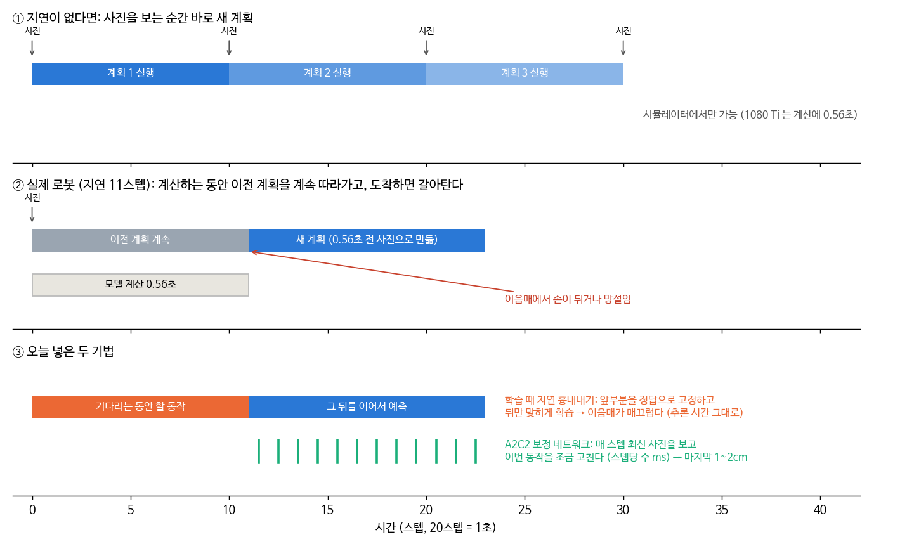
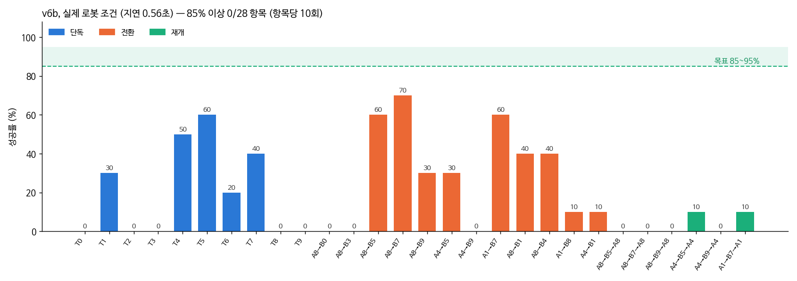
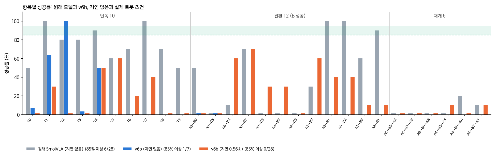
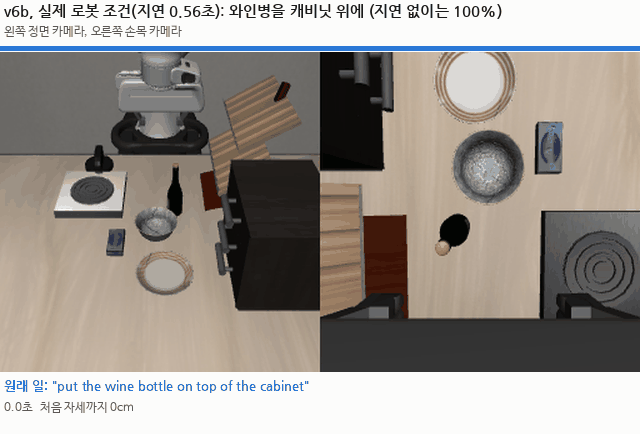
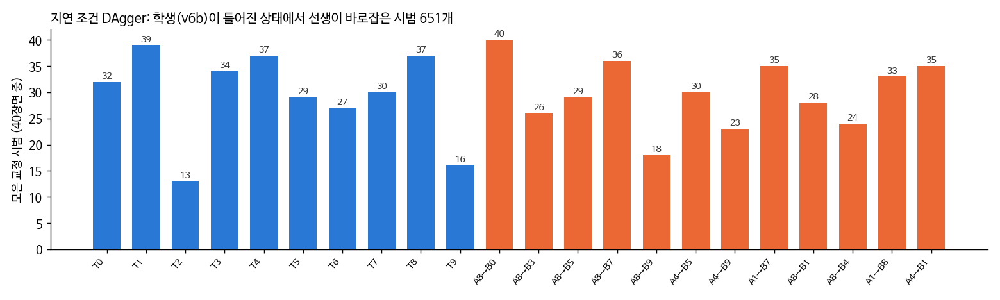

# 2026-10-02 실제 로봇 조건으로 바꾸고, 논문에서 지연 대책을 가져왔다

> 목표: 28개 항목 각각 95% 이상 (저녁에 85%에서 올림), 실제 로봇 조건(지연 0.56초).
>
> 한 줄 요약: 평가 기준을 실제 로봇 조건(1080 Ti 계산 지연 0.56초)으로 바꿨다. 그랬더니 v6b 모델은 전환에서 0~70%, 재개는 전부 0%였다. 지연과 정밀도를 다룬 논문 11편을 찾아, 비용 없이 쓸 수 있는 두 가지(학습 때 지연 흉내내기, 매 스텝 보정 네트워크)를 직접 구현했다. 지금은 지연 조건으로 DAgger 교정 시범을 모으는 중이고, 끝나면 v6c 학습과 평가가 자동으로 이어진다.

## 오늘 결과 한눈에

| 무엇을 했나 | 결과 |
|---|---|
| 평가 기준 변경 | 이제부터 정확도는 **지연 11스텝(0.56초)을 넣고** 잰다. 실제 로봇에서 쓸 수 있어야 하므로 |
| v6b를 실제 조건으로 평가 | 28개 항목 중 85% 넘은 것 0개. 가장 높은 것이 A8→B7 70%, 지연 없이 100%이던 T2는 0% |
| 논문 조사 | 11편. 가장 가까운 경쟁 논문 Causeway(9/25)도 찾음 |
| 새로 만든 것 | 학습 때 지연 흉내내기(`ttrtc.py`), 가중치 이동평균(EMA), A2C2 보정 네트워크(`a2c2.py`), 28개 항목 성적표(`scoreboard.py`) |
| DAgger | 지연 조건에서 v6b가 틀어진 상태 → 선생이 바로잡는 시범. 1시간에 약 370개 |

---

## 1. 왜 평가 기준을 바꿨나

지금까지 정확도는 시뮬레이터에서 모델 계산 시간이 0초라고 치고 쟀다. 실제 로봇은 그렇지 않다. 연구실 1080 Ti에서 SmolVLA가 한 번 계산하는 데 **0.56초**가 걸리고, 로봇은 1초에 20번 움직이니 **11스텝**이다(9/18에 잰 값).



- ① 시뮬레이터 평가는 사진을 보는 순간 새 계획이 나온다고 가정했다.
- ② 실제로는 계산하는 0.56초 동안 로봇이 이전 계획을 계속 따라가고, 새 계획은 0.56초 전 사진으로 만든 것이다. 계획을 갈아타는 이음매에서 손이 튀거나 망설인다.
- ③ 오늘 넣은 두 기법이 각각 어디를 고치려는 것인지 표시했다(3절, 4절). 효과는 아직 검증 전이다.

"실제 로봇에서 못 쓰이면 모델을 왜 만드냐"는 말씀대로, 앞으로 모든 정확도는 ②의 조건으로 잰다.

## 2. v6b를 실제 조건으로 돌려 보니 (28개 항목 모두)

장면 20~29, 항목마다 10회. 전환은 지금까지 쓰던 flush(새 지시가 오면 계획을 버리고 기다림)로 쟀다.



| 구분 | 결과 |
|---|---|
| 단독 10개 | T0 0%, T1 30%, T2 0%, T3 0%, T4 50%, T5 60%, T6 20%, T7 40%, T8 0%, T9 0% |
| 전환 12쌍 (B 성공) | A8→B0 0%, A8→B3 0%, A8→B5 60%, A8→B7 70%, A8→B9 30%, A4→B5 30%, A4→B9 0%, A1→B7 60%, A8→B1 40%, A8→B4 40%, A1→B8 10%, A4→B1 10% |
| 재개 6쌍 | 0~10% |
| 85% 이상 | **0 / 28** |

원래 모델·지연 없는 조건과 나란히 놓으면 이렇다.



- 지연을 넣으면 거의 모든 항목이 무너진다. 가장 크게 떨어진 것은 T2(와인병→캐비닛 위)로, 지연 없이 100%였는데 0%가 됐다.
- 실패는 모두 시간 초과다. 물체를 떨어뜨리거나 아예 멈춘 경우는 거의 없다.



T2 장면 20. 와인병을 잡은 뒤 캐비닛 앞에서 15초 넘게 같은 자리를 맴돈다. 계획을 이어 붙이는 이음매마다 방향이 어긋나 앞으로 나아가지 못하는 것으로 보인다.

## 3. 논문 조사: 지연과 정밀도

자세한 표는 [논문노트/지연과_정밀도_논문조사.md](../02_논문노트/지연과_정밀도_논문조사.md).

가장 도움이 된 것은 [Understanding Async Inference](https://arxiv.org/abs/2605.08168)다. **SmolVLA와 LIBERO로** 지연 대책 네 가지를 같은 조건에서 비교했다(그래프에서 읽은 값, 지연 8스텝).

| 방법 | 성공률 | 추가 비용 |
|---|---|---|
| 아무것도 안 함 | 약 25% | - |
| 추론 때 RTC (9월에 써 본 것) | 약 52% | 계산이 느려짐 |
| 학습 때 지연 흉내내기 | 약 51% | 없음 |
| VLASH (앞당긴 로봇 상태) | 약 56% | 없음 |
| **A2C2 (매 스텝 보정)** | **약 66%** | 스텝당 수 ms |

그래서 두 가지를 골랐다. 비용이 없는 "학습 때 지연 흉내내기"와 가장 강한 "A2C2"다.

### 경쟁 논문 Causeway (9/25)

일주일 전에 나온 논문으로, 우리와 같은 **LIBERO-Goal 전환**을 다룬다. 쥔 물체가 필요 없으면 놓는 단계도 있다. 다만 **원래 일로 돌아가는 재개가 없고**, 큰 모델(π0.5 등)에서 추론이 2.5~2.8배 느려진다. 우리 차별점은 재개까지 포함한 흐름, 처음 자세로 돌아가지 않는다는 제약, 저사양 GPU 실시간 조건이다. → [Causeway.md](../02_논문노트/Causeway.md)

## 4. 직접 만든 것

### 학습 때 지연 흉내내기 (training-time RTC)

출처: Black 외, [arXiv 2512.05964](https://arxiv.org/abs/2512.05964).

- 학습 때: 50스텝 동작 묶음의 앞 d스텝(0~14 중 무작위)을 정답 그대로 넣어 주고, 뒤쪽만 맞히게 한다.
- 실제로 쓸 때: 계산을 시작하는 순간 "기다리는 0.56초 동안 로봇이 실제로 할 동작" 11개를 앞에 넣어 준다. 모델은 그 뒤를 이어서 만든다.
- 추론 시간은 그대로다.

SmolVLA 코드를 직접 고쳐서(`ttrtc.py`) 동작 묶음의 스텝마다 다른 시간값을 넣을 수 있게 했다. 점검한 것:
- 이 기능을 끄면 원래 모델과 손실·출력이 **완전히 같다**(차이 0.0).
- 켜면 앞 11개가 넣어 준 값 그대로 유지된다.

### 가중치 이동평균 (EMA)

학습 중 가중치의 이동평균을 저장한다. Diffusion Policy와 π0 학습에서 쓰는 방식이다. 학습 마지막 순간의 흔들림에 덜 좌우된다.

### A2C2 보정 네트워크

출처: [arXiv 2509.23224](https://arxiv.org/abs/2509.23224).

SmolVLA는 그대로 두고, 작은 네트워크 하나를 더 붙인다.
- 입력: 매 스텝 최신 사진 두 장(정면, 손목), 로봇 상태, 묶음에서 이번 동작과 그 뒤 3개, 이번 동작이 묶음 몇 번째인지.
- 출력: 이번 동작에 더할 작은 보정값.
- 학습: 선생 동작에서 SmolVLA 동작을 뺀 값을 맞히게 한다.

| 항목 | 값 |
|---|---|
| 크기 | 1,460만 파라미터 (SmolVLA의 3%) |
| 사진 처리 | ResNet18, 128×128 |
| 계산 시간 | CPU에서 37ms, GPU에서는 몇 ms |
| 실제 로봇 | 카메라 2대 + 로봇 상태 + 지시문만 쓴다. 쓸 수 있다 |

SmolVLA는 0.56초마다 한 번 사진을 보지만, 이 네트워크는 **매 스텝(0.05초) 사진을 본다.** 그릇 테두리를 1~2cm 빗나가는 것처럼 마지막에 손을 맞추는 부분을 고치는 것이 목적이다. **고쳐지는지는 아직 모른다.** v6b에 먼저 붙여 같은 장면에서 붙이기 전과 비교한다.

### 28개 항목 성적표

`scoreboard.py`는 단독 10개, 전환 12쌍, 재개 6쌍을 한 표와 한 그래프로 만들고, 85% 달성 여부를 표시한다.

## 5. DAgger: 지연 조건에서 틀어진 순간을 바로잡는 시범

DAgger는 학생 모델을 실제처럼 돌리다가 무작위 시점(10~200스텝)에 선생 스크립트가 넘겨받아 끝까지 하는 방법이다. 학생이 실제로 빠지는 상태에서 "여기서는 이렇게 하라"는 시범이 모인다. 오늘은 **지연 11스텝을 넣고** 돌렸다. 실제 로봇에서 학생이 가게 될 상태를 모으기 위해서다.



B 구간까지 모두 651개를 모았다(14:14). 40장면마다 넘겨받는 시점을 무작위로 정했고, 넘겨받기 전에 학생이 이미 성공한 경우는 저장하지 않았다. 그런 경우는 T7에서 10번, A8→B4에서 14번으로 많았고, 나머지는 거의 0번이었다.

T2(13개)와 T9(16개)가 적다. 학생이 이미 와인병을 쥐고 있을 때 선생이 병을 놓고 다시 집으려다 넘어뜨린 경우가 많은 것으로 보인다. 그래서 필요한 물체를 이미 쥐고 있으면 놓지 않고 쥔 채 이어서 옮기도록 바꿨다. 효과는 다음 DAgger 때 확인한다.

## 6. 학생이 원래 모델보다 못한 이유 하나: 동작 단위가 안 맞았다

원래 SmolVLA(사람 시범 50개로 학습)와 v6b(선생 시범으로 학습)를 지연 없이 비교하면 이렇다.

| 태스크 | 원래 SmolVLA | v6b |
|---|---|---|
| T1 그릇→스토브 | 100% | 63% |
| T3 위 서랍+그릇 | 80% | 3% |
| T4 그릇→캐비닛 위 | 90% | 50% |

선생 시범을 더 많이 줬는데 오히려 나빠졌다. 원인 후보를 하나 찾았다.

모델은 동작 값을 "(값 − 평균) ÷ 표준편차"로 바꿔서 배운다. 이 평균과 표준편차가 **원래 LIBERO 사람 시범에서 잰 값**이다. 우리 선생 데이터로 다시 재면 이렇다.

| 동작 | 바꾼 값의 퍼짐 (1이 정상) | 뜻 |
|---|---|---|
| 손 위치 x, y, z | 0.6~0.7 | 작게 보인다 |
| 손목 회전 3개 | 1.2~2.0 (가장 큰 값 12.8) | 크게 보인다 |
| 그리퍼 | 1.0 | 맞다 |

학습은 바꾼 값의 오차를 줄이는 방향으로 간다. 그래서 크게 보이는 손목 회전 오차에 힘을 쓰고, 정작 중요한 **손 위치(그릇을 어디서 잡나)는 덜 신경 쓰게** 된다. 위치와 회전의 상대적 비중으로 따지면 4배쯤 위치를 덜 본다.

고친 방법: 학습 데이터에서 평균과 표준편차를 다시 재고, 모델 앞뒤의 변환(정규화, 되돌리기)을 모두 바꿔서 저장한다(`--renorm-action`). 저장했다가 다시 읽어도 오차가 0.0000005 이하인 것을 확인했다. v6c 학습에 넣는다.

## 7. 학습 속도의 한계를 쟀다

| 항목 | 값 |
|---|---|
| 학습 한 스텝(사진 4장) | 0.87초 (GPU를 혼자 쓸 때) |
| 그중 사진 처리(SigLIP) | 약 60% |
| 1초에 보는 장면 | 약 4.6장 |
| 지금까지 데이터 한 바퀴 | 약 75만 장 → 한 바퀴에 45시간 |

사진 처리부는 학습하지 않는 부분이라 미리 계산해 두면 2.5배 빨라진다. 코드를 만들어 결과가 같은 것(손실 차이 0.2%)까지 확인했다. 그런데 미리 계산하는 데만 27시간이 걸린다. 데이터를 한 바퀴도 다 못 도는 지금은 오히려 손해라 쓰지 않았다.

그래서 정밀도는 A2C2에 맡기기로 했다. ResNet18에 128픽셀 사진을 쓰므로 SmolVLA보다 수십 배 빨리 학습된다. v6c를 기다리지 않고 **지금 있는 v6b 위에 작게 먼저 붙여서** 효과가 있는지 확인한다.

## 8. 재개 구간 DAgger 추가

지금까지 DAgger는 새 지시 B를 하는 구간만 바로잡았다. 재개(B를 마친 뒤 내려놓은 그릇을 다시 집어 원래 일 마치기)는 바로잡는 시범이 없었고, 재개 성공률도 전부 0%였다.

`dagger_v6.py --resume`을 추가했다. 순서는 이렇다.
1. 학생이 A를 하다 그릇을 쥔다.
2. 지시가 B로 바뀌고 학생이 B를 한다. 못 하면 선생이 B를 마저 끝내는데, 이 부분은 기록하지 않는다.
3. 다시 A 지시를 주고 학생이 10~200스텝을 움직인다.
4. 그 지점에서 선생이 넘겨받아 A를 끝낸다. **이 부분을 기록한다.** 끝난 뒤 B가 풀려 있으면 버린다.

재개 6쌍 × 40장면이다.

## 9. 자동으로 이어지는 순서

```
지금      DAgger 수집 (B 구간) + v6b 지연 평가
↓ 끝나면
          재개 구간 DAgger (2개)  +  [0] A2C2 시험: v6b 위에 작게 붙여 효과 확인
↓ 모두 끝나면
[1] v6c 학습: v6b에서 이어서, 정상+전환+DAgger, 지연 흉내내기 + EMA + 동작 단위 다시 재기, 24000스텝 (약 6시간)
[2] A2C2 데이터 생성 + 빠른 비교 (계속 계산하는 방식 vs 10스텝마다)
[3] A2C2 학습 + v6c 정식 평가 (28개 항목, 지연 11스텝)
[4] v6c + A2C2 평가
```

전환할 때는 `keep` 방식으로 평가한다. 새 지시가 오면 이전 계획을 계속 따라가면서 새 계획을 계산하고, 도착하면 이어 붙인다. 손이 멈추지 않는다. 어제까지 쓰던 `flush`는 계획을 버리고 0.56초 동안 멈춘다.

메모리: 학습은 18GB를 쓰므로 혼자 돌린다. 평가는 GPU 프로세스 3개까지만 둔다.

## 10. A2C2 시험 결과 (검증함)

v6b는 그대로 두고 보정 네트워크만 붙였다. 보정 네트워크는 데이터의 15%로 8000스텝 학습했다(약 33분). 학습에 안 쓴 시범에서 동작 오차가 0.443에서 0.276으로 38% 줄었다.

실제 성공률은 같은 장면(20~29), 같은 지연 조건(11스텝), 같은 전환 방식(flush)으로 붙이기 전과 비교했다.


| 항목 | v6b | v6b + A2C2 | 차이가 우연일 확률 (단측 Fisher) |
|---|---|---|---|
| T1 그릇→스토브 | 3/10 | **10/10** | 0.002 |
| T4 그릇→캐비닛 위 | 5/10 | **9/10** | 0.07 |
| T8 그릇→접시 | 0/10 | **6/10** | 0.005 |
| A8→B5 접시 밀기 | 6/10 | 7/10 | 0.50 |
| A8→B7 스토브 켜기 | 7/10 | **3/10 (떨어짐)** | |

- 그릇을 옮기는 단독 태스크 셋은 크게 올랐다. T1과 T8은 우연으로 보기 어렵다.
- A8→B7은 떨어졌다. 실패한 7번을 궤적으로 보면, 손은 성공할 때와 같은 스토브 손잡이 위치(약 [-40, 23, 93]cm)까지 갔는데 **그리퍼가 열린 채(0.040)** 끝났다. 성공한 경우는 그리퍼가 닫혀 있다(0.02~0.03). 손잡이를 쥐고 돌려야 하는데 쥐지 못한 것이다.
- 가설: 보정 네트워크가 그리퍼 값을 잘못 고친다. **아직 검증 전이다.** 그리퍼 보정만 끄고(위치·회전만 보정) 같은 장면에서 다시 잰다(`run_a2c2_dimtest.sh`, v6c 학습이 끝나면 자동).
- 장면 10개라 한 항목의 95% 신뢰구간이 넓다. 최종 판단은 v6c에서 28개 항목 전체로 한다.

## 11. 목표를 항목마다 95% 이상으로 올렸다 (저녁)

95%는 85%와 다르게 세 가지가 더 필요하다.

**① 선생이 먼저 95%를 넘어야 한다.** 학생은 선생을 따라 배운다. 오늘 수집한 데이터에서 선생 성공률을 다시 세어 보니 95%가 안 되는 항목이 있다. 이 값은 수집 때 넣은 노이즈(DART 0.1)가 포함된 값이라, 노이즈 없이 따로 잰다.

| 항목 | 선생 성공률 (수집 데이터, 노이즈 포함) |
|---|---|
| 전환 A8→B9 | 82.5% (33/40) |
| 전환 A8→B3 | 92.5% (37/40) |
| 전환 A4→B5 | 92.5% (37/40) |
| 재개 A8→B7→A8 | 68% (27/40) |
| 재개 A1→B7→A1 | 75% (30/40) |
| 나머지 전환·재개 | 92~100% |

→ `teacher_audit.py`: 평가 장면 20~49(30개)에서 노이즈 없이 28개 항목을 모두 재고, 실패한 단계와 이유를 남긴다. v6c 학습이 끝나 메모리가 비면 자동으로 돈다(`run_teacher_audit.sh`).

**② 평가를 늘린다.** 10번 중 10번이어도 "실제 실력 하한"(95% 신뢰구간 아래쪽)은 72%다. 장면 수에 따라 이렇게 달라진다.

| 장면 수 | 결과 | 실력 하한 |
|---|---|---|
| 10 | 10번 성공 | 72% |
| 30 | 29번 성공 | 83% |
| 50 | 48번 성공 | 87% |
| 100 | 96번 성공 | 90% |

새 배치(장면 1000번대)는 원하는 만큼 만들 수 있다. 처음에는 50장면으로 정했다가, 사용자 요청으로 **100장면 중 95번 이상**으로 늘렸다(15절).

**③ 학생**은 지금 계획(v6c → A2C2 → 95% 미만 항목만 DAgger → 다시 학습)을 그대로 돌린다.

## 12. 평가 장면이 학습 데이터에 들어 있었다 (발견, 검증함)

LIBERO는 태스크마다 고정 시작 장면(물체 배치)이 50개 있고, 장면 번호를 **50으로 나눈 나머지**로 고른다(`init_states[번호 % 50]`). 그런데 우리는 학습 시범을 장면 0~19와 **50~139**에서 모았다. 그러면 장면 70~99와 120~139는 평가 장면 20~49와 같은 배치다. 실제로 장면 20, 70, 120의 물체 위치를 재 보니 소수점까지 같았다.

| | 내용 |
|---|---|
| 무엇이 문제인가 | 학생 모델이 평가 배치에서 시작한 시범을 보고 배웠다. 시험 문제를 미리 본 것과 같다 |
| 어디에 영향 | 우리가 학습한 모델(v5, v6, v6b)과 A2C2의 평가 숫자. 원래 SmolVLA는 우리 데이터로 학습하지 않아 해당 없음 |
| 고친 것 | 장면 번호 1000 이상은 고정 배치를 쓰지 않고, 같은 규칙으로 물체를 무작위로 놓는다. 번호가 같으면 같은 배치로 재현된다(확인). 고정 50개 어느 것과도 다르다(물체 위치 합계 1.3~2.4cm 차이) |
| 앞으로 평가 | **장면 1000번대** (학습에 한 번도 안 쓴 배치). v6b도 같은 장면에서 다시 잰다 |
| 앞으로 수집 | 번호 % 50이 20~49인 장면과 1000번 이상은 학습 데이터 수집에 쓰지 않도록 막았다 (`collect_v6.ep_range`) |

오늘 앞에 적은 v6b와 A2C2 시험 숫자(장면 20~29)는 이 문제가 있던 조건의 값이다. 새 배치에서 다시 재서 바꿔 적는다.

## 13. 시범 프로그램 고친 것 (검증함, 장면 20~49 각 30번)

| 항목 | 고치기 전 | 고친 뒤 | 원인과 고친 방법 |
|---|---|---|---|
| T5 접시 밀기 | 28 | **30** | 옆으로 고쳐 밀 때 손가락이 낮은 테두리를 넘어가 접시가 안 움직였다 → 끝에 목표 밖이면 그리퍼를 닫아 막대처럼 만들고 바깥에서 테두리를 정한 거리만큼 민다 |
| 전환 A4→B5 / 재개 | 25 / 25 | **30 / 30** | 같은 원인 |
| 전환 A8→B5 / 재개 | 27 / 27 | **30 / 30** | 같은 원인 |
| T3 위 서랍+그릇 | 27 | 확인 중 | 그릇이 손잡이 앞 12cm 안이면 서랍이 그릇에 걸려 2~4cm만 열렸다 → 열기 전에 그릇을 앞으로 10cm 옮긴다 (실패 3장면 모두 성공으로 바뀜). 원래 있던 옮기기 조건이 −1m로 잘못 들어가 한 번도 실행되지 않고 있었다 |

이미 모은 학습 데이터에는 이런 장면의 시범이 빠져 있다(실패한 시범은 버렸으므로). 그래서 다음 수집과 DAgger부터 고친 시범 프로그램을 쓴다.

## 14. 처음 자세 근처를 지나가던 시범 고치기

시범 프로그램 측정에서 재개 A4→B9→A4가 22/30이었다. 실패 8번 중 7번은 일은 다 했는데, 와인 선반에서 그릇 쪽으로 돌아갈 때 팔이 **처음 자세(매 시도 시작 때 팔 위치) 5.6~6.9cm 안**을 지나가 우리 규칙(7cm 안이면 실패)에 걸렸다. A1→B7 재개도 2번 같은 이유였다.

| 고친 방법 | 결과 (장면 20~49, 30번) |
|---|---|
| 직선 경로가 처음 자세 12cm 안을 지나면 바깥 한 점을 거쳐 감 | A4→B9 재개 22 → **29**, T4·T1 30 그대로. A1→B7 재개 28 그대로 |
| 위 + 매 스텝 처음 자세 12cm 안으로 들어가려는 움직임만 빼서 바깥을 따라 미끄러지게 | A1→B7 재개 28 → **30**, A4→B9 재개 **29**, A8→B9 29, T1·T4·T8 30 그대로 |

남은 실패(A4→B9, A8→B9 각 1번)는 와인병을 집을 때다. 와인병이 처음 자세 바로 아래(약 25cm 아래)에 있어서 집으러 내려가는 길이 6.2~6.9cm까지 다가간다. 30번 중 29번이라 95% 기준은 넘으므로 그대로 두고, 100장면 측정에서 다시 본다.

A1→B7은 그릇을 들고 스토브로 가다 6.5cm까지 다가갔다. 팔은 축마다 속도가 따로 잘려 직선으로 가지 않아서, 직선만 보는 첫 방법으로는 막지 못했다.

## 15. 학습용 배치를 늘린다

평가를 학습에 안 쓴 무작위 배치로 바꾸고 나니, 학생 모델이 배운 배치가 고정 장면 몇십 개뿐이라는 점이 걸린다. 새 배치에서 약할 수 있다(가설). 그래서 고친 시범 프로그램으로 학습 전용 무작위 배치(장면 2000번대)에서 시범을 새로 모은다. 정상 수행 10개 태스크 × 60배치, 전환·재개 12쌍 × 40배치. 장면 번호는 이렇게 나눴다.

| 번호 | 용도 |
|---|---|
| 0~19 (그리고 나머지가 0~19인 50~999) | 학습 (고정 배치) |
| 20~49 (그리고 나머지가 20~49인 번호) | 쓰지 않음 (예전 평가 배치) |
| 1000~1999 | **평가 전용** 무작위 배치 |
| 2000 이상 | 학습 전용 무작위 배치 |

최종 평가는 사용자 요청("시간 오래 걸려도 되니까 장면 최대한 많이")에 따라 **항목마다 100장면(1000~1099), 95번 이상 성공**으로 한다. 시간이 남으면 200장면.

## 연구실 PC에서 걸리는 시간 (사용자 요청으로 정리)

| 작업 | GTX 1080 Ti 실측 | RTX 4090급 (추정) |
|---|---|---|
| SmolVLA 계산 1번 | 0.56초 (11스텝) | 0.05~0.1초 (1~2스텝) |
| v6c 학습 24,000스텝 | 5.8시간 | 0.5~1시간 |
| 데이터 한 바퀴 (75만 장면) | 45시간 | 5~8시간 |
| 28개 항목 평가 (10회씩) | 2~3시간 | 1~1.5시간 |

자세한 사양, 근거, 추정 방법은 [걸리는_시간.md](../04_실습/05_libero/realtime/걸리는_시간.md). 추정은 직접 재기 전까지 가능성이다.

## 검증한 것과 아직 가설인 것

검증을 거치지 않으면 가능성에 머무른다. 오늘 것을 둘로 나눠 둔다.

| 검증함 (측정) | 아직 가설 (확인 방법) |
|---|---|
| v6b 실제 조건 성적 (장면 20~29, 10회) | 학습 때 지연 흉내내기가 지연 조건 성공률을 올린다 → v6c와 v6b 같은 장면 비교 |
| 지연 있을 때 T2가 맴돌다 실패 (GIF) | 동작 단위 다시 재기가 손 위치 정밀도를 올린다 → v6c 비교 (다른 변화와 섞여 있어 따로 떼려면 추가 실험 필요) |
| 동작 단위 불일치 (위치 0.6~0.7배, 회전 1.2~2.0배) | ~~A2C2가 성공률을 올린다~~ → **검증함**: 그릇 단독 3개는 크게 오름, A8→B7은 떨어짐 (10절) |
| 새 코드가 꺼진 상태에서 원본과 같음, 저장·읽기 오차 0 | 계속 계산하는 방식이 10스텝마다보다 낫다 → v6c 빠른 비교 |
| 사진 특징 미리 계산은 27시간 걸림 → 안 씀 | |

논문 수치는 다른 모델·조건의 값이라 참고로만 쓴다.

## 다음에 할 것

- v6b 지연 평가 나머지(전환 7쌍, 단독 10개)가 나오면 표를 채운다
- DAgger 끝나면 v6c 학습 시작(자동). 학습 손실과 검증 손실 확인
- v6c와 v6c+A2C2의 28개 항목 성적표 비교
- 85%에 못 미치는 항목은 DAgger 2차 수집을 그 항목에 몰아서 한다
- 실패 장면 GIF를 만들어 어디서 틀어지는지 본다
