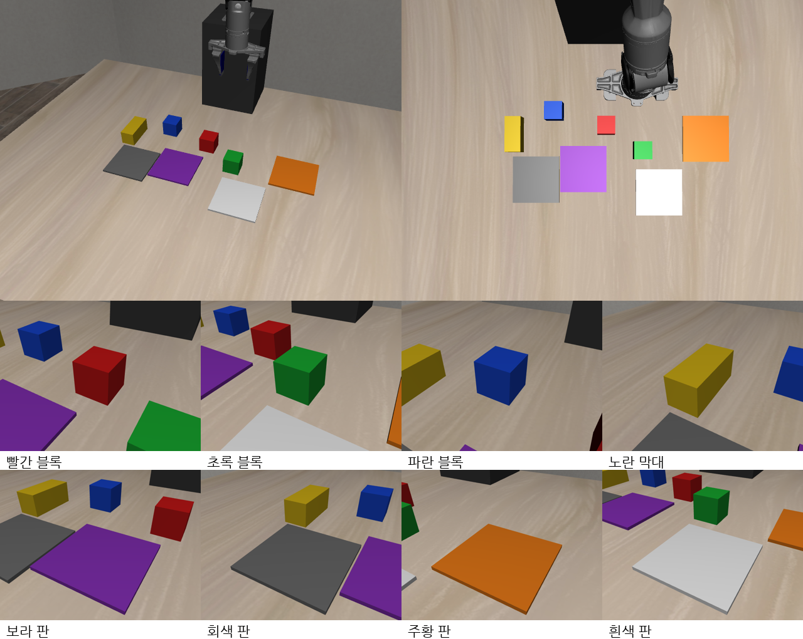

# 2026-10-04 PiPER 1차 학생 모델 결과, 색 블록 장면으로 바꿈

> 목표: PiPER 28개 항목 각각 95% 이상 (실제 로봇 조건: 지연 0.56초, 처음 보는 물건 자리).

## 한눈에

| 무엇 | 결과 |
|---|---|
| PiPER 1차 학생 모델 (piper_s1) | 새 배치 28항목: 85% 이상 0개. 평균 단독 13.5%, 전환 19.5%, 재개 3.3% |
| 잘한 것 | 그릇→스토브 50%, 그릇 들고 접시→스토브로 바꾸기 55% |
| 못한 것 | 서랍·와인·치즈 0~5%, 재개 대부분 0% |
| 찾은 원인 | 그릇: 시범이 테두리 끝만 걸쳐 쥐어 여유가 없음 / 서랍: 손이 3~6cm 빗나감 |
| 고친 것 | 그릇을 1.2cm 깊게 쥐는 시범으로 다시 모음 (정상 395, 전환·재개 1,498) |
| 장면 변경 | **색 블록 4개와 색 판 4개만 있는 장면으로 바꿈 (2절)** — 목표 각 항목 95~100% |
| 시범 프로그램 (블록) | 혼자 하는 과제 20/20, 일 바꾸기 12쌍·돌아오기 6개 모두 10/10 (학습용 장면) |
| 논문 | 이번 대회는 시뮬레이션만, 다음 대회에서 실물 (사용자 결정, 4절) |

## 1. 그릇을 왜 놓쳤나

쉬운 점검(연습한 자리 5번, 그릇→접시)에서 5번 다 실패했다. 로봇은 그릇까지 정확히 내려가는데, 손을 오므리는 높이가 95.6cm 였다.
시범 프로그램은 94.9cm 에서 오므린다. 그릇 테두리 맨 위가 95.1cm 이니 시범은 테두리 끝을 0.2cm 만 걸쳐 잡고 있었다.
학생 모델이 1cm 도 안 되게 틀려도 빈손이 되는 구조였다.

| 시범 프로그램 | 0.7cm 높게 오므려도 잡히나 |
|---|---|
| 예전 (테두리 끝 0.2cm) | 학생 모델은 놓침 |
| 새로 (1.2cm 더 깊게) | 1.2cm 높게 오므려도 6/6 잡힘 |

Panda 학생 모델이 그릇 2~3cm 위에서 오므리던 것도 같은 원인이었을 수 있다(가능성).

## 2. 물체를 색 블록과 색 판으로 바꾼다 (사용자 결정)

PiPER 1차 학생 모델 성적이 너무 낮아(평균 단독 13.5%), 사용자가 "물체를 단순한 걸로, 다양한 색상의 정사각형이나 직사각형으로" 하자고 했다.
처음에는 서랍장·스토브·와인 선반을 두고 물건만 블록으로 바꾸려 했는데, 사용자가 "그냥 사각형만 있는 걸로" 하자고 해서 **색 블록과 색 판만 있는 장면**으로 정했다.
목표는 각 항목 95% 이상, 할 수 있으면 100%.

### 왜 바꾸나

| 이유 | 설명 |
|---|---|
| 잡을 곳이 넓다 | 1차 모델은 그릇 가장자리(두께 몇 mm)를 잡다가 0.7cm 만 높아도 놓쳤다. 블록은 옆면 전체를 잡으니 손이 1~2cm 빗나가도 잡힌다 |
| 위치를 찾기 쉽다 | 빨강·파랑·초록·노랑처럼 색이 뚜렷하면 카메라 사진에서 물건 위치를 찾기 쉽다. 1차 모델은 와인병·치즈에서 3~7cm 빗나갔다 |
| 실물 장면을 똑같이 만들 수 있다 | 같은 크기·색의 블록과 색 종이(판)만 있으면 된다. 서랍장·스토브·와인 선반을 실물로 구하고 맞출 필요가 없다 |
| 다른 논문도 블록을 쓴다 | SmolVLA 실물 실험(블록 옮기기·쌓기·색 분류) 평균 78%, PiPER 로 블록을 접시에 옮긴 PhysVLA 95% |

### 장면

| 물체 | 크기 | 무게 |
|---|---|---|
| 빨간 블록, 초록 블록, 파란 블록 | 4.5cm 정육면체 | 약 36g |
| 노란 막대 | 9 × 4 × 4cm | 약 58g |
| 보라 판, 회색 판, 주황 판, 흰색 판 | 10 × 10cm, 두께 0.5cm | — |

물건이 놓이는 자리는 장면 번호마다 무작위로 조금씩(블록 ±2cm, 판 ±1.5cm) 달라진다. 학습은 2000번대 장면, 평가는 학습에 안 쓴 1000번대 장면.

### 과제 10개

| 번호 | 지시 | 번호 | 지시 |
|---|---|---|---|
| T0 | 파란 블록을 흰색 판 위에 | T5 | 초록 블록을 흰색 판 위에 |
| T1 | 빨간 블록을 주황 판 위에 | T6 | 초록 블록을 빨간 블록 위에 |
| T2 | 노란 막대를 보라 판 위에 | T7 | 노란 막대를 흰색 판 위에 |
| T3 | 빨간 블록을 파란 블록 위에 | T8 | 빨간 블록을 보라 판 위에 |
| T4 | 빨간 블록을 회색 판 위에 | T9 | 초록 블록을 파란 블록 위에 |

(실제 지시문은 영어: "put the red block on the purple square" 처럼)

### 연구 주제는 그대로다

- A 를 하다가 블록을 쥔 직후 B 지시가 온다 → 쥔 블록을 아무 데나 내려놓고 B 를 한다 → 다시 집어 A 를 끝낸다
- 전환 뒤 손이 처음 자세 7cm 안에 들어가면 실패, 멈췄다 가는 동작 없이 이어서
- 일 바꾸기 12쌍과 원래 일로 돌아오기 6개는 번호를 그대로 쓴다

| 종류 | 쌍 | 하는 일 |
|---|---|---|
| 쥔 채 놓을 곳만 바꾸기 | A8→B1, A8→B3, A8→B4, A1→B8, A4→B1 | 빨간 블록을 든 채 새 자리로 |
| 내려놓고 다른 일 | A8→B0, A8→B5, A8→B7, A8→B9, A4→B5, A4→B9, A1→B7 | 빨간 블록을 내려놓고 B 를 한다 |
| 원래 일로 돌아오기 | A8→B5, A8→B7, A8→B9, A4→B5, A4→B9, A1→B7 | B 를 마친 뒤 빨간 블록을 다시 집어 A 를 끝낸다 |

### 시범 프로그램 점검 (학습용 장면 2000~2019)

시범 프로그램 = 시뮬레이터의 정확한 물체 좌표로 팔을 움직이는 프로그램. 학습 시범을 만드는 데만 쓴다.
학생 모델이 배울 수 있는 최고치이므로 먼저 100% 가까이 만들어 둔다.

| 항목 | 처음 | 고친 뒤 |
|---|---|---|
| 혼자 하는 과제 10개 | 2/10 과제만 됨 → T2·T7 2/5 → 장면 2014 에서 3과제 실패 | 과제마다 20/20 (2014 는 고친 뒤 다시 확인) |
| 일 바꾸기 12쌍 | 쌍마다 9/10 | 쌍마다 **10/10** |
| 원래 일로 돌아오기 6개 | 9/9, A8→B9 만 8/9 | 모두 **10/10** |

고친 것 다섯 가지 (쉬운 말로)

| 증상 | 원인 | 고친 것 |
|---|---|---|
| 8과제가 처음부터 오류 | 성공 판정이 예전 장면(캐비닛·스토브)의 목표를 읽고 있었다 | 판정도 블록 장면 정의에서 읽게 |
| 노란 막대를 아예 집으러 가지 않음 (5번 중 3번) | 막대는 쥘 수 있는 방향이 하나뿐인데, 그 방향이 손목이 돌 수 있는 한계 밖이었다 | 손을 반 바퀴 돌려 쥐는 방향도 후보로 (손가락이 대칭이라 같은 쥐기) |
| 블록을 쥐기 전에 "쥐었다"로 판단 | PiPER 손가락은 활짝 열면 0.035 인데 "0.035 보다 작으면 닫힘"이라, 값이 0.03499 로 흔들릴 때 깜박였다 | 기준을 0.030 으로 (블록을 쥐면 0.0225) |
| 쌓은 블록을 쳐서 무너뜨림 | 초록을 파랑 위에 쌓은 뒤, 손을 덜 든 채 옆으로 빨강을 가지러 갔다 | 블록마다 "손이 들어가면 안 되는 상자"를 두고, 지나가는 높이를 가장 높은 블록 위 3cm 로 |
| 초록 블록을 아예 집으러 가지 않음 (장면 2014) | 손 기울기 6가지 중 가장 여유 있는 하나만 보고, 그게 옆 판에 걸리면 포기했다 | 기울기마다 따로 보고 걸리지 않는 것을 고른다 |

### 그대로인 것, 달라진 것

- 로봇(PiPER), 카메라 2대, 지연 0.56초, 평가 방식(새 배치 1000번대, 100장면 중 95번)은 그대로다.
- 서랍 열기·스토브 켜기·쟁반 밀기처럼 '물건이 아닌 것을 조작하는' 과제는 없어졌다. 모두 '집어서 위에 놓기'다.
  그래서 다른 논문의 LIBERO-Goal 점수와 그대로 비교할 수는 없다. 비교할 때 이 점을 밝힌다.

## 3. 다음에 할 것

- 블록 시범 수집 중: 혼자 하는 과제 10개 × 100장면, 일 바꾸기·돌아오기 12쌍 × 50장면 (학습용 2000번대)
- 블록 학생 모델 1차(piper_b1) 학습 → 새 장면 1000~1019 에서 28항목 → 매 스텝 보정(A2C2) 붙여 다시 평가 (자동 실행 `run_blk_round1.sh`)
- 시범 프로그램을 새 장면(1000번대)에서도 재서 기록
- 95% 안 되는 항목은 교정 시범(학생이 실제로 가는 자리에서 시범 프로그램이 이어 받기)으로 2차
- 원래 물체 2차 학습(piper_s2)은 블록 데이터가 모이면 멈추고, 그 저장본에서 블록 학생 모델을 시작한다
- 반복 단계·지연 비교는 멈췄다: "지연 없음" 조건을 학습 때와 다르게(앞부분 없이) 재서 T1·T4·T7 모두 0/10 — 의미 없는 비교였다. 블록 학생 모델에서 다시 잰다

## 4. 논문 방향 (사용자 결정)

> "이번 논문 대회는 시뮬레이션만, 다음 논문대회에서는 실물로 할 거야"

| | 이번 대회 | 다음 대회 |
|---|---|---|
| 로봇 | PiPER 디지털 트윈 (시뮬레이터) | 실물 PiPER |
| 장면 | 색 블록·색 판 (실물로 똑같이 꾸밀 수 있게) | 같은 블록·판을 실물로 |
| 본 결과 | 블록 장면 28항목, 같은 장면에서 "그냥 지시만 바꾸기"·"정상 시범만 배운 모델"과 비교, 하나씩 빼 보기 | 실물 성공률·영상 |
| 다른 논문과 잇기 | Panda(LIBERO 원래 장면) 결과를 함께 싣는다 — 블록 장면은 원래 장면보다 쉬워 다른 논문 숫자와 바로 비교하지 않는다 | |

상을 받으려면 (Claude 의견): ① 같은 조건에서 직접 잰 비교, ② 로봇 두 대(Panda 7축, PiPER 6축)에서 된다는 것, ③ 왜 실패하는지 분석(쥐면 지시를 덜 듣는다 0.72 → 0.28, 같은 자리 맴돌기), ④ "하던 일로 돌아오기"는 아직 아무도 안 한 문제라는 점.
