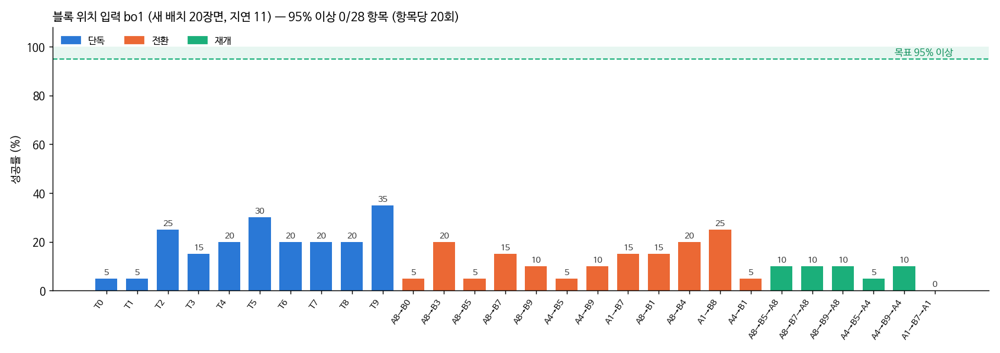

# 2026-10-07 위치 입력 모델 bo1 결과와 '쥐자마자 미끄러짐'

> 목표: 10/10 까지 블록 장면 28항목 정확도 100% 근접.

## 한눈에

| 무엇 | 결과 |
|---|---|
| bo1 (ba1 + 색·모양 검출 위치 24개 입력) | 3cm 기준 혼자 19.5%·일 바꾸기 12.5%·돌아오기 7.5%, 판 안 기준 34%·22.5%·12% — ba1 과 거의 같다 |
| 어디서 지나 | 블록은 10번 중 8번 쥔다. 쥔 것 중 판 안에 놓는 것이 42% 뿐 |
| 왜 (4장면 진단) | 쥐고 6스텝 만에 블록이 손에서 빠진다. 손가락이 오므리는 방향으로 1.4~1.5cm 어긋나 블록 윗면 모서리에 걸린 채 쥐었다 |
| 다음 시험 | 블록을 3.5cm 로 줄이면 손가락 여유가 한쪽 1.25 → 1.75cm. 다시 학습하지 않은 bo1 을 작은 블록 장면에 넣어 먼저 잰다 (가설) |

## 1. bo1 성적 (새 배치 장면 1000~1019, 지연 11스텝)

| 모델 | 혼자 | 일 바꾸기 (B) | 돌아오기 (A 다시) | 28항목 평균 |
|---|---|---|---|---|
| ba1 (사진만) 3cm 기준 | 19.0% | 14.2% | 11.7% | 15.4% |
| bo1 (사진 + 검출 위치) 3cm 기준 | 19.5% | 12.5% | 7.5% | 13.9% |
| ba1 판 안 기준 | 30.5% | 23.8% | 20.8% | |
| bo1 판 안 기준 | 34.0% | 22.5% | 11.7% | |

분모는 모두 시도한 20장면 (쥐지 못해 일 바꾸기가 시작되지 않은 장면도 실패로 센다).
항목마다 20장면이라 한 항목의 95% 구간이 ±15~20%p 다. 두 모델 차이는 이 폭 안이다. **검출 위치를 넣은 효과는 이번 측정으로는 보이지 않았다.**

## 2. 어디서 지나: 쥐기는 되고, 쥔 뒤가 안 된다

혼자 하기 10과제 × 20장면을 나눠 보면:

| | ba1 | bo1 |
|---|---|---|
| 블록을 쥠 (두 손가락이 닿고 3스텝 유지) | 166/200 | 161/200 |
| 그중 판 안에 놓음 | 61 (37%) | 68 (42%) |
| 3cm 기준 성공 | 38 | 39 |

쥐는 비율은 80% 를 넘는다. 잃는 것은 쥔 뒤다.

## 3. 쥔 뒤에 무슨 일이: 장면 4곳 들여다보기

T0·T8 성공 2·실패 2 장면에서 스텝마다 손·블록 위치, 손가락 벌어짐, 그리퍼 명령을 뽑았다.

| | 쥘 때 손 높이 (블록 가운데 기준) | 오므리는 방향 어긋남 | 그 뒤 |
|---|---|---|---|
| 실패 2장면 | +3.5, +3.7cm | 1.4, 1.5cm | 51스텝에 쥐고 57스텝에 빠짐. 그리퍼 명령은 계속 '닫아' (+1), 손가락은 끝까지 닫힘 (0.001~0.005) |
| 성공 2장면 | +0.8, +1.0cm | 0.0, 0.4cm | 끝까지 쥐고 옮김 |

PiPER 그리퍼는 최대 약 7cm 벌어진다 (05_로봇팔_제원/PiPER.md). 4.5cm 블록이면 양쪽 여유가 1.25cm 씩이다.
실패 장면의 어긋남(1.4~1.5cm)은 이 여유보다 크다. 손가락 하나가 블록 옆면이 아니라 윗면 모서리에 얹힌 채 오므려, 모서리만 잡혔다가 빠졌다.

노란 막대(4cm 폭, 여유 1.5cm)를 쓰는 T2·T7 이 판 안 기준 9~10/20 으로 정육면체 과제(T0 8, T1 5, T3 3)보다 조금 낫다. 여유가 클수록 낫다는 쪽과 맞지만, 20장면이라 이것만으로는 말할 수 없다.

## 4. 블록을 줄이면? (가설 — 아직 재지 않음)

- 3.5cm 정육면체면 여유가 한쪽 1.75cm. 실패 장면의 어긋남 1.4~1.5cm 가 여유 안으로 들어온다.
- 실물: 다음 대회에서 PiPER 로 할 때 3.5cm 블록을 새로 출력하면 된다 (07_물체 에 STL 추가).
- 비용: 시범 수집·위치 검출 계산·학습을 다시 해야 한다. 그래서 먼저 **다시 학습하지 않은 bo1** 을 3.5cm 장면에 넣어 본다. 사진 속 블록이 작아져 불리한 조건인데도 쥔 뒤 성공이 오르면 가설 쪽 근거가 된다.

준비한 것
- `piper_sim/blocks.py`: `PIPER_CUBE=0.035` 이면 블록 3.5cm, 막대 9×3.5×3.5cm. 블록 파일·과제 정의를 다른 폴더(`assets/blocks_c35`, `bddl_blocks_c35`)에 써서, 같이 도는 4.5cm 수집·평가를 건드리지 않는다.
- 처음엔 막대를 3cm 로 했더니 시범 프로그램이 막대 과제를 0/5 — 쥐는 높이 1.5cm 에서 손끝이 책상에 걸려 쥐기 자세를 못 찾았다. 블록과 같은 3.5cm 로 바꿔 해결.
- 평가 기록에 쥔 구간(`hold_segs`: 시작·끝 스텝, 물체, 끝날 때 그리퍼 명령)과 끝난 뒤 물체 위치를 남기게 했다. 실패를 '못 집음 / 쥔 채 빠짐(명령 +1 인데 놓침) / 엉뚱한 곳에 놓음' 으로 200장면 전부 나눌 수 있다.
- `run_c35_probe.sh`: GPU 가 비면 (다른 세션 ACT 학습 3개가 끝나면) bo1 을 3.5cm 장면 T0·T8·T2 와 4.5cm 같은 장면(실패 분류용)에 20장면씩.

## 5. 그 밖에

- 쥔 구간 진단을 20장면으로 늘리려다 GPU 메모리 부족으로 꺼졌다. GPU 11GB 에 ACT 학습 3개 + 교정 시범 수집 2개가 이미 8.4GB 를 쓰고 있었다. 위 4절의 평가 기록으로 대신한다.
- bo1 교정 시범 (DAgger) 수집 중: 학생이 하다가 틀리면 시범 프로그램이 넘겨받는 840장면. 2개만 띄워 약 10시간. 끝나면 bo2 학습이 자동으로 이어진다.

## 다음

- 작은 블록 시험 결과 → 좋으면 3.5cm 로 시범 다시 모으고 bo 모델에서 이어 학습
- bo2 (교정 시범 더해 학습) 28항목
