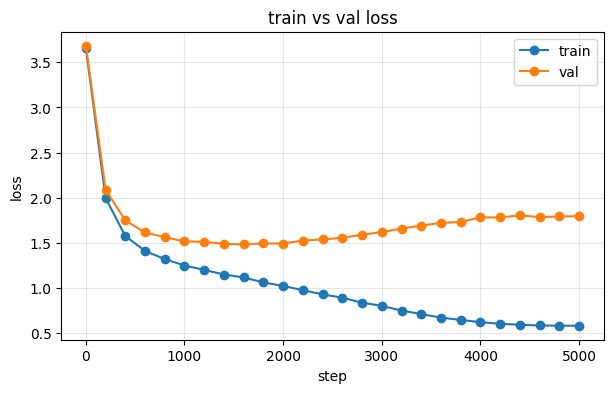

# 2026-09-17 [공부] Transformer 큰 설정 학습과 과적합 (Colab)

> 한 줄 요약: 모델을 10.8M으로 키우자 1600스텝부터 검증 loss가 올라가는 과적합이 뚜렷하게 나왔다. 조기 종료가 필요하다.

## 새로 나온 말

| 말 | 뜻 |
|---|---|
| 과적합 | 학습 데이터만 잘 맞추고 안 본 데이터에서는 나빠지는 것 |
| 조기 종료 (early stopping) | 검증 loss가 더 좋아지지 않으면 멈추고 가장 좋았던 모델을 쓰는 것 |
| 일반화 격차 | 학습 loss와 검증 loss의 차이. 커질수록 외우는 중이다 |
| weight decay | 가중치가 커지지 않게 눌러 과적합을 줄이는 방법 |

## 목표

- 개선판 노트북을 큰 설정으로 학습해 생성 품질 비교

## 한 일

- `LAB-1309 TEST-2-1` ([Colab](https://colab.research.google.com/drive/1nH2cmhVS4chhSZPgNKkPJrGQsUBxs5V7)): 파라미터 10.8M, 5000스텝, T4에서 42분
- 온도 0.5, 1.0, 1.0에 top-k 20으로 생성 비교
- 자세한 기록: [04_실습/02_transformer](../../04_실습/02_transformer/2026-09-16_실습과제.md#큰-설정으로-다시-학습--과적합이-선명하게-보임-2026-09-17-t4)

## 알게 된 것

### 1600스텝부터 외우기 시작한다

| 스텝 | 학습 loss | 검증 loss | 차이 |
|---|---|---|---|
| 1000 | 1.25 | 1.51 | 0.27 |
| 1600 | 1.11 | 1.48 (최저) | 0.37 |
| 3000 | 0.80 | 1.62 | 0.82 |
| 5000 | 0.58 | 1.79 | 1.21 |

- 작은 모델(1.83M)은 차이가 0.08로 과적합이 거의 없었는데, 6배 키우니 같은 1MB 데이터에서 외울 여유가 생겼다
- 5000스텝 모델은 가장 좋았던 시점보다 검증 loss가 0.31 나쁘다

### 생성은 꽤 그럴듯하다

- `ROMEO:`로 시작하면 MERCUTIO, BENVOLIO 같은 같은 작품 인물과 대사 형식, 고어체(`thou speak'st`)까지 따라 한다. 뜻은 통하지 않는다
- 온도 0.5는 반듯하지만 반복적이고, 1.0은 다양하지만 엉키고, top-k 20은 그 중간이다

### 연구와의 연결

- loss가 내려간다고 잘 배운 것은 아니다. 검증 loss를 같이 봐야 한다
- 연구 쪽에는 반대 사례가 있었다. LoRA 1차는 검증 loss는 멀쩡했는데 로봇 성공률은 오르지 않았다. 로봇에서는 loss와 별도로 태스크 성공률을 재야 한다

## 막힌 것과 해결

| 문제 | 원인 | 해결 |
|---|---|---|
| 오래 학습할수록 검증 loss가 나빠짐 | 데이터에 비해 모델이 커서 외운다 | 조기 종료, dropout 0.2, weight decay 0.2, 층을 6에서 4로 |

## 측정한 수치

| 항목 | 값 | 조건 |
|---|---|---|
| 검증 loss 최저 | 1.48 | 1600스텝 |
| 파라미터 / 걸린 시간 | 10.8M / 2516초 | T4, 5000스텝 |
| 최종 학습 / 검증 loss | 0.58 / 1.79 | 5000스텝 |

## 다음에 할 것

- [ ] 조기 종료를 넣고 다시 학습 (검증 loss 1.48 모델로 생성 비교)
- [ ] block_size 128에서 256으로 늘릴 때 스텝당 시간 변화 (어텐션은 길이의 제곱)
- [ ] 1-2 CNN과 ViT
