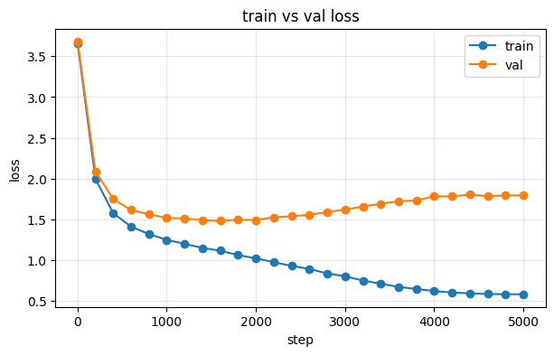

# 작은 Transformer 직접 구현 — 문자 단위 텍스트 생성 (2026-09-16, Colab)

[01_딥러닝기초 1-3 Transformer](../../01_공부순서/01_딥러닝기초.md) 실습. 노트북: `LAB-1309 TEST-2.ipynb` ([Colab 링크](https://colab.research.google.com/drive/1LdHz9YBlEo1ITDU6XK0aS7Xe0FGliZji))

## 만든 것

GPT 계열과 같은 **디코더 전용 Transformer**를 라이브러리 없이 직접 구현했습니다.

| 부품 | 구현 내용 |
|---|---|
| `CausalSelfAttention` | qkv를 한 번에 projection → 헤드로 쪼개기 → scaled dot-product → **causal mask** → 합치기 |
| `TransformerBlock` | **pre-LN** 구조 (`x + attn(ln1(x))`, `x + mlp(ln2(x))`), MLP는 4배 확장 + GELU |
| `CharTransformer` | 토큰 임베딩 + **위치 임베딩**, 블록 2개, 마지막 LayerNorm, vocab 크기로 projection |

설정: `block_size=16`, `embed_dim=64`, `num_heads=4`, `num_layers=2`, AdamW `lr=1e-3`, 500 스텝, 배치 8

## 결과

```
Step 100 | Loss: 0.3077
Step 200 | Loss: 0.1032
Step 300 | Loss: 0.1005
Step 400 | Loss: 0.1037
Step 500 | Loss: 0.0938

[생성 결과]
hello transformer! building a mini transfor
```

`"hel"` 을 주면 나머지를 이어서 만들어냅니다. **구현이 맞다는 증거입니다.** 어텐션이나 마스킹이 틀리면 이렇게 깔끔하게 안 나옵니다.

## ⚠️ 다만 이건 "외운" 것입니다

학습 데이터가 문장 **하나**뿐입니다.

```python
text = "hello transformer! building a mini transformer model from scratch."
```

생성 결과가 그 문장을 그대로 재현하고 loss가 0.09까지 떨어진 건, 언어를 배운 게 아니라 **문장 하나를 통째로 외운 것**입니다. 9/15 MNIST에서 학습 정확도 99.7%가 실력이 아니었던 것과 같은 이야기입니다.

> loss가 0.09 아래로 잘 안 내려가는 이유: 같은 글자 다음에 다른 글자가 오는 경우(예: `t` 다음에 `r`도 오고 `o`도 옴)가 있어서 완벽히 못 맞춥니다. 이것도 일종의 바닥값입니다.

## 다음에 해볼 것

**1. 더 큰 텍스트로 (가장 중요)**

```python
import requests
text = requests.get("https://raw.githubusercontent.com/karpathy/char-rnn/master/data/tinyshakespeare/input.txt").text
```

1MB짜리 셰익스피어 텍스트입니다. 외우기엔 너무 크니, 이때 나오는 생성물이 **진짜 학습한 결과**입니다. 영어 단어처럼 보이는 것들이 나오기 시작하면 성공입니다.

**2. 학습/검증 분리** — 외웠는지 확인하려면 안 본 부분의 loss를 봐야 합니다

```python
n = int(0.9 * len(data))
train_data, val_data = data[:n], data[n:]
```

**3. 샘플링 방식 바꿔보기** — 지금은 확률 그대로 뽑습니다(`multinomial`). 온도(temperature)로 나누거나 상위 k개만 남기면(top-k) 결과가 달라집니다

```python
probs = F.softmax(next_token_logits / temperature, dim=-1)
```

**4. block_size 늘려보기** — 16은 문맥이 16글자뿐입니다. 64, 128로 늘리면 어텐션 계산량이 제곱으로 늘어납니다. 그 비용을 체감해 두면 VLA에서 chunk 길이를 정할 때 감이 옵니다

## VLA와 어떻게 이어지나

여기서 만든 부품이 SmolVLA 안에 그대로 들어 있습니다.

| 이 실습 | SmolVLA |
|---|---|
| `CausalSelfAttention` | action expert(LlamaModel)의 self-attention |
| `TransformerBlock` (pre-LN + MLP) | 같은 구조의 블록 32층 |
| 토큰을 하나씩 이어 생성 | **동작 50스텝을 한 번에** 예측 (action chunk) |
| 위치 임베딩 | 시간 위치 정보 |

**다른 점 하나**: 글자는 한 개씩 순서대로 뽑지만(auto-regressive), SmolVLA는 **50스텝을 통째로** 내놓습니다. 로봇은 20Hz로 움직여야 해서 한 스텝씩 뽑으면 너무 느리기 때문입니다. 이게 action chunking이고, 우리 전환 실험에서 "남은 chunk를 어떻게 할까"(flush/keep/blend)가 문제가 된 이유입니다.

그리고 지금 돌리고 있는 **LoRA는 저 블록들 안의 q/k/v/o projection에 붙습니다.** 이 실습에서 만든 `qkv_proj`, `out_proj`가 바로 그 자리입니다.

---

## 개선판 실행 결과 (tiny shakespeare, T4)

외운 문제를 해결하려고 개선판 노트북을 만들어 돌렸습니다 ([Colab: LAB-1309 TEST-2 개선](https://colab.research.google.com/drive/1nH2cmhVS4chhSZPgNKkPJrGQsUBxs5V7)).

**바꾼 것**: tiny shakespeare 1MB로 학습 · 학습/검증 9:1 분리 · 마스크 `register_buffer` · `F.scaled_dot_product_attention` · dropout 0.1 · 온도/top-k 생성 · 모델 키움(block 128, embed 192, 6 heads, 4 layers, **1.83M 파라미터**) · AdamW + cosine + gradient clipping

| 항목 | 값 |
|---|---|
| 데이터 | 1,115,394 글자, vocab 65 (학습 1,003,854 / 검증 111,540) |

| 스텝 | 학습 loss | 검증 loss | 차이 |
|---|---|---|---|
| 1 | 4.1918 | 4.1903 | 0.00 |
| 200 | 2.4737 | 2.4923 | 0.02 |
| 600 | 2.2454 | 2.2455 | 0.00 |
| 1000 | 2.0584 | 2.1013 | 0.04 |
| 1400 | 1.9906 | 2.0573 | 0.07 |
| 1800 | 1.9676 | 2.0448 | 0.08 |

1800 스텝까지 **47초** (T4)

### 읽는 법

- **검증 loss가 학습 loss를 따라 내려갑니다.** 한 번도 안 본 뒤쪽 10%에서도 좋아진다는 뜻이라, 원본(문장 하나 외움)과 달리 **진짜로 배우는 중**입니다
- 차이 0.08은 건강한 수준입니다. 과적합이 시작되면 검증 loss가 올라갑니다
- 시작 loss 4.19 ≈ ln(65) = 4.17. 65개 글자 중 아무거나 찍는 수준에서 출발했다는 확인입니다
- loss 2.0은 아직 엉성한 영어 수준입니다. 설정을 키우면(block 256, embed 384, layer 6, 5000 스텝, lr 1e-3) 1.5 근처까지 내려갑니다

### 남은 것

- [x] ~~생성 셀·학습 곡선 셀 실행~~ → 아래 큰 설정 결과
- [x] ~~큰 설정으로 다시 학습~~ → 검증 loss 최저 1.48 (1600 스텝), 이후 과적합
- [ ] 조기 종료 넣고 다시 학습
- [ ] block_size 128 → 256 에서 스텝당 시간이 얼마나 늘어나는지 (어텐션은 길이의 제곱)

---

## 큰 설정으로 다시 학습 — 과적합이 선명하게 보임 (2026-09-17, T4)

권장했던 큰 설정으로 5000 스텝 학습했습니다.

| 항목 | 값 |
|---|---|
| 파라미터 | **10.8M** (이전 1.83M 의 약 6배) |
| 스텝 | 5000 |
| 시간 | **2516초 (약 42분)**, T4 |

### 학습 곡선



| 스텝 | 학습 loss | 검증 loss | 차이 |
|---|---|---|---|
| 1 | 3.65 | 3.68 | 0.03 |
| 400 | 1.57 | 1.75 | 0.17 |
| 1000 | 1.25 | 1.51 | 0.27 |
| **1600** | 1.11 | **1.48 ← 최저** | 0.37 |
| 2000 | 1.02 | 1.49 | 0.47 |
| 3000 | 0.80 | 1.62 | 0.82 |
| 4000 | 0.62 | 1.78 | 1.16 |
| 5000 | 0.58 | 1.79 | **1.21** |

### 읽는 법 — 교과서적인 과적합

```
loss
 │ ╲
 │  ╲____________________________ 검증 (1600 스텝부터 다시 올라감)
 │   ╲       ↑ 여기가 최적
 │    ╲___
 │        ╲______
 │               ╲_______________ 학습 (계속 내려감)
 └──────────────────────────────── 스텝
          1600                5000
```

- **1600 스텝까지**: 둘 다 내려감 → 셰익스피어 문체의 규칙을 배우는 중
- **1600 스텝 이후**: 학습 loss 만 내려가고 검증 loss 는 올라감 → **학습 데이터를 외우기 시작**
- 최종 모델(5000 스텝)은 최적 시점(1600)보다 **검증 loss 가 0.31 나쁨**
- 1.83M 짜리 작은 모델은 과적합이 거의 없었는데(차이 0.08), 모델을 6배 키우니 같은 1MB 데이터에서 외울 여유가 생김

### 생성 결과 (5000 스텝 모델, `ROMEO:` 로 시작)

**temperature 0.5** — 안전하고 형식이 반듯함

```
ROMEO:
I thank you.

MERCUTIO:
The sins of his mother, and not my life.

ROMEO:
But in the end of my sorrow's rapier's name?
```

**temperature 1.0** — 다양하지만 문장이 엉킴

```
ROMEO:
Lo, do not meddle with her; for her eyes
Rather thrice did spend me her; nay, thou speak'st
Thy wrenched's wife, like a drowsy and a
cold, and like thee in thy neck behalf alone.
```

**temperature 1.0 + top-k 20** — 중간

```
ROMEO:
O, sir;
I will not, an if you perceive it.

BENVOLIO:
Not that my care.
```

- **대사 형식**(인물 이름 → 줄바꿈 → 대사)을 완벽히 배움
- `ROMEO` 다음에 **같은 작품 인물**(MERCUTIO, BENVOLIO)이 나옴 → 문맥을 기억
- 실제 영단어와 고어체(`thou speak'st`, `thrice`)를 씀
- 뜻은 안 통함 — 글자 단위 1천만 파라미터 모델의 한계
- 과적합된 모델이라 **원문 구절을 그대로 외워 뱉었을 가능성**도 있음

### 고치는 법 — 네 가지

**1. 조기 종료: 검증 loss 가 가장 낮을 때 모델 저장 (가장 중요)**

```python
best_val = float('inf')
for step in range(1, max_steps + 1):
    ...
    if step % eval_every == 0:
        m = estimate_loss()
        if m['val'] < best_val:
            best_val = m['val']
            torch.save(model.state_dict(), 'best.pt')   # 최적 시점 저장
            patience = 0
        else:
            patience += 1
            if patience >= 5:                              # 1000 스텝 동안 안 좋아지면 중단
                print('조기 종료', step); break
model.load_state_dict(torch.load('best.pt'))               # 최적 모델로 생성
```

이것만 해도 검증 loss 1.79 → 1.48, 학습 시간 42분 → 약 15분.

**2. dropout 올리기**: 0.1 → 0.2

**3. weight decay 올리기**: 0.1 → 0.2 (가중치가 커지는 걸 억제)

**4. 데이터 대비 모델 크기 맞추기**: 1MB 에 10.8M 은 큼. 층을 6 → 4 정도로 줄이면 과적합이 늦게 옴

### 연구와 연결되는 교훈

- **"loss 가 내려간다 ≠ 잘 배웠다"** — 검증 loss 를 같이 봐야 함
- 우리 LoRA 1차는 반대 사례였음: 검증 loss 는 멀쩡했는데(0.08 안팎으로 평평) **실제 로봇 성공률은 안 올랐음**. 즉 로봇에서는 **loss 가 좋아도 태스크 성공은 따로 재야** 함
- LoRA 학습에도 "검증 성공률이 가장 높을 때 저장"을 넣는 게 맞음 → 반영 예정
