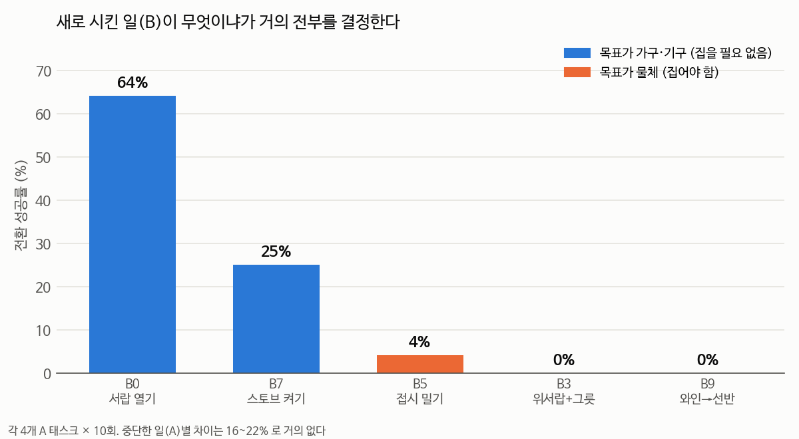

# 전환의 난이도는 **"무엇을 새로 시키느냐"** 가 결정한다 (2026-09-23)

## 📌 쉬운 말 요약

로봇이 그릇을 들고 있을 때 새 지시를 주면 잘 못 따릅니다(32%).
**그런데 어떤 지시를 주느냐에 따라 완전히 갈립니다.**

| 새로 시킨 일 | 성공률 |
|---|---|
| "가운데 서랍을 열어라" | **64%** |
| "스토브를 켜라" | 25% |
| "접시를 밀어라" | 4% |
| "위 서랍을 열고 그릇을 넣어라" | **0%** |
| "와인병을 선반에 놓아라" | **0%** |

**중단한 일(A)이 무엇이냐는 거의 상관없습니다** (16~22%).



> ⚠️ 이 발견은 **쌍을 4개에서 20개로 늘리고 나서야** 보였습니다.
> 그전까지 우리는 B 를 2종류만 쓰고 있었고, 그래서 **B 의 영향이 가려져 있었습니다.**

---

## 1. 전체 표

행 = 중단한 일(A), 열 = 새 지시(B). 각 칸 10회.

| | B0 서랍열기 | B3 위서랍+그릇 | B5 접시밀기 | B7 스토브 | B9 와인→선반 | **A 평균** |
|---|---|---|---|---|---|---|
| A1 그릇→스토브 | 60% | 0% | — | 20% | 0% | 16% |
| A2 와인→찬장 | 67% | 0% | 17% | 0% | 0% | 17% |
| A4 그릇→찬장 | 70% | 0% | 0% | 30% | 0% | 20% |
| A8 그릇→접시 | 60% | 0% | 0% | 50% | 0% | 22% |
| **B 평균** | **64%** | **0%** | **4%** | **25%** | **0%** | |

**A 는 16~22% (범위 6%p), B 는 0~64% (범위 64%p).** 열 방향으로만 갈립니다.

## 2. ⭐ 가르는 것은 "B 가 물체를 집어야 하는가"

B 의 단독 성능으로 나눠 보면 선명해집니다.

| B | 단독 | 전환 | **비율** | B 의 목표 |
|---|---|---|---|---|
| **B0 가운데 서랍 열기** | 60% | **64%** | **1.07** | 서랍 (가구) |
| B7 스토브 켜기 | 100% | 25% | 0.25 | 스토브 (기구) |
| B5 접시 밀기 | 100% | 4% | 0.04 | **접시 (물체)** |
| B3 위서랍 열고 그릇 넣기 | 50% | 0% | 0.00 | **그릇 (물체)** |
| B9 와인병→선반 | 50% | 0% | 0.00 | **와인병 (물체)** |

| B 의 목표 | 전환 성공 |
|---|---|
| **물체** (B3·B5·B9) | **1.4%** (12쌍) |
| **가구·기구** (B0·B7) | **44.6%** (8쌍) |

**30배 차이입니다.**

### B0 은 전환 손실이 0 이다

단독 60% 인데 전환에서 **64%** 입니다. 떨어지지 않습니다.

> **전환 자체는 아무 문제가 없습니다.** 문제는 "전환한 다음 무엇을 시키느냐" 입니다.

이건 우리가 9일 동안 "전환을 어떻게 할 것인가"(chunk 처리, 노이즈, 회복, 지시문 증폭)에
매달린 것이 **질문 자체가 어긋나 있었음**을 뜻합니다.

## 3. 원인을 끝까지 파면 — **집기만 무너진다**

### ① 놓아야 할 이유가 없을 때도 놓는다

가장 이상한 경우:

```
로봇이 그릇을 쥐고 있다.
지시: "위 서랍을 열고 **그릇**을 안에 넣어라"   ← 필요한 물체를 이미 쥐고 있다

결과: 0%.  그리고 **10/10 전부 그릇을 놓아버린다.**
```

| 쌍 | 쥔 물체 | B 가 필요한 것 | 놓았나 |
|---|---|---|---|
| A1→B3 | 그릇 | **그릇** | 10/10 |
| A4→B3 | 그릇 | **그릇** | 10/10 |
| A8→B3 | 그릇 | **그릇** | 10/10 |

"지시가 바뀌면 일단 놓는다"가 학습된 반사입니다.

### ② 그런데 "놓지 못하게" 하는 건 답이 아니었다

그리퍼를 강제로 닫아 두는 방법(`--grip-latch`)을 만들어 봤습니다.

| 조건 | 기준 | 그리퍼 유지 |
|---|---|---|
| A2→B9 (물체가 필요한 B) | 0% | 0% (유지 50/100/200 전부) |
| **A8→B0 (서랍 열기)** | **60%** | **0%** (p=0.005) |

**서랍을 열려면 손잡이를 잡아야 하는데, 그리퍼를 닫아 두면 못 잡습니다.**
"놓지 못하게 한다"는 발상이 **B 의 절반(가구·기구)과 충돌**합니다. → 폐기.

### ③ ⭐ 진짜 원인 — 5cm 앞까지 가서 못 집는다

| 쌍 | 목표 물체까지 최소 거리 | 10cm 안까지 | B 성공 |
|---|---|---|---|
| A8→B3 (그릇) | **5.2cm** | **100%** | **0%** |
| A1→B3 (그릇) | **5.0cm** | **100%** | **0%** |
| A8→B5 (접시) | 9.0cm | 90% | 0% |
| A8→B9 (병) | 14.5cm | 0% | 0% |

그리고 놓은 뒤 **다시 집으려 시도도 합니다** (A8→B3 에서 8/10 이 그리퍼를 다시 닫음).

> **이동 능력은 살아 있습니다. 정밀한 집기만 무너집니다.**

(A8→B9 만 접근조차 못 하는데, 쥐고 있던 것은 **그릇**인데 B 가 요구하는 것은 **와인병**이라
다른 물체로 옮겨 가지 못하는 경우입니다.)

## 4. 9/16 데이터와 정확히 맞물린다

교란된 자세에서 시작했을 때의 성공률을 이미 재 둔 것이 있었습니다.

| 손목을 돌려 놓고 시작 | 0도 | 10도 | 20도 | 30도 |
|---|---|---|---|---|
| 태스크 1 (**물체를 집어야 함**) | 100% | 80% | **30%** | **0%** |
| 태스크 7 (집을 필요 없음) | 100% | 90% | 60% | 0% |

⏳ 2026-09-23 재측정 (위치 교란):

| 위치를 옮겨 놓고 시작 | 0cm | 12cm | 20cm |
|---|---|---|---|
| **태스크 1 (집어야 함)** | 100% | **30%** | **10%** |
| 태스크 7 (집을 필요 없음) | 100% | 80% | 50% |

**같은 이야기입니다.** 교란된 자세에서 **집는 것만** 무너집니다.

## 5. ⇒ 최종 인과 사슬

```
전환
  ↓
팔이 교란된 자세가 된다 (위치 27cm + 회전 8도)
  ↓
성긴 동작은 살아 있다   → 서랍·스토브 같은 큰 목표로는 간다  →  44.6%
정밀한 집기는 무너진다  → 물체 5cm 앞까지 가서 못 집는다    →   1.4%
  ↓
못 집으니 B 실패 → 물체는 아무 데나 놓인 채 → A 재개도 불가 (진짜 0.6%)
```

**지금까지 실패한 모든 대책이 이 지점을 안 건드렸습니다.**

| 시도한 것 | 무엇을 건드렸나 | 결과 |
|---|---|---|
| chunk 처리 (flush/keep/blend/rtc) | 남은 동작 | 전부 30%대 |
| 노이즈 (시드·CEM·크기) | 생성 무작위성 | 전부 실패 |
| 회복 (흔들기·rollback) | 전환 후 동작 | 전부 실패 |
| 지시문 증폭·반복 | 언어 채널 | CMI 는 올랐는데 성공률은 하락 |
| 그리퍼 유지 | 놓는 반사 | 잘 되던 것을 망가뜨림 |
| **교란된 자세에서 집는 능력** | — | **아직 안 건드림** ← 여기 |

## 6. 한계

- 태스크 A 4개 × B 5개 = 20쌍, 각 10회입니다. 10회로는 **53%p 미만을 구분할 수 없습니다**
  (→ [표본 한계](../README.md#0-2)). B0 64% vs B3 0% 는 그 한계를 훨씬 넘지만,
  B5 4% 와 B3 0% 의 차이는 말할 수 없습니다
- "물체냐 가구냐"는 **저희가 붙인 구분**입니다. 다른 설명(단계 수, 목표 판정의 엄격함)과
  완전히 분리되지는 않았습니다
- A 는 전부 **물체를 쥐는 태스크**입니다 (grasp:3 시점에 전환해야 하므로). A 쪽 다양성이 적습니다

## 7. 파일

| 파일 | 내용 |
|---|---|
| [`run_manypairs.sh`](../코드/run_manypairs.sh) | 쌍을 20개로 넓히는 실험 |
| [`run_regrasp.sh`](../코드/run_regrasp.sh) | 집는/안 집는 태스크 × 교란 |
| [`run_lora_v4.sh`](../코드/run_lora_v4.sh) | 이 진단으로 설계한 학습 |
| `results/b_effect.json` | 원자료 |
| `img/b_effect.png` | 그래프 |
