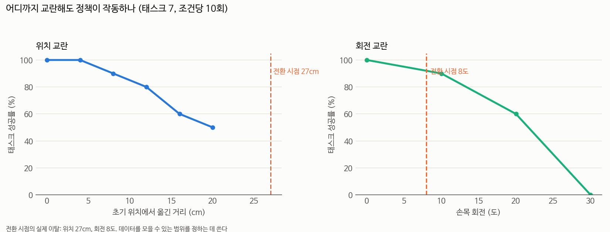

# 어디까지 교란해도 작동하나 — 그리고 "전환"은 무엇을 더하는가 (2026-09-18)

## 📌 쉬운 말 요약

**질문 1**: 팔을 초기 자세에서 얼마나 옮겨 놓아도 정책이 태스크를 해낼까? (학습 데이터를 모을 수 있는 범위)

**질문 2**: 전환 시점은 초기 위치에서 27cm 떨어져 있다. **그냥 27cm 옮겨 놓은 것과 전환이 다른가?**

**답**: **다릅니다 — 전환이 오히려 쉽습니다.** 같은 거리를 임의로 옮겨 놓으면 29% 인데, 실제 전환은 50~55% 입니다.
전환 시점의 팔은 **태스크를 수행하다 도달한 자연스러운 자세**라서, 임의로 옮겨 놓은 자세보다 학습 분포에 가깝습니다.

> ⚠️ **이 문서는 하루 안에 한 번 뒤집혔습니다.** 20cm 까지만 보고 "전환 = 27cm 떨어진 것"이라고 썼는데,
> 25cm 데이터(29%)가 들어오자 반대가 됐습니다. 곡선의 끝을 늘여 짐작하면 안 된다는 교훈입니다.

---

## 1. 위치를 얼마나 옮겨도 되나 (태스크 7, 조건당 10회)



| 초기 위치에서 | 성공률 | 목표 자세 도달 |
|---|---|---|
| 0cm | 100% | - |
| 4cm | 100% | - |
| 8cm | 90% | - |
| 12cm | 80% | 10/10 |
| 16cm | 60% | 10/10 |
| **20cm** | **50%** | 8/10 |
| **25cm** | **29%** | 7/10 |

(0~8cm 은 [2026-09-16 자세 민감도](../pose_sensitivity/README.md) 측정값)

- **완만하게 떨어집니다.** 20cm 에서도 절반, 25cm 에서도 29% 는 해냅니다
- → **25cm 까지는 자기 궤적으로 학습 데이터를 모을 수 있습니다** (역커리큘럼에 필요)
- ⚠️ 20cm 이상에서는 **스크립트가 목표 자세에 도달하지 못하는 경우**가 생깁니다 (8/10, 7/10).
  그만큼 표본이 줄어듭니다

## 2. ⭐ "전환"은 팔 위치 말고 무엇을 더하는가

전환 시점의 실제 이탈은 **위치 27cm, 회전 8도**입니다.
위 곡선을 27cm 로 늘여 보면 **약 29%** 입니다. 실제 전환과 비교하면:

| 쌍 | 실제 전환 B 성공 | 깨끗한 장면 27cm | 차이 |
|---|---|---|---|
| 8→7 | 55% | 29% | **+26%p** |
| 4→7 | 50% | 29% | **+21%p** |
| 9→7 | 0% | 29% | −29%p |

**쉬운 쌍은 예측보다 20%p 이상 높습니다 — 전환이 임의 교란보다 쉽습니다.**

왜일까요. 두 상태는 초기 위치에서 같은 거리지만 **성질이 다릅니다.**

```
임의 교란:  초기 자세 ──(P 제어로 아무 방향으로 25cm)──▶ 아무 자세
            학습 데이터에 없는 방향일 수 있다

전환 시점:  초기 자세 ──(태스크 A 를 수행)──▶ 물체를 쥔 자세
            **학습 데이터에 있는 궤적 위의 자세다**
```

**거리는 같아도 "분포 안"이냐가 다릅니다.** 전환 시점의 팔은 정책이 학습 중에 지나가 본 자세입니다.

### 그래서 "거리"만으로는 전환 난이도를 설명할 수 없다

| 설명 | 판정 |
|---|---|
| "전환은 팔이 27cm 떨어진 것이 전부다" | ❌ **반증** — 같은 거리의 임의 교란보다 21~26%p 쉽다 |
| "거리가 멀수록 어렵다" | ✅ 맞다 (곡선이 단조 감소) |
| "같은 거리면 같은 난이도다" | ❌ 아니다. **어떻게 거기 갔는지**가 중요하다 |

이는 [회복 실험](../recovery/README.md)의 결과와도 맞물립니다 — `ret_part` 로 팔을 7.4cm 까지 되돌리면 67% 인데,
깨끗한 장면의 8cm 는 90% 입니다. **되돌린 자세는 깨끗한 자세보다 못합니다** (스크립트로 만든 자세라 분포 밖).

## ⭐ 2-2. 위치는 완만하고, 회전은 절벽이다

손목 회전 곡선까지 채우자 **두 축의 성질이 완전히 다르다**는 것이 드러났습니다.

| 손목을 돌려 놓은 각도 | 성공률 |
|---|---|
| 0도 | 100% |
| 10도 | 90% |
| 20도 | 60% |
| 30도 | 0% ⚠️ (아래 참고) |
| 40도 | 0% |
| 50도 | 0% |
| 60도 | 0% |

> ⚠️ **30도 값(0%)은 의심스럽습니다.** 위치와 함께 준 조건에서 이렇게 나왔습니다:
>
> | 조건 | 성공률 | 위치만 줬을 때 |
> |---|---|---|
> | 16cm + 30도 | 20% (2/10) | 16cm 60% |
> | **20cm + 30도** | **43% (3/7)** | 20cm 50% |
> | 25cm + 45도 | 0% (0/8) | 25cm 29% |
>
> 회전이 정말 30도에서 치명적이라면 **20cm + 30도가 43%(= 20cm 단독 50%와 거의 같음)일 수 없습니다.**
> 30도 단독 0% 는 **2026-09-16 에 잰 값**이라 지금 조건과 같다고 보장할 수 없습니다
> (0/10 vs 3/7, Fisher p=0.051 — 경계선).
> → **월요일에 30도 단독을 20회로 다시 재야 합니다.** 40~60도가 모두 0% 인 것은 새로 잰 값이라 확실합니다.

```
위치:  100 ─ 100 ─ 90 ─ 80 ─ 60 ─ 50 ─ 29 …   완만한 내리막 (25cm 에서도 29%)
회전:  100 ─  90 ─ 60 ─  0 ─  0 ─  0        20도와 30도 사이가 절벽
```

| | 25% 를 유지하는 한계 | 성질 |
|---|---|---|
| 위치 | **25cm** | 완만하게 감소 |
| 회전 | **20도** | 30도부터 **갑자기 0%** |

### 이것이 두 가지를 설명한다

**① 전환이 어려운 이유는 회전이 아니라 위치다.**
전환 시점의 실제 이탈은 **위치 27cm + 회전 8도**입니다.
회전 8도는 성공률이 100%에 가까운 안전 구간이고, 위치 27cm 는 한계 바로 바깥입니다.
→ 전환 대책은 **위치** 쪽을 봐야 합니다.

**② 그런데 A 재개는 정반대입니다.** [회복 실험](../recovery/README.md)에서:

| 전략 | 위치 복귀 | 회전 복귀 | A 재개 |
|---|---|---|---|
| ret_pos | ✅ 1.1cm | ❌ | **7%** |
| retreat | ✅ 1.3cm | ✅ | **62%** |

위치를 거의 완벽히 되돌려도 7% 입니다. **회전이 안 되돌아가면 소용이 없습니다.**

### ✅ 예측을 세웠고, 같은 날 검증됐다

> **B 를 끝낸 시점의 손목 회전은 30도를 넘어 있을 것이다.**

근거: 30도 이상이면 깨끗한 장면에서도 0% 인데, A 재개도 정확히 0% 입니다.
만약 B 종료 시점의 회전이 20도 이내였다면 위치만 되돌린 ret_pos 가 7% 에 그칠 이유가 없습니다.

**왜 돌아가 있나 (가설)**: A 에서 잡은 물체를 내려놓는 동작과 B 를 수행하는 동작이
손목을 계속 비틀어 놓기 때문입니다. 위치는 되돌릴 수 있어도 그 비틀림은 남습니다.

**검증 결과 (궤적 116개, `outputs/latency`)** — [`rotation_at_resume.py`](rotation_at_resume.py):

| 시점 | 손목 회전 이탈 | 위치 이탈 |
|---|---|---|
| **전환** (B 시작) | **4.9도** | 24.6cm |
| **재개** (A2 시작) | **83.6도** | 32.5cm |

재개 시점 회전: 25~75% 구간 20~123도, **66% 가 30도를 넘습니다.**

**✅ 예측이 맞았습니다.** 그리고 30도 절벽의 위치가 정확히 어디든 상관없습니다 —
**84도는 우리가 재 본 모든 값(60도 단독 0%, 25cm+45도 0%)보다 훨씬 밖**이기 때문입니다.

### 그래서 전환과 재개는 서로 다른 문제다

```
전환 시점:  회전  5도 (안전)    + 위치 25cm (경계)   →  32~55%
재개 시점:  회전 84도 (범위 밖) + 위치 33cm (범위 밖) →   0%
```

- **전환**은 위치 하나만 경계에 걸쳐 있습니다 → 고칠 여지가 있습니다
- **재개**는 **두 축이 동시에 범위 밖**입니다 → 하나만 고쳐서는 안 됩니다
  - `ret_pos` 가 위치를 1.1cm 까지 되돌려도 **7%** 인 이유: 회전 84도가 그대로 남습니다
  - `retreat` 가 둘 다 되돌려 **62%**

**왜 84도나 돌아가 있나**: A 에서 쥔 물체를 내려놓고 B 를 수행하는 동안
손목이 계속 비틀립니다. 위치는 되돌릴 수 있어도 그 비틀림은 남습니다.

## 3. 이것이 바꾸는 것

| | |
|---|---|
| **전환 대책의 방향** | 전환은 위치 27cm 가 문제지 회전 8도는 문제가 아니다 → 회전을 건드리는 대책은 우선순위가 낮다 |
| **역커리큘럼** | 25cm 까지 데이터를 모을 수 있다 → [LoRA 3차](../lora_v2/README.md)의 교란 범위를 20~30cm 로 넓힐 근거 |
| **문제 정의** | 전환은 "먼 자세"가 아니라 **"먼데 자연스러운 자세"** 다. 임의 교란으로 학습하면 엉뚱한 것을 배울 수 있다 |
| **LoRA 2차 재해석** | 2차는 8~20cm **임의 교란**으로 학습했다. 전환 자세와 성질이 달라 전이가 안 됐을 수 있다 → **전환 자세 자체로 학습하는 것이 맞다** |

> ⚠️ **한계**: 깨끗한 장면 곡선은 **태스크 7 하나**에서 잰 것이고, 27cm 는 25cm 값에서 늘여 본 것입니다.
> 전환 쌍마다 A 가 달라 장면 상태가 완전히 같지도 않습니다.

## 4. 파일

| 파일 | 내용 |
|---|---|
| `analyze_boundary.py` | 곡선과 분해 계산 |
| `run_lora_v3.sh` | 이 결과로 학습 범위를 정하는 파이프라인 |
| `results/boundary.json` | 원자료 |
| `img/boundary.png` | 그래프 |
