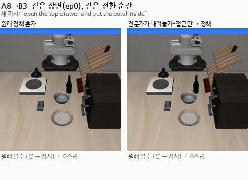

# 스크립트 전문가: 무엇을 가르치면 되는가 (2026-09-28)

> 한 줄 요약: 그릇을 쥔 채 새 지시를 받았을 때, 스크립트가 "그릇을 바로 세워 내려놓고 다음 작업 근처로 데려가기"만 해 주면 나머지는 원래 SmolVLA가 해낸다. 모델에게 가르칠 것은 이 두 동작뿐이다.



그릇을 접시로 옮기다가, 그릇을 집은 직후 "위 서랍을 열고 그릇을 넣어라"로 바꿨다. 같은 장면, 같은 순간이다. 왼쪽은 SmolVLA 혼자라 실패한다. 오른쪽은 보라색 구간만 스크립트가 그릇을 내려놓고 서랍 앞으로 옮겨 주고, 나머지는 SmolVLA가 스스로 서랍을 열고 그릇을 넣는다.

스크립트는 시뮬레이터가 알려주는 물체 위치로 움직이므로 실제 로봇에서는 쓸 수 없다. 그래서 아래 결과는 모델 성능이 아니라 "무엇을 가르치면 되는가"를 정하기 위한 진단이다. 실제 모델은 LoRA 5차에서 이 동작을 카메라만 보고 스스로 하도록 학습한다.

---

## 1. 결과

### 내려놓기만 도와줄 때와 이동까지 도와줄 때 (A8, 각 10회)

| 새 지시 B | 원래 모델 | 내려놓기만 | 내려놓기 + 이동 | p |
|---|---|---|---|---|
| 스토브 켜기 | 50% | 30% | 100% | 0.016 |
| 위 서랍 열고 그릇 넣기 | 0% | 0% | 60% | 0.005 |
| 가운데 서랍 열기 | 60% | 90% | 80% | 0.31 |
| 접시 밀기 | 0% | 20% | 0% (물체 기준 위치로 데려가면 50%) | |
| 와인병을 선반에 | 0% | 20% | 물체 기준 위치로 데려가면 40% | |

### 다른 A에서도 같다

| 새 지시 B | A8 (그릇→접시) | A4 (그릇→찬장) | A1 (그릇→스토브) |
|---|---|---|---|
| 스토브 켜기 | 10/10 | 10/10 | 10/10 |
| 서랍 열고 그릇 넣기 | 6/10 | 5/10 | 7/10 |

### 어디로 데려갈지는 B마다 다르다

| 새 지시 B | 고정 위치 + 모델 | 물체 기준 위치 + 모델 | 궤적 재생 (모델 없음) |
|---|---|---|---|
| 스토브 켜기 | 100% | | |
| 서랍 열고 그릇 넣기 | 60% | 0% | 0% |
| 가운데 서랍 열기 | 80% | | |
| 접시 밀기 | 0% | 50% | 30% |
| 와인병을 선반에 | | 40% | 30% |

- 서랍과 스토브처럼 고정된 가구는 고정 위치, 접시와 와인병처럼 매번 위치가 다른 물체는 물체 기준 위치가 낫다
- 궤적을 위치만 따라가는 재생은 모델보다 못하다. 가까이 데려간 뒤에는 모델에게 맡기는 편이 낫다

### 원래 일로 돌아가기도 같은 방식으로 된다

B를 마친 뒤 지시를 다시 A로 바꾸고, 같은 상태에서 모델 혼자와 "그릇 근처까지만 데려다 주기"를 비교했다.

| 쌍 (A → B → A) | 모델 혼자 | 그릇 근처로 데려가 주면 |
|---|---|---|
| 그릇→접시, 스토브 켜기, 다시 그릇→접시 | 0/10 | 8/10 |
| 그릇→찬장, 스토브 켜기, 다시 그릇→찬장 | 0/10 | 7/10 |
| 그릇→스토브, 스토브 켜기, 다시 그릇→스토브 | 0/10 | 8/10 |
| 그릇→접시, 서랍 열기, 다시 그릇→접시 | 0/8 | 0/8 |

## 2. 스크립트가 하는 일

| 단계 | 함수 (`scripted_expert.py`) | 내용 |
|---|---|---|
| 내려놓기 | `put_down` | 그 자리에서 곧장 탁자까지 내려 바로 세워 놓고, 8cm 들어 올린다 |
| 고정 위치로 | `approach` | 모델이 성공할 때 작업 대상 근처에 도착한 자세 (처음 자세에서 16~43cm) |
| 물체 기준 위치로 | `demo_approach` | 녹화한 성공 궤적에서 처음 물체에 닿는 점 15cm 안이면서 처음 자세에서 10cm 밖인 점을, 지금 물체 위치에 맞게 옮겨서 |
| 궤적 재생 | `replay` | 그 점부터 녹화 궤적을 따라간다 |

모든 이동은 멈추지 않고 한 번에 하며, 물체를 피하려고 한 번 들어 올렸다 내려온다.

## 3. 제약 점검

와인병은 처음 자세에서 17~19cm밖에 떨어져 있지 않아서, 처음 구현은 처음 자세 4~7cm 안의 점을 목표로 골랐다. 이것은 사실상 리셋이다. 그래서 두 가지를 고쳤다.

- 목표점은 처음 자세에서 10cm 밖에서만 고른다 (`MIN_HOME`)
- 시범을 모을 때 전환 뒤 손이 처음 자세 7cm 안으로 들어간 것은 버린다 (`collect_expert.py --min-home`)

모든 시험은 "처음 자세까지 가장 가까이 간 거리"를 함께 기록한다.

## 4. 이것으로 무엇을 하나: LoRA 5차

시범 하나는 [스크립트: 내려놓기와 이동] 다음에 [모델: B 마무리]가 이어진 것이고, 전부 B의 지시문으로 저장한다. B를 마친 뒤에는 지시를 A로 바꿔 [스크립트: 그릇 근처로] [모델: A 마무리]도 A의 지시문으로 저장한다. 모델이 두 번 실패하면 세 번째는 궤적 재생으로 끝까지 한다. [run_lora_v5.sh](../코드/run_lora_v5.sh)

## 다시 해 보기

```bash
cd ~/smolVLA
.venv/bin/python record_demos.py                                   # 성공 궤적 녹화
.venv/bin/python test_putdown.py --pairs 8:7,8:3,8:0 --approach    # 고정 위치로
.venv/bin/python test_putdown.py --pairs 8:5,8:9 --approach --approach-src demo
.venv/bin/python test_replay.py --pairs 8:5,8:9,8:3
.venv/bin/python test_resume.py                                    # 원래 일로 돌아가기
.venv/bin/python make_gifs_clean.py                                # GIF
```
