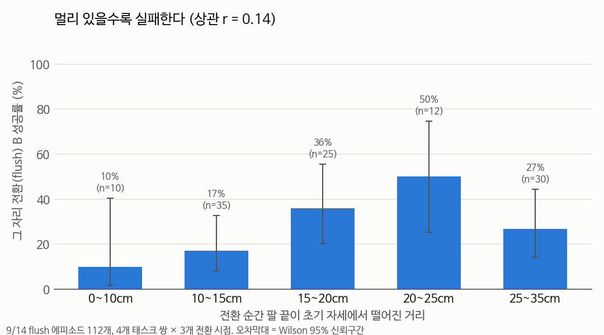

# 가설 검증 — 전환 성공을 가르는 건 팔 위치인가? (2026-09-17)

## 📌 쉬운 말 요약

**질문**: 앞선 실험들을 보고 "전환 순간 팔이 멀리 있어서 실패한다"고 생각했습니다. 정말 그럴까요?

**답**: **아니었습니다.** 실제 전환 에피소드 112개를 하나씩 보니, 팔이 초기 자세에서 멀든 가깝든, B 의 정상 경로에서 멀든 가깝든 **성공과 실패가 고르게 섞여** 있었습니다. 대신 **같은 장면에서도 시도할 때마다 결과가 바뀌는 무작위성**이 가장 컸습니다.

**왜 중요한가**: 이 결과로 다음 방법의 방향이 바뀝니다. 팔 위치 거리로 후보를 고르는 `bon` 전략은 효과가 약할 가능성이 크고, **성공 가능성을 학습한 판정기**(V-GPS, Q-Planning 방식)가 필요하다는 근거가 됩니다.

---

## 배경 — 왜 위치가 원인이라고 생각했나

| 실험 | 결과 | 당시 해석 |
|---|---|---|
| [자세 민감도](../pose_sensitivity/README.md) | 초기 자세에서 **일부러** 10cm 옮기면 87% → 43% | 멀면 실패 |
| [retreat ablation](../retreat_ablation/README.md) | 초기 위치로 **되돌리면** 32% → 64% | 위치가 핵심 |
| 전환 순간 실제 거리 | 12~27cm | 멀리 있음 |

그래서 "전환 순간 팔이 멀리 있어서 실패한다"고 결론 냈습니다. 하지만 이건 **통제 실험**의 결과이지, **실제 전환 상황에서 자연스럽게 생긴 차이**가 성공을 가르는지는 따로 확인하지 않았습니다.

## 가설 1 — 초기 자세와의 거리

그 자리 전환(flush) 112회에서, 전환 순간 팔 끝이 초기 자세에서 떨어진 거리와 B 성공을 비교했습니다.



| 거리 | 에피소드 | B 성공 |
|---|---|---|
| 0~10cm | 10 | 10% |
| 10~15cm | 35 | 17% |
| 15~20cm | 25 | 36% |
| 20~25cm | 12 | 50% |
| 25~35cm | 30 | 27% |

**상관 r = +0.14** — 오히려 **멀수록 약간 더 성공**. 가설 기각.

## 가설 2 — B 의 정상 경로와의 거리

"초기 자세가 아니라, B 를 정상적으로 할 때 팔이 지나가는 길에서 멀어서 실패한다"로 바꿔 봤습니다. B 정상 경로는 **교란 없이 B 를 성공한 궤적**으로 만들었습니다 (평가 대상인 flush 성공 궤적은 섞지 않음).


| 거리 기준 | 상관 r |
|---|---|
| 초기 자세와의 거리 | +0.14 |
| B 정상 경로와의 거리 | **+0.23** |

태스크 쌍별로 보면 방향이 제각각입니다.

| 쌍 | B 경로 거리 r | 초기 자세 거리 r |
|---|---|---|
| 1→5 | **−0.42** | −0.41 |
| 2→5 | +0.08 | +0.09 |
| 4→7 | +0.12 | +0.13 |
| 8→7 | +0.28 | +0.28 |

**일관된 경향이 없음.** 가설 기각.

## 그럼 무엇이 성공을 가르나 — 장면 vs 무작위성

같은 (태스크 쌍, 초기 배치)에서 flush/keep/blend × 3개 시점, 최대 9회 시도의 성공 비율:

| 쌍 | 에피소드(장면)별 성공 비율 |
|---|---|
| 8→7 | 0.11 · **0.78** · 0.67 · 0.56 · 0.22 · **0.00** · 0.67 · 0.44 · 0.44 · 0.33 |
| 4→7 | 0.44 · **0.78** · 0.56 · 0.11 · 0.22 · 0.11 · 0.44 · 0.33 · 0.33 · 0.22 |
| 1→5 | 0.11 · 0.33 · 0.00 · 0.00 · 0.33 · 0.33 · 0.11 · 0.22 · 0.00 · 0.00 |
| 2→5 | 0.00 · **0.44** · 0.00 · 0.00 · 0.00 · 0.00 · 0.00 · 0.00 · 0.00 · 0.00 |

| 쌍 | 전체 성공 | 장면이 설명하는 비율 |
|---|---|---|
| 8→7 | 42% | 24% |
| 4→7 | 36% | 17% |
| 1→5 | 14% | 16% |
| 2→5 | 6% | 31% |

- **장면은 일부만 설명**합니다 (16~31%). 8→7 에피소드 1은 쉽고 에피소드 5는 어렵습니다
- **나머지 70~84% 는 같은 장면에서도 시도마다 달라지는 무작위성**입니다. SmolVLA 는 flow matching 이라 매번 노이즈가 달라 동작이 조금씩 다르고, 그 작은 차이가 성공·실패를 가릅니다

## 결론과 수정

### 앞선 해석 수정

- ❌ "전환 실패의 원인은 전환 순간 팔 위치가 멀어서" — **단정할 수 없음**
- ✅ "초기 자세로 되돌리면 성공률이 오른다" — 사실 (ablation). 하지만 되돌리는 동작이 위치 말고도 **물체를 내려놓고, 속도를 0으로 만들고, 장면을 정리하는** 효과를 함께 가짐
- ✅ "자연스럽게 생긴 위치 차이는 성공을 예측하지 못한다" — 이번 검증

### 다음 방법에 주는 의미

| 방향 | 판단 |
|---|---|
| `bon` (팔 위치 거리로 후보 고르기) | 점수 기준이 성공과 무관할 가능성 → 효과 약할 것으로 예상 → **실제로 34% vs flush 32%, 짝 비교 p≈0.82 로 차이 없음 (예측 적중)** |
| **학습한 판정기로 후보 고르기** ([V-GPS](../../../02_논문노트/V-GPS.md), [Q-Planning](../../../02_논문노트/Q-Planning.md)) | 무작위성이 크다 = **좋은 후보와 나쁜 후보가 섞여 나온다** → 제대로 구분만 하면 효과가 클 수 있음. **다음 우선순위** |
| [DSRL](../../../02_논문노트/DSRL.md) (노이즈 조종 강화학습) | 무작위성이 결과를 크게 좌우한다는 건 **노이즈를 잘 고르면 성공률이 오른다**는 뜻 → 근거 강화 |

## 🔄 2026-09-18 후속 — 이 결론은 "전환 범위 안에서" 참이다

하루 뒤 실험에서 얼핏 모순처럼 보이는 결과가 나왔습니다.

| | |
|---|---|
| 여기(9/17) | 전환 에피소드 112개에서 **거리와 성공의 상관이 거의 없음** (r = +0.14) |
| [회복 실험](../recovery/README.md)(9/18) | 초기 위치로 **완전히 되돌리면** 32% → 64~89% |

**모순이 아닙니다.** 여기서 비교한 거리는 전부 **12~27cm 범위 안**이었습니다.
그 범위에서는 거리가 성공을 못 가릅니다 — **전부 나쁘기** 때문입니다.
0cm 까지 가야 달라지는데, 그 지점은 이 분석의 표본에 없었습니다.

```
거리:    0cm ─────── 12cm ──────────── 27cm
성공률:  64~89%      ??  (전부 30% 근처)  ??
                     └── 9/17 분석은 이 구간만 봤다 ──┘
```

부분적으로 가까워지는 것(21cm, 4~10cm 이동)도 [효과가 없었습니다](../recovery/README.md).
**거리는 연속적으로 작동하지 않고, "도착"해야 합니다.**

그리고 9/18 에 **진짜 원인**을 찾았습니다 — 실패는 [좁은 영역에서 맴도는 것](../failure_mode/README.md)(policy idling)이고,
거기에 빠질지 말지는 [전환 순간의 생성 노이즈](../noise_seed/README.md)가 크게 정합니다.
이 문서의 "시도마다의 무작위성이 가장 컸다"는 관찰이 **바로 그 노이즈**였던 것으로 보입니다.

## 한계

- 팔 끝 **위치만** 봤습니다. 손목 방향, 속도, 쥔 물체의 위치·자세는 저장하지 않아 못 봤습니다
- 태스크 쌍당 30회 안팎이라 쌍별 상관은 신뢰구간이 넓습니다
- "무작위성"이라고 부른 것 안에는 **저장하지 않은 상태 차이**(물체가 몇 mm 다르게 놓임 등)도 섞여 있을 수 있습니다

```bash
python deviation_vs_success.py
python manifold_distance_vs_success.py
```
