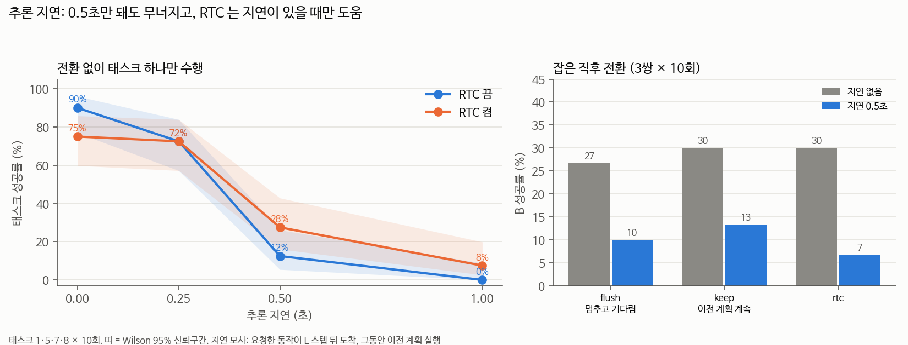

# 추론 지연 실험 — 느린 GPU 에서도 되는가 (2026-09-18)

## 📌 쉬운 말 요약

**왜?** [연구주제.md](../../../연구주제.md) 2단계가 "추론 지연 0~1초로 **저사양 상황** 재현"입니다. 그리고 RTC 가 지연 없는 조건에서만 평가돼 **불공정했던 점**([RTC 노트](../../../02_논문노트/Real-Time-Chunking.md))도 바로잡아야 했습니다.

**결과 한 줄**: SmolVLA 는 추론이 **0.5초만 늦어도 90% → 12% 로 무너집니다.** RTC 는 지연이 있을 때 확실히 도움이 되지만(12 → 28%), 전환 상황까지 구하지는 못했습니다.

---

## 지연 모사 방법 (`switch_experiment.py --latency-steps L`)

실제 로봇에서 추론이 느리면 이렇게 됩니다.

```
시간 →   t                 t+L
         │ 관측 찍고 요청   │ 새 동작 도착
         │◀── 계산 중 ──▶│
로봇:     이전 계획 계속 실행  │ 새 계획으로 교체 (이미 지나간 앞 L개는 버림)
```

- 요청 시점 관측으로 계산한 동작이 **L 스텝 뒤에** 도착 (20스텝 = 1초)
- 기다리는 동안 **이전 계획을 계속 실행**, 이전 계획이 바닥나면 제자리 유지
- 지시가 바뀌면 이전 지시로 보낸 요청은 버리고 새 지시로 즉시 요청
- `--latency-steps 0` 이면 기존 동기 실행과 완전히 같음

## A. 전환 없이 태스크 하나만



태스크 1·5·7·8 × 10회

| 추론 지연 | RTC 끔 | RTC 켬 | 짝 비교 (RTC 만 성공 : 끔 만 성공) |
|---|---|---|---|
| 없음 | 90% | 75% | 2 : 8, p ≈ 0.11 |
| 0.25초 (5스텝) | 72% | 72% | 7 : 7 |
| **0.5초 (10스텝)** | **12%** | **28%** | **6 : 0, p ≈ 0.03** |
| 1초 (20스텝) | 0% | 8% | 3 : 0 |

- **0.5초 지연에서 성공률이 1/7 로** — 오래된 관측으로 만든 동작이 실제 상황과 어긋나고, 새 동작이 도착할 때마다 방향이 튐
- **RTC 는 지연이 있을 때만 이득.** 0.5초에서 6 : 0 으로 통계적으로도 유의. 논문 주장과 같은 방향
- 지연이 없으면 RTC 가 오히려 손해 (반응성을 부드러움과 맞바꾸기 때문)

## B. 잡은 직후 전환 (8→7, 4→7, 1→5 × 10회)

| 전략 | 지연 없음 | 지연 0.5초 | 지연 0.5초에서 멈춘 시간 |
|---|---|---|---|
| flush (이전 계획 버리고 기다림) | 27% | **10%** | **1.5초** (30스텝) |
| keep (새 동작 올 때까지 이전 계획 계속) | 30% | **13%** | 0.5초 |
| rtc (이전 계획 계속 + 이어붙이기) | 30% | **7%** | 0.5초 |

- 지연이 있으면 전환 성공률이 **절반 이하**
- flush 는 기다리는 동안 **멈춰 서 있어서** stop-and-go (1.5초 정지). 자연스러움 제약에도 어긋남
- 전환 상황에서는 RTC 도 도움이 안 됨 (지시가 바뀐 순간 이전 계획을 따르는 게 방해)

## 1080 Ti 실측 추론 시간

| 조건 | 1회 추론 (chunk 50개) | 20Hz 기준 지연 | 시뮬 1스텝 |
|---|---|---|---|
| **GPU 단독** | **559.9ms** (p90 562.8ms) | **11.2 스텝 ≈ 0.56초** | 15.6ms |
| GPU 공유 (다른 평가 2개 실행) | 1281ms (p90 1357ms) | 약 26 스텝 ≈ 1.3초 | 21.6ms |

측정: `bench_inference.py`, 워밍업 5회 후 30회, `torch.cuda.synchronize()` 포함, fp32

### ⚠️ 이게 뜻하는 것

**연구실 1080 Ti 의 실제 지연(0.56초)이 위 표에서 성능이 무너지는 구간(0.5초)과 정확히 일치합니다.**

| | 우리가 지금까지 측정한 값 (동기 실행) | 실제 지연 0.5초에서 |
|---|---|---|
| 태스크 성공률 | 90% | **12%** (RTC 28%) |
| 잡은 직후 전환 B 성공 | 27~30% | **7~13%** |

지금까지의 모든 실험은 "계산하는 동안 세상이 멈추는" 동기 실행이라 **낙관적인 수치**입니다. 이 GPU 로 실물 로봇(PiPER)에 올리면 위 오른쪽 열이 현실입니다.

**따라서 저사양 대응이 선택이 아니라 필수입니다.**
1. **RTC 는 이 조건에서 필요** (12 → 28%)
2. `n_action_steps` 를 늘려 추론 횟수를 줄이기 (지금 10 → 25 이면 추론 사이 간격이 지연보다 길어짐)
3. 비동기 추론 (SmolVLA 논문이 제안한 방식)
4. 더 작은 입력 해상도 / VLM 앞부분 캐시 재사용

## 의미

1. **저사양 문제는 실재한다.** 우리 실험은 지금까지 지연 없이(동기 실행) 했기 때문에, 실제 로봇에서는 이보다 훨씬 나쁠 수 있음
2. **RTC 는 "지연 대응" 도구로는 맞다.** 전환 도구로는 아님
3. 전환 연구의 최종 평가는 **실제 추론 시간만큼 지연을 넣은 조건**에서 해야 공정함

## 한계

- 지연 모사는 고정 L 스텝. 실제로는 추론 시간이 흔들림
- 에피소드 시작 때 첫 동작이 도착할 때까지 L 스텝 제자리
- 태스크 4개, 조건당 10회

```bash
./run_latency.sh && python make_latency_chart.py
python bench_inference.py "GPU 단독"
```
