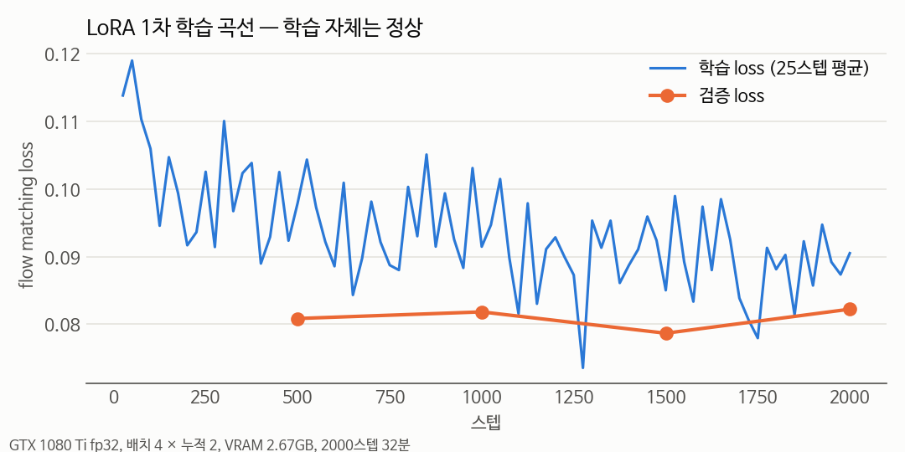
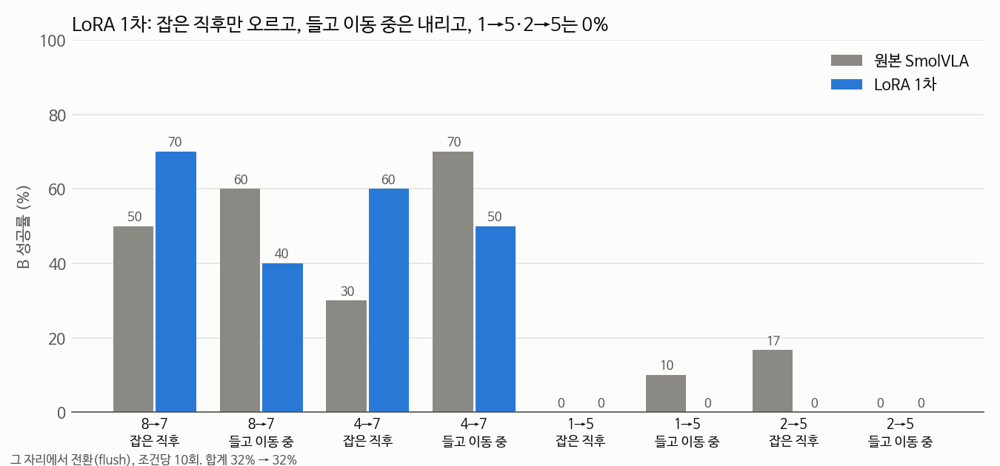
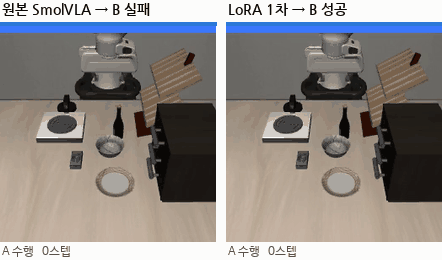
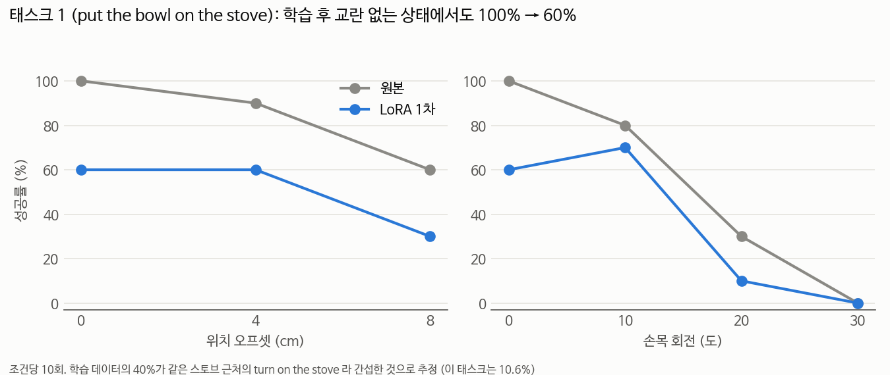

# LoRA 1차 — 자세 강건화 self-imitation 학습 (2026-09-16)

## 📌 쉬운 말 요약

**왜 했나?** 전환이 실패하는 이유는 "팔이 학습 때 못 본 자세에 있어서"였습니다([자세 민감도](../pose_sensitivity/README.md), [ablation](../retreat_ablation/README.md)). 초기 자세로 되돌리는 건 금지라, **모델 자체가 낯선 자세에서도 일하게** 가르쳐야 합니다.

**어떻게?** 모델이 **스스로 성공한 궤적**을 모아 다시 가르쳤습니다(self-imitation). 사람 시연 없이, 연구실 GTX 1080 Ti에서 LoRA로 학습했습니다.

**결과 한 줄**: **실패에 가깝습니다.** 전환 성공률은 32% → 32%로 그대로였고, 원래 잘하던 태스크 하나는 100% → 60%로 떨어졌습니다. 원인은 **데이터 편향**입니다. 이 실패를 바탕으로 [LoRA 2차](../lora_v2/README.md)를 설계했습니다.

---

## 방법

### 데이터 (184 에피소드, 21,428 프레임)

| 종류 | 만드는 법 | 저장한 것 |
|---|---|---|
| **자세 교란** | 시작 자세를 최대 8cm·20도 틀어놓고 정책 실행 | **성공한 것만**, 스크립트로 자세 만든 구간은 제외 |
| **전환** | 물체를 쥔 상태에서 **그 자리에서** B로 지시 교체 | **B를 성공한 것만**, 전환 이후 구간 |

두 종류 모두 리셋 동작이 들어가지 않습니다. 제약([연구주제.md](../../../연구주제.md))을 지키는 데이터입니다.

### 모델

| 항목 | 값 |
|---|---|
| 기반 | `HuggingFaceVLA/smolvla_libero` |
| LoRA 대상 | action expert(LlamaModel)의 q/k/v/o_proj, gate/up/down_proj |
| rank / alpha | 16 / 32 |
| 학습 파라미터 | **4.92M / 609.8M (0.81%)** |
| 학습 | AdamW lr 1e-4, OneCycle, 배치 4 × 누적 2, 2000 스텝 |
| 환경 | GTX 1080 Ti fp32, **VRAM 2.67GB**, **32분** |

VLM과 비전 인코더는 동결했습니다. 체크포인트 원래 설정(`train_expert_only=True`)과 같고, 9/14 실험에서 문제가 "이해"가 아니라 "동작 생성"이었기 때문입니다.

```bash
python collect_robust_data.py --tasks 0 1 2 4 5 7 8 --mode pose --episodes 40 --max-offset-cm 8 --max-yaw-deg 20
python collect_robust_data.py --tasks 8 4 1 2 --task-b 7 7 5 5 --mode switch --switch-at grasp:3 --episodes 25
python train_lora.py --data data/robust --steps 2000 --batch-size 4 --grad-accum 2 --out outputs/lora_v1
```

## 결과

### 학습 자체는 정상



검증 loss 0.081 → 0.082 → 0.079 → 0.082. 과적합도, 발산도 없었습니다. **모델 쪽 문제가 아니라는 뜻입니다.**

### 전환 성공률: 오르고 내린 게 상쇄



| 쌍 | 시점 | 원본 | LoRA 1차 |
|---|---|---|---|
| 8→7 | 잡은 직후 | 50% | **70%** |
| 8→7 | 들고 이동 중 | 60% | 40% |
| 4→7 | 잡은 직후 | 30% | **60%** |
| 4→7 | 들고 이동 중 | 70% | 50% |
| 1→5 | 잡은 직후 / 들고 이동 중 | 0% / 10% | 0% / 0% |
| 2→5 | 잡은 직후 / 들고 이동 중 | 17% / 0% | 0% / 0% |
| **합계** | | **32%** | **32%** |

A 재개는 학습 전후 모두 **0%** 였습니다.

### 영상: 원본은 실패, LoRA 1차는 성공한 에피소드



4→7(그릇을 캐비닛 위에 → 스토브 켜기), 잡은 직후 **그 자리에서** 전환(flush), 에피소드 4. 원본은 300스텝 안에 스토브를 못 켜고, LoRA 1차는 170스텝에 켭니다. 둘 다 초기 자세로 돌아가지 않습니다.

> 이 에피소드는 **LoRA 가 나아진 경우를 골라** 보여주는 것입니다. 전체로는 32% → 32% 로 변화가 없었습니다 (위 표).

### 원래 잘하던 것을 잊음



태스크 1(put the bowl on the stove)이 **교란 없는 상태에서 100% → 60%** 로 떨어졌습니다. 태스크 7은 그대로, 태스크 5는 섞여 나왔습니다.

## 실패 원인: 데이터 편향

| 지시문 | 프레임 비중 |
|---|---|
| **turn on the stove** | **40.1%** |
| open the middle drawer | 19.2% |
| push the plate to the front of the stove | 12.2% |
| put the bowl on the stove | 10.6% |
| put the bowl on the plate | 6.7% |
| put the bowl on top of the cabinet | 5.7% |
| put the wine bottle on top of the cabinet | 5.6% |

1. **못하는 건 데이터가 안 생긴다.** 1→5, 2→5 전환은 원래 성공률이 0~17%라 성공 궤적이 **0개** 모였습니다. 그래서 전혀 배우지 못했습니다. self-imitation의 근본 한계입니다
2. **한 태스크가 데이터를 독차지했다.** 8→7, 4→7 전환 성공이 전부 "turn on the stove"로 들어가 40%가 됐습니다. 같은 스토브 근처에서 그릇을 드는 "put the bowl on the stove"가 여기에 간섭당한 것으로 추정합니다
3. **"들고 이동 중"이 떨어진 이유**: 전환 데이터를 "잡은 직후" 위주로 모은 영향으로 보입니다 (확인 필요)

## 다음: LoRA 2차에서 바꾼 것

| 문제 | 대응 |
|---|---|
| 잘하던 걸 잊음 | 10개 태스크의 **교란 없는 정상 궤적** 추가 |
| 전환 시 실제 이탈(12~27cm)보다 교란 범위가 좁음(8cm) | 교란 범위 **8~20cm** |
| 못하는 쌍은 데이터 0개 | **hindsight relabeling** — B에 실패해도 우연히 달성한 다른 태스크로 라벨을 바꿔 저장 |
| 한 태스크 독점 | 지시문별 **균형 샘플링** |
| 망각이 큼 | LoRA r 16 → **8**, lr 1e-4 → **5e-5** |

## 파일

| 파일 | 내용 |
|---|---|
| `collect_robust_data.py` | 데이터 수집 (pose / switch / hindsight 모드) |
| `train_lora.py` | LoRA 학습 (action expert 전용, 균형 샘플링 옵션) |
| `run_pipeline.sh` | 1차 전체 파이프라인 (수집 → 학습 → 평가) |
| `run_pipeline_v2.sh` | 2차 파이프라인 |
| `make_v1_charts.py` | 이 문서의 그래프 |
| `results/history.json` | 학습 loss 기록 |
