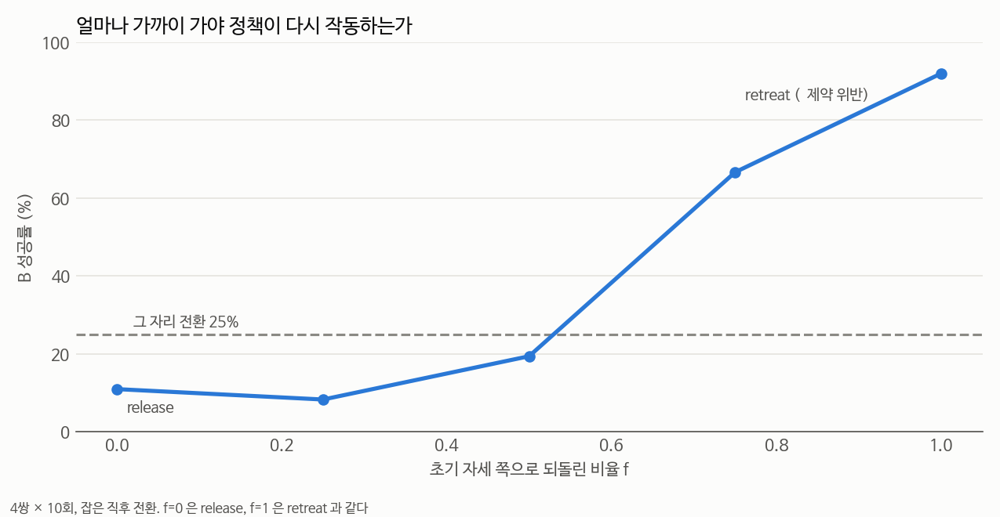

# 무엇이 정책을 회복시키는가 — 세 가지 시도와 그 결과 (2026-09-18)

## 📌 쉬운 말 요약

**질문**: 전환 후 로봇이 [좁은 영역에서 맴돌다 실패](../failure_mode/README.md)합니다. 초기 자세로 되돌리면(금지된 방법) 89% 로 회복됩니다. **금지된 방법을 쓰지 않고 회복시킬 수 있을까요?**

**답**: 세 가지를 시도했는데 **전부 안 됐습니다.**

| 방법 | 팔이 어디로 가나 | B 성공 |
|---|---|---|
| (기준) 그 자리 전환 `flush` | 그대로 (초기 위치에서 27cm) | **32%** |
| ① 맴돌면 흔들어 탈출 (4방향) | 아무 데나 4~10cm | 25~31% (**변화 없음**) |
| ② `rollback` — 최근 동작 역재생 | 집기 직전 (초기 위치에서 21cm) | **19%** (**더 나쁨**) |
| (금지) `ret_pos` — 초기 **위치**로 | 초기 위치 (0cm) | 64% |
| (금지) `retreat` — 초기 **자세**로 | 초기 자세 (0cm + 회전) | **89%** |

**부분적인 이동은 전혀 도움이 안 되고, 초기 위치에 "도착"해야만 효과가 있습니다.**
그래서 마지막 질문이 남습니다 — **얼마나 가까이 가야 하는가?** (③ 용량-반응 실험, 진행 중)

---

## 1. 시도 ① — 맴돌면 흔들어서 탈출 (PIP ablation)

[PIP 논문](../../../02_논문노트/PIP-Policy-Idling.md)은 idling 을 감지하면 **초기 자세 쪽으로 동작을 섞어** 탈출시킵니다.
우리는 초기 자세 참조가 **필요한지** 확인하려고 4방향을 비교했습니다.

감지: 최근 2초 동안 끝단 이동 범위 < 3cm → 10스텝 동안 흔들기 (세기 0.5 = 2.5cm/스텝), 쿨다운 2초.

| 흔들기 방향 | 초기 자세 참조 | B 성공 | 흔든 횟수(중앙값) | flush 와 짝 비교 |
|---|---|---|---|---|
| 없음 | - | 25% (9/36) | 0 | 기준 |
| `lift` (위로) | ✅ 아니오 | 31% (11/36) | 1 | 3 : 1, p = 0.63 |
| `reverse` (최근 동작 거꾸로) | ✅ 아니오 | 25% (9/36) | 1 | 1 : 1, p = 1.00 |
| `random` (무작위) | ✅ 아니오 | 25% (9/36) | 1 | 2 : 2, p = 1.00 |
| **`home` (PIP 원본)** | ⛔ 예 | 28% (10/36) | 1 | 2 : 1, p = 1.00 |

**넷 다 효과가 없었습니다. PIP 원본 방향(`home`)도 마찬가지입니다.**

### 흔들기가 실제로 작동하긴 했나 — 확인함

| 방향 | 흔들기 횟수 | 10스텝 동안 이동 | 50스텝 뒤에도 남은 이동 |
|---|---|---|---|
| `lift` | 40 | 6.0cm | 5.8cm |
| `reverse` | 36 | 5.2cm | 4.8cm |
| `random` | 43 | 3.6cm | 5.6cm |
| `home` | 35 | **10.0cm** | 7.9cm |

**로봇은 확실히 움직였고 그 효과도 남았습니다.** 그런데 성공률은 그대로입니다.

**왜 PIP 와 다른 결과가 나왔을까** (추측)
- PIP 는 **같은 태스크를 수행하다 막힌** 상황입니다. 우리는 **지시가 바뀐 뒤** 낯선 자세에서 시작합니다
- PIP 의 σ ∈ [0.6, 1.0] 는 관절 공간 보간이고, 우리는 끝단 공간에서 흔듭니다
- 무엇보다 **우리 상황은 "막힌" 게 아니라 "처음부터 작동 범위 밖"** 일 수 있습니다 (아래 3절)

## 2. 시도 ② — `rollback`: 최근 동작을 거꾸로 재생

[SwitchVLA](../../../02_논문노트/SwitchVLA.md) 의 rollback 모드를 제약 안에서 구현했습니다.
동작이 끝단 delta 이므로 **순서를 뒤집고 부호를 바꾸면 위치와 손목 회전을 모두 되돌립니다.**

| | n | B 성공 | A 재개 | 초기 위치까지 | 되돌림 스텝 |
|---|---|---|---|---|---|
| `flush` | 72 | **32%** | 0% (0/23) | 27.2cm | - |
| **`rollback`** | 72 | **19%** | 0% (0/14) | **21.2cm** | 36 |

짝 비교: rollback 만 성공 5, flush 만 성공 14 → **p = 0.064** (더 나쁜 쪽으로 기울어짐)

### 역재생은 제대로 작동했다 — 확인함

| 항목 | 값 |
|---|---|
| 되돌림 목표점(집기 10스텝 전)과의 오차 | **2.4cm** (사분위 1.5~3.3) |
| 전환 지점에서 실제로 되돌아간 거리 | **7.7cm** |
| 성공 시 오차 vs 실패 시 오차 | 1.9cm vs 2.5cm (차이 없음) |

**구현 문제가 아닙니다.** 역재생은 목표 지점에 2.4cm 오차로 도착했습니다.
문제는 **되돌아가는 거리가 7.7cm 뿐**이라는 것입니다 — 물체를 집는 동작 자체가 짧기 때문입니다.
그래서 끝나는 자리가 여전히 **초기 위치에서 21cm** 떨어져 있습니다.

## 2-2. rollback 은 동작도 덜 자연스럽다

| 전략 | 경로 길이 | 우회 비율 | 소요 시간 | 멈춤 |
|---|---|---|---|---|
| `flush` | 67.3cm | 1.52 | 7.7초 | 1.0 |
| **`rollback`** | **88.7cm** | **2.16** | 9.5초 | 1.0 |
| 흔들기 4방향 | 66~70cm | 1.72 | 7.2~8.2초 | 1~2 |
| `retreat` (⛔) | 104.7cm | 2.45 | 9.0초 | 2.0 |

성공했을 때의 궤적만 비교한 값입니다. rollback 은 성공률이 낮은 데다 **경로도 21cm 더 길고 우회도 큽니다.**
되돌아갔다가 다시 나와야 하니 당연한 결과입니다 — [제약](../../../연구주제.md)의 "자연스럽게"에도 불리합니다.

## 3. 무엇이 진짜 조건인가 — "도착"해야 한다

세 실험을 거리 순으로 늘어놓으면 패턴이 보입니다.

```
초기 위치까지의 거리        B 성공률
   27cm  (flush, 그대로)      32%
   21cm  (rollback)           19%   ← 더 가까워졌는데 더 나쁨
 4~10cm 이동 (흔들기)      25~31%   ← 변화 없음
    0cm  (ret_pos)            64%
    0cm + 회전 (retreat)      89%
```

**부분적으로 가까워지는 것은 아무 효과가 없습니다.** 초기 위치에 **도착**해야 성능이 살아납니다.

이건 [9/17 가설 검증](../hypothesis_check/README.md)과도 모순되지 않습니다. 거기서는 **전환 상황 안에서만**
(모두 12~27cm) 비교해서 "거리가 성공을 예측하지 못한다"고 결론냈습니다.
**그 범위 안에서는 전부 나쁘고**, 0cm 까지 가야 달라지는 것입니다.

> **정직하게**: 이건 SmolVLA 가 LIBERO-Goal 에서 **"초기 자세에서 시작하는 것"에 심하게 의존**한다는 뜻입니다.
> [자세 민감도](../pose_sensitivity/README.md)(10cm 에서 43%, 손목 30° 에서 17%)와 같은 이야기입니다.

## 4. ✅ 답: 초기 위치에서 **7cm 안**까지 들어가야 한다

`ret_part` 로 초기 자세 쪽으로 **f 만큼만** 되돌리고(위치·회전 모두 f 비율 보간) 성공률을 쟀습니다.



| f | 0 (release) | 0.25 | 0.5 | **0.75** | 1.0 (retreat) |
|---|---|---|---|---|---|
| **B 성공** | 11% | **8%** | 19% | **67%** | **92%** |
| 초기 위치까지 거리 | 27cm | 20.9cm | 14.1cm | **7.4cm** | 0cm |
| flush(25%) 와 짝 비교 | — | 0 : 6, p=0.03 | 3 : 5, p=0.73 | **15 : 0, p<0.001** | — |
| A 재개 | 0/4 | 0/3 | 0/7 | 2/24 (8%) | 62% |

**곡선에 무릎이 있습니다.**

```
초기 위치까지 거리   27cm   20.9cm   14.1cm   7.4cm   0cm
B 성공률            25%     8%      19%      67%     92%
                    └── 아무 효과 없음 ──┘    └─ 살아남 ─┘
```

- **14cm 까지 들어가도 아무 효과가 없습니다** (f=0.5, p=0.73). f=0.25 는 오히려 나쁩니다
- **7.4cm 안으로 들어가면 67% 로 뛰어오릅니다**
- 완전 복귀(0cm)는 92%

### ⭐ 통제 비교 — 물체는 같은 자리, 팔만 다르다

`ret_part` 는 f 와 무관하게 **물체를 전환 지점에 내려놓고**, 그다음 팔만 f 만큼 되돌립니다.
그래서 **물체 배치는 같고 팔 자세만 다른** 자연스러운 통제 비교가 됩니다.

| f | **쥔 물체가 움직인 거리** | 팔-초기위치 거리 | B 성공 |
|---|---|---|---|
| 0.25 | 2.5cm | 20.9cm | 8% |
| 0.5 | **0.2cm** | 14.1cm | 19% |
| 0.75 | **0.2cm** | **7.4cm** | **67%** |

**물체는 같은 자리에 있는데(0.2cm) 팔 자세만 달라 성공률이 19% → 67% 로 바뀝니다.**

이것으로 **지배 변수가 팔 자세**라는 것이 직접 확인됩니다. 물체 배치가 아닙니다.
(이는 [`retreat` 에 대한 정정](#4-4--정정--retreat-는-물체를-원래-자리로-되돌리지-않는다)과도 일치합니다.)

### ✅ 쌍마다 일관된다 (한 쌍이 주도한 게 아니다)

| 쌍 | f=0 | f=0.25 | f=0.5 | **f=0.75** | f=1.0 |
|---|---|---|---|---|---|
| 1→5 | 0% | 0% | 10% | **60%** | 75% |
| 2→5 | 17% | 0% | 0% | **50%** | 75% |
| 4→7 | 30% | 0% | 10% | **70%** | 100% |
| 8→7 | 50% | 30% | 50% | **80%** | 100% |

**네 쌍 모두 f=0.75 에서 도약합니다.** f=0.25·0.5 는 세 쌍에서 f=0 보다 낮거나 같습니다.

### ⭐ 그리고 두 체제가 깔끔하게 갈린다

**1→5 는 [오라클에서 0%](../oracle_bon/README.md)** 였습니다 — 80개 후보를 다 굴려도 하나도 성공하지 못했습니다.
그런데 **f=0.75 에서는 60%** 가 됩니다.

| 무엇을 바꿨나 | 1→5 결과 |
|---|---|
| **노이즈만** 바꿔 8번 다시 뽑기 (오라클) | **0%** |
| **팔 자세**를 초기 쪽으로 75% 되돌리기 | **60%** |

**어려운 쌍은 노이즈로는 절대 안 되고, 상태(팔 자세)를 바꿔야 풀립니다.**
9/18 오전에 세운 "문제가 두 종류"라는 구분이 이렇게 확인됩니다.

| 쌍 유형 | 무엇이 문제 | 무엇이 듣는가 |
|---|---|---|
| 쉬운 쌍 (8→7, 4→7) | 노이즈 운 | 노이즈 선택 (오라클 상한 100%) |
| 어려운 쌍 (1→5, 2→5) | **팔 자세** | 자세 복귀 (f=0.75 에서 50~60%) |

### 이게 제약을 지키는가?

정직하게: **애매합니다.**

| | f=0.75 |
|---|---|
| 초기 자세와 같은가 | ❌ 아니다 (7.4cm 떨어져 있음) |
| "초기 자세 쪽으로 가는 동작"인가 | ✅ 그렇다 (75% 지점까지) |
| 사람이 보면 리셋처럼 보일까 | ⚠️ 그럴 수 있다 |

**A 재개는 f=0.75 에서도 8%(2/24) 에 그칩니다.** 완전 복귀(62%)와 큰 차이가 있어,
**재개 문제는 이 방법으로도 안 풀립니다.**

## 4-9. (원래 계획) 남은 질문

`ret_part` 전략을 만들어 **초기 자세 쪽으로 f 만큼만** 되돌립니다 (위치와 회전 모두 f 비율로 보간).

```
f = 0.00  →  release  (측정됨: 8%)
f = 0.25  →  ⏳
f = 0.50  →  ⏳
f = 0.75  →  ⏳
f = 1.00  →  retreat  (측정됨: 89%)
```

**이 곡선의 모양이 연구의 방향을 정합니다.**

| 곡선 모양 | 뜻 | 다음 |
|---|---|---|
| f = 0.5 에서 이미 70% 이상 | **부분 복귀로 충분** → 초기 자세가 아니므로 제약 준수 | 그걸 LoRA 로 증류 |
| f = 0.9 까지 낮다가 급격히 상승 | 사실상 완전 복귀가 필요 | 제약과 정면 충돌 → **학습으로 정책 자체를 바꿔야 함** |

## 4-2. ⭐ 모든 방법을 "초기 위치까지의 거리" 순으로 늘어놓으면

| 방법 | 무엇을 하나 | 전환 처리 후 초기위치까지 | B 성공 |
|---|---|---|---|
| `finish_a` | 하던 A 를 **마저 완료**하고 B 로 | **34cm** | 20% |
| `flush` | 그 자리에서 즉시 B | 27cm | 32% |
| `rollback` | 최근 동작 역재생 | 21cm | 19% |
| `ret_part` f=0.25 | 초기 쪽으로 25% | 20.9cm | 8% |
| `ret_part` f=0.5 | 초기 쪽으로 50% | 14.1cm | 19% |
| **`ret_part` f=0.75** | 초기 쪽으로 75% | **7.4cm** | **67%** |
| `ret_pos` | 위치만 완전 복귀 | ~0cm | 64% |
| `retreat` | 위치+회전 완전 복귀 | 0cm | **89%** |

**두 가지가 보입니다.**

1. **7cm 안에 들어가지 않으면 전부 8~32% 대입니다.** 거리를 줄여도 그 안에서는 개선이 없습니다
2. **중간까지만 가는 것은 가만히 있는 것보다 나쁩니다** (flush 32% → f=0.25 8%, rollback 19%).
   시간을 쓰면서 오히려 더 낯선 배치를 만드는 것으로 보입니다

`finish_a`(하던 일을 마저 완료)도 실패한 이유가 이 표로 설명됩니다 — **A 를 끝내면 팔이 오히려 더 멀리(34cm) 갑니다.**

### `finish_a` 의 부수 효과 — A 는 얻지만 B 를 잃는다

| 방법 | A 완료 | B 성공 | **둘 다** |
|---|---|---|---|
| `flush` | ❌ (재개 0/23) | 32% | **0%** |
| `finish_a` | ✅ (9/10 을 26~40스텝에 완료) | 20% | **0%** |
| `retreat` (⛔금지) | ✅ (재개 62%) | 89% | **56%** |

**제약을 지키는 어떤 방법도 A 와 B 를 함께 얻지 못합니다.** `flush` 는 B 만, `finish_a` 는 A 만 얻습니다.
(⚠️ `finish_a` 는 1쌍 10 에피소드 중간 결과. 나머지 쌍 실행 중)

## 4-3. ⚠️ f=0.75 는 "제약을 지키는 회복법"이 아니다 — 7cm 남긴 retreat 이다

자연스러움 지표로 보면 결론이 분명합니다 (잡은 직후 전환, B 성공 에피소드만, 중앙값).

| 방법 | n | 경로 길이 | 우회 비율 | 소요 | 멈춤 | B 성공 |
|---|---|---|---|---|---|---|
| `flush` (제약 준수) | 9 | **66.0cm** | **1.69** | 7.2초 | **1.0** | 32% |
| `ret_part` f=0.25 | 3 | 74.5cm | 1.99 | 10.2초 | 2.0 | 8% |
| `ret_part` f=0.5 | 7 | 65.7cm | 2.07 | 7.9초 | 2.0 | 19% |
| **`ret_part` f=0.75** | 24 | **86.6cm** | **2.26** | 9.1초 | 2.0 | **67%** |
| `retreat` (⛔ 금지) | 33 | 87.6cm | 2.39 | 7.5초 | 2.0 | 89% |

**f=0.75 는 자연스러움에서 retreat 쪽에 훨씬 가깝습니다.**

| 비교 | 경로 차이 | p (Mann-Whitney) |
|---|---|---|
| `flush` vs **f=0.75** | 66.0 → 86.6cm (**21cm**) | **< 0.0001** |
| **f=0.75** vs `retreat` | 86.6 → 87.6cm (**1cm**) | 0.044 |

정확히 말하면 f=0.75 는 retreat 과 **통계적으로 구분은 됩니다**(p=0.04). 다만 그 차이가 **1cm** 로,
`flush` 와의 **21cm** 격차에 비하면 무시할 수준입니다. 우회 비율도 마찬가지입니다 (1.69 → 2.26 → 2.39).

### 그래서 회복 방향은 닫혔다

```
제약을 지키는 방법        flush 32% · rollback 19% · 흔들기 25~31% · finish_a 20%
                          (경로 66~89cm, 우회 1.7~2.2)
                                     ↕  넘을 수 없는 벽
통하는 방법               f=0.75 67% · ret_pos 64% · retreat 89%
                          (경로 87cm, 우회 2.3~2.4 — 사실상 같은 동작)
```

**"제약을 지키면서 회복한다"는 불가능합니다.** 성능이 살아나는 지점(초기 위치 7cm 안)에 도달하는 동작은
자연스러움 지표에서 리셋과 구분되지 않습니다.

**남은 길은 하나입니다 — 정책 자체를 낯선 자세에서도 작동하게 만드는 것**
(역커리큘럼 학습, 또는 [노이즈 공간 조종](../noise_seed/README.md)).

## 4-4. ⚠️ 정정 — `retreat` 는 물체를 원래 자리로 되돌리지 않는다

코드를 다시 읽고 확인한 것입니다 (2026-09-18).

```
retreat:  접촉할 때까지 하강 → 그리퍼 열기 → 들어올리기 → 초기 자세로 복귀
          └── 물체는 **전환 지점**에 놓인다 (원래 자리가 아니다)
```

처음에는 "retreat 의 A 재개 62% 는 물체를 원래 자리에 되돌려서"라고 해석했는데 **틀렸습니다.**
**팔이 초기 자세로 돌아가기 때문**입니다 — B 성공의 조건과 같습니다.

이 정정이 중요한 이유: `rollback`(집었던 자리에 되돌려 놓기)을 만든 근거의 절반이 **오해였습니다.**
물체 위치보다 **팔 자세**가 지배적인 변수입니다. (rollback 이 실패한 것도 이와 일치합니다 —
물체는 원래 자리에 놓았지만 팔이 21cm 떨어져 있었습니다.)

**A 재개는 B 보다 더 어렵습니다**

| 방법 | 팔의 초기위치까지 거리 | B 성공 | A 재개 |
|---|---|---|---|
| `ret_part` f=0.75 | 7.4cm | **67%** | **8%** |
| `retreat` | 0cm | 89% | **62%** |

팔이 7.4cm 까지 돌아가면 B 는 살아나지만 재개는 안 됩니다.
재개는 **팔 이탈 + 물체 이탈**이 겹쳐서 더 엄격한 조건이 필요한 것으로 보입니다.

## 4-5b. `finish_a` 최종 (4쌍 36 에피소드)

| | n | B 성공 | A 재개 | **둘 다** | 초기위치까지 | A 마저 하는 데 쓴 스텝 |
|---|---|---|---|---|---|---|
| `flush` | 72 | **32%** | 0% | 0% | 27.2cm | - |
| **`finish_a`** | 36 | **14%** | 0% (0/5) | **0%** | **29.6cm** | 46 |

쌍별로는 8→7 20%, 4→7 30%, 1→5 0%, 2→5 0% (2→5 는 **낙하 3/6** — 와인병을 떨어뜨림).

**하던 일을 마치고 넘어가는 것은 도움이 안 됩니다.** A 를 끝내면 팔이 오히려 더 멀어지고(29.6cm),
2→5 에서는 마저 하는 동안 물체를 떨어뜨립니다.

## 4-5. ⭐ 세 번째 실패 모드 — B 가 A 를 망친다

`finish_a`(하던 A 를 마저 완료하고 B 로) 결과를 자세히 보면 새로운 것이 나옵니다.

| 쌍 | A → B | A 완료 | **A 가 다시 망가진 횟수** | B 성공 | 둘 다 |
|---|---|---|---|---|---|
| **4→7** | 그릇을 캐비닛 위에 → 스토브 켜기 | 9/10 | **9 / 9** | 30% | **0%** |
| 8→7 | 그릇을 접시에 → 스토브 켜기 | 9/10 | 3 / 9 | 20% | **0%** |
| 1→5 | 그릇을 스토브에 → 접시 밀기 | 10/10 | 4 / 10 | 0% | **0%** |

**4→7 은 A 를 9번 완료했는데 9번 모두 망가졌습니다.** 캐비닛 위에 놓은 그릇이
스토브로 가는 동안 떨어지는 것으로 보입니다.

이건 **정책의 한계가 아니라 태스크 간 물리적 간섭**입니다. 그리고 중요한 함의가 있습니다.

| 순서 | 위험 |
|---|---|
| **A 먼저 → B 나중** (`finish_a`) | B 를 하다가 **A 가 망가진다** |
| **B 먼저 → A 나중** (우리 연구의 순서) | A 를 마지막에 하므로 망가질 일이 없다 |

**우리 연구가 택한 순서(중단 → B → A 재개)가 구조적으로 더 안전합니다.**
`retreat` 의 "둘 다 56%" 도 A 를 마지막에 하기 때문입니다.

→ 즉 실패 모드가 세 가지로 정리됩니다.

| # | 실패 모드 | 어디서 |
|---|---|---|
| 1 | **B 를 못 한다** (맴돌기) | 모든 제약 준수 방법 |
| 2 | **A 를 다시 못 한다** (팔이 멀고 물체도 옮겨짐) | `flush` 등 그 자리 전환 |
| 3 | **B 가 A 를 망친다** | `finish_a` (A 를 먼저 끝냈을 때) |

## 4-6. ⚠️ 전환 시점의 손목 회전은 생각보다 작다 (8도)

커리큘럼 설계를 위해 **전환 시점의 실제 손목 회전 이탈**을 처음으로 측정했습니다.

| 항목 | 값 |
|---|---|
| 정상 시작 자세끼리의 흩어짐 | 0.1도 (사실상 고정) |
| **전환 시점의 회전 이탈** | **중앙값 8도** (사분위 6~10, 최대 28) |
| 전환 시점의 위치 이탈 | 27cm |

**전환 시점의 지배적 이탈은 위치(27cm)이고, 회전은 8도로 작습니다.**
[자세 민감도](../pose_sensitivity/README.md)에서 20도는 60~90% 로 견딜 만한 수준이었습니다.

### 그러면 `ret_pos`(64%) → `retreat`(89%) 의 +25점은 무엇인가?

두 전략의 유일한 차이는 **회전 복구 여부**입니다. 그런데 전환 시점의 회전 이탈이 8도라면
그걸 되돌려서 25점이 오르는 건 설명이 어렵습니다. 가능한 설명:

> **내려놓는 동작(하강 → 그리퍼 열기 → 들어올리기) 자체가 손목 회전을 더 크게 틀어 놓는다.**
> 그래서 "전환 시점의 8도"가 아니라 "내려놓은 뒤의 회전"을 되돌리는 것이 +25점을 만든다.

❓ **아직 확인 안 됨.** 내려놓기 직후의 회전을 기록해야 합니다 (현재 궤적 로그에 회전이 없음).

⚠️ **측정의 한계**: 위 8도는 `--mode switch` 로 모은 **B 에 성공한 전환 궤적 72개**에서 잰 것이라
성공 쪽으로 치우친 표본입니다. 실패한 전환의 회전 이탈은 더 클 수 있습니다.

## 4-7. ⭐ A 재개가 0% 인 이유가 완전히 설명된다

**B 를 끝낸 시점(= A2 가 시작되는 시점)에 팔이 어디 있는지** 쟀습니다.

| 전략 | **A2 시작 시 초기위치까지** | A 재개 성공 |
|---|---|---|
| `flush` | **41.2cm** | 0% |
| `keep` | 41.3cm | 0% |
| `bon` | 40.0cm | 0% |
| `rollback` | 38.8cm | 0% |
| `finish_a` | 38.4cm | 0% |
| `ret_pos` (위치만 복귀) | **1.1cm** | 7% |
| `retreat` (위치+회전) | **1.3cm** | **62%** |

**두 가지가 한꺼번에 설명됩니다.**

### ① 왜 0% 인가 — 팔이 40cm 나 떨어져 있다

전환 시점은 27cm 였는데, **B 를 끝내고 나면 40cm** 입니다. 더 멀어집니다.
[깨끗한 장면에서도 25cm 에 29%](../boundary/README.md) 이므로 40cm 는 사실상 0% 입니다.

### ② 재개에는 **회전**이 결정적이다

`ret_pos`(7%) 와 `retreat`(62%) 는 **둘 다 위치가 초기값(1.1 vs 1.3cm)** 입니다.
차이는 **손목 회전을 되돌렸는지**뿐인데 **7% → 62%** 입니다.

B 를 수행하면 손목이 B 에 맞는 자세가 됩니다. 그 상태로 A 를 다시 하려면 회전이 맞지 않습니다.
[회전은 위치보다 훨씬 취약합니다](../boundary/README.md) — 40도면 0%, 25cm 는 29%.

### 그래서 A 재개는 B 보다 더 엄격한 조건이 필요하다

| | B 성공에 필요한 것 | A 재개에 필요한 것 |
|---|---|---|
| 팔 위치 | 7cm 안 (f=0.75 에서 67%) | **초기값 (1cm)** |
| 손목 회전 | 덜 중요 (전환 시점 8도는 안전 범위) | **초기값** (안 되면 7%) |

**이것이 `ret_part` f=0.75 가 B 는 67% 인데 재개는 8% 인 이유입니다.**

## 5. 정직한 정리

| 시도 | 결과 | 배운 것 |
|---|---|---|
| 흔들기 4방향 | ❌ 변화 없음 (p≥0.63) | 움직임을 주는 것만으로는 안 됨. **PIP 의 이득이 우리 설정에서 재현되지 않음** |
| `rollback` | ❌ 더 나쁨 (19%, p=0.064) | 구현은 정확(오차 2.4cm)하나 **되돌아가는 거리가 7.7cm 뿐** |
| `finish_a` (하던 일 마치고) | ❌ 20~30% | A 를 끝내면 팔이 **더 멀리(34cm)** 간다. A 는 얻지만 B 를 잃음 |
| 용량-반응 | ✅ 답: **7cm 안** | 14cm 무효, 7.4cm 에서 67%. 단 **그건 리셋과 구분이 안 됨** |

**네 번의 음성 결과가 문제를 좁혔습니다.** "적당히 움직여서 분포 안으로 돌아가기"는 안 됩니다.
그리고 통하는 유일한 지점(7cm 안)은 **자연스러움 지표에서 리셋과 구분되지 않습니다**.

**결론: 회복(recovery) 방향은 닫혔습니다.** 남은 길은 **정책 자체를 바꾸는 것**입니다 —
낯선 자세에서도 작동하게 학습(역커리큘럼)하거나, [노이즈를 상태에 따라 고르는 학습](../noise_seed/README.md)(DSRL).

## 6. 파일

| 파일 | 내용 |
|---|---|
| `analyze_rollback.py` | rollback 집계와 짝 비교 |
| `results/rollback.json` | 전략별 B 성공·A 재개·초기위치 거리 |
