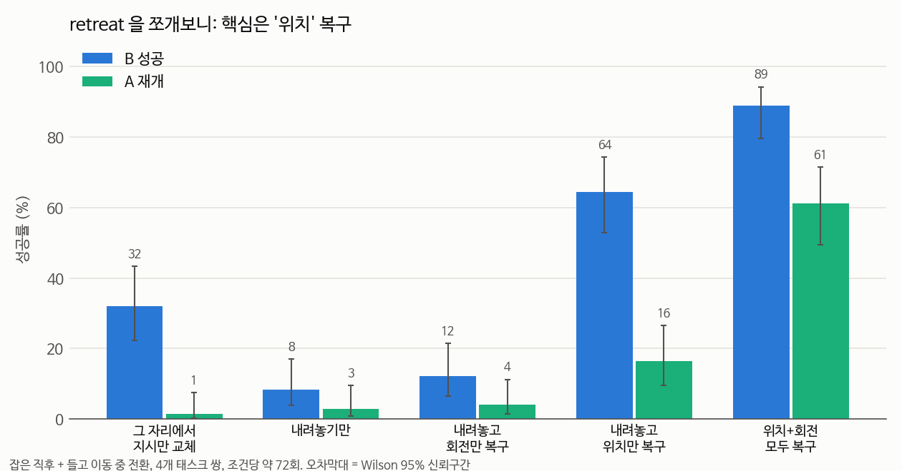

# retreat ablation — 무엇이 효과의 핵심인가 (2026-09-16)

## 📌 쉬운 말 요약

**왜 했나?** 9/14 전환 실험에서 `retreat`(물체 내려놓기 + 초기 자세 복귀)만 성공률이 높았습니다. 그런데 retreat은 여러 동작을 한꺼번에 합니다. **그중 뭐가 진짜 효과를 내는지** 하나씩 빼보며 확인했습니다.

**결과 한 줄**: 핵심은 **위치 복구**입니다. 회전만 복구하면 12%로 효과가 거의 없고, 위치만 복구하면 64%, 둘 다 하면 89%입니다. 그리고 **내려놓기만 하면 오히려 더 나빠집니다** (32% → 8%).

> ⚠️ retreat 계열은 **초기 자세로 되돌리는 스크립트**라 연구 제약([연구주제.md](../../../연구주제.md))상 최종 방법이 될 수 없습니다. 원인을 밝히는 **진단 도구**로만 씁니다.

---

## 비교한 전략

| 전략 | 내려놓기·그리퍼 열기 | 위치 복구 | 회전 복구 |
|---|---|---|---|
| `flush` | ✗ | ✗ | ✗ |
| `release` | ✅ | ✗ | ✗ |
| `ret_rot` | ✅ | ✗ | ✅ |
| `ret_pos` | ✅ | ✅ | ✗ |
| `retreat` | ✅ | ✅ | ✅ |

한 번에 하나씩만 다르게 해서 각 요소의 기여를 봅니다 ([06_실험방법론 6-5](../../../01_공부순서/06_실험방법론.md)).

- 태스크 쌍 4개(8→7, 4→7, 1→5, 2→5) × 전환 시점 2개(잡은 직후, 들고 이동 중) × 10 에피소드
- 새로 돌린 것: `release`, `ret_rot`, `ret_pos` 240 에피소드. `flush`, `retreat` 은 [9/14 결과](../switch_experiment/README.md)를 같은 조건으로 재사용

```bash
./run_ablation_sweep.sh
python analyze.py
```

## 결과



| 전략 | 에피소드 | B 성공 | A 재개 | 둘 다 | 추가 스텝(중앙값) |
|---|---|---|---|---|---|
| flush | 72 | 32% | 1% | 0% | 0 |
| release | 72 | **8%** | 3% | 0% | 41 |
| ret_rot | 74 | **12%** | 4% | 0% | 50 |
| ret_pos | 73 | **64%** | 16% | 5% | 75 |
| retreat | 72 | **89%** | 61% | 56% | 78 |

## 해석

### 1. 위치가 핵심, 회전은 보조

`ret_rot`(12%)은 거의 효과가 없고 `ret_pos`(64%)가 대부분을 설명합니다. 회전까지 더하면 89%로 마저 올라갑니다.

### 2. 9/16 자세 민감도와 모순? → 이탈 크기가 달랐다

9/16에는 **손목 30도가 위치 10cm보다 치명적**이었습니다. 반대처럼 보이지만, 전환 순간 팔이 실제로 얼마나 떨어져 있는지 재보니 설명이 됩니다.

| 전환 시점 | 초기 자세로부터 실제 거리 (중앙값) |
|---|---|
| 접근 중 | 12.1cm |
| 들고 이동 중 | 18.2cm |
| **잡은 직후** | **27.1cm** |

9/16에 측정한 위치 범위는 **최대 10cm**였습니다. 실제 전환 상황은 그 2~3배 멀리 가 있어서, **전환할 때는 위치 이탈이 압도적으로 큰 문제**입니다.

### 3. 내려놓기만 하면 더 나빠진다

`release`(8%) < `flush`(32%). 물체를 놓은 **그 자리, 테이블 근처 낮은 위치**에 팔이 머물러서 오히려 더 낯선 상태가 됩니다.

### 4. 다음 방향에 주는 의미

초기 자세로 되돌리는 건 금지이므로, **모델이 초기 자세에서 12~27cm 떨어진 곳에서도 작동하도록** 학습시켜야 합니다. → [LoRA 1차](../lora_v1/README.md)
