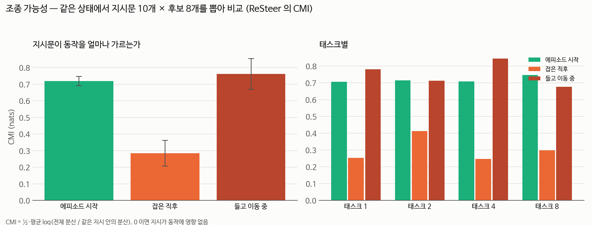

# 물체를 쥐면 지시문이 안 들린다 — 조종 가능성(CMI) 측정 (2026-09-21)

## 📌 쉬운 말 요약

**질문**: 로봇에게 새 지시를 내렸을 때, 그 지시가 **실제로 동작을 바꾸기는 하는가?**

**답**: 평소에는 바꿉니다. 그런데 **물체를 쥔 직후에는 영향력이 61% 떨어집니다.**
들고 움직이기 시작하면 다시 회복됩니다.

> 이것이 **"물체를 잡은 상태에서의 전환"이 유독 어려운 이유**입니다.
> 우리 연구 주제가 정확히 그 지점을 짚고 있었습니다.



---

## 1. CMI 가 무엇인가

**CMI** = Conditional Mutual Information (조건부 상호정보량), 단위는 nats.

> **같은 상태**에서 지시문만 바꿨을 때, 동작이 얼마나 달라지는가

```
같은 장면·같은 팔 자세에서
   지시 "스토브를 켜라"      → 동작 a₁
   지시 "그릇을 접시에 놔라"  → 동작 a₂
   지시 "와인을 선반에 놔라"  → 동작 a₃

   a₁·a₂·a₃ 가 서로 많이 다르다  →  CMI 큼  →  지시문이 잘 먹힌다
   a₁·a₂·a₃ 가 거의 같다        →  CMI 0   →  **무슨 말을 하든 같은 행동**
```

CMI 가 0 이면 지시를 알아들어도 **동작으로 옮기지 못하는** 상태입니다.

> 📚 이 측정 방법은 [ReSteer](../../../02_논문노트/ReSteer.md) (2026-03) 에서 가져왔습니다.

## 2. ⭐ 측정 결과

태스크 1·2·4·8 에서, 조작의 세 시점에 쟀습니다 (각 시점 n=17~20).

| 측정 지점 | CMI (nats) | 자기-타지시 거리 |
|---|---|---|
| 에피소드 시작 (빈손) | **0.719** | 0.934 |
| **물체를 쥔 직후** | **0.284** ← **−61%** | 0.864 |
| 들고 이동 중 | **0.761** | 3.278 |

**네 태스크 모두 같은 패턴입니다.**

| 태스크 | 시작 | 쥔 직후 | 이동 중 |
|---|---|---|---|
| T1 (서랍 열기) | 0.707 | **0.253** | 0.781 |
| T2 (와인→찬장) | 0.715 | **0.414** | 0.713 |
| T4 (그릇→찬장) | 0.708 | **0.247** | 0.844 |
| T8 (그릇→접시) | 0.747 | **0.299** | 0.677 |

```
CMI
0.8 │ ●                                    ●
    │ (시작)                            (이동 중)
0.6 │
0.4 │
    │              ●
0.2 │           (쥔 직후)
    └──────────────────────────────────────────
      빈손        물체를 쥠        들고 이동
```

**쥐는 순간에만 푹 꺼졌다가 회복됩니다.** 한 태스크의 특이점이 아닙니다.

## 3. 행동으로도 같은 방향이 나온다

CMI 가 낮은 시점에 전환하면 실제로 더 못합니다.

| 전환 시점 | CMI | B 성공률 (원본, flush) |
|---|---|---|
| 잡은 직후 | 0.284 (낮음) | **25%** (9/36) |
| 들고 이동 중 | 0.761 (회복) | **39%** (14/36) |

⚠️ 단, 이 행동 차이는 **p=0.156 으로 유의하지 않습니다** (36회씩으로는 부족).
CMI 자체는 직접 측정값이라 이 검정과 별개로 유효합니다.

## 4. ⭐ 이것이 지금까지의 모든 실패를 설명한다

우리는 반년치 실험을 **엉뚱한 곳**에 쓰고 있었습니다.

| 무엇을 고치려 했나 | 결과 |
|---|---|
| 팔 자세 — LoRA 1·2·3차 | 32 → 32 → 31 → 30% (전혀 안 움직임) |
| 생성 노이즈 — 시드 고정 | 처음 보는 쌍에서 **7%** (기준 31%) |
| 생성 노이즈 — CEM 으로 μ 학습 | **−10%p** (p=0.885) |
| 전환 후 회복 — 흔들기 4방향 | 전부 실패 |
| 남은 동작 처리 — flush/keep/blend/rtc | 전부 30%대 |

**전부 "몸"을 고치려 했습니다. 문제는 "귀"에 있었습니다.**

팔이 어디에 있든, 노이즈가 무엇이든, **지시문이 동작에 영향을 못 주면**
새 지시를 따를 방법이 없습니다.

## 5. 그래서 무엇을 하는가 — 지시문 증폭

채널이 약해진 것이 문제라면 **그 채널을 키우면** 됩니다.

```
v = v_B + (w − 1) · (v_B − v_A)

  v_A : 이전 지시 A 로 구한 속도장   ← 음의 조건
  v_B : 새 지시 B 로 구한 속도장     ← 양의 조건
  w=1 이면 원래 정책과 완전히 같다
```

**이전 지시를 음의 조건으로 쓰는 것이 핵심입니다.**
보통의 CFG 는 빈 조건을 쓰는데, 전환 문제에서는 **버려야 할 지시가 무엇인지 알고 있습니다.**

제약 준수: 자세를 건드리지 않고(✅ 초기자세 복귀 없음), 스크립트 동작이 없고(✅ 자연스러움),
학습이 필요 없습니다.

→ 구현·검증은 [일지 5절](../../../03_일지/2026-09-21.md) 참고. ⏳ 평가 진행 중.

## 6. 우리가 새로 채운 자리

[ReSteer](../../../02_논문노트/ReSteer.md) 는 LIBERO-Goal 에서 CMI 를 이렇게 보고했습니다.

| 모델 | CMI |
|---|---|
| π0.5 | 0.403 |
| OpenVLA-OFT | 0.252 |
| MolmoACT | 0.295 |
| **SmolVLA** | **미측정** ← 우리가 채움 (시작 0.719) |

그리고 그 논문은 **에피소드 시작에서만** 쟀습니다.
**조작 단계별로 CMI 가 어떻게 변하는지는 재지 않았습니다** — 이것이 우리 기여입니다.

## 7. 한계

- 태스크 4개, 시점당 17~20 표본입니다. 더 넓혀야 합니다
- 행동과의 연결(25% vs 39%)은 아직 유의하지 않습니다
- "쥔 직후"는 잡고 3스텝 뒤로 정의했습니다. 얼마나 오래 지속되는지는 안 쟀습니다
  → 시간에 따른 CMI 곡선이 다음 과제입니다

## 8. 파일

| 파일 | 내용 |
|---|---|
| `steerability.py` | CMI 측정 |
| `analyze_steer.py` | 표·그래프 |
| `results/steerability.json` | 원자료 |
| `img/steerability.png` | 그래프 |
