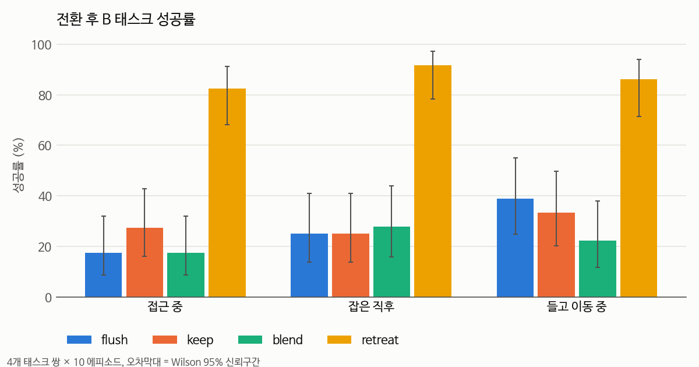
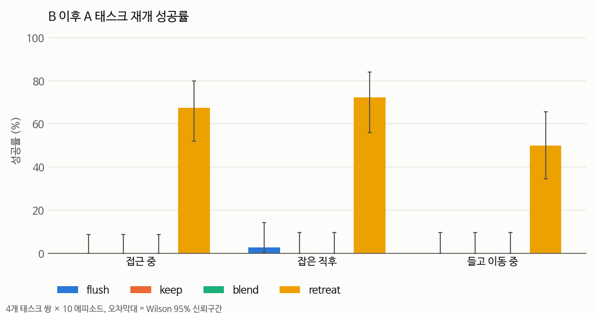
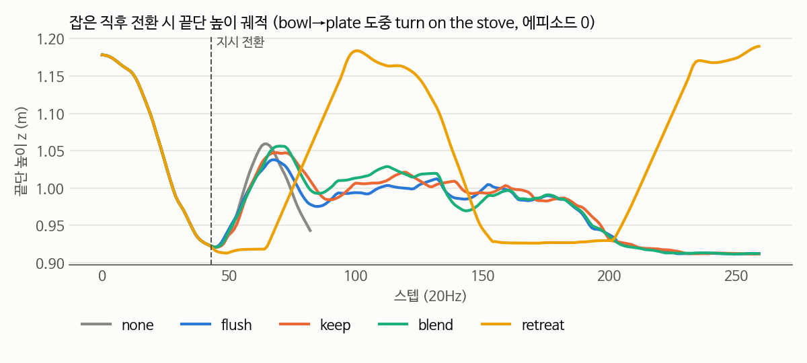
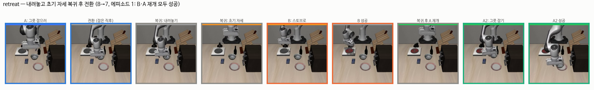
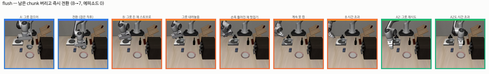
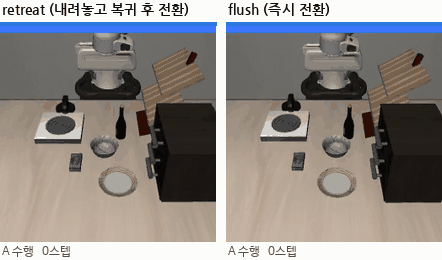
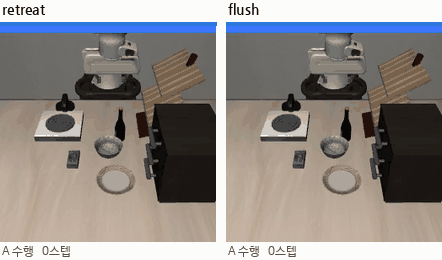

# 첫 태스크 전환 실험 — LIBERO-Goal + SmolVLA (2026-09-14)

## 📌 쉬운 말 요약

**뭘 했나?** 로봇이 태스크 A(예: 그릇을 접시에)를 하던 도중 지시를 B(예: 스토브 켜기)로 바꾸고, B가 끝나면 다시 A를 시켰습니다. 지시를 바꾸는 방법 4가지를 600번 돌려 비교했습니다.

**결과 한 줄**: 남은 chunk를 버리든(flush), 끝까지 쓰든(keep), 섞든(blend) **B 성공률은 20~40%로 거의 같았고**, "물체 내려놓고 처음 자세로 돌아간 뒤 전환(retreat)"만 **82~92%** 로 높았습니다. B 이후 A를 다시 하는 것도 retreat만 됐습니다(50~72% vs 0~3%).

**왜?** 전환 순간 **로봇 자세가 학습 데모의 시작 자세와 달라지면** SmolVLA가 새 지시를 알아듣고도(그쪽으로 가긴 함) 제대로 수행하지 못합니다. chunk 처리 방식보다 **전환 시점의 로봇 상태**가 훨씬 큰 변수였습니다.

---

## 1. 설정

| 항목 | 값 |
|---|---|
| 모델 | `HuggingFaceVLA/smolvla_libero` (chunk 50) |
| 환경 | LIBERO-Goal (10개 태스크가 같은 장면 → 리셋 없이 지시만 교체 가능) |
| B 성공 판정 | B 태스크 BDDL의 goal predicate를 **같은 시뮬레이션**에서 평가 |
| 통제변수 | `n_action_steps=10`, 에피소드 index별 LIBERO 고정 초기상태 + seed(7+ep), 각 단계 최대 300스텝 |
| 태스크 쌍 (A→B) | 8→7 bowl→plate / turn on stove · 4→7 bowl→cabinet top / stove · 1→5 bowl→stove / push plate · 2→5 wine bottle→cabinet top / push plate |
| 전환 시점 | **접근 중**(step 15) · **잡은 직후**(잡기 감지 +3스텝) · **들고 이동 중**(+20스텝) |
| 반복 | 쌍 4 × 시점 3 × 전략 5 × 10 에피소드 = **600 에피소드** |
| 환경 | GTX 1080 Ti (fp32), PyTorch 2.10.0+cu126, LeRobot 0.4.4, hf-libero 0.1.4, MuJoCo 3.8.1, Python 3.10 |

**잡기 감지**: 그리퍼 손가락 qpos < 0.035 이고 끝단 10cm 이내에 물체가 있으면 "잡음".

### 전략 (모두 action chunk 단위 → 로봇 종류와 무관)

| 전략 | 동작 |
|---|---|
| `none` | 전환하지 않음 (같은 시점의 저크·궤적 기준값) |
| `flush` | 남은 chunk 버리고 즉시 새 지시로 재추론 |
| `keep` | 남은 chunk(최대 9스텝)를 다 실행한 뒤 새 지시로 추론 |
| `blend` | 이전 chunk와 새 chunk의 앞 10스텝을 선형 가중평균 |
| `retreat` | 스크립트로 [하강해서 물체 내려놓기 → 그리퍼 열기 → 들어올리기 → 초기 자세(위치+자세) 복귀] 후 flush. (연구주제.md 접근법 4 "전환 안전 판정"의 가장 단순한 형태) |

### 지표

| 지표 | 정의 |
|---|---|
| B 성공 | 전환 후 300스텝 안에 B goal 달성 |
| A 재개 | B 이후 다시 A 지시 → 300스텝 안에 A goal 달성 |
| 둘 다 | 마지막에 A, B goal이 동시에 만족 |
| 반응 시간 | 같은 에피소드의 `none` 궤적과 끝단 위치가 **2cm 이상 벌어지는 첫 스텝** (전환 전까지 두 궤적이 완전히 동일함을 확인 → 공정한 짝 비교) |
| 저크 | LAB03 `jerk_score`, 끝단 위치, 전환 5스텝 전 ~ 45스텝 후, dt=1/20 |
| 낙하 | 전환 후 B 구간에서 그리퍼가 열린 순간 물체 높이 − 15스텝 뒤 높이 > 3cm |
| 실패 유형 | 낙하 → 지시 무시(B 중 A가 완료됨) → 얼어붙음(60스텝 이동 < 3cm) → 시간 초과 순으로 자동 분류 |

---

## 2. 기준 점수 (전환 없음, 태스크별 10 에피소드)

| id | 지시 | 성공률 |
|---|---|---|
| 0 | open the middle drawer of the cabinet | 60% |
| 1 | put the bowl on the stove | 100% |
| 2 | put the wine bottle on top of the cabinet | 80% |
| 3 | open the top drawer and put the bowl inside | 50% |
| 4 | put the bowl on top of the cabinet | 90% |
| 5 | push the plate to the front of the stove | 100% |
| 6 | put the cream cheese in the bowl | 50% |
| 7 | turn on the stove | 100% |
| 8 | put the bowl on the plate | 60% |
| 9 | put the wine bottle on the rack | 50% |
| **평균** | | **74%** |

`n_action_steps=10`, `interrupt_resume.py` (LeRobot `select_action` 사용). 논문 LIBERO-Goal 92%보다 낮음 — LAB05에 적힌 재현 이슈(81~83%)보다도 낮은데, `n_action_steps`가 체크포인트 기본값(1)과 다른 영향일 수 있음 (미확인).

---

## 3. 결과





### 전략 × 전환 시점 (4개 쌍 합산)

| 시점 | 전략 | 잡은 상태 | B 성공 | A 재개 | 둘 다 | 낙하 | 반응(스텝) | 저크 |
|---|---|---|---|---|---|---|---|---|
| 접근 중 | none | 0% | - | - | - | 0% | - | 7.0 |
| 접근 중 | flush | 0% | 18% (7/40) | 0% | 0% | 0% | 4 | 9.0 |
| 접근 중 | keep | 0% | 28% (11/40) | 0% | 0% | 0% | 10 | 8.6 |
| 접근 중 | blend | 0% | 18% (7/40) | 0% | 0% | 0% | 9 | 8.0 |
| 접근 중 | **retreat** | 0% | **82% (33/40)** | **68%** | **55%** | 0% | 3 | 8.0 |
| 잡은 직후 | none | 100% | - | - | - | 0% | - | 7.3 |
| 잡은 직후 | flush | 100% | 25% (9/36) | 3% | 0% | 0% | 8 | 9.0 |
| 잡은 직후 | keep | 100% | 25% (9/36) | 0% | 0% | 3% | 11 | 8.8 |
| 잡은 직후 | blend | 100% | 28% (10/36) | 0% | 0% | 3% | 10 | 8.6 |
| 잡은 직후 | **retreat** | 100% | **92% (33/36)** | **72%** | **67%** | 0% | 6 | **3.4** |
| 들고 이동 중 | none | 95% | - | - | - | 0% | - | 7.9 |
| 들고 이동 중 | flush | 94% | 39% (14/36) | 0% | 0% | 0% | 3 | 10.3 |
| 들고 이동 중 | keep | 94% | 33% (12/36) | 0% | 0% | 0% | 5 | 9.8 |
| 들고 이동 중 | blend | 94% | 22% (8/36) | 0% | 0% | 0% | 6 | 8.2 |
| 들고 이동 중 | **retreat** | 94% | **86% (31/36)** | **50%** | **44%** | 0% | 2.5 | **3.8** |

반응·저크는 중앙값. "잡은 직후/들고 이동 중"의 분모가 36인 이유: wine bottle(2→5)은 잡기 감지(10cm)가 안 된 채 A가 끝난 에피소드가 4개 있어 집계에서 제외.

### 태스크 쌍별 (모든 시점 합산, B 성공 / A 재개)

| 쌍 | flush | keep | blend | retreat |
|---|---|---|---|---|
| 8→7 bowl→plate / stove | 43% / 0% | 47% / 0% | 37% / 0% | 97% / 53% |
| 4→7 bowl→cabinet / stove | 33% / 0% | 40% / 0% | 33% / 0% | 100% / 80% |
| 1→5 bowl→stove / push plate | 17% / 3% | 13% / 0% | 13% / 0% | 73% / 77% |
| 2→5 bottle→cabinet / push plate | 9% / 0% | 9% / 0% | 0% / 0% | 73% / 36% |

### B 실패 유형

| 전략 | B 실패 | 물체 낙하 | 지시 무시 | 얼어붙음 | 시간 초과 |
|---|---|---|---|---|---|
| flush | 82 | 0 | 0 | 0 | 82 |
| keep | 80 | 1 | 0 | 0 | 79 |
| blend | 87 | 1 | 0 | 0 | 86 |
| retreat | 15 | 0 | 0 | 0 | 15 |

영상으로 확인한 실패 모습: 로봇이 **B 대상 쪽으로 가긴 하지만**(지시는 알아들음) 손목이 틀어진 채 손잡이·물체를 계속 헛집다가 시간 초과. 자동 분류가 전부 "시간 초과"로 나온 건 이 때문이며, 더 세밀한 분류(잘못된 자세로 헛시도 등)는 영상 라벨링이 필요.

### 궤적 예시



- flush / keep / blend는 전환 후 궤적이 거의 겹침 → **chunk 처리 방식 차이가 실제 동작에 거의 반영되지 않음**
### 장면 비교 (8→7, 잡은 직후 전환)





flush는 그릇을 든 채 스토브로 가서 내려놓지만, 손목이 틀어진 자세 그대로 손잡이를 계속 헛집습니다.

### 영상 (GIF, 왼쪽 retreat / 오른쪽 flush)



*잡은 직후 전환, 8→7 (bowl→plate 도중 turn on the stove)*



*들고 이동 중 전환, 1→5 (bowl→stove 도중 push the plate). retreat은 B 성공·A 재개 실패, flush는 둘 다 실패한 에피소드*

원본 mp4 (손목 카메라 포함): `results/videos/` — `A8_B7_grasp3_retreat_ep1`(B·A 재개 성공), `A8_B7_grasp3_flush_ep0`(둘 다 실패), `A8_B7_grasp3_retreat_ep0`(B만 성공), `A1_B5_grasp20_{flush,retreat}_ep0`

---|---|
| [retreat 성공](results/videos/A8_B7_grasp3_retreat_ep1.mp4) | 8→7 잡은 직후, B·A 재개 모두 성공 |
| [flush 실패](results/videos/A8_B7_grasp3_flush_ep0.mp4) | 같은 조건, 둘 다 실패 |
| [retreat A 재개 실패](results/videos/A8_B7_grasp3_retreat_ep0.mp4) | B 성공, A 재개 시간 초과 |
| [flush 들고 이동 중](results/videos/A1_B5_grasp20_flush_ep0.mp4) | 1→5, 들고 가는 중 전환 |
| [retreat 들고 이동 중](results/videos/A1_B5_grasp20_retreat_ep0.mp4) | 같은 조건의 retreat |

---

## 4. 확인 실험 (결론이 버그나 설정 탓이 아닌지)

| 확인 | 조건 | 결과 | 해석 |
|---|---|---|---|
| 파이프라인 정상? | flush, **step 1 / step 5** 전환 (8→7, 1→5) | B 성공 **90%·70% / 100%·100%** | 시작 자세 근처에서 바꾸면 B 잘 됨 → 코드 문제 아님 |
| 자세가 원인? | 위와 같은데 **step 15** 전환 | B 성공 20%·40% | 15스텝만 움직여도 급락 → **전환 시 자세**가 핵심 |
| chunk 개루프 탓? | flush, `n_action_steps=1`(매 스텝 재추론), step 15 / 잡은 직후, 8→7·1→5 | B 성공 합계 **25% (10/40)** vs n=10일 때 28% (11/40) | 재추론을 자주 해도 해결 안 됨. 대신 저크는 약 2배(14~27 vs 8~12) |
| A 재개 0%는 버그? | flush, step 5 (B 100% 성공 후 A 재개) | A 재개 0/20 | 영상: 그릇을 잡긴 하나 손목이 틀어진 채 접시 위에서 헤맴 → 실제 현상 |

---

## 5. 알게 된 것

1. **chunk 처리(flush/keep/blend)는 B 성공률에 거의 영향 없음** (신뢰구간이 모두 겹침). LAB03 합성 궤적에서 블렌딩이 저크를 9배 줄였던 것과 달리, 실제 시뮬레이션에서는 blend의 저크 감소가 작음(blend 8.0~8.6 vs flush 9.0~10.3) — OSC 제어기가 이미 동작을 부드럽게 만들고, chunk 끝부분이 원래 크게 튀지 않기 때문으로 추정.
2. **지배적인 변수는 전환 순간의 로봇 상태** (학습 데모 시작 분포와의 거리 = 공변량 이동). 시작 자세로 되돌리면(retreat) B 82~92%, A 재개 50~72%.
3. **"지시 무시"는 거의 없었음.** SmolVLA는 새 지시를 알아듣고 방향은 바꿈. 문제는 *이해*가 아니라 *낯선 자세에서의 수행*.
4. **물체를 잡은 상태가 오히려 더 어렵지 않았음** (flush 기준 접근 중 18% vs 잡은 직후 25%). 연구주제.md의 가정(잡은 직후가 핵심 난이도)과 다름 — 접근 중에도 이미 자세가 틀어져 있기 때문. 단, 이건 LIBERO-Goal + 이 체크포인트 한정.
5. **retreat의 대가**: 전환마다 스크립트 동작 약 67~76스텝(3.3~3.8초) 추가. 다만 B 성공 에피소드 기준 총 스텝은 retreat 67+79 ≈ 146 vs flush 150으로 비슷. 그리고 **초기 자세를 알아야 하는 스크립트**라 "자연스러운 전환"과는 거리가 있음.
6. 반응 시간: retreat 2.5~6 < flush 3~8 < blend 6~10 ≈ keep 5~11 스텝. keep이 가장 느린 건 예상대로(남은 chunk 소진).

## 6. 한계

- 에피소드 10개/조건, 쌍 4개. 쌍별 편차가 큼(1→5 step 15에서 n=1은 90%, n=10은 40%). 전략 간 차이(flush/keep/blend)를 말하려면 반복을 늘려야 함
- 잡은 물체 식별이 "끝단에서 가장 가까운 물체"라 틀릴 수 있음 (1→5에서 cream cheese로 잡힌 경우 15건) → 낙하 판정에 영향
- 낙하·실패 유형은 휴리스틱. 영상 라벨링으로 검증 필요
- GPU 비결정성: 같은 seed여도 재실행 시 결과가 달라질 수 있음 (개발 중 확인). 짝 비교에서 전환 전 궤적은 동일했음

## 7. 다음에 할 것

- [ ] **retreat ablation**: ① 그리퍼만 열기 ② 자세(회전)만 복귀 ③ 위치만 복귀 ④ 물체 들고 복귀 — 무엇이 효과의 핵심인지 (06_실험방법론 6-5)
- [ ] 초기 자세를 모르는 방법: 전환 데모 학습(접근법 3) — retreat 궤적을 교사로 데이터 생성 후 4070 Ti에서 파인튜닝
- [ ] 에피소드 20~50개로 늘려 flush/keep/blend 차이 재확인
- [ ] 영상 보고 실패 유형 수동 라벨링 → 누적 막대그래프
- [ ] 추론 지연(0~1초) 넣고 같은 실험 (저사양 조건)

## 파일

| 파일 | 내용 |
|---|---|
| `switch_experiment.py` | 전환 실험 (전략·시점·지표) |
| `run_switch_sweep.sh` | 600 에피소드 스윕 (3프로세스 병렬, 약 3.5시간) |
| `analyze.py` | 표·CSV·그래프 생성 |
| `interrupt_resume.py` | 기준 점수 측정 + 초기 버전 인터럽트 실험 |
| `results/` | 표(`tables.md`), 에피소드별 CSV, 기준점수 CSV, 그래프, 예시 영상 |

실행:

```bash
python switch_experiment.py --task-a 8 --task-b 7 --switch-at grasp:3 --strategy retreat --episodes 10 --video
```

> 실험 코드 작성과 실행은 Claude Code와 함께 진행했습니다.
