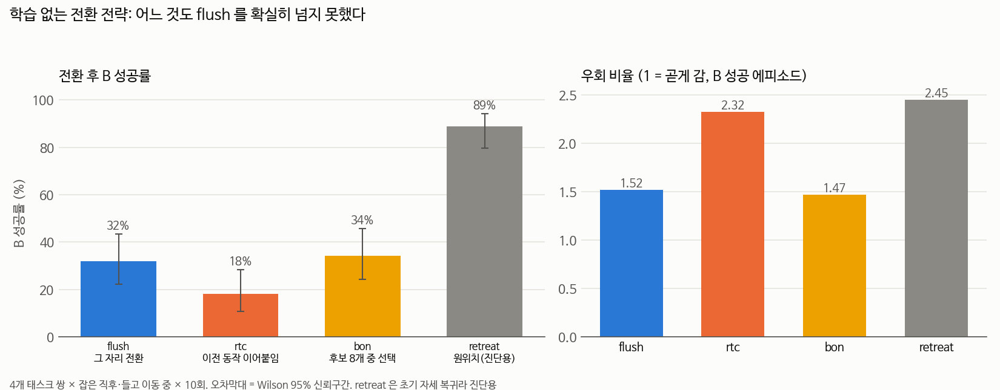

# 학습 없는 전환 전략 — 어디까지 되는가 (2026-09-17)

## 📌 쉬운 말 요약

**질문**: 모델을 다시 학습시키지 않고, **추론할 때 쓰는 방법만 바꿔서** 전환을 잘하게 할 수 있을까?

**답**: **없었습니다.** 논문에서 가져온 방법 세 가지를 모두 구현해 재 봤지만, 가장 단순한 `flush`(남은 동작 버리고 즉시 새 지시) 32% 를 넘는 것이 하나도 없었습니다.

그리고 더 중요한 걸 발견했습니다. **그 자리에서 전환한 경우, 중단한 A 를 다시 해내는 비율이 0% 입니다** (23번 중 0번). 물체를 원래 자리에 되돌린 경우만 62% 였습니다.

---

## 1. 시험한 전략과 근거 논문

| 전략 | 아이디어 | 근거 논문 |
|---|---|---|
| `flush` | 남은 동작 버리고 즉시 새 지시로 | 기준선 |
| `keep` | 남은 동작을 다 쓰고 새 지시로 | 기준선 |
| `blend` | 이전·새 동작의 앞부분을 가중평균 | [RTC](../../../02_논문노트/Real-Time-Chunking.md) 의 단순 근사 |
| **`rtc`** | 새 동작을 **만드는 과정에서** 이전 동작에 맞춰 생성 (inpainting) | [Real-Time Chunking](../../../02_논문노트/Real-Time-Chunking.md) (NeurIPS 2025) |
| **`flush_rtc`** | 전환 순간엔 끊고, 그 뒤부터 RTC | RTC 변형 (우리가 만듦) |
| **`bon`** | 후보 8개를 뽑아 **성공 궤적 근처로 가는** 것을 선택 | [Q-Planning](../../../02_논문노트/Q-Planning.md), [V-GPS](../../../02_논문노트/V-GPS.md), [RoboMonkey](../../../02_논문노트/RoboMonkey.md) |

`bon` 은 원 논문들이 쓰는 **학습된 판정기**를 1080 Ti 에서 돌릴 수 없어서, "성공한 궤적들이 지나간 곳과의 거리"라는 학습 없는 점수로 바꿨습니다.

## 2. 결과 — B 성공률

4개 태스크 쌍(8→7, 4→7, 1→5, 2→5) × 2개 전환 시점 × 10회 = 조건당 72 에피소드, 초기상태 고정.

| 전략 | 잡은 직후 | 들고 이동 중 | 합계 | flush 와 짝 비교 |
|---|---|---|---|---|
| **`flush`** | 25% (9/36) | 39% (14/36) | **32%** (23/72) | 기준 |
| `keep` | 25% (9/36) | 33% (12/36) | 29% (21/72) | 4 : 6, p ≈ 0.75 |
| `blend` | 28% (10/36) | 22% (8/36) | 25% (18/72) | 3 : 8, p ≈ 0.23 |
| `rtc` | 25% (9/36) | **11%** (4/36) | 18% (13/72) | 8 : 18, **p ≈ 0.08** ⬇ |
| `flush_rtc` | 28% (10/36) | **6%** (2/36) | 17% (12/72) | 8 : 19, **p ≈ 0.05** ⬇ |
| `bon` | **41%** (15/37) | 28% (10/36) | 34% (25/73) | 10 : 8, p ≈ 0.82 |

**읽는 법**: 짝 비교는 같은 초기상태끼리 맞대 보는 것입니다. "8 : 18" 은 rtc 만 성공한 게 8번, flush 만 성공한 게 18번이라는 뜻입니다.

- **RTC 계열은 확실히 손해였습니다** (특히 들고 이동 중: 39% → 11%)
- **bon 은 차이가 없었습니다** (p ≈ 0.82). 잡은 직후에는 41% 로 높아 보이지만 들고 이동 중에는 낮아져 상쇄됩니다

## 3. 왜 RTC 가 손해였나

RTC 는 새 동작을 **이전 동작(A 를 하던 방향)에 맞춰** 만듭니다. 같은 지시 안에서는 이게 매끄러움이지만, **지시가 바뀐 순간에는 A 방향으로 계속 끌려갑니다.**

| | flush | rtc |
|---|---|---|
| **지시 무시** (B 도중 A 를 끝내버림) | 0회 | **4회** |
| 저크 (작을수록 부드러움) | 9.6 | **5.9** ✅ |
| 우회 비율 (성공 시, 1=곧게) | 1.52 | **2.32** ⬇ |
| 전환 직후 되돌아감 | 0.2cm | **1.8cm** ⬇ |
| B 소요 스텝 (성공 시) | 154 | 192 |

**교훈: "매끄럽다 ≠ 자연스럽다."** 사람도 일을 바꿀 때는 하던 동작을 **끊고** 방향을 바꿉니다. 저크는 RTC 가 더 낮은데(5.9 vs 9.6) 우회 비율은 더 높습니다 — 부드럽게, 그러나 **틀린 방향으로** 갔다는 뜻입니다.

**`flush_rtc` 로 확인**: 전환 순간엔 끊고 그 뒤부터만 RTC 를 켜니 "지시 무시"는 0회가 됐지만 성공률은 그대로 낮았습니다(17%). **B 를 수행하는 동안에도 RTC 가 방해**가 된다는 뜻입니다.

**전환 없이도 확인**: 태스크 하나만 수행할 때 RTC 를 켜면 90% → 80% 였습니다 (5개 태스크 × 10회, `results/rtc_no_switch.json`). 계속 방향을 조정해야 하는 접시 밀기(태스크 5)에서 7 → 3 으로 가장 크게 떨어졌습니다.

> ⚠️ **나중에 바로잡은 것**: 이 실험은 **추론 지연이 없는 조건**이었습니다. RTC 는 원래 지연에 대응하는 방법이라 불공정했습니다. [지연을 넣고 다시 재 보니 0.5초 지연에서 12% → 28% 로 이득](../latency/README.md)이었습니다. **RTC 는 지연 대응 도구로는 맞고, 전환 도구로는 아니다**가 최종 결론입니다.

## 4. ⭐ 가장 중요한 발견 — A 재개는 0%

B 를 성공한 뒤 **중단했던 A 를 다시 시켜서** 해내는지 측정했습니다.

| 전략 | 물체를 어떻게 했나 | B 성공 | **A 재개 성공** |
|---|---|---|---|
| `flush` | 쥔 채 그 자리에서 전환 | 23 | **0% (0/23)** |
| `keep` | 〃 | 21 | **0% (0/21)** |
| `blend` | 〃 | 18 | **0% (0/18)** |
| `rtc` | 〃 | 13 | 8% (1/13) |
| `bon` | 〃 | 25 | **0% (0/25)** |
| `release` | 그 자리에 놓기만 | 6 | 0% (0/6) |
| `ret_pos` | 놓고 **위치만** 복귀 | 47 | 9% (4/47) |
| `retreat` | 놓고 **완전 복귀** | 64 | **62% (40/64)** |

**이게 우리 연구의 두 번째 목표가 완전히 안 풀렸다는 뜻입니다.**

왜 이런 차이가 나는지 생각해 보면:
- 그 자리에서 전환하면, 쥐고 있던 A 의 물체가 **B 를 하는 동안 어딘가로 밀려나거나 이상한 자세로 놓입니다.** A 를 다시 시켜도 그 상태에서 시작해야 해서 실패합니다
- 되돌려 놓으면 A 의 물체가 **원래 자리에** 있으므로, A 를 처음부터 다시 하는 것과 비슷해집니다
- `ret_pos`(9%) 와 `retreat`(62%) 의 차이가 큰 것도 같은 이유로 보입니다 — 손목 회전까지 되돌려야 물체가 제대로 놓입니다

**그래서 `rollback`(최근 동작 역순으로 되돌려 집었던 자리에 놓기)을 만들어 시험했습니다.**

> ❌ **2026-09-18 결과: 실패했습니다.** B 성공 19%(flush 32%), **A 재개 0/14**.
> 되돌아간 거리가 7.7cm 뿐이라 초기 위치에서 여전히 21cm 떨어져 있었습니다.
> 그리고 [부분적으로 가까워지는 것은 아무 효과가 없다](../recovery/README.md)는 것이 확인됐습니다.
> **A 재개는 여전히 미해결**입니다.

## 5. 자연스러움

| 전략 | 경로 길이(cm) | 우회 비율 | 소요 시간(초) | 멈춤 횟수 | 되돌아감(cm) |
|---|---|---|---|---|---|
| `flush` | 67.3 | **1.52** | 7.7 | 1.0 | 0.2 |
| `keep` | 70.1 | 1.72 | 7.8 | 1.0 | 1.1 |
| `blend` | 70.9 | 1.66 | 8.2 | 1.0 | 0.2 |
| `rtc` | 84.2 | 2.32 | 9.6 | 2.0 | 1.8 |
| `flush_rtc` | 68.3 | 1.82 | 9.7 | 2.0 | 0.0 |
| **`bon`** | **62.3** | **1.47** | 8.2 | 2.0 | 0.0 |

B 에 성공한 에피소드만, 중앙값. `bon` 이 경로가 가장 짧고 곧지만 성공률 차이가 없어서 의미가 약합니다.

## 6. 결론과 다음

| 결론 | 근거 |
|---|---|
| **학습 없이 추론 방법만 바꿔서는 안 된다** | 5가지 전략 모두 flush 32% 를 못 넘음 |
| RTC 는 전환 도구가 아니다 | 32% → 18%, 지시 무시 4회. 단 [지연이 있으면 이득](../latency/README.md) |
| 후보 중 고르기는 점수가 문제였다 | `bon` 은 위치 거리로 골라 실패. [학습한 판정기도 실패](../lora_v2/README.md) (Q−V = 0.0003) |
| **A 재개는 물체를 되돌려야 가능하다** | 그 자리 전환 0%, retreat 62% |

**2026-09-18 후속** — 위 결론들이 어떻게 이어졌는지:

| 여기서의 결론 | 하루 뒤 |
|---|---|
| "후보 중 고르기는 점수가 문제였다" | [오라클](../oracle_bon/README.md): 쉬운 쌍은 상한 100%, 어려운 쌍은 0%. 그리고 **점수가 아니라 [노이즈](../noise_seed/README.md)가 문제**였을 수 있음 |
| "A 재개는 물체를 되돌려야 가능하다" | `rollback` 으로 시험 → ❌ 실패. [부분 이동은 무효](../recovery/README.md) |
| "학습 없이 추론 방법만 바꿔서는 안 된다" | ⚠️ **예외 발견**: [노이즈 시드를 바꾸면](../noise_seed/README.md) 20% ↔ 90% |

## 7. 파일

| 파일 | 내용 |
|---|---|
| `switch_experiment.py` | 실험 본체 (이 시점 사본) |
| `naturalness.py` | 자연스러움 지표 계산 |
| `make_training_free_chart.py` | 그래프 생성 |
| `results/training_free_strategies.png` | 전략 비교 그래프 |
| `results/rtc_no_switch.json` | 전환 없이 RTC 만 켠 결과 |
| `results/naturalness.md` | 자연스러움 표 |
