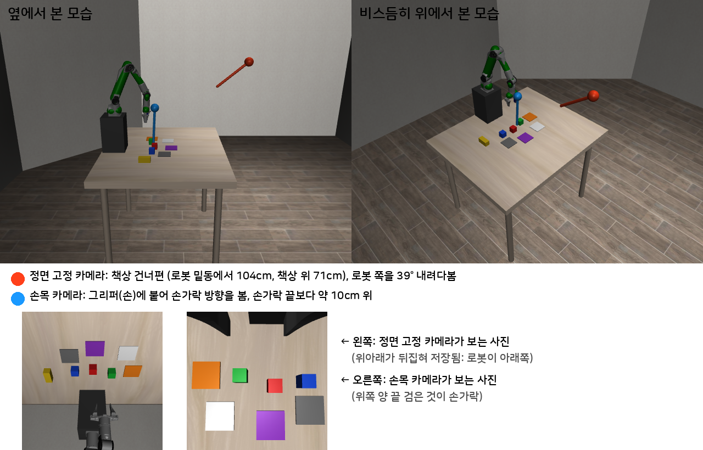

# AgileX PiPER 제원

연구실에 있는 실물 로봇팔이다. 앞으로의 실험 기준 로봇이다 (2026-10-03 결정).

## 구입처와 연결 소프트웨어

| 항목 | 내용 |
|---|---|
| 제조 | AgileX Robotics |
| 연구실 장비 공급 | **WeGo Robotics** (위고 로보틱스) |
| LeRobot 연결 플러그인 | [WeGo-Robotics/lerobot_robot_piper](https://github.com/WeGo-Robotics/lerobot_robot_piper) (Apache-2.0) |
| 설치 | `pip install lerobot_robot_wego_piper` — PyPI의 `lerobot_robot_piper`는 다른 회사 것이라 주의 |
| 요구 사항 | Python 3.10 이상, LeRobot 0.3.0 이상, Linux SocketCAN, CAN-USB 어댑터(gs_usb) |
| 원격 조종 | 리더 팔을 손으로 움직이면 팔로워 팔이 따라 함 (`piper-teleop`) |
| 데이터 기록 | 관절 위치 + USB 카메라 여러 대 (LeRobot 데이터셋) |
| 점검·설정 | `piper-doctor`(설치·CAN·팔 응답 점검), `piper-setup`(팔 이름), `piper-calibrate`(영점), `piper-ui` |
| 안전 | `max_relative_target` 로 한 스텝 관절 이동 제한 |

주의: 이 플러그인은 **관절 각도**로 기록하고 움직인다. 시뮬레이터의 우리 모델은 **손끝 위치·방향 변화량**으로 움직인다. 실물 단계에서 정기구학(관절 → 손끝)과 역기구학(손끝 → 관절) 변환을 넣거나, 관절 각도로 학습하는 방식을 정해야 한다.

## 공식 사양 (판매 페이지)

출처: [Generation Robots PiPER](https://www.generationrobots.com/en/404258-6-axis-robotic-arm-piper.html), [US Robot Store PiPER](https://www.usrobotstore.com/products/piper)

| 항목 | 값 |
|---|---|
| 자유도 | 6 (+ 그리퍼) |
| 가반하중 | 1.5 kg |
| 도달 거리 | 626 mm |
| 무게 | 4.2 kg |
| 반복 정밀도 | ±0.1 mm |
| 전원 | DC 24 V |
| 통신 | CAN (1 Mbps, USB-CAN 어댑터) |
| 재질 | 알루미늄 몸체, 플라스틱 덮개 |
| 제어기 | 팔에 내장 |
| 프로그래밍 | 손으로 끌어 가르치기, 경로 입력, API (piper_sdk), ROS |

## 관절 범위와 크기 (제조사 공식 URDF)

출처: AgileX [Piper_ros](https://github.com/agilexrobotics/Piper_ros) 저장소 `noetic` 브랜치 `src/piper_description/urdf/piper_description.urdf` (2026-10-03 직접 읽음)

| 관절 | 범위 | 비고 |
|---|---|---|
| J1 (밑동 회전) | −150° ~ +150° | |
| J2 (어깨) | 0° ~ +180° | |
| J3 (팔꿈치) | −170° ~ 0° | |
| J4 (손목 회전) | −100° ~ +100° | |
| J5 (손목 굽힘) | −70° ~ +70° | |
| J6 (손 회전) | −120° ~ +120° | |
| 그리퍼 손가락 2개 | 각 0 ~ 35 mm (최대 약 70 mm 벌어짐) | 직선 운동 |

| 마디 | 길이 |
|---|---|
| 밑동 → 어깨 높이 | 123 mm |
| 위팔 (J2 → J3) | 285 mm |
| 아래팔 (J3 → J4·J5) | 약 252 mm |
| 손목 → 손 끝판 (J5 → J6) | 91 mm |
| 손 끝판 → 손가락 | 136 mm |
| URDF 질량 합계 | 4.67 kg |

URDF에 적힌 관절 힘 한계는 100 (그리퍼 10), 속도 한계는 5 rad/s (J6 3 rad/s). 실제 모터 사양과 다를 수 있다.

### 자료마다 다른 값 (주의)

| 출처 | J3 | J4 | J6 |
|---|---|---|---|
| 공식 URDF (`noetic`) | −170° ~ 0° | ±100° | ±120° |
| MuJoCo Menagerie 모델 (`ros-noetic-no-aloha` URDF에서 변환) | −154.5° ~ 0° | ±105° | ±180° |
| roboticscenter.ai 사양표 | −150° ~ +80° | ±175° | ±175° |
| Generation Robots | | | ±170° |

실물에서 쓰기 전에 팔의 펌웨어 한계를 `piper_sdk`로 직접 읽어 확인해야 한다.

## 시뮬레이터 모델

- MuJoCo Menagerie `agilex_piper` (MIT 라이선스, Google DeepMind 관리) — `third_party/mujoco_menagerie/agilex_piper` 에 받아 둠
- 관절 6개 위치 제어 + 손가락 2개 (오른쪽이 왼쪽을 따라감)
- 손끝 기준점: 손 끝판(link6)에서 접근 방향으로 12 cm (손가락 패드 사이)

## LIBERO-Goal 장면에서 손이 닿는지 (2026-10-03 계산)

PiPER 밑동을 책상 위(높이 0.90 m, y=0)에 놓고, 그리퍼가 아래를 보게 해서 역기구학으로 계산했다. 위치 오차 1 cm, 방향 오차 5° 안이면 "닿음".

| 밑동 x 위치 | 닿지 않는 곳 |
|---|---|
| −0.55 m (책상 가장자리 밖) | 거의 다 |
| −0.45 m | 접시 위, 서랍 손잡이, 캐비닛 윗면, 서랍 안, 와인 선반, 스토브 앞 |
| −0.35 m | 접시 위(2 cm 모자람), 서랍 손잡이, 캐비닛 윗면, 서랍 안, 와인 선반 |
| −0.30 m | 와인병 위, 서랍 손잡이, 캐비닛 윗면, 서랍 안, 와인 선반 |

LIBERO의 캐비닛(손잡이·윗면이 책상 위 19~23 cm)과 와인 선반은 PiPER에게 높고 멀다. 그리퍼가 아래를 보려면 손목이 그보다 21 cm 위에 있어야 하는데, 어깨에서 손목까지 최대 약 54 cm(285 + 252 mm)라 모자란다. 그래서 PiPER 장면은 받침대 높이·위치를 바꾸거나 캐비닛·선반을 가깝고 낮게 배치해야 한다. 실물 책상도 같은 배치로 맞춘다.

## PiPER용 LIBERO-Goal 장면 (2026-10-03, 10/4 부터 아래 블록 장면으로 바꿈)

왼쪽은 앞에서 비스듬히 본 모습, 오른쪽은 위에서 본 모습이다(오른쪽 그림에서 로봇은 위쪽, 캐비닛 손잡이가 로봇 쪽을 본다).

물체 다섯 개(그릇, 접시, 와인병, 크림치즈, 스토브)와 과제 10개는 LIBERO-Goal 그대로 두었다. PiPER 손이 닿도록 아래 세 가지만 바꿨다. 정의 파일은 `piper_sim/make_bddl.py`가 만든다.

| 바꾼 것 | LIBERO 원래 | PiPER 장면 | 이유 |
|---|---|---|---|
| 로봇 밑동 | 책상 끝, 책상 높이 | (−0.38, 0), 29cm 받침대 위 | 팔이 짧아(626mm) 책상 높이에서는 캐비닛 위·와인 선반에 닿지 않음 |
| 캐비닛 | (0.03, −0.24), 서랍이 +y(옆)를 봄 | (0.07, −0.23), 서랍이 로봇(−x)을 봄 | 옆을 보는 서랍은 손을 아래로 세워 손가락을 틈에 넣어야 하는데 손 몸통이 캐비닛 윗판에 부딪힘. 로봇 쪽을 보면 손잡이를 앞에서 쥐고 몸 쪽으로 당길 수 있음 |
| 와인 선반 | (−0.26, −0.26), 홈이 −y로 올라감 | (−0.36, −0.42), 180° 돌림 (홈이 로봇 쪽으로 올라감) | 원래 자리는 열린 서랍이 8.8cm에서 선반에 부딪힘. 원래 방향은 병목이 로봇 반대쪽이라 쥔 손목이 로봇 반대편에 있어야 해서 손이 20~40cm 모자람 |

## PiPER 색 블록 장면 (2026-10-04, 지금 쓰는 장면)

위 두 장은 앞에서 비스듬히 본 모습과 위에서 본 모습, 아래 여덟 장은 물체 하나씩이다.
LIBERO-Goal 장면으로 만든 1차 학생 모델이 너무 낮아(평균 단독 13.5%) 사용자 결정으로 바꿨다. 실물로도 똑같이 꾸밀 수 있다(다음 논문대회에서 실물).
정의는 `piper_sim/blocks.py`, 켜는 법은 환경 변수 `PIPER_BLOCKS=1`.

| 물체 (시뮬레이터 안 이름) | 크기 | 기본 자리 (x, y) |
|---|---|---|
| 빨간 블록 (akita_black_bowl_1) | 4.5cm 정육면체 | (−0.09, 0.00) |
| 초록 블록 (cream_cheese_1) | 4.5cm 정육면체 | (−0.09, 0.13) |
| 파란 블록 (blue_block_1) | 4.5cm 정육면체 | (−0.09, −0.13) |
| 노란 막대 (wine_bottle_1) | 9 × 4 × 4cm | (−0.10, −0.26) |
| 보라 판 (plate_1) | 10 × 10cm, 두께 0.5cm | (0.04, 0.00) |
| 회색 판 (gray_pad_1) | 10 × 10cm | (0.04, −0.16) |
| 주황 판 (orange_pad_1) | 10 × 10cm | (−0.13, 0.27) |
| 흰색 판 (white_pad_1) | 10 × 10cm | (0.04, 0.16) |

- 시뮬레이터 안 이름은 예전 이름(그릇·치즈·와인병·접시)을 그대로 써서, 일 바꾸기·돌아오기 코드를 다시 쓴다.
- 장면 번호마다 블록 ±2cm, 판 ±1.5cm 무작위로 놓인다.
- 로봇 밑동(−0.38, 0, 29cm 받침대)과 카메라는 LIBERO-Goal 장면과 같다.
- 실물로 꾸밀 때: [07_물체](../07_물체/README.md) 의 STL 로 출력하거나 같은 크기의 나무 블록에 색칠. 무게 약 36g(블록)·58g(막대).

## 카메라 2대 (학생 모델 입력)

| 카메라 | 시뮬레이터 이름 | 위치 | 방향 | 시야 |
|---|---|---|---|---|
| 정면 고정 | agentview | 책상 건너편: 로봇 밑동에서 앞으로 104cm, 책상 위 약 71cm (바닥 기준 161cm) | 로봇 쪽을 39° 내려다봄 | 45° |
| 손목 | robot0_eye_in_hand | 그리퍼(손)에 붙음, 손가락 끝보다 약 10cm 위 | 손가락 방향 (손이 아래를 보면 책상을 내려다봄) | 75° |

- 정면 사진은 위아래가 뒤집혀 저장된다 (로봇이 화면 아래쪽). 학습과 평가가 같으므로 문제없다.
- 실물에서도 같은 자리에 단다. 10/6 부터 두 사진에서 색·모양으로 블록·판 위치를 찾아 모델 입력에 함께 넣는다 (`objdet.py`).

## 시뮬레이터 제어 방식 (2026-10-03)

학생 모델의 동작은 Panda와 같은 형식이다: 손끝 위치 변화량 3개(×5cm) + 회전 3개(×0.5rad) + 그리퍼 1개.

| 방식 | 내용 | 결과 |
|---|---|---|
| OSC (robosuite 기본) | 손끝 오차를 힘으로 바꿔 관절 토크를 냄 | 가벼운 PiPER에서는 관절 마찰을 못 이겨 목표 2~3cm 앞에서 멈추고, 손목 특이 자세(5번 관절 0°) 근처에서 손이 15cm 벗어남 |
| **역기구학 + 관절 위치 제어** (`piper_sim/ik_controller.py`) | 손끝 목표(지금 손끝 + 변화량) → 역기구학으로 관절 목표 → 관절 PD + 중력 보상 | 목표 세 곳 오차 0.3cm 안, 같은 동작에 3배 빠름 |

실물 PiPER(WeGo 플러그인)는 관절 각도 명령을 받는다. 학생 모델이 낸 손끝 변화량을 실물에서도 같은 역기구학으로 관절 각도로 바꿔 보내면 되므로, 시뮬레이터와 실물의 제어 방식이 같아진다.
