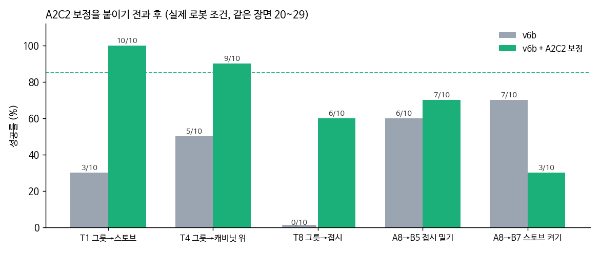
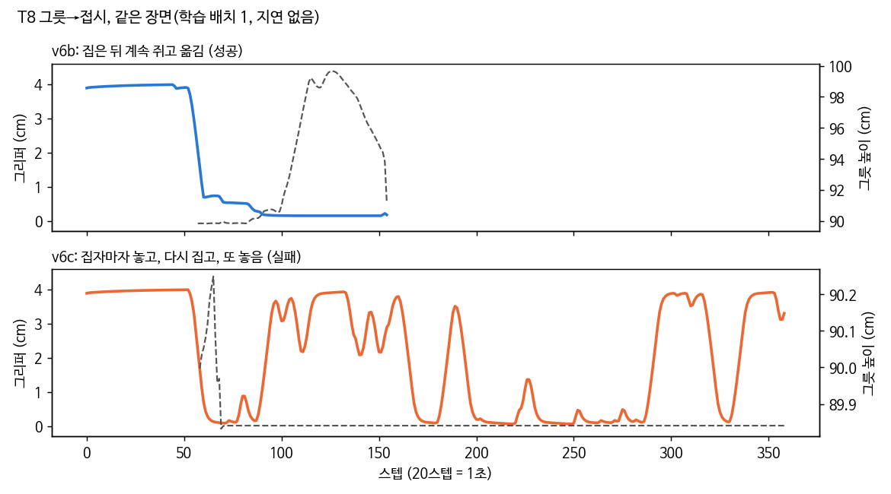
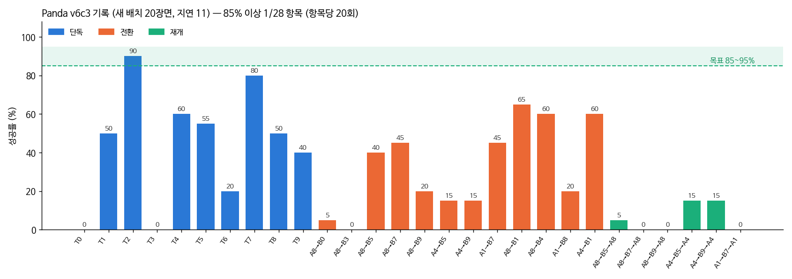

# Panda (LIBERO-Goal) 결과물 — 기록용

> 2026-10-03 사용자 지시: "panda는 끝나는대로 바로 모델 만들어줘 / 이제 piper만 해야해".
> Panda는 **v6c3를 마지막 모델로 기록에 남기고** 더 개선하지 않는다. 이후 개선은 [PiPER](../PiPER/README.md)에만 한다.
>
> 용어: **시범 프로그램** = 시뮬레이터의 정확한 물체 좌표로 팔을 움직여 학습용 시범을 만드는 프로그램(실물에서는 못 씀).
> **학생 모델** = SmolVLA(0.45B). 카메라 2대 + 로봇 상태 + 지시문만 보고 움직인다.

## 한 줄 요약

시범 프로그램은 새 배치 100장면에서 28개 항목 중 27개가 95% 이상이다. 최종 학생 모델 v6c3 는 실제 로봇 조건(추론 지연 0.56초)·새 배치에서 85% 이상 1/28 (T2 와인→캐비닛 위 90%), 평균 단독 44.5% · 전환 32.5% · 재개 6%. 서랍 열기와 재개를 거의 못 하고, 그릇 집기 정밀도가 부족하다.

## 1. 모델 목록

모델 파일은 크기(각 1.2GB) 때문에 GitHub에 올리지 않고 연구실 PC에 있다. 위치: `~/smolVLA/outputs/<모델>_model/merged`

| 모델 | 날짜 | 출발 | 학습 데이터 | 설정 | 상태 |
|---|---|---|---|---|---|
| 원래 SmolVLA | — | `HuggingFaceVLA/smolvla_libero` | LIBERO 사람 시범 | — | 비교 기준 |
| lora_v1~v4 | 9월 | 원래 모델 | 전환 시범 (LoRA) | LoRA | 전환 실험용 |
| lora_v5 | 9/30 | 원래 모델 | 시범 프로그램 + 원래 모델 동작 섞음 | LoRA | 단독 75% → 39% 로 나빠져 버림 |
| v6 | 10/2 01:06 | 원래 모델 | 시범 프로그램만 (정상 1,093 + 전환 2,603) | 동작 전문가 전체 미세조정, 이미지 증강, 24,000스텝 | |
| v6b | 10/2 10:29 | v6 | 같은 데이터, 더 학습 | 같음 | 지연 넣으면 무너짐 (아래) |
| v6c | 10/2 22:55 | v6b | + 지연 조건 DAgger 교정 시범 | + 지연 흉내내기, EMA, 동작 정규화 다시 재기 | **폐기**: 쥔 그릇을 바로 놓는 버릇 (교정 시범 267개 결함) |
| v6c2 | 10/3 07:26 | v6b | 결함 시범 격리 + 새 배치 시범 596 | v6c 와 같음, 프레임 2개마다 1개 | 쉬운 점검 0/5 |
| **v6c3** | 10/3 15:06 | v6b | v6c2 와 같음 | v6c2 에서 동작 정규화 다시 재기만 끔 | **최종 기록 모델** |

## 2. 평가 조건 읽는 법

| 조건 | 뜻 |
|---|---|
| 지연 없음 | 모델 계산이 0초라고 가정 (실제 로봇에서는 불가능) |
| 지연 11스텝 (0.56초) | 연구실 GTX 1080 Ti 에서 한 번 계산에 걸리는 시간. 실제 로봇 조건 |
| 장면 20~49 | LIBERO 고정 시작 배치. ⚠️ 10/2 에 학습 수집 장면(50~139)과 배치가 겹친 것을 발견 — v5·v6·v6b 숫자는 **좋게 나온 값** |
| 장면 1000번대 | 학습에 한 번도 안 쓴 무작위 배치. 10/2 이후 정식 평가 |
| 95% 구간 | 장면 수가 적을 때 실제 성공률이 있을 범위 (Wilson) |

## 3. 학생 모델 결과

### 3-1. 원래 SmolVLA vs v6b (장면 20~29, 각 10번)

| 항목 | 원래 SmolVLA, 지연 없음 | v6b, 지연 없음 (장면 20~49, 30번) | v6b, 지연 0.56초 |
|---|---|---|---|
| T0 가운데 서랍 | 5/10 | 2/30 | 0/10 |
| T1 그릇 → 스토브 | 10/10 | 19/30 | 3/10 |
| T2 와인 → 캐비닛 위 | 8/10 | 30/30 | 0/10 |
| T3 위 서랍 + 그릇 | 8/10 | 1/30 | 0/10 |
| T4 그릇 → 캐비닛 위 | 9/10 | 15/30 | 5/10 |
| T5 접시 밀기 | 6/10 | — | 6/10 |
| T6 치즈 → 그릇 | 7/10 | — | 2/10 |
| T7 스토브 켜기 | 10/10 | — | 4/10 |
| T8 그릇 → 접시 | 7/10 | — | 0/10 |
| T9 와인 → 선반 | 5/10 | — | 0/10 |
| 전환 12쌍 (B 성공) | 0~10/10 | A8→B0·A8→B3 0/30 | 0~7/10 |
| 재개 6개 | 0~5/10 | — | 0~1/10 |

v6b 지연 0.56초 전체 성적표: 
→ 85% 넘는 항목 0 / 28. 지연이 생기면 모델이 계산하는 동안 이전 계획을 그대로 실행해 정밀한 동작(서랍 손잡이, 그릇 테두리)을 놓친다.

### 3-2. 매 스텝 보정 네트워크(A2C2) 시험 — v6b, 지연 0.56초, 장면 20~29

| 항목 | v6b | v6b + A2C2 |
|---|---|---|
| T1 그릇 → 스토브 | 3/10 | 10/10 |
| T4 그릇 → 캐비닛 위 | 5/10 | 9/10 |
| T8 그릇 → 접시 | 0/10 | 6/10 |
| A8→B5 | 6/10 | 7/10 |
| A8→B7 | 7/10 | 3/10 |

보정이 그릇 집기 정밀도를 크게 올린다(단, 장면 20~29는 학습 배치와 겹친 값).

### 3-3. v6c 실패 (폐기)

DAgger 교정 시범 중 267개가 "쥔 그릇을 바로 놓고 다시 집는" 동작이었고, v6c 는 그릇을 집자마자 놓는 버릇을 배웠다. 새 배치 10장면, 지연 0.56초: T0 0/10, T3 0/10, T8 1/10, A8→B3 0/10, A8→B7 4/10.

### 3-4. v6c2·v6c3 쉬운 점검 (그릇 → 접시, 학습 배치 5장면)

| 모델 | 지연 없음, 앞부분 없이 | 실제 배치 조건 (지연 11 + 앞부분 제공) |
|---|---|---|
| v6b | 3/5 | — |
| v6c2 | 0/5 | — |
| v6c3 | 0/5 | **2/5** |

- **헛잡는 방식:** 둘 다 그릇 테두리보다 2~3cm 높은 곳(95.9~97cm)에서 그리퍼를 닫아 빈손으로 접시까지 갔다.
- **'정규화 다시 재기' 가설은 틀림:** 처음에는 이 옵션을 원인으로 보고 v6c3 에서 껐지만, v6c3 도 0/5 였다.
- **점검 조건이 학습과 달랐음:** 이 모델들은 '앞부분 동작이 주어진 상태'로 학습했다(지연 흉내내기). 쉬운 점검은 그 앞부분 없이 쟀기 때문에 0/5 가 나왔고, 실제 배치 조건으로 재면 2/5 다.

### 3-5. v6c3 최종 기록 — 새 배치 1000~1019, 지연 0.56초, 각 20번 (10/3 20:53 끝)

| 항목 | 성공 | 항목 | 성공 |
|---|---|---|---|
| T0 가운데 서랍 | 0/20 | A8→B0 | 1/20 |
| T1 그릇 → 스토브 | 10/20 | A8→B3 | 0/20 |
| T2 와인 → 캐비닛 위 | **18/20 (90%)** | A8→B5 | 8/20 |
| T3 위 서랍 + 그릇 | 0/20 | A8→B7 | 9/20 |
| T4 그릇 → 캐비닛 위 | 12/20 | A8→B9 | 4/20 |
| T5 접시 밀기 | 11/20 | A4→B5 | 3/20 |
| T6 치즈 → 그릇 | 4/20 | A4→B9 | 3/20 |
| T7 스토브 켜기 | 16/20 (80%) | A1→B7 | 9/20 |
| T8 그릇 → 접시 | 10/20 | A8→B1 | 13/20 |
| T9 와인 → 선반 | 8/20 | A8→B4 | 12/20 |
| 재개 A8→B5→A8 | 1/20 | A1→B8 | 4/20 |
| 재개 A8→B7→A8 | 0/20 | A4→B1 | 12/20 |
| 재개 A8→B9→A8 | 0/20 | | |
| 재개 A4→B5→A4 | 3/20 | | |
| 재개 A4→B9→A4 | 3/20 | | |
| 재개 A1→B7→A1 | 0/20 | | |

전체 표(95% 구간 포함): [score_v6c3_heldout.md](score_v6c3_heldout.md)

| 묶음 | v6b (지연 0.56초, 장면 20~29, 학습 배치와 겹침) | **v6c3 (지연 0.56초, 새 배치)** |
|---|---|---|
| 단독 10개 평균 | 20% | **44.5%** |
| 전환 12쌍 평균 | 29% | **32.5%** |
| 재개 6개 평균 | 3% | **6%** |
| 85% 이상 | 0 / 28 | **1 / 28** (T2 90%) |

v6c3 는 더 어려운 새 배치에서도 v6b 보다 단독이 두 배 넘게 좋아졌다(지연 흉내내기·지연 조건 교정 시범의 효과로 본다. 같은 장면에서 비교한 것이 아니라 추정이다). 그러나 서랍(T0·T3, A8→B0·B3)과 재개는 거의 못 한다.

## 4. 시범 프로그램 결과 — 새 배치 1000~1099, 각 100번

| 항목 | 성공 | 항목 | 성공 |
|---|---|---|---|
| T0 가운데 서랍 | 100 | A8→B0 | 100 |
| T1 그릇 → 스토브 | 100 | A8→B3 | **94** |
| T2 와인 → 캐비닛 위 | 100 | A8→B5 (재개) | 99 (99) |
| T3 위 서랍 + 그릇 | 96 | A8→B7 (재개) | 100 (98) |
| T4 그릇 → 캐비닛 위 | 100 | A8→B9 (재개) | 100 (100) |
| T5 접시 밀기 | 99 | A4→B5 (재개) | 99 (99) |
| T6 치즈 → 그릇 | 99 | A4→B9 (재개) | 100 (100) |
| T7 스토브 켜기 | 100 | A1→B7 (재개) | 100 (98) |
| T8 그릇 → 접시 | 100 | A8→B1, A8→B4, A1→B8, A4→B1 | 각 100 |
| T9 와인 → 선반 | 100 | | |

28개 중 27개 95% 이상. 학생 모델이 배울 '천장'은 충분히 높다.

## 5. 남은 문제와 PiPER 에 가져간 것

| Panda 에서 배운 것 | PiPER 에 적용 |
|---|---|
| 지연 흉내내기로 학습한 모델은 반드시 실제 배치 조건으로 잰다 | PiPER 쉬운 점검·평가 모두 지연 11 + 앞부분 제공 |
| 교정 시범에 결함(쥔 물체 놓기)이 섞이면 버릇이 된다 | 교정 시범 저장 전 검사 유지 |
| 시범에 오래 멈춘 구간이 있으면 맴돌기를 배운다 | PiPER 시범에서 12프레임 넘게 멈춘 구간 잘라 냄 |
| 그릇 집기 정밀도가 가장 약하다 | A2C2 보정을 라운드마다 학습 |
| 평가 장면이 학습 배치와 겹치면 숫자가 부풀려진다 | 평가는 1000번대, 학습·교정은 2000번대만 |
