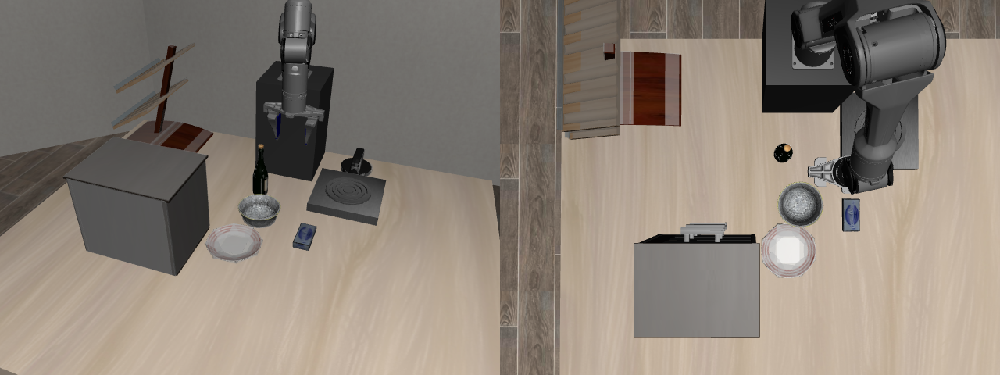
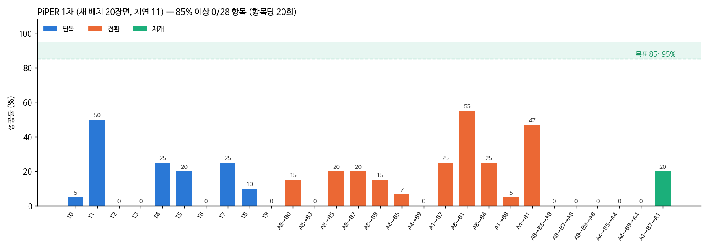

# PiPER (WeGo Robotics 공급, AgileX) 결과물 — 본 실험

> 10/3 부터 PiPER 만 개선한다. 목표: 28개 항목 각각 95% 이상(할 수 있으면 100%), 실제 로봇 조건(지연 0.56초), 학습에 안 쓴 새 배치.
> 장면·제어 방식은 [05_로봇팔_제원/PiPER.md](../../05_로봇팔_제원/PiPER.md).
> **10/4 부터 본 실험은 색 블록 장면 (0절).** 아래 1~3절은 LIBERO-Goal 물체 장면 기록이다.

## 0. 색 블록 장면 (10/4~, 본 실험)

색 블록 4개(빨강·초록·파랑 4.5cm 정육면체, 노란 막대 9×4×4cm)와 색 판 4개(10cm)만 있다. 과제는 모두 "X 블록을 Y 위에".
이유와 과제 목록: [10/4 일지 2절](../../03_일지/2026-10-04.md)

### 시범 프로그램 결과

| 항목 | 학습용 장면 2000~2019 | 새 장면 1000~1019 |
|---|---|---|
| 혼자 하는 과제 10개 | 과제마다 20/20 | 과제마다 **20/20 (200/200)** |
| 일 바꾸기 12쌍 | 쌍마다 10/10 | 재는 중 |
| 원래 일로 돌아오기 6개 | 10/10 | 재는 중 |

### 학생 모델

| 모델 | 출발 | 데이터 | 상태 |
|---|---|---|---|
| piper_b1 | piper_s2 마지막 저장본 | 블록 정상 1,000 + 일 바꾸기·돌아오기 12쌍 × 50장면 | 수집 끝나면 자동 학습 (10/4 저녁) |
| piper_b0n (비교용) | 같음 | 블록 정상 1,000 만 | b1 뒤에 학습 — "그냥 지시만 바꾸면" 비교 |
| piper_b2 | piper_b1 | + 2차 수집(정상 1,000, 12쌍 × 50) + b1 이 못 하는 항목 교정 시범 | 자동 예약 |

## 평가 기준

| 항목 | 값 |
|---|---|
| 장면 | 학습에 안 쓴 무작위 배치 1000번대 (학습·교정 시범은 2000번대만) |
| 추론 지연 | 11스텝 = 0.56초 (연구실 GTX 1080 Ti), 지연 동안 앞 계획 실행 + 그 앞부분을 넣고 계산 (지연 흉내내기) |
| 시간 제한 | 단계(A, B, 재개)마다 600스텝 = 30초. 가장 긴 시범 프로그램(T3, 최대 558스텝)보다 조금 넉넉하게 |
| 전환 규칙 | 전환 뒤 손이 처음 자세 7cm 안에 들어가면 실패 |
| 95% 판정 | 최종은 100장면 중 95번 이상 |

## 1. 시범 프로그램 결과 (새 배치)

| 항목 | 결과 | 항목 | 결과 |
|---|---|---|---|
| T0 가운데 서랍 | 20/20 | A8→B0 | 10/10 |
| T1 그릇 → 스토브 | 20/20 | A8→B3 | 10/10 |
| T2 와인 → 캐비닛 위 | 20/20 | A8→B5 (재개) | 10/10 (10/10) |
| T3 위 서랍 + 그릇 | 20/20 | A8→B7 (재개) | 10/10 (10/10) |
| T4 그릇 → 캐비닛 위 | 20/20 | A8→B9 (재개) | 10/10 (10/10) |
| T5 접시 밀기 | 20/20 | A4→B5 (재개) | 10/10 (10/10) |
| T6 치즈 → 그릇 | 20/20 | A4→B9 (재개) | 10/10 (10/10) |
| T7 스토브 켜기 | 20/20 | A1→B7 (재개) | 10/10 (10/10) |
| T8 그릇 → 접시 | 20/20 | A8→B1, A8→B4, A1→B8 | 각 10/10 |
| T9 와인 → 선반 | 20/20 | A4→B1 | 9/10 → 실패 장면 고침 |

## 2. 학습 데이터

| 데이터 | 개수 | 장면 |
|---|---|---|
| 정상 수행 1차 | 596 | 2000~2059 |
| 전환·재개 1차 | 843 파일 | 2000~2029 |
| 오래 멈춘 구간 잘라 냄 | 프레임 16% | — |
| 2차 수집 (고친 시범 프로그램) | 수집 중 | 2060~2099, 2030~2059 |

## 3. 학생 모델

| 모델 | 출발 | 학습 데이터 | 상태 |
|---|---|---|---|
| piper_s1 | Panda v6b | 1차 시범 (정상 596 + 전환·재개 843), 오래 멈춘 구간 잘라 냄, 20,000스텝 | 아래 성적 |
| piper_s2 | piper_s1 | 그릇을 깊게 쥐는 새 시범(정상 395 + 전환·재개 1,498) + 그릇 없는 예전 시범 597 + 교정 시범 | 10/4 04:08 교정 시범 수집 중 → 학습 |

### piper_s1 — 새 배치 1000~1019, 지연 0.56초, 각 20번 (10/4 04:06)

| 묶음 | 평균 | 가장 잘한 것 |
|---|---|---|
| 단독 10개 | 13.5% | T1 그릇→스토브 50% |
| 전환 12쌍 | 19.5% | A8→B1 55%, A4→B1 47% |
| 재개 6개 | 3.3% | A1→B7→A1 20% |
| 85% 이상 | 0 / 28 | |

전체 표: [score_s1_heldout.md](score_s1_heldout.md)

왜 낮은가 (궤적을 보고 찾은 것)

| 실패 | 원인 | 고친 것 |
|---|---|---|
| 그릇 테두리를 놓침 | 손을 0.7cm 높게(95.6cm) 오므림. 시범이 테두리 끝 0.2cm 만 걸쳐 쥐어 여유가 없었다 | 시범이 1.2cm 깊게 쥐도록 → 1.2cm 높게 오므려도 6/6 잡힘. 그릇 시범을 다시 모음 |
| 서랍 손잡이를 놓침 | 손이 손잡이에서 3~6cm 빗나간 곳에서 오므림 | 교정 시범(학생이 빗나간 자리에서 시범 프로그램이 이어 받음), A2C2 보정 |
| 와인·치즈 0% | 측정 후 확인 예정 | |
