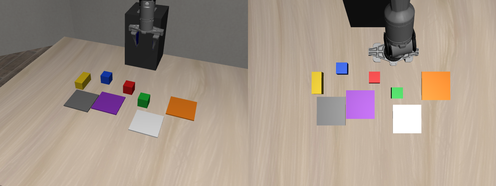
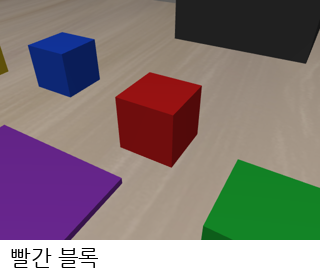
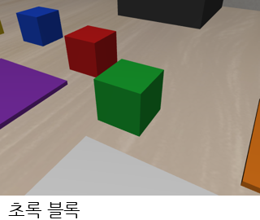
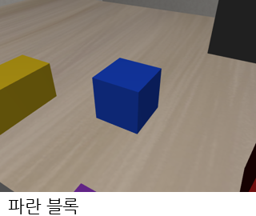
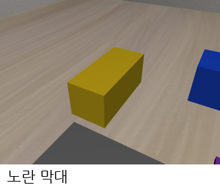
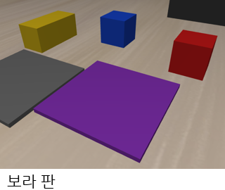
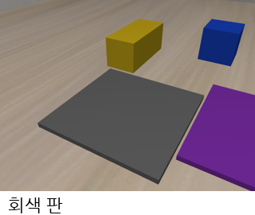
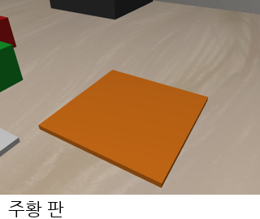
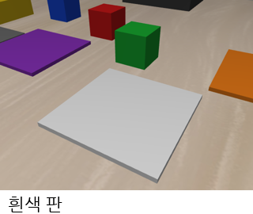

# 물체 — 색 블록 장면 (2026-10-04~)

PiPER 본 실험에서 쓰는 물체 8개. 시뮬레이터(이번 논문대회)와 실물(다음 논문대회)을 똑같이 꾸미려고 단순한 사각형만 쓴다.
바꾼 이유는 [10/4 일지 2절](../03_일지/2026-10-04.md): 잡을 곳이 넓고, 색으로 위치를 찾기 쉽고, 실물로 똑같이 만들 수 있다.

## 물체 8개

| 사진 | 이름 | 크기 (mm) | 색 (RGB) | 시뮬레이터 안 이름 | 기본 자리 x, y (m) | STL |
|---|---|---|---|---|---|---|
|  | 빨간 블록 | 45 × 45 × 45 | #D91A1A | akita_black_bowl_1 | −0.09, 0.00 | [cube_45mm.stl](stl/cube_45mm.stl) |
|  | 초록 블록 | 45 × 45 × 45 | #1AB333 | cream_cheese_1 | −0.09, 0.13 | [cube_45mm.stl](stl/cube_45mm.stl) |
|  | 파란 블록 | 45 × 45 × 45 | #1A4DE6 | blue_block_1 | −0.09, −0.13 | [cube_45mm.stl](stl/cube_45mm.stl) |
|  | 노란 막대 | 90 × 40 × 40 | #F2CC1A | wine_bottle_1 | −0.10, −0.26 | [bar_90x40x40mm.stl](stl/bar_90x40x40mm.stl) |
|  | 보라 판 | 100 × 100 × 5 | #8C33BF | plate_1 | 0.04, 0.00 | [pad_100x100x5mm.stl](stl/pad_100x100x5mm.stl) |
|  | 회색 판 | 100 × 100 × 5 | #737373 | gray_pad_1 | 0.04, −0.16 | [pad_100x100x5mm.stl](stl/pad_100x100x5mm.stl) |
|  | 주황 판 | 100 × 100 × 5 | #F2801A | orange_pad_1 | −0.13, 0.27 | [pad_100x100x5mm.stl](stl/pad_100x100x5mm.stl) |
|  | 흰색 판 | 100 × 100 × 5 | #F2F2F2 | white_pad_1 | 0.04, 0.16 | [pad_100x100x5mm.stl](stl/pad_100x100x5mm.stl) |

- 자리는 로봇 밑동이 (−0.38, 0) 인 책상 좌표다. 장면 번호마다 블록 ±2cm, 판 ±1.5cm 무작위로 놓인다.
- 시뮬레이터 안 이름은 LIBERO-Goal 의 예전 이름(그릇·치즈·와인병·접시)을 그대로 써서 일 바꾸기·돌아오기 코드를 다시 쓴다.

## 과제 10개

| 번호 | 지시 (영어 지시문) |
|---|---|
| T0 | 파란 블록을 흰색 판 위에 (put the blue block on the white square) |
| T1 | 빨간 블록을 주황 판 위에 (put the red block on the orange square) |
| T2 | 노란 막대를 보라 판 위에 (put the yellow block on the purple square) |
| T3 | 빨간 블록을 파란 블록 위에 (put the red block on the blue block) |
| T4 | 빨간 블록을 회색 판 위에 (put the red block on the gray square) |
| T5 | 초록 블록을 흰색 판 위에 (put the green block on the white square) |
| T6 | 초록 블록을 빨간 블록 위에 (put the green block on the red block) |
| T7 | 노란 막대를 흰색 판 위에 (put the yellow block on the white square) |
| T8 | 빨간 블록을 보라 판 위에 (put the red block on the purple square) |
| T9 | 초록 블록을 파란 블록 위에 (put the green block on the blue block) |

성공 판정: 옮긴 블록이 목표(판 또는 블록) 위에 닿아 있고, 가운데끼리 수평 거리가 3cm 안.

## 폴더

| 폴더 | 내용 |
|---|---|
| [stl/](stl/README.md) | 3D 프린터용 STL (mm). 출력 설정·무게 안내 |
| sim/ | 시뮬레이터(MuJoCo) 물체 정의. 원점은 바닥 가운데, 마찰 1.0, 블록 밀도 400kg/m³(정육면체 약 36g, 막대 약 58g) |
| img/ | 시뮬레이터에서 찍은 사진 |

장면을 만드는 코드: [04_실습/05_libero/코드/piper_sim/blocks.py](../04_실습/05_libero/코드/piper_sim/blocks.py) (켜는 법 `PIPER_BLOCKS=1`)
