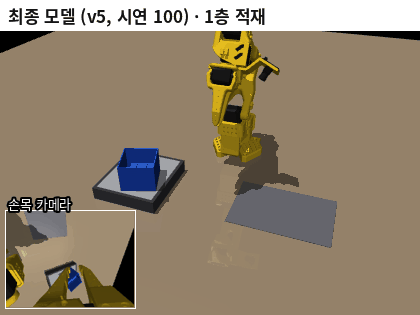

# 08 개인 논문 — YOLOv8 무게 인식 + ACT 순차 적재

> 캡스톤(스마트팩토리 비전 검사) 결과를 학술대회 논문으로 마무리하는 폴더입니다.
> 이 저장소의 본 연구(SmolVLA 태스크 전환)와는 **별개**이며, 다른 폴더의 파일은 건드리지 않습니다.

## 한눈에

| 항목 | 내용 |
|---|---|
| 논문 | YOLOv8 7-segment 무게 인식과 ACT 모방학습을 결합한 스마트 팩토리 분류·적재 시스템 (가제) |
| 학회 양식 | 대한전자공학회 학술대회 2단 양식 (`논문양식.docx`) |
| 저자 | 이지용, 김한민, 정철훈, 장민기, 고병철 (계명대학교 컴퓨터공학전공) |
| 마감 목표 | **2026-10-10** |
| 실제 시스템 | 컨베이어 색 분류 → 저울 위 파란 통 → 7-segment 무게 인식(YOLOv8) → 118g 이상이면 SO-101 이 통을 1층 → 옆 → 2층 순서로 적재 |
| 연산 장치 | **Jetson Orin Nano** (ACT 는 PC 에서 학습 → 체크포인트만 Orin Nano 로 옮겨 실행) |
| 문제 | 실제 로봇팔이 파손되고 ACT 실측 결과가 남아 있지 않음 |
| 해결 | 실제와 같은 SO-101(손목 카메라 모델)·저울·분류 통을 MuJoCo 로 만들고, **ACT 정량 평가를 시뮬레이션으로 다시 수행** |

## 원칙

- 측정하지 않은 수치는 논문에 쓰지 않는다. 시뮬레이션 수치는 시뮬레이션이라고 밝힌다.
- 7-segment 수치(FPS 59.5, 정분류율 91.7% 등)는 팀이 실측한 초안 값을 그대로 쓴다.
- 수치를 적을 때는 측정 조건(장치, 시행 횟수, 시드)을 함께 적는다.
- 개인정보(전화번호 등)가 든 원본 HWP 는 올리지 않는다.

## 폴더

| 폴더 | 내용 |
|---|---|
| [일지/](일지/) | 날짜별 진행 기록 |
| [기록/](기록/) | 초안 검토, 실제 시스템 정리, 시뮬레이션 설계, 실험 계획 |
| [코드/](코드/) | 시뮬레이션·시연 생성·ACT 학습·평가 코드 사본 |
| [결과/](결과/) | 수치(JSON), 그림, GIF |
| [논문/](논문/) | 최종 원고 |

## 최종 모델 적재 장면 (시뮬레이션)

단계마다 시연 100번으로 학습한 ACT 정책이 1층 → 옆 → 2층으로 연속 적재한다. 왼쪽 아래 작은 창은 정책이 보는 손목 카메라 화면이다. 200회 평가에서 연속 성공률은 **99.0%** (95% CI 96.4–99.7%)이고, 집기에 실패해 통이 저울에 남으면 같은 단계를 다시 실행하게 하면 **200/200 = 100%** 다.

## 진행 상황

- [x] 원본 HWP 초안 찾기·변환·검토 (10/6)
- [x] 실제 시스템 코드(포트폴리오 저장소) 분석, 사용자 확인 사항 정리 (10/6)
- [x] MuJoCo SO-101 분류 통 적재 환경 + 스크립트 전문가 (연속 3단계 20/20) (10/6)
- [x] 단계별 시연 200개 생성, 팀 조건(시연 100) 재현 학습·평가 — v1 76/84/50%, 연속 28% (10/7)
- [x] 집기 오차 분석 → 파지 여유 9mm 시연(v2) — n100 90/88/72%, 연속 62% (10/7)
- [x] 남은 실패 분석 → 전문가가 잡는 벽을 바꾸는 구간(통 +7.5° 이상)에 실패 24/25 몰림 → 늘 같은 벽을 잡는 v4 시연 (전문가 108/108) (10/7)
- [x] v4 n100: 100 / 100 / 86%, 연속 82% → 2층 실패는 놓은 뒤 빠질 때 기울어짐 → v5 (물러났다가 올라가기) (10/7)
- [x] **v5 n100: 단계별 100 / 100 / 100%, 연속 96% (200회 평가: 99.0%, 95% CI 96.4–99.7) — 목표 95% 달성** (10/7)
- [x] v5 n200 / 500 / 1000: 연속 92 / 98 / 94% — 시연 100 에서 이미 포화 (10/8)
- [x] 무작위화(v6): 연속 98%, 환경 변화 15조건 평균 98% (무작위화 없이 89%). CLAHE 를 더하면 오히려 95% (체크무늬 책상 80→32%) → CLAHE 제외 (10/8)
- [ ] v8 (옆 단계 간격 확보) 최종 모델, v7 (넓은 무작위화), DART, 카메라 비교
- [ ] 2×2 두 층 팔레타이징 (2×3 은 팔 도달 범위 밖이라 불가, 이유는 10/7 일지)
- [x] 7-segment 부분 정리 (실측 YOLO 지표·FPS·거리 정확도 반영)
- [ ] 원고 결과 문단·그림 4 완성 (양식 5쪽)
- [ ] 최종 점검

## 일지

시연 설계 버전(v1·v2·v3·v4·v5)이 각각 무엇인지는 [2026-10-07 일지의 "시연 설계 버전 정리"](일지/2026-10-07.md#시연-설계-버전-정리-v1--v2--v3--v4--v5) 에 그림과 함께 정리했다.

| 날짜 | 요약 |
|---|---|
| [2026-10-08](일지/2026-10-08.md) | 시연 수 포화(n100~1000 연속 92~98%), 무작위화 v6 연속 98%·견고성 평균 98%, **CLAHE 는 오히려 손해 → 제외**, 2×2 두 층 팔레타이징 (진행 중) |
| [2026-10-07](일지/2026-10-07.md) | 시연 설계를 고쳐 연속 28%(v1) → 62%(v2) → 82%(v4) → **96%(v5), 200회 평가 99.0% — 목표 달성**. 기존 모델 견고성 16조건(책상 어두우면 0~30%), 저울 재시도 +16%p, 무작위화·CLAHE 학습 시작 |
| [2026-10-06](일지/2026-10-06.md) | 초안·코드 분석, 시뮬레이션 셀(통 벽 잡기, 전문가 20/20), 시연 200개, n100 학습 시작, 메모리 사고 대책 (사진·GIF 포함) |
