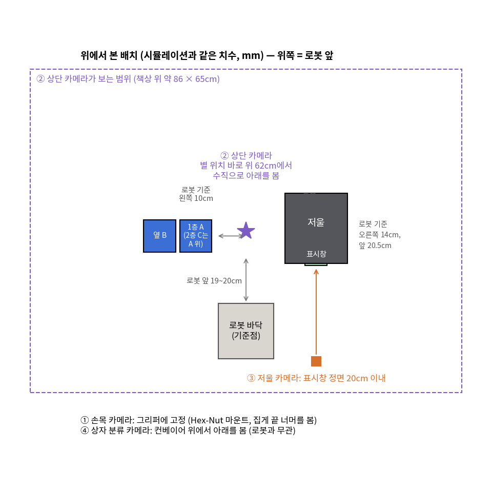
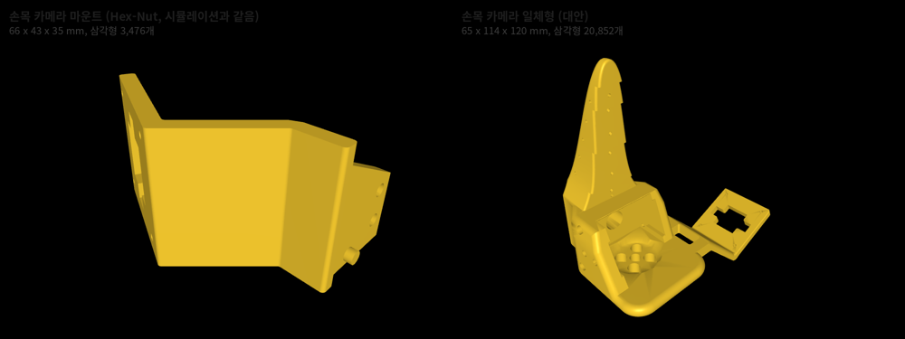
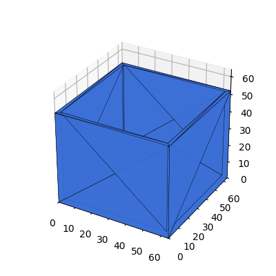

# 물체 — 로봇팔·실험 물체 STL 모음

나중에 SO-101 로봇팔을 다시 구매하거나 출력해서 실물 실험을 할 때 필요한 3D 프린팅 파일 모음.

| 폴더 | 내용 | 출처 |
|---|---|---|
| [로봇팔_SO101/](로봇팔_SO101/) | SO-101 팔로워·리더 팔 부품, 출력 정확도 게이지 | TheRobotStudio/SO-ARM100 공식 저장소 (Apache-2.0) |
| [카메라_마운트/](카메라_마운트/) | **손목 카메라·상단 카메라 거치대** (이 연구는 카메라 2개 사용) | 같은 공식 저장소 (Apache-2.0) |
| [실험물체/](실험물체/) | 적재 실험의 분류 통, 큐브 (시뮬레이션과 같은 크기) | 이 연구에서 생성 (`act_sim/make_object_stl.py`) |

## 1. 로봇팔 SO-101 (`로봇팔_SO101/`)

**키트를 살 경우**: 출력된 부품이 포함된 키트(Seeed Studio, WowRobo 등, [README_원본.md](로봇팔_SO101/README_원본.md) 의 Kits)를 사면 팔 부품은 출력할 필요가 없고, **[카메라_마운트/](카메라_마운트/)와 실험물체만** 출력하면 된다.

**직접 출력할 경우** (공식 권장: PLA+, 노즐 0.4mm·층 0.2mm, 채움 15%, 서포트 사용):

| | 파일 | 용도 |
|---|---|---|
| ① 한 판에 모은 파일 | `STL/SO101/Follower/Prusa_Follower_SO101.stl` · `BambuLabA1mini_Follower_SO101.stl` | **팔로워(로봇) 팔** 전체 부품, 프린터 판 크기에 맞춰 배치됨 |
| | `STL/SO101/Leader/Prusa_Leader_SO101.stl` · `BambuLabA1mini_Leader_SO101.stl` | **리더(조종) 팔** 전체 부품 — 사람 시연(원격조작)을 하려면 필요 |
| ② 부품별 파일 `STL/SO101/Individual/` | 공통: Base, Base_motor_holder, Motor_holder_Base, Motor_holder_Wrist, Under_arm, Upper_arm, Rotation_Pitch, Wrist_Roll_Pitch, WaveShare(또는 Seeedstudio)_Mounting_Plate | 팔로워·리더 둘 다 1세트씩 |
| | 팔로워 전용: Moving_Jaw, Wrist_Roll_Follower | 그리퍼 |
| | 리더 전용: Handle, Trigger, Wrist_Roll | 손잡이 |
| ③ 게이지 `STL/Gauges/` | Gauge_0 · Gauge_tight_1 (서보 기준), Lego 시험편 | 본 출력 전에 프린터 치수 정확도 확인 |

- 조립 순서·배선은 [LeRobot SO-101 문서](https://huggingface.co/docs/lerobot/so101) 참고.

**모터·전자부품 (공식 README 기준, 출력물 아님)**

| 부품 | 팔로워 1대 | 리더 1대 |
|---|---|---|
| STS3215 서보 7.4V | 1/345 기어(C001) × 6 | C046(1/147) × 3, C044(1/191) × 2, C001(1/345) × 1 |
| 모터 제어 보드 (Waveshare) | 1 | 1 |
| 전원 5V (12V 서보를 쓰면 12V 5A 이상), USB-C 케이블, 책상 고정 클램프 | 1 | 1 |

## 2. 카메라 마운트 (`카메라_마운트/`)

캡스톤 셀의 카메라는 4대였지만 (팀 메모 `로봇팔.txt`, 논문 2.1절), **ACT 적재 연구에 필요한 것은 ①②③ 3대** (④ 는 선택):

| # | 카메라 | 연결 | 하는 일 | 거치대 |
|---|---|---|---|---|
| ① | **손목 카메라** (front) | 로봇 PC/Jetson | ACT 입력 — 그리퍼 앞 통을 봄 | 이 폴더 `1_` (또는 `2_`) |
| ② | **상단(오버헤드) 카메라** (top) | 로봇 PC/Jetson | ACT 입력 — 저울·적재 자리 전체를 위에서 봄 | 이 폴더 `3_` |
| ③ | **저울 카메라** (USB, 640×480) | Jetson | 저울 7-segment 숫자 판독 → 118g 판정 | 공식 STL 없음 — 저울 표시창을 정면에서 찍도록 소형 삼각대·클램프로 고정 |
| ④ | 상자 분류 카메라 (USB) — **선택** | Jetson | YOLOv8n-seg 로 큰 상자 / 작은 상자 구분 (캡스톤 셀의 별도 기능) | **ACT 적재 연구에는 불필요.** 전체 셀을 그대로 재현할 때만 |

- ①② 는 ACT 가 학습 때 본 시점과 같아야 하므로 **위치를 바꾸지 않게 단단히 고정** (시뮬레이션: 상단 ±12mm·손목 ±3mm 이내는 괜찮았음)
- ③④ 는 YOLO 용이라 위치 자유도가 크지만, 저울 카메라는 숫자가 화면에 크게 잡히는 거리(중거리 정확도 90% 측정 조건)를 유지

**어디에 두나 — 시뮬레이션과 같은 배치** (로봇 바닥 중심이 기준점, 앞 = 로봇이 바라보는 쪽)

| 카메라·물체 | 위치 | 방향 |
|---|---|---|
| ① 손목 카메라 | 그리퍼(손목)에 Hex-Nut 마운트로 고정 | 집게 끝 약 4cm 너머를 봄 (화각 78°) |
| ② 상단 카메라 | 로봇 앞 **20cm**, 좌우 가운데, 책상에서 **62cm 높이** | **수직으로 아래** (화각 55°, 책상 위 약 86 × 65cm 가 보임 — 저울·적재 자리·팔이 모두 들어옴) |
| 저울 | 로봇 앞 20.5cm, **오른쪽 14cm** (저울 크기 140 × 124mm) | 표시창이 로봇 쪽 |
| 적재 자리 | 1층 A: 앞 19cm·**왼쪽 10cm** / 옆 B: 앞 19cm·왼쪽 17.2cm (A 와 8mm 간격) / 2층 C: A 바로 위 | — |
| ③ 저울 카메라 | 표시창 **정면 20cm 이내** (근거리 정확도 95%; 30~50cm 는 90%, 50cm 넘으면 80%) | 표시창과 수직 |
| ④ 상자 분류 카메라 (선택) | 컨베이어 위 | 아래를 봄 |

- ②의 높이·위치가 바뀌면 화면 속 크기가 달라지므로 **한 번 정한 뒤 움직이지 않게** 고정한다. 공식 거치대(이 폴더 `3_`, 부품 길이 231·163·182mm)는 로봇 바닥판에 끼워 고정되지만 조립 높이·각도가 시뮬레이션(62cm, 수직)과 정확히 같지는 않다 → 시뮬레이션과 똑같이 하려면 책상 클램프형 카메라 암으로 62cm 수직에 맞추고, 실물 시연을 새로 녹화할 거라면 공식 거치대로도 충분하다 (시연과 시험을 같은 위치로만 유지)
- 저울·적재 자리는 팔이 닿는 범위(로봇에서 약 19~29cm) 안에 있어야 한다

아래 거치대 STL 은 ①② 용. 32×32mm USB 카메라 모듈(720p·30fps 이상) 기준.

| 폴더 | 파일 | 설명 |
|---|---|---|
| **`1_손목_HexNut_시뮬레이션과_같음/`** (추천) | `SO-ARM101_camera_wrist_mount.stl` (+ `.step`) | 시뮬레이션의 카메라 버전 로봇(`so101_new_calib_camera.xml`)에 달린 것과 **같은 파일** (바이트 단위 일치 확인). 손목의 육각 너트 홈에 끼워 고정. 채움 40%·트리 서포트 권장, M2 나사 4 + **M3×8mm 나사 2 + M3 육각 너트 2** 필요 |
| `2_손목_일체형_대안/` | `Wrist_Cam_Mount_32x32_UVC_Module_SO101.stl` | 팔로워의 Wrist_Roll_Follower 부품을 **통째로 바꾸는** 일체형. 나사 추가 없음. 시뮬레이션과 카메라 위치가 조금 다름 |
| `3_상단_오버헤드/` | `arm_base`, `cam_mount_bottom/middle/top` (4개) | 로봇 바닥판에 세우는 **상단 카메라** 거치대 |

- 왼쪽이 시뮬레이션과 같은 Hex-Nut 마운트, 오른쪽이 일체형. 조립 방법은 각 폴더의 `README_원본.md`.
- 팀이 썼던 카메라 모델명은 기록이 없다. 다른 카메라(RealSense D405/D435, 일반 웹캠)용 마운트는 [공식 저장소 Optional/](https://github.com/TheRobotStudio/SO-ARM100/tree/main/Optional) 에 있다.

## 3. 실험 물체 (`실험물체/`)

시뮬레이션(`act_sim/stack_env.py`)과 **같은 크기**로 만든 파일. 단위 mm, 닫힌(watertight) 메시로 검사함.

| 파일 | 크기 | 용도 |
|---|---|---|
| `bin_64x64x52mm_wall2mm.stl` | 바깥 64 × 64 × 52mm, 벽·바닥 두께 2mm, 윗면 열림 | 분류 통 (저울 위 → 1층 / 옆 / 2층 적재). **파란색 PLA** 로 출력 (색은 판정 기준이라 바꾸지 않음) |
| `cube_18mm.stl` | 18 × 18 × 18mm | 컨베이어가 통에 떨어뜨리는 큐브 |

- 통 무게: 시뮬레이션은 33g. 꽉 채워 출력하면 약 41g(PLA)이므로 채움 비율로 맞추거나, 실제 무게를 재서 큐브 수로 **118g 기준**을 맞춘다 (시뮬레이션: 통 33g + 큐브 10g × 9개 = 123g).
- 2층 적재는 위 통이 아래 통의 2mm 벽 위에 얹히므로, 벽 윗면이 평평하게 나오도록 출력 방향은 **바닥이 아래**로 둔다.
- 저울은 구매품(디지털 저울, 7-segment 표시), 컨베이어는 MakerWorld 의 *Automatic Color Sorting Conveyor* (Brian3D) — 라이선스상 파일을 여기 다시 올리지 않고 원본에서 받는다.

## 4. 구매 목록 (2026-10-09 판매 페이지 기준 — 주문 전 재고·구성 다시 확인)

**실제 로봇으로 모방학습을 하려면 리더(사람이 조종) + 팔로워(로봇) 2대가 모두 필요** (사람 시연 녹화).

| # | 품목 | 추천 제품 | 수량 | 참고 가격 | 비고 |
|---|---|---|---|---|---|
| 1 | **로봇팔 (리더 + 팔로워)** | **Seeed Studio SO-ARM101 Pro Unassembled Bundle** — Pro 서보 키트 + 3D 프린팅 부품 + USB 카메라(100°, 720p) | 1 | $309.80 | 조립 필요. Pro = 리더 7.4V(기어 C001·C044·C046 혼합), 팔로워 **12V 고토크(30kg·cm)** 서보. 주문 전 리더·팔로워 2대분인지 확인 |
| 1' | (대안) 직접 출력 | SO-ARM101 Pro Servo Motor Kit + `로봇팔_SO101/` STL 출력 | 1 | — | 3D 프린터가 있으면. 키트에 프린팅 부품·카메라는 없음 |
| 2 | 전원 | 팔로워 **12V 5A 이상** 어댑터, 리더 **5V** 어댑터 | 각 1 | — | 키트에 전원 케이블만 들어 있을 수 있음 |
| 3 | **손목 카메라** | **innomaker 1080P USB2.0 UVC Camera, 130° 광각** (Amazon B0CNCSFQC1) | 1 | — | 공식 손목 마운트 추천품 (32×32mm 모듈) |
| 4 | **상단 카메라** | **InnoMaker 720P USB 2.0 UVC Camera, 120° DFOV** (Amazon B0CLRJZG8D) | 1 | — | 공식 상단(오버헤드) 거치대 추천품 (32×32mm 모듈) |
| 5 | 저울 카메라 | USB 웹캠 640×480 이상, **20cm 에서 초점** (자동초점 권장) | 1 | — | 캡스톤 때 쓰던 것 재사용 가능 |
| 6 | 디지털 저울 | 7-segment 숫자 표시, 0.1~1g 단위 | 1 | — | 캡스톤 저울 재사용 가능 |
| 7 | 나사 | M3×8mm 2개 + M3 육각 너트 2개 | — | — | Hex-Nut 손목 마운트용 (M2 나사는 서보에 동봉) |
| 8 | 책상 클램프 | 로봇 바닥 고정용 2개 | 1세트 | — | 공식 부품표 포함 |
| 9 | 출력 재료 | PLA+ (팔·마운트), **파란색 PLA** (분류 통) | — | — | 통 색은 바꾸지 않음 |

- **카메라 화각 참고**: 공식 추천 카메라(130°, 120°)는 시뮬레이션 카메라(손목 세로 78° ≈ 대각 95°, 상단 세로 55° ≈ 대각 70°)보다 넓다. 실물 시연을 새로 녹화해 학습할 것이므로 공식 추천품으로 충분하고, 시뮬레이션 화면과 똑같이 맞추려면 같은 32×32mm 규격에서 화각이 좁은 렌즈를 고른다.
- 번들에 들어 있는 USB 카메라(100°, 720p)가 32×32mm 공식 마운트에 맞는지는 판매 페이지에 없음 → 맞으면 손목 카메라로 쓰고 3번을 생략.
- 출처: [Seeed SO-ARM101 Pro Unassembled Bundle](https://www.seeedstudio.com/SO-ARM101-Pro-Unassembled-Bundle.html), [Seeed SO-ARM101 Pro 조립 완제품($299, 1대)](https://www.seeedstudio.com/SO-ARM-101-Assembled-Kit-Pro-p-6691.html), [Seeed LeRobot 위키](https://wiki.seeedstudio.com/lerobot_so100m_new/), 공식 마운트 README(`카메라_마운트/*/README_원본.md`)

## 출처·라이선스

- `로봇팔_SO101/`, `카메라_마운트/` : [TheRobotStudio/SO-ARM100](https://github.com/TheRobotStudio/SO-ARM100) 커밋 `a758567` (2026-10-09 받음) 의 일부 그대로. **Apache License 2.0** — [LICENSE](로봇팔_SO101/LICENSE) 원문 동봉. 큰 조립 확인용 파일(`SO101 Assembly.stl`, 38MB)과 Ender 용 판 파일은 용량 때문에 제외 (원본 저장소에서 받을 수 있음).
- `실험물체/` : 이 연구에서 생성. 다시 만들려면 `python make_object_stl.py --out 실험물체` (act_sim).
