# 2026-10-06 초안 분석, 시뮬레이션 셀, 시연 데이터, 학습 시작

> 한 줄 요약: 멈춰 있던 하계학술대회 초안과 캡스톤 코드를 분석했고, 실제 로봇이 파손되어 ACT 정량 평가를 MuJoCo 로 다시 하기로 했다. 실제와 같은 SO-101(손목 카메라)·저울·분류 통 셀과 통 벽을 집는 스크립트 전문가를 만들고(연속 3단계 20/20), 단계별 시연 200개를 모아 ACT 학습(n100)을 시작했다. 메모리 사고 두 번을 겪고 작업을 별도 서비스·JPEG 메모리 묶음 방식으로 바꿨다.

## 오늘 결과 한눈에

| 무엇을 봤나 | 결과 |
|---|---|
| 원본 초안 | HWP 5.x, 리눅스에서 안 열림 → ODT 변환. 3.4절(ACT) 수치 없음, 장 번호·인용 오류 등 10건 ([기록/01](../기록/01_원본초안_검토.md)) |
| 실제 시스템 | LeRobot 0.3.3 ACT, SO-101, MCP TCP 트리거(8765), Jetson Orin Nano ([기록/02](../기록/02_실제시스템.md)) |
| 시뮬레이션 셀 | MuJoCo SO-101 손목 카메라 모델 + 저울 + 분류 통(123g), 통 벽 잡기 ([기록/03](../기록/03_시뮬레이션_설계.md)) |
| 전문가(스크립트 시연자) | 연속 3단계 **20/20**, 평균 위치 오차 2.1~2.4mm |
| 시연 데이터 | 단계별 **200개** 완료 (전문가 성공률 98.5 / 94.3 / 96.6%) |
| ACT 학습 | n100 진행 중, 4000스텝에서 손실 6.4 → 0.42 |
| 2×2 2층 (8개) | 전문가 7/8 단계까지 성공 → 원래 실험 뒤에 하기로 |

## 측정한 수치

| 항목 | 값 | 조건 |
|---|---|---|
| 전문가 연속 3단계 성공 | 20/20 | 시뮬레이션, 저울 위 통 ±2cm·±20°, 먼저 쌓인 통 ±8mm·±5° |
| 전문가 평균 위치 오차 (1층/옆/2층) | 2.2 / 2.4 / 2.1mm | 같은 20회 |
| 시연 생성 성공률 (1층/옆/2층) | 98.5% (200/203) / 94.3% (200/212) / 96.6% (200/207) | 실패 시연은 버림 |
| 시연 평균 위치 오차 (1층/옆/2층) | 2.12 / 2.48 / 2.23mm | 시연 200개 |
| 시연 생성 시간 (1층/옆/2층) | 22 / 24 / 30분 | 3개 동시, CPU |
| 시연 데이터 크기 | HDF5 1.6GB → JPEG 묶음 0.49~0.52GB | 단계별 200개 × 270스텝 × 카메라 2대 |
| ACT 파라미터 | 51.6M | LeRobot 0.3.3 기본 설정 |
| ACT 학습 속도 | 단독 10.5 / 3개 동시 4.0~4.6 스텝/초 | GTX 1080 Ti, 배치 8, 160×120 영상 2개 (이전 HDF5·공유 상태는 약 3) |
| n100 손실 (2000 → 4000스텝) | 1단계 1.099 → 0.421, 2단계 1.108 → 0.429, 3단계 1.098 → 0.423 | 시작 손실 약 6.4 |
| DART 시연 성공률 | σ=0.01: 47% (20/43) → σ=0.005: 90% (90/100) | 1층 |
| 2×2 2층 전문가 | 1~7번째 성공, 8번째 실패 (2회 모두) | 위치 오차 0.1~6.2mm |
| 메모리 (큐 v4) | 큐 5.3GB (상한 6GB), 압박 0, 시스템 8.7 / 32GB | 학습 3개 각 1.8GB + 생성 0.56GB |
| YOLO 숫자 모델 (실측) | mAP50 86.3%, mAP50-95 65.6%, 정밀도 85.4%, 재현율 80.8% | 팀 체크포인트 `number.pt` 의 검증 기록 |
| YOLO 상자 모델 (실측) | mAP50 99.5%, mAP50-95 96.5% | 팀 체크포인트 `box.pt` |

## 그림으로 보기

### 연구 전체 흐름

실제 시스템(위)과 이번 논문의 시뮬레이션 평가(아래). 사람 시연자만 스크립트로 바뀌고 ACT 학습·평가 조건은 같다.

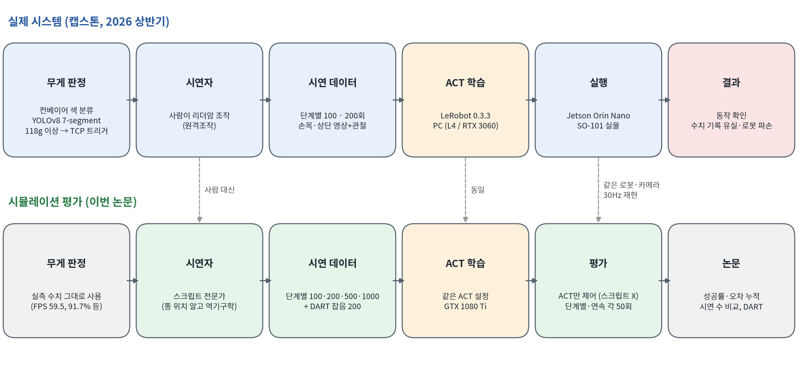

### 시스템 구성 · 7-segment 인식 파이프라인 (논문 그림 1, 2)

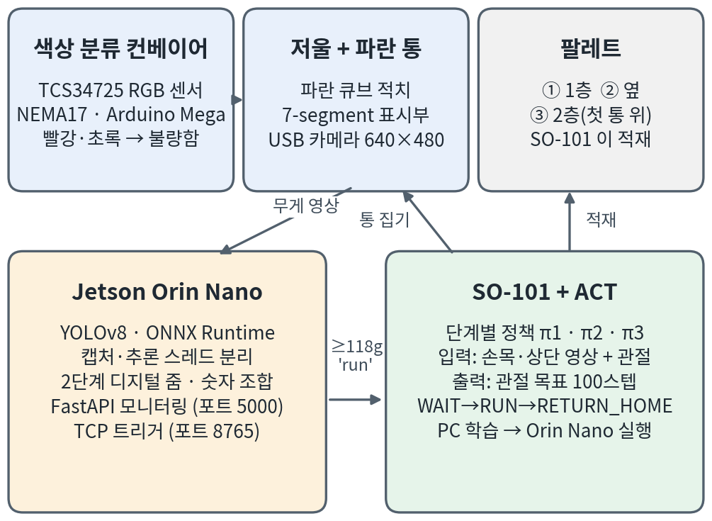 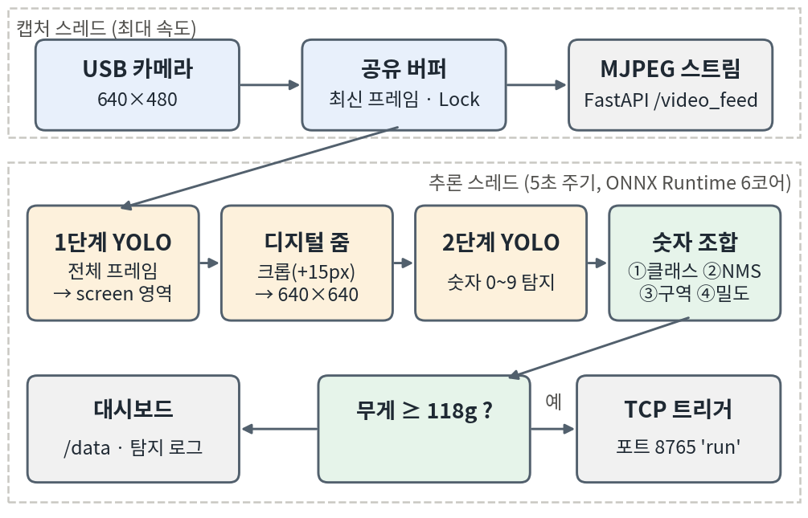

### 시뮬레이션 셀 (논문 그림 3)

(a) 전체 (b) 손목 카메라 (c) 상단 카메라 — ACT 는 (b)(c) 영상과 관절값만 본다.

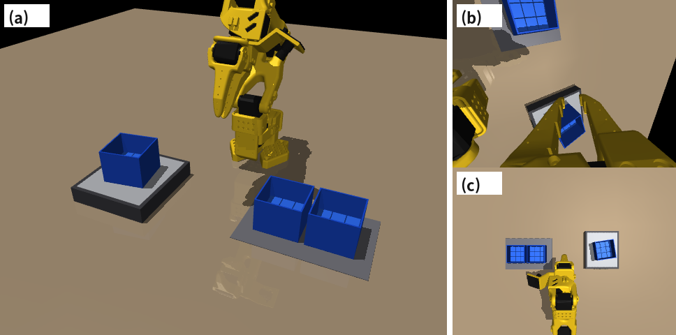

### 적재 과정 (스크립트 시연)

저울 위 통 A → 1층 → 옆(통 B) → 2층(통 C, A 위). 마지막 칸은 다른 각도.

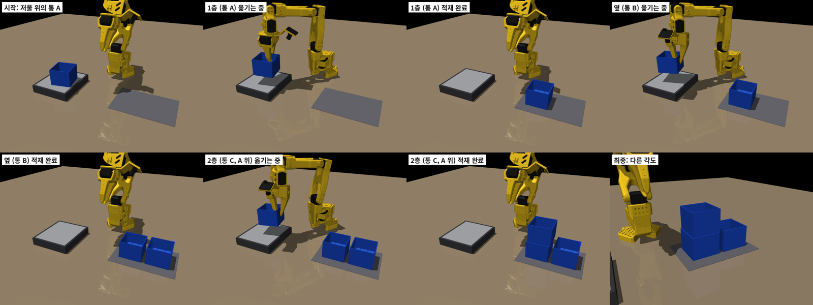

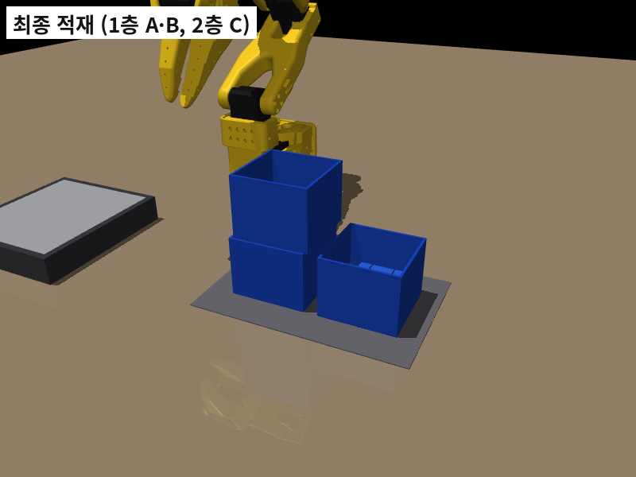 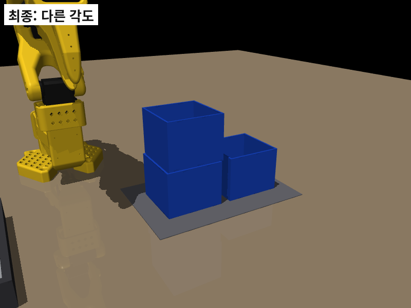

연속 3단계 GIF (왼쪽 전체, 오른쪽 위 손목·아래 상단 카메라):

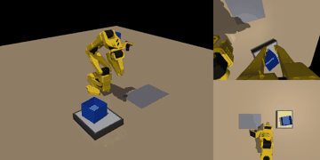

### ACT 가 학습하는 시연 화면 (손목 front | 상단 top)

| 단계 | 대표 프레임 | 시연 GIF |
|---|---|---|
| 1층 | 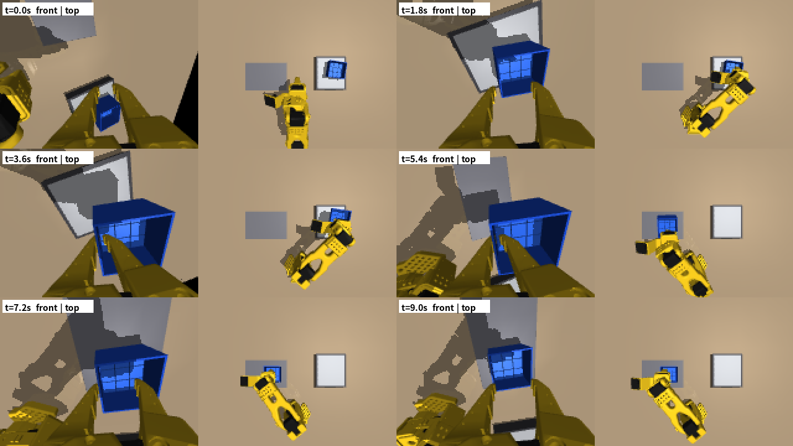 | 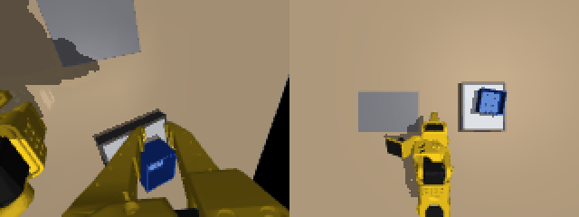 |
| 옆 | 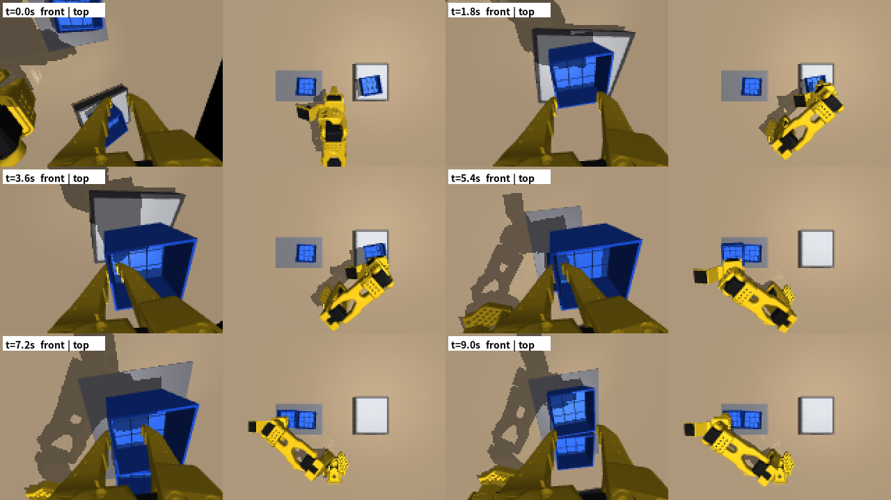 | 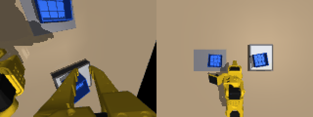 |
| 2층 | 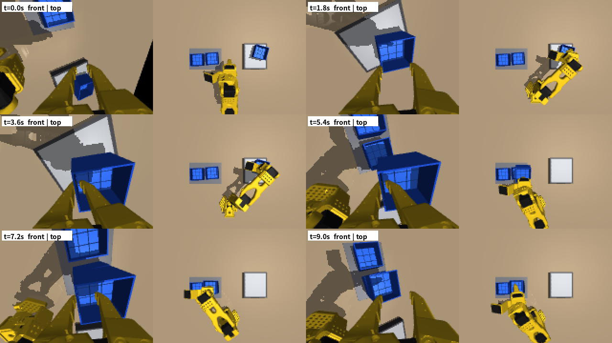 | 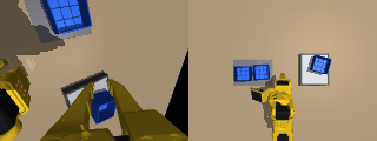 |

### 2×2 2층 (8개) 가능성 시험

8번째(2층 가까운 줄 왼쪽, 로봇 몸에 가장 가까운 자리)만 기울어져 실패. 사용자 결정: 원래 3단계 결과가 잘 나오면 그때 진행. 코드: `pallet_env.py`, `pallet_expert.py`, `pallet_test.py`.

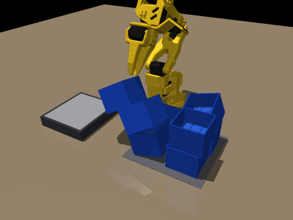

## 18:00 포트폴리오 저장소에서 실측 YOLO 학습 기록 발견

사용자 요청으로 포트폴리오 저장소(`2026/03. 캡스톤 - 스마트팩토리 비전검사`)를 커밋 이력 11개까지 전부 확인했다.

- **ACT 실측 데이터는 없음**: `motor_log.txt`·`error_log.txt`·`factory_gate.log` 는 0바이트, `smart_factory.log`·`factory_operations.log` 는 카메라 재연결·시작 기록뿐, 지워진 데이터 파일도 없음
- **YOLO 체크포인트(`number.pt`, `box.pt`) 안에 학습 설정과 에폭별 검증 정확도가 남아 있음** → 팀의 실측값이므로 논문 4.1절 표 1 로 넣음

| 모델 | `number.pt` (7-segment 숫자) | `box.pt` (상자 분류) |
|---|---|---|
| 구조 / 파라미터 | YOLOv8n / 3.0M | YOLOv8n-seg / 3.3M |
| 학습일 / 장치 / 학습 시간 | 2026-05-01 / Colab GPU / 8분 22초 | 2026-05-26 / CPU / 29분 28초 |
| 클래스 | 0~9, '-', '.', screen (13) | big_box, small_box (2) |
| 설정 | 50 에폭, 배치 16, 640px, Ultralytics 8.4.45 | 50 에폭, 배치 16, 640px, Ultralytics 8.4.53 |
| **정밀도 / 재현율** | **85.4% / 80.8%** | **99.2% / 100%** |
| **mAP50 / mAP50-95** | **86.3% / 65.6%** | **99.5% / 96.5%** (마스크 mAP50-95 92.6%) |

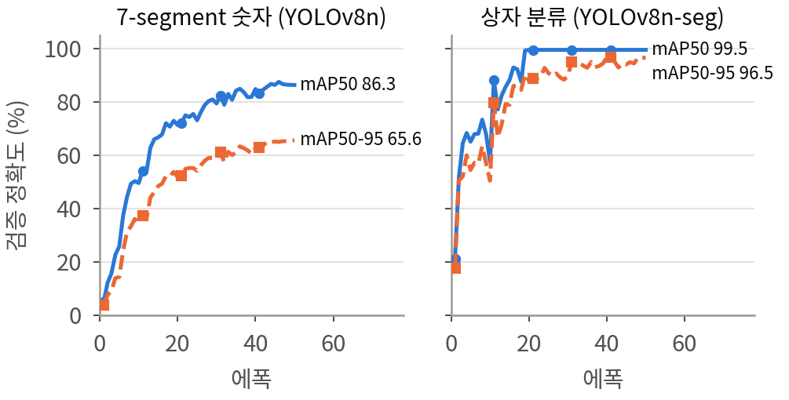

원자료: [yolo_학습기록_실측.json](../결과/수치/yolo_학습기록_실측.json) (에폭별 손실·정밀도·재현율·mAP 50개씩)

## 목표

- 초안이 어디까지 됐는지, 무엇이 비었는지 파악
- ACT 적재 실험을 다시 할 방법 정하기 → 시뮬레이션
- 팀 조건(시연 100·200)을 재현하고, 그보다 나아가기 (500·1000, DART, 시간 앙상블)

## 한 일 (시간순)

| 시각 | 한 일 |
|---|---|
| 12:20 | 카카오톡 받은 파일에서 초안 HWP 찾음, `pyhwp` 로 ODT 변환해 LibreOffice 로 열람 |
| 12:30 | 포트폴리오 저장소의 ACT 실행기(`run_act_inference_jetson_fixed.py`) 등 분석, 학회 양식(`논문양식.docx`) 구조 파악 |
| 12:35 | 사용자 확인: 적재 순서(A 1층 → B 옆 → C 는 A 위), 단계별 모델, Orin Nano, 손목 카메라 모델, 기준 118g, 벽 잡기 |
| 12:40~13:05 | MuJoCo 환경·스크립트 전문가 작성. 역기구학, 손목 카메라, 집게 충돌 문제 해결 → 큐브 10/10 |
| 12:55 | 시연 영상·MakerWorld 정보로 실제 분류 통(33g)을 확인 → 통 벽 잡기로 환경 변경 → 5/5 |
| 13:20 | LAB-1309 에 이 폴더 생성, 첫 기록 |
| 13:20~13:53 | 저울 위 통 ±2cm·±20° 로 넓혀 전문가 20/20, 단계별 시연 200개 생성 |
| 13:40 | 사용자 제안: 시연 100 / 200 / 500 / 1000 비교 (팀은 단계별 100·200회). 실제 데이터는 Hugging Face 에도 없음 확인 |
| 13:53 | n100 학습 시작 (같은 PC 의 PiPER 학습과 GPU 공유) |
| 14:32 | **메모리 부족으로 Claude 앱 전체 종료** (아래) |
| 14:39~14:50 | 별도 서비스(메모리 상한)로 다시 시작, 학습 메모리 줄이기. 오분류 5건·영문 이름·e-mail 확인 받음 |
| 15:53 | PC 전원 꺼짐 (정상 종료) |
| 17:11~17:18 | 학습이 멈춰 있던 원인(GIL) 찾음 → JPEG 메모리 묶음으로 바꿔 큐 v4 시작 |
| 17:20~17:35 | 2×2 2층 가능성 시험, 7-segment 파이프라인 그림, 적재 사진, 학회 규정 확인(2단 1~5쪽) |

## 막힌 것과 해결

| 문제 | 원인 | 해결 |
|---|---|---|
| HWP 가 안 열림 | 리눅스, LibreOffice 는 HWP 97 만 | pyhwp → ODT |
| `mujoco.Renderer` 없음 | MuJoCo 3.15 API 변경 | 3.3.5 고정 |
| 팔이 위로 뻗음 | 수직 접근은 z ≤ 5cm 에서만 가능 (손목 한계) | 높이별 기울기 0~30° |
| 손목 카메라가 검은 원 | 카메라가 부품 메쉬 안 | 22mm 앞으로 |
| 상자를 못 집음 / 잡으면 기울어짐 | 기준점이 고정 집게 면, 집게 볼록 껍질의 사선 면 | 잡기 위치 보정, 상자형 집게 충돌체 |
| 2mm 통 벽을 못 쥠 | 닫힘 한계에서도 4mm 틈 | 움직이는 집게 충돌체를 두껍게 |
| 시연 생성 동시 실행 오류 | 같은 임시 파일 | 프로세스별 이름 + 원자적 쓰기 |
| **14:32 Claude 앱 전체 종료** | `systemd-oomd` 가 메모리 압박으로 Claude 묶음(cgroup, 프로세스 119개)을 종료. 제 작업이 Claude 와 같은 묶음에 있었고, PiPER 학습(약 14GB) 위에 학습 3개·생성 3개를 더함. PiPER `train_lora.py` 도 함께 꺼짐 (`piper_ba2_model` 체크포인트 없음 → PiPER 쪽에서 다시 시작 필요) | 작업을 **별도 systemd 사용자 서비스** `act-queue` 로, `MemoryMax=6G`·`MemoryHigh=5.5G` (넘쳐도 Claude·RustDesk 는 안전) |
| 학습 하나가 2.5GB | 정규화 통계용 임시 배열이 힙에 남음, 할당기 조각화 | 통계를 시연 하나씩 누적, `malloc_trim`, `MALLOC_MMAP_THRESHOLD_=1MB` |
| 1시간 동안 학습이 2000스텝도 못 감 | 학습 중 별도 스레드가 HDF5 를 읽는 동안 GIL 을 잡아 학습이 멈춤, 하드디스크 경쟁 | 영상을 **JPEG(품질 90) 묶음**으로 메모리에 통째로 → 단독 10.5 스텝/초 |
| DART 시연 성공률 47% | σ=0.01 잡음이 2mm 벽 잡기에 너무 큼 | σ=0.005 → 90% |
| 15:53 전원 꺼짐 | 정상 종료 (메모리 문제 아님) | 큐 v4 로 다시 시작 |
| 저장소 리베이스가 멈춤 | 이 작업 사본에 작성자 정보가 없음 | 리베이스 취소 후 작성자 정보 넣고 다시, 사본에 설정 |

동시 실행 수 (메모리 상한 6GB): n100·n200·DART 는 3개, n500 은 2개, n1000 은 1개.

## 알게 된 것

- LeRobot ACT 는 작업 문장을 입력으로 쓰지 않는다 → 단계별 모델을 따로 둔 팀의 방식이 맞다
- SO-101 은 높은 곳에서 수직으로 내려 잡을 수 없다 (손목 한계). 높이에 따라 그리퍼를 기울여야 한다
- 시뮬레이터의 메쉬 충돌(볼록 껍질)은 집게 사이에 사선 면을 만들어 잡기를 망친다 → 집게는 상자형 충돌체로
- 물체 배치 범위가 좁으면 정책이 물체를 보지 않는다 (PiPER 10/6 교훈) → 저울 위 통 ±2cm·±20° 로 넓힘
- **스크립트 시연도 모방학습이다**: 시연자만 사람 대신 스크립트, 기록 형식(팔로워 관절값 + 손목·상단 영상 + 동작)과 학습(ACT)은 같다
- 이 PC 에서 Claude 로 띄운 무거운 작업은 Claude 와 같은 묶음 → 메모리 압박 시 Claude 가 같이 죽는다. 무거운 작업은 반드시 별도 서비스로
- 학습 데이터 읽기는 학습 스레드를 막지 않게 (h5py 는 GIL 을 잡는다)

## 읽은 논문

- ACT (Zhao et al., RSS 2023): 시뮬레이션 실험에서 스크립트 정책으로 시연 50개를 만듦 → 스크립트 시연 사용의 근거
- DART (Laskey et al., CoRL 2017, [02_논문노트/DART.md](../../02_논문노트/DART.md)): 시연 중 잡음 주입 → 개선안
- MimicGen (Mandlekar et al., CoRL 2023): 시연 자동 생성으로 데이터 늘리기
- Data Scaling Laws in Imitation Learning (Lin et al., ICLR 2025): 시연 수보다 환경·물체 다양성이 더 중요 → 시연 수 비교 해석에 사용
- 학회 규정: 대한전자공학회 2026 하계 — 2단 1~5쪽, Word 또는 한글 양식

## 다음에 할 것

- [x] 단계별 시연 200개 생성
- [x] 7-segment 부분 원고 정리 (파이프라인 그림 추가)
- [x] 오분류 건수(5건), 저자 이메일 확인
- [ ] n100 → n200 → 시간 앙상블 → DART200 → n500 → n1000 학습·평가 (큐 v4 진행 중)
- [ ] 결과 나오면 원고 수치·그래프·ACT 적재 장면 자동 갱신 (`publish.sh`)
- [ ] 원래 실험이 잘 나오면 2×2 2층 (8번째 자리 고치기)
