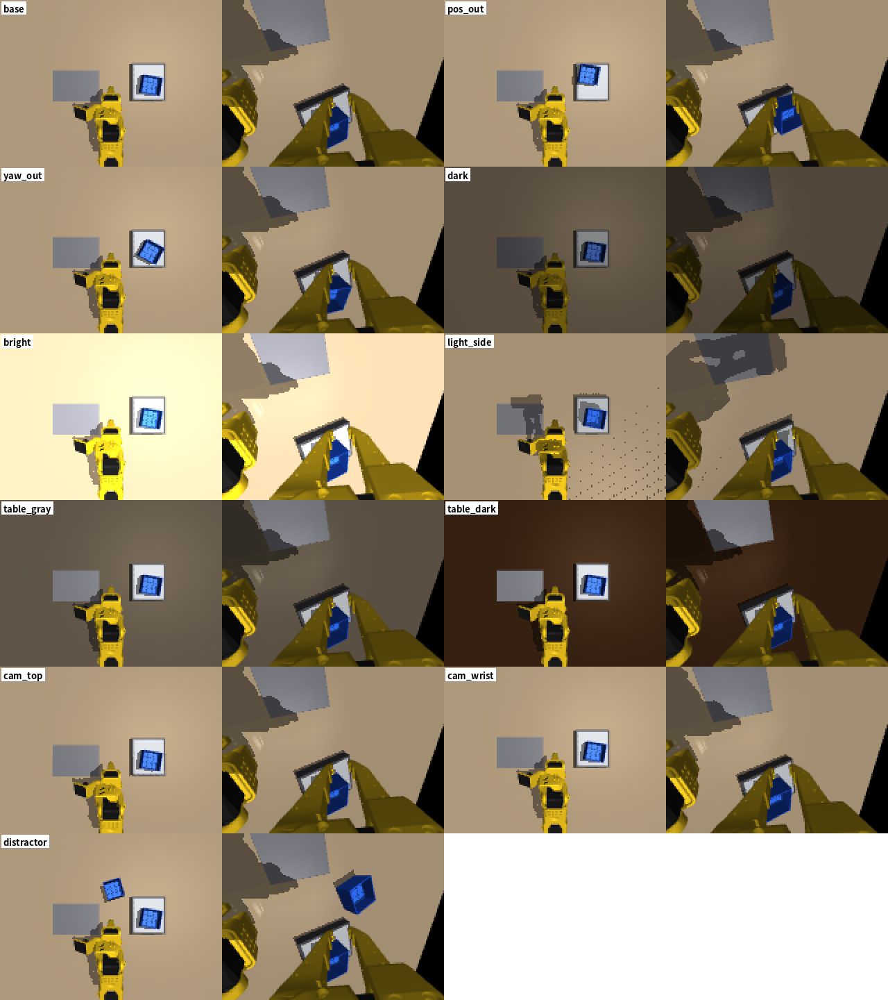
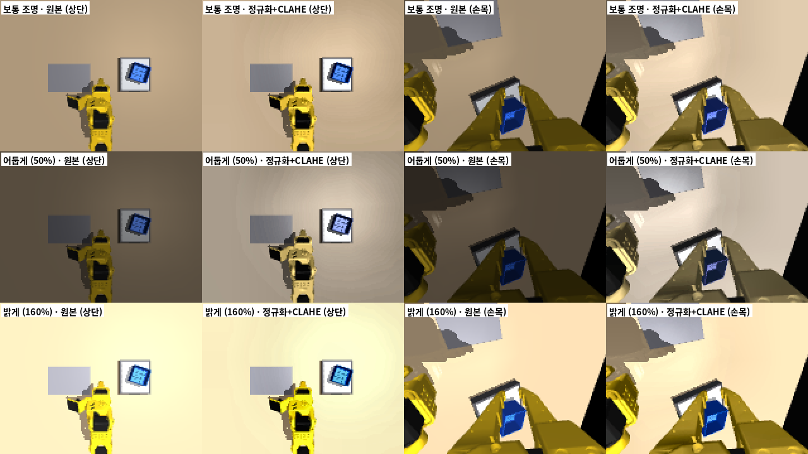
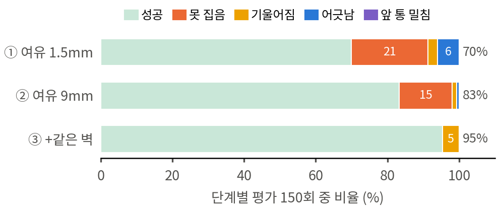

# 2026-10-07 시연 설계를 4번 고쳐 연속 성공률 28% → 62% → 82%, 2층 마지막 원인(빠질 때 기울어짐)까지 찾음

> 한 줄 요약: 팀 조건(단계별 시연 100회)을 시뮬레이션에서 재현한 ACT 는 연속 3단계 28% 였다. 실패한 장면을 하나씩 분석해 원인이 ACT 가 아니라 **시연을 만드는 방식**에 있음을 차례로 찾았다.
> 1. 집게를 벽에 너무 붙여 내려감 → 파지 여유 9mm (v2): 62%
> 2. 상자가 돌아가 있으면 잡는 벽이 바뀌어 시연이 두 갈래가 됨 → 늘 같은 벽 (v4): 82%, 1층·옆 100%
> 3. 2층을 놓은 뒤 곧장 올라가며 상자를 끌어 기울임 → 물러났다가 올라가기 (v5): 전문가 기울어짐 11 → 1회, 지금 학습 중
>
> 같은 설계로 시연만 200개로 늘리면 오히려 36% 로 떨어져, 시연의 양보다 **일관성**이 먼저라는 것도 확인했다.

## 오늘 결과 한눈에

| 시각 | 시연 설계 | 바꾼 것 | 시연 100 결과 (1층 / 옆 / 2층, 연속) |
|---|---|---|---|
| 10/6 밤 | v1 | 처음 설계 (여유 1.5mm, 로봇 쪽 벽) | 76 / 84 / 50%, 연속 **28%** |
| 07:22 | v2 | 파지 여유 1.5 → 9mm | 90 / 88 / 72%, 연속 **62%** |
| 12:20 | v2, 시연 200 | 시연 수만 2배 | 82 / 80 / 66%, 연속 **36%** (오히려 낮아짐) |
| 16:10 | v4 | 늘 같은 벽을 잡음 | **100 / 100 / 86%, 연속 82%** |
| 16:30 | v5 (2층만) | 놓은 뒤 5mm 물러났다가 올라감 | 학습 중 (예상 22:30) |
| 17:00 | v6 | 위 설계 + 조명·책상 색·카메라·주변 물건·넓은 범위 무작위화, 정규화+CLAHE | 시연 생성 중 |

| 그 밖에 확인한 것 | 결과 |
|---|---|
| 정책이 카메라로 통을 따라가나 | 쥔 위치 ↔ 실제 통 위치 기울기 약 1 → 영상으로 통을 따라감 |
| 재계획(25스텝) 추론 | 효과 없음 |
| 실패와 통 회전각 (v2 n100) | +7.5° 넘는 구간 실패율 49%, 나머지 1% |
| 그리퍼가 꽉 닫히나 | 명령 각도까지 닫힘, 벽을 약 28N 으로 쥠, 옮기는 동안 1.2mm 밀림, 9/9 |
| 전문가 2층 기울기 (v4 → v5) | 3° 넘음 11 → 1회, 성공 49 → 50/50 |
| 22:37 (10/6) 큐 종료 | oomd 가 제 서비스만 종료 (Claude·RustDesk 무사) → 상한 설정 수정 |

## 시연 설계 버전 정리 (v1 · v2 · v3 · v4 · v5)

여기서 "버전"은 ACT 모델이 아니라 **스크립트 전문가가 시연(학습 데이터)을 만드는 방식**의 버전이다.

**모든 버전에서 같은 것**
- ACT 구조와 학습 설정: 청크 100, 배치 8, 학습률 1e-5, 단계별 3만 스텝
- 평가 장면: 같은 난수 시드, 시연에 안 쓴 장면
- 성공 기준: 통 위치 15mm, 높이 8mm, 기울기 10° 이내, 먼저 쌓인 통이 10mm 이상 밀리지 않음

**버전마다 바뀌는 것** 두 가지
1. 집게를 벽에서 얼마나 떨어뜨려 내려가는가 (파지 여유, 그리퍼 열림)
2. 통의 어느 벽을 잡는가 (벽 선택 규칙)

**기본 동작**
- 통은 64×64×52mm, 벽 두께 2mm다.
- 전문가는 통 벽 하나를 사이에 두고 **고정 집게는 벽 바깥, 움직이는 집게는 통 안쪽**에 둔 채 내려가서 닫는다.
- **파지 여유**는 닫기 직전 고정 집게와 벽 바깥면 사이의 거리다.
- **견디는 파지 오차**는 전문가가 잡는 위치를 일부러 벽 법선 방향으로 밀었을 때도 성공하는 범위다. 음수는 벽 쪽(안쪽), 양수는 바깥쪽이다.

| 버전 | 파지 여유 | 그리퍼 열림 | 잡는 벽 | 견디는 파지 오차 (전문가 시험) | 상태 | 시연 100 결과 (1층 / 옆 / 2층, 연속) |
|---|---|---|---|---|---|---|
| **v1** | 1.5mm | 0.32 rad | 로봇을 가장 많이 향한 벽 | −3 ~ +14mm | 학습·평가 끝 (보관) | 76 / 84 / 50%, 연속 **28%** |
| **v2** | 9mm | 0.32 rad | 로봇을 가장 많이 향한 벽 | −11 ~ +9mm | n100 끝, n200 평가 중 | 90 / 88 / 72%, 연속 **62%** |
| **v3** (a·b·c) | 11 · 13 · 12mm | 0.42 · 0.42 · 0.38 rad | 로봇을 가장 많이 향한 벽 | −12 · −15 · −13 ~ +4mm 이상 | 전문가 시험만 (학습 안 함) | — |
| **v4** | 9mm | 0.32 rad | **늘 같은 벽 (앞벽)** | v2 와 같은 설정 (따로 재지 않음) + 회전 ±20° 전 구간 108/108 | 학습·평가 (n100 끝) | **100 / 100 / 86%, 연속 82%** |
| **v5** | 9mm | 0.32 rad | 늘 같은 벽 + **놓은 뒤 벽에서 5mm 떨어졌다가 올라감** | v4 와 같음. 2층 전문가 기울기 3° 넘음 11 → 1회 | 2층 데이터 생성 중, 학습 대기 | (2층만 새로 학습) |

**위 그림 읽는 법**
- 위 줄: 통 뒤에서 로봇 쪽을 본 집기 직전 모습이다.
- 아래 줄: 잡는 벽을 따라 본 모습이다 (통 반투명). 벽 바깥이 고정 집게, 통 안이 움직이는 집게다.
- 회전 0°: v1 은 고정 집게가 벽에 거의 붙어 있고, v2·v3b 는 벽과 간격이 있다.
- 통이 +15° 돌았을 때: v2 규칙은 옆벽을 골라 팔이 옆에서 들어오고, v4 는 그대로 앞벽을 잡는다. (`design_photos.py`)

### v1 — 처음 설계 (10/6)

- **무엇:** 고정 집게를 벽 바깥 **1.5mm** 에 붙여 내려가서 닫는다. 그리퍼 열림 0.32rad, 잡는 벽은 "로봇을 가장 많이 향한 벽"이다.
- **왜 이렇게 했나:** 전문가 혼자 놓고 보면 벽에 바짝 붙여 잡는 것이 가장 확실한 파지라서.
- **데이터:**

  | 시연 | 1층 | 옆 | 2층 |
  |---|---|---|---|
  | 기본 200개 (전문가 성공률) | 98.5% | 94.3% | 96.6% |
  | DART 200개 | 90.1% | 87.3% | 87.3% |
  | 추가 800개 | 98.3% | 97.0% | — |

- **결과 (시연 100):** 1층 76%, 옆 84%, 2층 50%. 연속은 68% → 44% → **28%**
- **문제:** ACT 는 잡는 위치가 평균 5~8mm 벽 쪽으로 치우친다. v1 은 벽 쪽으로 3mm 만 어긋나도 고정 집게가 벽 윗면에 얹혀 내려가지 못한다 (−6mm 에서 성공 17%). 시연이 오차 여유가 거의 없는 동작이라, 학생(ACT)의 작은 오차를 견디지 못했다.
- **보관:** `archive_v1/` (데이터·체크포인트), 평가 결과 `결과/수치/eval_v1_n100.json`

### v2 — 파지 여유 9mm (10/7 01:40)

- **무엇:** 고정 집게를 벽 바깥 **9mm** 에서 내려가서 닫는다. 9mm 는 집게가 벽을 사이에 둘 수 있는 범위(바깥 0~17mm)의 가운데다. 그리퍼 열림 0.32rad 와 잡는 벽 규칙은 v1 과 같다.
- **고르는 과정 (전문가 시험):**

  | 후보 | 결과 |
  |---|---|
  | 여유 10mm + 열림 0.55rad (처음 안) | **0%**. 크게 연 움직이는 집게가 통 안쪽에 부딪힘 |
  | 여유 7mm (v2a) | −9 ~ +9mm |
  | **여유 9mm (v2b)** | **−11 ~ +9mm → 채택** |

  

- **데이터:**

  | 시연 | 1층 | 옆 | 2층 |
  |---|---|---|---|
  | 기본 200개 (전문가 성공률) | 100% | 95.7% | 98.5% |
  | DART 200개 | 98.0% | 90.9% | 98.0% |
  | 추가 800개 | 100% | 97.4% | 99.1% |

  2층 추가 800개는 v4 로 바꾸면서 JPEG 변환 전에 멈췄다.
- **결과 (시연 100):** 1층 90%, 옆 88%, 2층 72%. 연속은 84% → 72% → **62%**. n200 평가는 11:45 예정이다.
- **남은 문제:** 실패 25건 중 24건이 통이 +7.5° 넘게 돌아간 구간에서 났다. 원인은 잡는 벽이 바뀌는 것이다 (아래 v4, 10:00 절).

### v3 — 벽 쪽으로 더 견디게 (10/7 07:30, 전문가 시험만)

- **생각:** v2 실패가 벽 쪽 −15 ~ −17mm 에 몰려 보였다. 그래서 여유를 늘리고 그리퍼를 더 열어 견디는 범위를 벽 쪽으로 넓히려 했다.
- **시험 (각 4회, +4mm 보다 바깥은 시험 안 함):**

  | 후보 | 여유 · 열림 | 견디는 범위 |
  |---|---|---|
  | v3a | 11mm · 0.42rad | −12 ~ +4mm 이상 |
  | v3b | 13mm · 0.42rad | −15 ~ +4mm 이상 |
  | v3c | 12mm · 0.38rad | −13 ~ +4mm 이상 |

- **학습에 쓰지 않은 이유:**
  - 실패 시행을 다시 보니 그리퍼가 잡을 높이보다 **26mm 위(벽 윗면)** 에서 닫혔고, 벽을 따라서도 ±20mm 어긋나 있었다. 벽 쪽으로 조금 치우친 것이 아니라 **모서리 쪽으로 간 것**이다.
  - 원인이 따로 있었으므로(v4) 여유를 더 키우는 v3 는 보류했다.
  - 여유를 키우면 바깥쪽 여유가 줄어드는 대가도 있다 (+4mm 까지만 확인).

### v4 — 늘 같은 벽 (10/7 10:00)

- **무엇:** v2 와 같은 여유 9mm, 열림 0.32rad 에 잡는 벽만 바꿨다. 통이 얼마나 돌아가 있든 **늘 같은 벽**(법선이 로봇 쪽 −x 방향에 가장 가까운 앞벽)을 잡는다. 바뀐 것은 벽 선택 규칙 하나다.
- **왜 바꿨나:**
  - 이전 규칙은 "로봇을 가장 많이 향한 벽"이었다. 저울은 로봇에서 약 146° 방향에 있어서, 통이 약 +7~11°(통 위치에 따라 다름) 넘게 돌면 이 규칙이 앞벽 대신 옆벽을 고른다.
  - 그러면 카메라에는 거의 같은 장면인데 시연 동작이 두 갈래로 나뉘고, ACT 는 두 동작의 중간인 모서리 쪽으로 간다.
  - 사람이 팔로우암으로 시연하면 보통 늘 같은 벽을 잡는다.
- **왜 늘 같은 벽이 되나:** 통 회전 ±20° 에서 앞벽 법선은 160° ~ 200° 방향이다. 늘 기준 방향(180°)에서 45° 안이라, 전 구간에서 같은 벽이 골라진다.
- **전문가 시험:** 회전 −20 ~ +20° (5° 간격) × 위치 네 모서리 (±20mm) × 3단계 = **108/108 성공** (`wall_rule_test.py`)
- **데이터 (생성 중, `gen_v4.sh`):** 단계별 기본 200 → 추가 800 → DART 200 → DART 추가 800
- **학습:** n100 → n200 → n500 → n1000 → DART1000 → DART200 (`run_queue7.sh`)
- **코드:** `expert.py` 의 `ACT_DESIGN=v4` 로 켠다. 기본값을 v2 로 두어 진행 중이던 v2 실험에는 영향이 없다.

### v5 — 놓은 뒤 물러났다가 올라가기 (10/7 16:30)

- **무엇:** v4 와 같고, 놓을 때 그리퍼를 벌린 뒤 **벽 바깥쪽으로 5mm 물러났다가** 올라간다. 벌리기 0.5초 → 물러나기 0.3초 → 올라가기 0.6초 (v4 는 벌린 뒤 곧장 0.8초 동안 6cm 올라감).
- **왜:** v4 n100 의 2층 실패 7건이 모두 놓은 뒤 빠질 때 기울어진 것이었다. 고정 집게가 벽 바깥면에 붙은 채 올라가면서 통 C 의 한쪽을 끌어 올렸다 (위 16:10 절).
- **전문가 시험 (2층 평가 장면 50개, 시연과 같은 속도·경유점 흔들림):**

  | 전문가 | 성공 | 기울기 평균 | 최대 | 3° 넘음 | 5° 넘음 |
  |---|---|---|---|---|---|
  | v4 | 49/50 | 1.7° | 11.3° | 11 | 4 |
  | **v5** | **50/50** | **0.7°** | **3.9°** | **1** | **0** |

- **데이터:** 2층만 새로 만든다 (`gen_v5.sh`, 서비스 `act-gen5`): 기본 200 → 추가 800 → DART 200 → DART 추가 800. 1층·옆은 바닥에 놓아 곧장 올라가도 기울지 않았으므로(v4 n100 100 / 100%) v4 데이터와 정책을 그대로 쓴다.
- **코드:** `expert.py` 의 `ACT_DESIGN=v5` (`BACKOFF = 0.005`). v4 생성 결과는 바뀌지 않는다 (난수 사용 순서 동일).

| 버전 | 바꾼 이유가 된 관찰 | 바꾼 것 |
|---|---|---|
| v1 → v2 | 실패 때 고정 집게가 벽 윗면에 걸림, ACT 가 벽 쪽으로 5~8mm 치우침 | 파지 여유 1.5 → 9mm |
| v2 → (v3) | 실패가 벽 쪽 −15mm 근처로 보임 | 여유·열림을 더 키우는 안 → 시험만 하고 보류 |
| v2 → v4 | 실패 24/25 가 통 회전 +7.5° 넘는 구간, 그리퍼가 벽 윗면·모서리에서 닫힘 | 잡는 벽을 하나로 고정 |
| v4 → v5 | 2층 실패 7/7 이 기울어짐. 놓을 때는 평평한데 곧장 위로 빠질 때 집게가 벽을 끌어 올림 | 벌린 뒤 벽 바깥쪽으로 5mm 물러났다가 올라감 (2층 데이터만 새로) |

## 측정한 수치

| 항목 | 1층 | 옆 | 2층 | 조건 |
|---|---|---|---|---|
| 단계별 성공률 | 76% (38/50) | 84% (42/50) | 50% (25/50) | 시뮬레이션, 앞 단계 통은 목표 ±8mm, 평가 시드 501000~ |
| 성공 시 평균 위치 오차 | 7.7mm | 8.5mm | 6.7mm | 전문가는 2.1~2.5mm |
| 실패 유형 | 못 듦 7, 어긋남 4, 기울어짐 1 | 못 듦 3, 어긋남 4, 기울어짐 1 | 못 듦 22, 어긋남 1, 기울어짐 2 | `analyze.py` 분류 |
| 따라가기 기울기 x / y | 0.87 / 1.06 | 0.79 / 0.68 | 1.03 / 1.00 | 1 = 통 위치만큼 따라감 |
| 학습 곡선 (1만 / 2만 / 3만 스텝) | 70% / 67% / 76% | 60% / 63% / 84% | 43% / 47% / 50% | 1·2만은 30회, 3만은 50회 |
| 마지막 학습 손실 | 0.064 | 0.067 | 0.061 | 30,000스텝, 시작 약 6.4 |

| 연속 평가 | 값 |
|---|---|
| 누적 성공률 (1층 → 옆까지 → 2층까지) | 68% → 44% → 28% |
| 처음 실패한 단계 | 1층 16회, 옆 12회, 2층 8회, 실패 없음 14회 (50 시퀀스) |
| 앞 단계 성공 조건부 성공률 | 1층 0.68, 옆 0.65, 2층 0.64 |

| 시연 데이터 (추가) | 성공 / 시도 | 성공률 | 평균 오차 | 시간 |
|---|---|---|---|---|
| DART 1층 (σ=0.005) | 200 / 222 | 90.1% | 6.53mm | 25분 |
| DART 옆 | 200 / 229 | 87.3% | 6.46mm | 30분 |
| DART 2층 | 200 / 229 | 87.3% | 5.64mm | 36분 |
| 추가 1층 (n500·n1000 용) | 800 / 814 | 98.3% | 2.12mm | 105분 |
| 추가 옆 | 800 / 825 | 97.0% | 2.34mm | 89분 |

DART 시연의 평균 오차가 큰 것은 실행 동작에 잡음을 넣었기 때문 (정답 라벨은 깨끗한 궤적).

## 00:53 재계획(25스텝) 추론 결과 — 나아지지 않음

| 추론 방식 (n100 모델) | 1층 | 옆 | 2층 | 연속 누적 (1 → 2 → 3) |
|---|---|---|---|---|
| 기본: 청크 100 을 끝까지 실행 | 76% | 84% | 50% | 68 → 44 → 28% |
| 25스텝(0.83초)마다 다시 계획 (k25) | 78% | 70% | 54% | 66 → 36 → 24% |

- 각 50회, 같은 평가 장면. 차이는 오차 범위 안 (옆은 오히려 낮음)
- **원인은 "다시 보지 않아서"가 아니라 집기 동작 자체의 정밀도** → 데이터를 늘리는 쪽이 먼저
- 사용자 결정(10/7): **시연 100 → 200 → 500 → 1000 순서로 키우고, DART 는 마지막**. 지금 큐(v4)는 n200 학습 중이라 DART 차례가 오는 순간 자동으로 v5 로 바꾸는 감시 서비스(`act-swap`)를 띄움 (2층 추가 시연 생성을 끊지 않기 위해)
- 메모리: 큐 8.6GB 중 프로세스 2.1GB·파일 캐시 5.9GB → 상한을 9GB 로 올림 (서비스 재시작 없이). PiPER 11.3GB 와 합쳐도 약 24GB

## 01:00 DART 를 1000개로도 하기로

사용자 질문 "1000까지 하고 DART 도 1000개로 하는 게 좋나" → 추천: **DART 1000 추가 + DART 200 유지**

| 비교 | 보여 주는 것 |
|---|---|
| 일반 1000 vs DART 1000 | 데이터를 최대로 늘려도 DART 가 더 좋은가 → 최종 제안 모델 |
| 일반 200 vs DART 200 | 데이터가 적을 때 DART 효과 |
| 두 쌍 함께 | 데이터가 많아질수록 DART 효과가 줄어드는가 |

- DART 시연 800개×3 추가 생성을 별도 서비스 `act-gen-dart` (메모리 상한 1.5GB, 시드 7000, σ=0.005)로 시작 → n1000 이 끝날 때쯤 준비
- 큐 v5 순서: n200 → n500 → n1000 → **DART1000** → DART200 (일정이 밀리면 DART200 을 뺌)
- 예상: n200 05:30, n500 10:30, n1000 16:30, DART1000 22:00, DART200 10/8 03:00
- DART 설명: 시연 중 실행 동작에만 작은 잡음을 넣고 정답은 깨끗한 경로로 기록 → 어긋난 상태에서 돌아오는 법까지 학습 ([02_논문노트/DART.md](../../02_논문노트/DART.md))

## 01:40 목표 95% → 실패 원인 분석 → 시연 설계 변경 (v2)

사용자 목표: **성공률 95% 이상**. 그래서 n100 실패를 다시 뜯어봤다.

### 실패한 시행에서 그리퍼는 어디서 닫혔나 (n100, 쥔 순간의 위치 − 전문가가 잡는 위치)

| 단계 | | 벽 법선 방향 오차 (− = 벽 쪽) | 닫을 때 높이 오차 |
|---|---|---|---|
| 1층 | 성공 38 | 평균 −5.2mm (−10.1 ~ +8.4) | −0.6 ± 0.9mm |
| | 실패 12 | 평균 **−12.7mm** (−28.9 ~ −0.3) | **+17.0 ± 12.9mm** |
| 옆 | 성공 42 / 실패 8 | −4.2 / **−11.9mm** | −1.6 / **+15.8mm** |
| 2층 | 성공 25 / 실패 25 | −6.8 / **−15.2mm** | −0.4 / **+20.6mm** |

→ 실패는 **고정 집게가 벽 위에 걸려 끝까지 못 내려간 채(높이 +16~21mm) 허공에서 닫은 것**. ACT 는 평균 5mm 벽 쪽으로 치우친다.

### 원인: 시연 설계 — 고정 집게를 벽에 너무 붙여 내려감

집게가 벽을 사이에 둘 수 있는 범위는 벽 바깥 0~17mm(열림 0.32rad). v1 시연은 그 끝(1.5mm)으로 내려가서 벽 쪽으로 3mm 만 틀려도 실패. 전문가로 파지 위치를 일부러 틀어 재 봤다:

| 설계 | −12 | −9(−10) | −6 | −3 | 0 | +3 | +6 | +9(+10) | 견디는 범위 |
|---|---|---|---|---|---|---|---|---|---|
| v1 여유 1.5mm | 0% | 0% | 17% | 100% | 100% | 100% | 100% | 100% | −3 ~ +14mm |
| v2 여유 10mm, 열림 0.55 | 0% | 0% | 0% | 0% | 0% | 0% | 0% | 0% | 실패 (넓게 벌리면 집게 충돌체가 통 안 벽에 닿음) |
| v2a 여유 7mm | 25% | 100% | 100% | 100% | 100% | 100% | 100% | 100% | −9 ~ +9mm |
| **v2b 여유 9mm (채택)** | **75%** | 100% | 100% | 100% | 100% | 100% | 100% | 100% | **−11 ~ +9mm** |

(stage 1, 각 4~6회, 시뮬레이션 전문가 시험)

### 결정

- 시연을 **v2b (여유 9mm)** 로 전부 다시 생성 (기본 200, DART 200, 추가 800, DART 추가 800 × 3단계). v2 전문가 연속 3단계 **10/10**, 평균 오차 2.0~2.7mm
- v1 결과(n100 76/84/50%, 연속 28%)는 `v1_n100` 으로 보관 → 논문에서 **시연 설계가 성공률을 좌우한다**는 비교로 사용
- v1 데이터(35GB)는 `archive_v1/` 로 옮김
- 재계획(k25)은 효과가 없어 v2 에서는 빼고, 시간 앙상블만 n200 에서 비교
- 큐 v6 (02:10 시작): 데이터 생성(별도 서비스 `act-gen`, 단계별 3개 동시) → 기본 200 이 준비되는 대로 n100 → n200(+시간 앙상블) → n500 → n1000 → DART1000 → DART200

## 02:30 논문 방향 결정 — "실제 구현 + 시뮬레이션으로 찾은 순차 적재의 핵심 요인"

| 방향 | 판단 |
|---|---|
| A. 구현 중심 (원래 초안) | ACT 수치가 시뮬레이션뿐이라 주장이 약하고 새 발견이 없음 |
| B. 시뮬레이션 연구만 | 실측(7-segment, YOLO mAP)과 실제 시스템을 버리게 됨 |
| **C. 구현 + 시뮬레이션 발견 (채택)** | 실측·시뮬레이션을 모두 쓰고 "무엇이 성공률을 좌우하나"라는 발견이 생김. 결과가 어떻게 나와도 성립 |
| D. 두 편으로 나누기 | 마감까지 무리, 나중에 학회지로 확장할 때 고려 |

기여 3가지: ① 무게 인식 → MCP → 단계별 ACT 에지 셀 구현과 인식 성능 실측 ② 연속 성공률로 순차 적재의 오차 누적을 보임 ③ 주된 실패가 파지 위치 오차임을 밝히고 파지 여유 설계·시연 수·DART 효과를 정량화.
원고를 이 구조로 고침: 초록·서론(기여 ①②③)·3.2 시연 설계(표 1 허용 오차)·4.2 결과(시연 설계 → 시연 수 → DART → 오차 누적)·결론. 표 번호를 등장 순서로 다시 매김(표 1~6). 현재 5쪽, 결과 수치는 실험이 끝나면 자동으로 채워짐. 초안: [논문/paper.pdf](../논문/paper.pdf)

## 07:22 v2 시연(여유 9mm) n100 결과 — 연속 28% → 62%

| n100 (각 50회, 같은 평가 장면) | 1층 | 옆 | 2층 | 연속 누적 (1 → 2 → 3) |
|---|---|---|---|---|
| v1 시연 (여유 1.5mm) | 76% | 84% | 50% | 68% → 44% → 28% |
| **v2 시연 (여유 9mm)** | **90%** | **88%** | **72%** | **84% → 72% → 62%** |

| 항목 | 1층 | 옆 | 2층 |
|---|---|---|---|
| 실패 유형 (v2) | 못 듦 5 | 못 듦 6 | 못 듦 11, 기울어짐 2, 어긋남 1 |
| 성공 시 위치 오차 (v2) | 5.7mm | 6.4mm | 5.6mm |
| 집을 때 벽 법선 오차 성공 / 실패 | −8.5 / −14.7mm | −5.4 / −17.1mm | −7.3 / −17.0mm |
| 학습 곡선 1만 / 2만 / 3만 스텝 | 77% / 93% / 90% | 47% / 87% / 88% | 40% / 57% / 72% |

- 연속에서 처음 실패한 단계: 1층 8회, 옆 6회, 2층 5회, 실패 없음 31회 (50 시퀀스)
- 남은 실패도 거의 전부 **집기 실패** (실패 때 벽 쪽으로 15~17mm, v2 가 견디는 범위 −11mm 밖). ACT 가 평균 5~8mm 벽 쪽으로 치우치는 경향은 그대로
- 2층은 2만 → 3만 스텝에서도 오르는 중 → 데이터·학습 길이를 늘릴 여지가 큼
- 다음: n200 학습 중. 잡을 수 있는 범위를 벽 쪽으로 더 넓히는 설계(그리퍼 0.38~0.42rad, 여유 11~13mm)를 전문가로 시험 중. 최종 모델은 학습을 6만~8만 스텝으로 늘리는 안 검토
- 데이터: v2 DART 기본 200 의 전문가 성공률 98 / 91 / 98% (v1 은 90 / 87 / 87%)

ACT(v2 n100)가 혼자 쌓은 장면 (논문 그림 5, 갱신):

| 연속 ooo (3단계 모두 성공) | 연속 oox | 2층 성공 | 학습 손실 |
|---|---|---|---|
|  |  |  |  |

## 07:30 남은 실패를 줄일 설계 v3 시험, 데이터 생성 서비스 사고

### 잡을 수 있는 범위를 벽 쪽으로 더 넓히기 (전문가 시험, 각 4회)

| 설계 | −18 | −15 | −12 | −9 | −6 | 0 | +4 | 견디는 범위 |
|---|---|---|---|---|---|---|---|---|
| v2 여유 9mm, 열림 0.32 (현재 데이터) | — | — | 75% | 100% | 100% | 100% | 100%(+6) | −11 ~ +9mm |
| v3a 여유 11mm, 열림 0.42 | 0% | 0% | 100% | 100% | 100% | 100% | 100% | −12 ~ +4 이상 |
| **v3b 여유 13mm, 열림 0.42** | 0% | **100%** | 100% | 100% | 100% | 100% | 100% | **−15 ~ +4 이상** |
| v3c 여유 12mm, 열림 0.38 | 0% | 50% | 100% | 100% | 100% | 100% | 100% | −13 ~ +4 이상 |

- v3b 는 v2 실패가 몰린 −15~−17mm 구간을 일부 덮는다. 고정 집게가 벽 바깥에 있어야 하는 기하학적 한계 때문에 설계만으로는 더 넓히기 어렵다
- 데이터를 또 전부 다시 만드는 것은 하루 이상 → **n200 결과를 보고 필요하면 최종 모델에만 적용**

### 05:07 데이터 생성 서비스 메모리 초과

| 무엇 | 내용 |
|---|---|
| 일 | `act-gen` 이 상한 2.5GB 를 넘어 커널 OOM 으로 종료 (05:07). 1층 추가 800개를 JPEG 로 바꾸는 중 변환기가 약 2GB 를 메모리에 모음 → 같은 서비스의 옆·2층 추가 생성(760·570개 진행)도 함께 멈춤 |
| 피해 | 1층 추가 800개는 무사 (변환만 다시), 옆·2층 추가 파일은 쓰는 중 끊겨 손상 → 다시 생성 |
| 해결 | 변환기를 디스크로 흘려 쓰는 방식으로 고침 (800개 변환 3분, 메모리 수백 MB), 생성은 **200개씩 4개 파일**로 나눠 끊겨도 최대 200개만 잃게 함 (`gen_more_v2.sh`) |
| 영향 | Claude·RustDesk·학습은 무사. 추가 시연 완료 예상 09:30, DART 추가 11:30 — n200 이 끝나는 11:50 보다 앞서 n500 일정에는 영향 없음 |

## 10:00 남은 실패의 진짜 원인 — 전문가가 잡는 벽을 바꿈 → 시연 설계 v4

v2 n100 의 단계별 평가 150회마다 저울 위 통의 회전각을 평가 시드로 복원해 결과와 맞춰 봤다 (`grasp_offsets.py`, `paper/fig_wallswitch.py`).

| 통 회전각 | 시행 | v2 n100 실패 | 실패율 | v1 n100 실패 | 실패율 |
|---|---|---|---|---|---|
| **+7.5° 초과** (잡는 벽이 바뀌는 구간) | 49 | **24** | **49%** | 31 | 63% |
| 나머지 (−20° ~ +7.5°) | 101 | **1** | **1%** | 14 | 14% |
| 전체 | 150 | 25 | 17% | 45 | 30% |

- **원인:** 전문가 스크립트는 "로봇 쪽을 가장 많이 향한 벽"을 잡게 만들었다. 통이 약 +7~11°(위치에 따라 다름) 넘게 돌면 그 벽이 앞벽에서 옆벽으로 바뀐다. 카메라로는 거의 같은 장면인데 시연 동작이 두 갈래로 나뉘고, ACT 는 두 동작의 **중간(모서리 쪽)** 으로 가서 집게를 벽 위에 얹은 채 닫았다.
  - 실패 때 그리퍼가 닫힌 위치(잡을 위치 기준): 높이 **+26mm** (벽 위에 얹힘), 벽 법선 −14 ~ −33mm, 벽을 따라 ±20mm
  - 이 구간을 빼면 v2 n100 은 이미 **99%** (100/101)
- 사람이 팔로우암으로 시연하면 보통 늘 같은 벽을 잡는다. 그러니 이건 ACT 의 한계가 아니라 **스크립트 전문가의 시연 설계 문제**였다.
- **v4 시연:** 회전각과 상관없이 **늘 같은 벽**(법선이 −x 에 가장 가까운 앞벽)을 잡는다. 여유 9mm, 그리퍼 열림 0.32 는 v2 와 같아서, 바뀐 것은 벽 선택 하나다 (`expert.py`, `ACT_DESIGN=v4`).
- **전문가 시험:** 회전각 −20° ~ +20° (5° 간격) × 위치 네 모서리 (±20mm) × 3단계 = **108/108 성공** (`wall_rule_test.py`, `결과/수치/wall_rule_v4.json`)

v2 n100 연속 평가 GIF — 통 회전각과 결과:

| ooo: 1층 +9.7°, 옆 −3.9°, 2층 −16.0° | xxx: 1층 **+19.5°** 에서 1층부터 실패 | oox: 2층 **+12.4°** 에서 2층만 실패 |
|---|---|---|
|  |  |  |

### 결정과 일정

- v2 의 n500 이후 실험과 v2 추가 시연 생성은 멈춘다. v2 n200 은 학습 막바지라 평가까지 마친다 (시연 설계 비교용: v1 → v2 → v4).
- v4 시연을 3단계 동시에 다시 만든다 (`gen_v4.sh`, 서비스 `act-gen4`): 기본 200 → 추가 800 → DART 200 → DART 추가 800.
- v4 학습 순서는 그대로 n100 → n200 → n500 → n1000 → DART1000 → DART200 (`run_queue7.sh`, 서비스 `act-queue7`). 평가 장면(시드)은 v1·v2 와 같다.
- 시간을 아끼려고 한 조건의 평가를 다음 조건 학습과 **겹쳐서** 돌린다 (GPU 에 학습 3개 + 평가 1개가 들어감).

| 예상 시각 (PiPER 와 같이 돌아 ±1시간) | 일 |
|---|---|
| 10/7 10:50 | v4 기본 시연 200개 × 3단계 |
| 11:00 / 11:45 | v2 n200 학습 끝 → v4 n100 학습 시작 / v2 n200 평가 끝 |
| 15:00 | v4 n100 학습 끝 (평가는 n200 학습과 함께, 약 16:00) |
| 19:00 | v4 n200 |
| 22:30 | v4 n500 |
| 10/8 02:00 | v4 n1000 |
| 05:30 | v4 DART1000 |
| 09:30 | v4 DART200 → 논문 최종 수치 |

## 10:35 그리퍼가 꽉 닫히나? — 측정

v4 전문가로 1층 집기를 9번 했다 (통 회전 0°, +15°, −15° × 위치 3곳). 집게를 닫고 5스텝 뒤, 옮기는 중, 놓기 직전에 각각 쟀다 (`grip_check.py`).

| 항목 | 평균 (최소 ~ 최대) | 뜻 |
|---|---|---|
| 집게 각도 (닫은 뒤) | −0.149 rad (명령 −0.15) | 명령한 각도까지 끝까지 닫힘 |
| 고정 집게가 벽을 누르는 힘 | 15.5 N (14.0 ~ 18.5) | 벽 바깥에서 |
| 움직이는 집게가 벽을 누르는 힘 | 13.4 N (11.9 ~ 14.2) | 통 안쪽에서 |
| 옮기는 중 합계 | **28.2 N** (27.9 ~ 28.8) | 놓기 직전까지 그대로 유지 |
| 통이 집게 안에서 밀린 거리 | **1.2 mm** (0.8 ~ 1.4) | 들어서 놓을 때까지 |
| 통 기울기 변화 | 1.0° (0.4 ~ 1.4) | |
| 적재 성공 | **9/9** | |

- **결론:** 그리퍼는 꽉 닫힌다.
  - 통 무게는 123g(약 1.2N)이다. 패드 마찰계수 1.5 로 잡을 수 있는 힘은 약 1.5 × 28 ≈ 42N 으로, 무게의 약 35배다.
  - 실제로 옮기는 동안 통이 1mm 정도만 밀렸다.
- 앞서 올린 버전 비교 사진(v1~v4)은 일부러 **닫기 직전**(집게가 열린 상태)을 찍은 것이라 열려 보인다.
- **시뮬레이션의 한계 (논문 결론에도 적음):**
  - MuJoCo 접촉은 약간 말랑하게 계산된다. 그래서 집게 패드가 2mm 벽에 약 1.6mm 파고든 채로 균형을 이루고, 서보는 최대 3.35 N·m 중 1.0 N·m 로 누른다.
  - 실제 로봇에서는 집게가 벽에 막혀 멈추고 서보가 더 세게(토크 한계까지) 누르는 방식이 된다. 잡는 힘의 크기는 비슷한 수준이지만, 접촉 모양은 단순화된 것이다.
  - 정책은 어느 쪽이든 같은 "닫기" 명령(−0.15 rad)을 내므로 학습과 평가에는 영향이 없다.

## 12:20 v2 n200 결과 — 시연을 200개로 늘렸더니 오히려 낮아짐

| 시연 (v2: 여유 9mm, 로봇 쪽 벽) | 1층 | 옆 | 2층 | 연속 누적 (1 → 2 → 3) |
|---|---|---|---|---|
| 100개 | 90% | 88% | 72% | 84% → 72% → **62%** |
| **200개** | **82%** | **80%** | **66%** | 76% → 56% → **36%** |

| 실패를 통 회전각으로 나눔 | v1 n100 | v2 n100 | **v2 n200** |
|---|---|---|---|
| 단계별: +7.5° 넘는 구간 (49회) 실패 | 31 (63%) | 24 (49%) | **32 (65%)** |
| 단계별: 나머지 (101회) 실패 | 14 (14%) | 1 (1%) | 4 (4%) |
| 연속: 통 3개 중 하나라도 +7.5° 넘음 (35 시퀀스) 실패 | 29 | 19 | **30** |
| 연속: 셋 다 +7.5° 이하 (15 시퀀스) 실패 | 7 | **0** | 2 |

- 시연이 두 갈래인 구간(잡는 벽이 바뀌는 구간)은 시연을 2배로 늘려도 좋아지지 않았고 오히려 나빠졌다 (실패 24 → 32). 나머지 구간은 이미 96~99% 다.
  - 같은 장면에서 앞벽·옆벽 두 동작이 모두 많아지면 ACT 가 둘을 평균 내는 경향이 더 뚜렷해진 것으로 보인다.
  - **시연 수보다 시연의 일관성이 먼저**라는 것을 v2 안에서 직접 확인한 셈이다. v4 로 바꾼 판단을 뒷받침한다.
- 실패 유형 (n200): 1층 못 듦 7·기울어짐 1·어긋남 1 / 옆 못 듦 4·기울어짐 3·앞 통 밀침 2·어긋남 1 / 2층 못 듦 8·어긋남 6·기울어짐 3
- 연속에서 처음 실패한 단계: 1층 12, 옆 10, 2층 10, 실패 없음 18 (50 시퀀스)
- 학습 곡선 (단계별, 1만·2만 스텝은 각 30회): 1만 77 / 63 / 57% → 2만 77 / 87 / 70% → 3만 82 / 80 / 66%. 2만 스텝 이후 더 오르지 않음
- 13:14 v2 큐 정지 (n200 시간 앙상블 평가는 건너뜀 → v4 에서 시험)
- v2 n200 의 중간 체크포인트(1만·2만 스텝) 평가가 끝나면 v2 큐를 멈춘다. 시간 앙상블 시험은 v2 대신 v4 모델로 옮긴다. v2 2층 추가 시연은 `v2hold_` 로 이름을 바꿔 v2 n500 이 시작되지 않게 했다.

| 연속 ooo: 통 +9.7°, −3.9°, −16.0° | 연속 xxx: 1층 통 **+19.5°** | 연속 oox: 2층 통 **+12.4°** | 2층 실패: 통 -16.8° |
|---|---|---|---|
|  |  |  |  |

## 16:10 v4 n100 결과 — 1층·옆 100%, 연속 62% → 82%

| 시연 100개 (각 50회, 같은 평가 장면) | 1층 | 옆 | 2층 | 연속 누적 (1 → 2 → 3) |
|---|---|---|---|---|
| v1 (여유 1.5mm, 로봇 쪽 벽) | 76% | 84% | 50% | 68% → 44% → 28% |
| v2 (여유 9mm, 로봇 쪽 벽) | 90% | 88% | 72% | 84% → 72% → 62% |
| **v4 (여유 9mm, 늘 같은 벽)** | **100%** | **100%** | **86%** | **100% → 96% → 82%** |

| 항목 | 1층 | 옆 | 2층 |
|---|---|---|---|
| 실패 유형 (v4) | 없음 | 없음 | **기울어짐 7** (10.1 ~ 18.7°) |
| 성공 시 위치 오차 | 3.6mm | 5.2mm | 5.6mm |
| 집을 때 벽 법선 오차 (성공, 평균 ± 표준편차) | −1.5 ± 2.4mm | −2.2 ± 2.0mm | +0.8 ± 2.2mm |
| 통 따라가기 기울기 (x / y) | 1.07 / 1.09 | 1.01 / 0.88 | 1.01 / 0.96 |

- 잡는 벽을 하나로 정하자 **집기 실패가 0** 이 됐다. 집는 위치 오차는 v2 의 표준편차 5~8mm 에서 약 2mm 로 줄었다.
- 연속 50 시퀀스: 처음 실패한 단계는 옆 2, 2층 7, 실패 없음 41.
- 남은 실패는 모두 **2층에서 통 C 가 10° 넘게 기울어 끝난 것**이다. 위치 오차는 1~8mm 로 작다.

| 연속 ooo (1층 +9.7°) | 연속 ooo (1층 **+19.5°**, v1·v2 는 xxx) | 연속 ooo (2층 +12.4°, v1·v2 는 oox) | 2층 성공 |
|---|---|---|---|
|  |  |  |  |

### 2층이 왜 기울었나 — 놓을 때는 평평, 빠질 때 기울어짐

2층 실패 시행을 CPU 에서 다시 돌려 통 C 의 기울기를 매 스텝 기록했다 (`inspect_stage3.py`).

| 시행 | 놓는 순간 기울기 | 그리퍼를 벌린 뒤 빠지는 동안 | 끝 |
|---|---|---|---|
| t20 | 1.7° | 3° → 6° → **14°** (통이 2.6mm 들림) | 16.5° 실패 |
| t26 | 5.2° → 1.3° | → 8° → **11°** | 11.0° 실패 |
| t19 | 3.6° | 0.3° 로 내려앉음 | 0.0° 성공 (GPU 평가에서는 18.7° 실패) |

- **원인:** 그리퍼를 벌린 뒤 **곧장 위로 빠지면서 고정 집게가 통 벽을 끌어 올린다.** 통 C 는 아래 통 A 의 2mm 벽 위에 얹혀 있어서, 한쪽이 들리면 기울어진 채 걸린다. 바닥에 놓는 1층·옆에서는 같은 일이 생겨도 통이 다시 평평하게 내려앉는다.
- 전문가도 같은 2층 평가 장면 50개에서 49/50 성공, 기울기 평균 1.7°, 3° 넘음 11회, 최대 11.3° 였다. **시연 자체에 이 버릇이 있다.** ACT 가 스승보다 잘하기는 어려우므로, 95% 를 넘으려면 시연을 고쳐야 한다.
- **다음 시험 (v5):** v4 에 "벌린 뒤 벽 바깥쪽으로 5mm 떨어졌다가 올라가기"를 더한다. 사람이 팔로우암으로 놓을 때도 보통 이렇게 한다. 전문가로 v4 와 v5 를 같은 평가 장면에서 비교하는 중이다.

## 16:30 계획 변경 — 2층만 v5 로 다시 학습 (`run_queue8.sh`)

정책은 단계마다 따로 학습하므로, 1층·옆은 v4 정책을 그대로 쓰고 **2층 정책만 v5 데이터로 새로 학습**한다. 평가 세트 `v5_nN` = 1층 `v4_nN` + 옆 `v4_nN` + 2층 `v5_nN` 정책이다.

| 순서 | 학습 | 데이터 |
|---|---|---|
| 1 | 2층 v5 n100, n200 | v5 2층 기본 200 |
| 2 | 1층·옆 v4 n500, 2층 v5 n500 | v4 기본+추가 / v5 기본+추가 |
| 3 | 1층·옆 v4 n1000, 2층 v5 n1000 | 〃 |
| 4 | DART1000 (1층·옆 v4, 2층 v5) | DART 기본+추가 |
| 5 | DART200 | DART 기본 |

- GPU 에 학습 최대 4개 + 평가 1개를 동시에 돌린다. 빈 GPU 메모리가 2.6GB 이상일 때만 새 학습을 시작하고, 1000개 학습은 메모리 때문에 동시에 2개까지만 돌린다. 평가는 v5_n100 → n200 → n500 → n1000 → DART1000 → DART200 → v4_n200 순서로 하나씩 한다.
- v7 큐는 지금 돌고 있는 v4 n200 학습이 끊기지 않도록 **다음 단계로 넘어가지 않게만 멈췄다**(SIGSTOP). v4 n200 학습과 v4 n100 중간 평가가 끝나면 v8 큐가 정리한다.
- 예상: v5 2층 기본 데이터 17:15 → 2층 v5 n100 학습 ~21:00 → 평가 ~22:30. 전체는 10/8 오전.

## 17:00 주변 환경이 바뀌어도 버티게 — 견고성 시험, CLAHE, 모든 변수 무작위화(v6)

**질문:** 조명, 책상, 카메라 위치, 상자 위치가 바뀌어도 정확도가 같을까? → 아니다. 지금 성공률은 학습 때 겪어 본 범위 안에서만 잰 값이다.

| 변수 | 지금까지 시연·평가 | 결정 |
|---|---|---|
| 상자 위치 / 회전 (저울 위) | ±20mm, ±20° 무작위 | 시연 범위를 ±28mm, ±30° 로 넓힘 |
| 먼저 쌓인 상자 위치 | ±8mm, ±5° 무작위 | 시험만 (10~14mm) |
| 조명 세기·방향 | 고정 | 무작위 (세기 0.45~1.7배, 방향 0~30° 기울임) + 정규화·CLAHE |
| 책상 색 | 고정 (밝은 나무색) | 무작위 (75% 확률로 임의의 색) |
| 카메라 장착 위치 | 고정 | 무작위 (상단 ±12mm·±2.5°, 손목 ±3mm·±2.5°) |
| 주변 물건 | 없음 | 상자·원기둥·공 최대 3개, **파란색 계열 제외** |
| **상자 색** | 파란색 | **기준으로 고정 (바꾸지 않음)** |

### 견고성 시험 (`robust_eval.py`)

재학습 없이, 학습이 끝난 정책을 바뀐 환경에서 평가한다. 단계별 평가와 같은 장면(시드)에 조건 하나씩만 바꾸고, 조건·단계마다 20회다. 정책은 CPU 에서 돌려(한 시행에 청크 예측 3번) GPU 학습과 겹치지 않게 했다. 조건은 11가지다: 상자 위치 범위 밖(22~28mm), 회전 범위 밖(22~30°), 아래 상자 10~14mm 어긋남, 어둡게(50%), 밝게(160%), 옆 조명, 책상 회색, 책상 짙은 갈색, 상단 카메라 10mm·2° 틀어짐, 손목 카메라 3mm·2° 틀어짐, 주변 물건(빨간 상자·초록 원기둥·노란 공).

(조건별 상단·손목 카메라 화면. 옆 조명은 그림자 줄무늬가 생겨 각도를 덜 눕혔고, 주변 물건은 파란 상자에서 빨강·초록·노랑 물건으로 바꿨다.)

- v4 n100 으로 측정을 시작했으나 CPU 부하(8코어에 24)가 커서 잠시 멈췄다. v5 2층 시연 생성이 끝나면 다시 돌린다.

### CLAHE — 그대로는 효과가 작아서 "밝기 정규화 + CLAHE"로

조명만 바꿨을 때 카메라 화면이 얼마나 변하는지(두 카메라 평균 화소 차이, 0~255)를, 상자를 10mm 옮겼을 때의 변화(정책이 읽어야 할 신호)와 비교했다.

| 전처리 | 어둡게 50% | 밝게 160% | 책상 짙은 갈색 | 상자 10mm 이동 (신호) |
|---|---|---|---|---|
| 원본 | 61.9 | 67.6 | 81.3 | 0.9 |
| CLAHE (clip 2, 4×4) | 56.8 | 57.7 | 85.1 | 1.2 |
| CLAHE (clip 4, 4×4) | 51.4 | 55.3 | 82.3 | 1.2 |
| **밝기 정규화(1~99% 늘이기) + CLAHE (clip 2, 4×4)** | **13.3** | **36.9** | 105.5 | **1.4** |

- CLAHE 만으로는 조명 변화에 따른 화면 차이가 8~15% 만 줄었다. 밝기를 먼저 늘여 맞춘 뒤 CLAHE 를 쓰면 어두워질 때 차이가 **약 1/5** 이 되고, 상자 위치 신호는 오히려 커졌다. → `preprocess.py` 의 `clahe` 는 이 조합이다 (학습·평가 모두 적용).
- 책상 색이 바뀌는 것에는 효과가 없고 오히려 차이가 커졌다. 이건 시연 무작위화(v6)로 해결한다.

### v6 시연 = 최종 설계 + 모든 변수 무작위화 (`gen_v6.sh`)

- 동작은 1층·옆 v4, 2층 v5 그대로다. 에피소드마다 조명·책상 색·카메라 장착·주변 물건을 새로 뽑고, 상자 위치·회전 범위를 넓혔다. 단계마다 1000개씩 만든다.
- 넓힌 범위의 전문가 시험 (회전 ±25·30° × 위치 네 모서리 ±28mm, 각 16회): 1층 15/16, 옆 13/16, 2층 14/16. 실패는 가장 먼 모서리(+28, −28mm)에서 25~30° 돌아간 극단 조합에 몰렸다. 시연은 성공한 것만 남기므로 그대로 쓴다.

### 학습 큐 v9 — 남은 학습 22개를 우선순위대로 (`run_queue9.sh`)

| 우선순위 | 학습 (3단계씩) | 보려는 것 |
|---|---|---|
| 1 | 2층 v5 n200 | v5 시연 수 비교 |
| 2 | **v6c n1000** (무작위화 + 정규화·CLAHE) | 최종 모델 후보 (견고성) |
| 3 | v4/v5 n500, n1000 | 시연 수에 따른 성공률 |
| 4 | v6 n1000 (무작위화만) | CLAHE 효과 분리 |
| 5 | v4c/v5c n200 (CLAHE 만) | 무작위화 없이 CLAHE 만의 효과 |
| 6 | DART1000, DART200 | 시연 잡음 주입 효과 (시간이 되면) |

- 데이터가 준비된 작업부터, GPU 에 학습 최대 4개, 빈 GPU 메모리 2.6GB 이상, 빈 RAM 5GB 이상일 때 시작한다.
- **학습 데이터 불러오기 개선:** 시연 영상을 프로세스마다 메모리에 복사하던 것을 파일에서 바로 읽는(memory-map) 방식으로 바꿨다. 같은 파일을 쓰는 학습끼리 한 벌을 공유하고, 불러오는 시간도 15초에서 0.3초로 줄었다. 무작위로 고른 영상 200장으로 이전 방식과 **똑같은 영상**이 나오는 것을 확인했다.
- v8 큐는 2층 v5 n100 학습과 평가만 맡고, 새 학습은 시작하지 않게 멈췄다.

## 17:40 논문 7-segment 부분 축소 (사용자와 결정)

- **결정:** 빼지 않고 약 절반으로 줄인다. 로봇이 파손돼 이 부분이 논문의 유일한 실제 장비(Jetson) 실측 결과이고 제목에도 들어가 있어서다. 줄여서 생긴 공간은 ACT 쪽(시연 설계 분석, 시연 수, 환경 변화 견고성)에 쓴다.
- 2.2절의 네 문단(스레드 분리, ONNX 병렬, 2단계 줌, 4단계 숫자 조합)을 **한 문단**으로 합쳤다.
- 실측 표 4개를 **"표 2. 무게 인식부 실측 성능" 하나**로 합쳤다. 수치는 그대로 다 남겼다: 숫자 mAP50 86.3%·mAP50-95 65.6%, 상자 분할 mAP50 99.5%, 1.2 → 59.5 FPS, 중거리 45 → 90%, 원거리 15 → 80%, 3자리 87.5%, 정분류율 91.7%, 810ms.
- 오분류 5건(조명이 고르지 않을 때 '8' → '1')에 대해 "밝기 정규화·CLAHE 를 인식부에 적용하는 것은 향후 과제"라고 적었다. 실제 저울 사진이 저장소·초안(HWP 안에 그림 없음)에 없어서 지금은 실측할 수 없다.
- 결과: 5쪽 유지, 마지막 쪽 약 1/3 여유 → 그림 4(시연 수)·그림 7(견고성) 자리.

## 18:00 마감 10/12 로 연장 → 논문에 더할 것 결정, v4 n200 결과

**사용자와 정한 추가 항목**
- 학습 없이 평가·계산만 하는 것 (A):
  1. 95% 신뢰구간: 표 3 의 연속 성공률에 Wilson 구간
  2. **저울로 집기 실패 확인 후 재시도**: RETURN_HOME 뒤 통이 아직 저울 위에 있으면(무게 118g 이상) 같은 단계를 다시 실행, 최대 3회 (`eval_retry.py`)
  3. 상자 무게 변화 100g·200g
  4. 관측 지연 67ms·133ms (초안의 "제어 지연으로 실패" 관찰을 정량화)
  5. 사이클 타임과 공정 전체 성공률 (분류 91.7% × 적재)
  6. 실패 유형 그림
- 학습이 필요한 것 (B): **카메라 비교** (손목만 / 상단만 / 둘 다, 시연 200) — 학습 6개 (`run_queue10.sh`, v9 큐가 모든 학습을 시작한 뒤 이어서)
- 하지 않는 것: 2×2 팔레타이징, Diffusion Policy·SmolVLA 비교 → 향후 과제

**v4 n200 결과** (19:08)

| v4 (늘 같은 벽) | 1층 | 옆 | 2층 | 연속 |
|---|---|---|---|---|
| 시연 100 | 100% | 100% | 86% | 82% (95% CI 69–90) |
| 시연 200 | 100% | 98% | 88% | 78% |

- 2층 실패 6건: 기울어짐 3건(놓은 뒤 빠질 때, v5 에서 고치는 문제)과 위치 어긋남 3건(15.5~16.7mm, 기준 15mm 를 살짝 넘음). 어긋남은 아래 통 A 가 제자리에서 밀려 있을 때 그 위치를 덜 따라간 경우다.
- v4 n100 학습 곡선 (단계별, 1만·2만 스텝은 30회): 1만 93 / 60 / 70% → 2만 100 / 93 / 83% → 3만 100 / 100 / 86%

**실패 유형 그림** (단계별 150회, 시연 100) — 설계를 고칠 때마다 "못 집음"이 21% → 15% → 0% 로 사라진다. ④(v5) 는 결과가 나오면 추가한다.

**자동화**
- 카메라 선택 옵션 (`train_act.py --cams`): 무작위로 고른 영상으로 상단 카메라 영상이 두 카메라일 때와 똑같이 들어가는 것을 확인했다.
- 후처리 큐 `run_post.sh` (CPU): 모델 학습이 끝나는 대로 견고성 16조건과 재시도 평가를 자동으로 돌린다. 순서는 v4 n100 (무게·지연 조건) → v5 n1000 → v6c n1000 → v5 n1000 재시도 → v6 n1000 → v5/v5c n200 (조명 조건).
- 견고성 첫 결과 (v4 n100, 1층): 기준 100% → **옆 조명 60%**. 기존 정책은 조명 방향에 약하다.

## 19:40 저울 재시도 효과, 기존 모델의 견고성 (중간 결과)

**저울로 집기 실패 확인 후 재시도** (v2 n100, 연속 50 시퀀스, CPU 실행)

| | 1층까지 | 옆까지 | 2층까지 (연속) |
|---|---|---|---|
| 첫 시도만 | 84% | 72% | 58% |
| **저울 확인 후 재시도 (최대 3회)** | **96%** | **86%** | **74%** |

- 단계 실행 150번 중 26번을 다시 시도했다. 정책은 그대로 두고, 원래 셀에 있던 저울만으로 연속 성공률이 **+16%p** 올랐다.
- v2 의 실패는 대부분 집기 실패라 효과가 크다. 최종 설계(v5)는 집기 실패가 거의 없으므로, v5 n1000 에서도 같은 평가를 한다(후처리 큐).
- 같은 시드인데 GPU 평가(62%)와 첫 시도 값(58%)이 조금 다른 것은 CPU·GPU 연산 차이 때문이다. 비교는 같은 실행 안의 "첫 시도만" 값과 한다.

**기존 모델(v4 n100)의 견고성** (조건별·단계별 20회, 1층 / 옆 / 2층)

| 조건 | 결과 |
|---|---|
| 기준 (변화 없음) | 100 / 100 / 95% |
| 책상 회색 | 95 / 95 / 85% |
| 상자 위치 범위 밖 (22~28mm) | 95 / 90 / 75% |
| 상자 회전 범위 밖 (22~30°) | 90 / 85 / 65% |
| 옆 조명 | 60 / 80 / 70% |
| **책상 짙은 갈색** | **0 / 5 / 30%** |

- 책상 색을 어둡게 바꾸면 거의 완전히 실패한다. 영상만 보는 정책이 배경에 크게 의존한다는 뜻이고, 시연 무작위화(v6)가 꼭 필요한 근거다.
- 나머지 조건(아래 통 어긋남, 어둡게·밝게, 카메라 틀어짐, 주변 물건, 무게, 지연)은 측정 중이다.

## 그림으로 보기

### (v1) ACT 정책이 쌓은 장면 — 아래 GIF 는 v1 n100

### 평가 GIF (왼쪽 전체, 오른쪽 손목·상단 카메라)

| 1층 성공 | 옆 성공 | 2층 성공 | 2층 실패 (빈손으로 옮김) |
|---|---|---|---|
|  |  |  |  |

연속 평가 (파일 이름의 o/x 가 1층·옆·2층 성공 여부):

| oox | oxx | xxx |
|---|---|---|
|  |  |  |

### 학습 손실 (n100)

## 한 일

| 시각 | 한 일 |
|---|---|
| 10/6 20:35 | n100 학습 끝 (3단계 동시 3만 스텝, 약 3시간 15분) |
| 21:31 | n100 평가 끝 (단계별 50 + 연속 50 + 학습 곡선용 1·2만 스텝 각 30) → n200 학습 시작 |
| 22:37 | systemd-oomd 가 `act-queue` 만 종료 (n200 4000스텝에서 멈춤) |
| 10/7 00:18 | 원인 확인, 평가 결과 분석, 실패 GIF 확인 |
| 00:21 | 메모리 설정 고쳐 큐 다시 시작, 재계획(25스텝) 추론 변형을 큐에 추가 |
| 00:22 | ACT 연속 적재 장면 촬영, 원고에 수치·그림 5 반영, 저장소 갱신 |
| 07:22 | v2 n100 평가 끝 → 원고·저장소 갱신, v2 n200 학습 시작 |
| 07:30 | v3 설계 전문가 시험, 생성 서비스 메모리 사고 수습 (변환기 고침) |
| 09:40 | 2층 적재 모양 확인 (첫 통 바로 위, 실제 라인은 이 3단계 묶음을 옆으로 이어 쌓음) → 논문 2.1 절에 반영 |
| 09:50 | 실패 시행의 통 회전각 분석 → 잡는 벽 전환이 원인 |
| 10:00 | v4 전문가 시험 108/108 → v2 추가 생성 멈춤, v4 생성(`act-gen4`)·학습 큐(`act-queue7`) 시작 |
| 10:20 | 시연 설계 버전(v1~v4) 정리 절과 버전별 집기 사진 추가 |
| 10:35 | 그리퍼 닫힘·잡는 힘·미끄러짐 측정 (28N, 1.2mm, 9/9) |
| 10:49 | v2 n200 학습 끝 → v4 n100 학습 시작 (3단계 동시) |
| 12:20 | v2 n200 결과 (82/80/66%, 연속 36%) 분석, v2 큐가 n500 을 시작하지 않게 조치 |
| 13:14 | v2 큐 정지 |
| 14:20 | v4 n100 학습 끝 → v4 n200 학습 시작, v4 n100 평가 |
| 16:10 | v4 n100 결과 100/100/86%, 연속 82% → 2층 실패 원인(빠질 때 기울어짐) 분석, v5 전문가 시험 시작 |
| 16:27 | v5 전문가 2층 50/50, 기울기 3° 넘음 11 → 1회 |
| 16:30 | v5 2층 데이터 생성(`act-gen5`), 새 학습 큐(`act-queue8`) 시작, v7 큐는 다음 단계로 못 넘어가게 멈춤 |
| 16:40 | 견고성 질문 → 시험 조건 11개 정의 (`robust_eval.py`), 상자 색은 기준으로 고정 |
| 17:00 | CLAHE 비교 → 밝기 정규화 + CLAHE 채택, 시연 무작위화(v6) 구현·전문가 시험, v6 시연 생성 시작 |
| 17:17 | 학습 데이터 memory-map 로딩, 학습 큐 v9 (22개, 우선순위) 시작 |
| 17:40 | 논문 7-segment 부분 축소 (문단 4 → 1, 표 4 → 1), 견고성 절 4.3 과 참고문헌 2개 추가 |
| 17:50 | 마감 10/12 로 연장, 추가 항목 결정 (A 1~6 + 카메라 비교), 카메라 비교 큐 v10 |
| 19:10 | v5 2층 시연 생성 끝, v4 n200 평가 끝, 견고성 측정 재개, 저울 재시도 평가(v2 n100) 시작, 무게·지연 조건, 신뢰구간, 실패 유형 그림, 후처리 큐 |
| 19:24 | 2층 v5 n100 학습 끝 → v5 n100 평가 시작 |
| 19:40 | 저울 재시도 58 → 74%, v4 n100 견고성 중간 결과 (책상 짙은 갈색 0 / 5 / 30%) |

## 막힌 것과 해결

| 문제 | 원인 | 해결 |
|---|---|---|
| 22:37 큐 서비스 종료 (oomd) | PiPER 학습(11.3GB)이 다시 돌면서 제 n200 학습 3개가 `MemoryHigh` 근처에서 계속 억제됨 → 억제 자체가 메모리 압박(PSI 52.7% > 50%)으로 잡혀 oomd 가 제 서비스를 종료. Claude·RustDesk 는 무사 | `MemoryHigh` 빼고 `MemoryMax=8G` 만 (예상 최대 6.6GB). 전체 = PiPER 11.3 + 데스크톱 약 4 + 저 8 ≤ 23GB |
| 2층 집기 실패 | ACT 가 100스텝(3.3초) 청크를 다시 보지 않고 실행 → 벽을 놓쳐도 그대로 옮김 | 추론만 바꾸는 변형 추가: 25스텝마다 다시 계획(k25), 시간 앙상블(te) |
| PiPER 와 GPU 공유 | 같은 PC | n200 학습 속도 단계당 약 2.4 스텝/초 (n100 때 4.1) |
| 05:07 생성 서비스 메모리 초과 | 변환기가 800개를 한꺼번에 메모리에 모음 | 디스크로 흘려 쓰는 변환기, 200개 단위 생성 |
| 실패가 상자 회전 +7.5° 이상에 몰림 | 전문가가 잡는 벽을 바꿔 시연이 두 갈래 | v4: 늘 같은 벽 |
| 2층이 놓은 뒤 기울어짐 | 벌린 뒤 곧장 올라가며 고정 집게가 벽을 끌어 올림 | v5: 5mm 물러났다가 올라감 |
| 예전 큐가 쓸모없어진 실험(v2 n500, v4 n500 의 2층)을 시작하려 함 | 큐가 데이터 파일이 생기면 자동으로 다음 단계로 감 | v2 2층 추가 데이터 이름 변경, v7 큐는 학습을 끊지 않도록 다음 단계로만 못 넘어가게 멈춤(SIGSTOP) |

## 알게 된 것

- 팀 조건(시연 100)만으로도 단계별 76~84%(1층·옆)는 나오지만 2층은 50%, 연속 3단계는 28% → 순차 적재에서는 단계별 성공률보다 **연속 성공률**이 실제 성능
- 정책은 영상으로 통을 따라간다 (기울기 약 1). 문제는 위치 인식이 아니라 **집기 순간의 작은 오차를 고치지 못하는 것**
- ACT 기본 추론(청크 100 을 끝까지 실행)은 열린 고리(open-loop)라 놓친 집기를 되돌리지 못함 → 더 자주 다시 보는 추론이 첫 개선 후보
- oomd 는 cgroup 의 억제(MemoryHigh)도 압박으로 본다 → 상한은 MemoryMax 하나로, 실제 사용량보다 넉넉하게
- 스크립트 전문가가 장면에 따라 **다른 전략**(잡는 벽)을 고르면, 그 경계 근처에서 시연이 두 갈래가 되어 ACT 가 중간 동작을 낸다. 시연 수를 늘리기 전에 **전략이 한 가지로 일관된지** 먼저 봐야 한다
- 실제로 v2 에서 시연을 100 → 200 으로 늘리자 그 경계 구간 실패가 24 → 32 로 늘었다. 일관되지 않은 시연은 양을 늘려도 해결되지 않는다
- 실패 장면을 다시 돌려 **언제** 망가지는지 보는 것이 가장 빨랐다. 2층은 놓을 때가 아니라 **놓은 뒤 빠질 때** 기울었다
- 2mm 벽 위에 얹힌 상자는 작은 힘에도 기운다. 바닥에서는 문제없던 동작(곧장 올라가기)이 2층에서만 문제가 됐다 → 단계마다 정책을 따로 두는 구조라 2층 시연만 고쳐 다시 학습하면 된다

## 다음에 할 것

- [x] n100 재계획(k25) 평가 → 효과 없음
- [x] v2 n200 평가 → 연속 36% (시간 앙상블은 v4·v5 에서 시험)
- [x] v4 n100 → 100 / 100 / 86%, 연속 82%
- [ ] v5 n100 (2층 v5) 평가 — 오늘 22:30 쯤
- [ ] v4 n200 (1층·옆), v5 n200 → n500 → n1000 → DART1000 → DART200 (목표: 단계별·연속 95% 이상)
- [ ] 가장 좋은 모델에 시간 앙상블 시험
- [ ] 견고성 시험 11조건: v4 n100(기준) → v5 n200 vs v5c n200(CLAHE) → v5 n1000 vs v6 n1000 vs v6c n1000
- [ ] 그림 4 (시연 수에 따른 성공률), 시연 설계 비교(v1·v2·v4·v5) 표, 원고 결과 문단 완성
