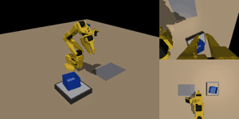
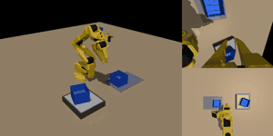

# 2026-10-07 n100 첫 결과: 단계별 76 / 84 / 50%, 연속 28%

> 한 줄 요약: 팀 1차 조건(단계별 시연 100회)을 시뮬레이션에서 재현한 ACT 는 1층 76%, 옆 84%, 2층 50%(각 50회)였고, 세 단계를 이어 하면 앞 단계 오차가 쌓여 28%까지 떨어졌다. 정책은 카메라로 통을 따라가지만(기울기 0.7~1.1), 2층 실패의 대부분은 그리퍼가 통 벽을 놓친 채 100스텝 청크를 끝까지 실행한 것이었다. 그래서 재학습 없이 25스텝마다 다시 계획하는 추론을 바로 시험한다. 밤사이 메모리 압박으로 큐가 한 번 종료돼 상한 설정을 고쳤다.

## 오늘 결과 한눈에

| 무엇을 봤나 | 결과 |
|---|---|
| n100 단계별 성공률 | 1층 **76%**, 옆 **84%**, 2층 **50%** (각 50회) |
| n100 연속 3단계 | 누적 68% → 44% → **28%** (50 시퀀스) |
| 실패 원인 | 2층 실패 25건 중 22건이 통을 못 들어 올림 (빈손으로 옮김) |
| 통을 보고 가는가 | 쥔 위치 ↔ 실제 통 위치 기울기 0.68~1.06 → 영상으로 통을 따라감 |
| ACT 연속 적재 장면 | 성공 시퀀스 촬영 (아래 그림) |
| 22:37 큐 종료 | oomd 가 제 서비스만 종료 (Claude·RustDesk 무사) → 상한 설정 수정 |

## 측정한 수치

| 항목 | 1층 | 옆 | 2층 | 조건 |
|---|---|---|---|---|
| 단계별 성공률 | 76% (38/50) | 84% (42/50) | 50% (25/50) | 시뮬레이션, 앞 단계 통은 목표 ±8mm, 평가 시드 501000~ |
| 성공 시 평균 위치 오차 | 7.7mm | 8.5mm | 6.7mm | 전문가는 2.1~2.5mm |
| 실패 유형 | 못 듦 7, 어긋남 4, 기울어짐 1 | 못 듦 3, 어긋남 4, 기울어짐 1 | 못 듦 22, 어긋남 1, 기울어짐 2 | `analyze.py` 분류 |
| 따라가기 기울기 x / y | 0.87 / 1.06 | 0.79 / 0.68 | 1.03 / 1.00 | 1 = 통 위치만큼 따라감 |
| 학습 곡선 (1만 / 2만 / 3만 스텝) | 70% / 67% / 76% | 60% / 63% / 84% | 43% / 47% / 50% | 1·2만은 30회, 3만은 50회 |
| 마지막 학습 손실 | 0.064 | 0.067 | 0.061 | 30,000스텝, 시작 약 6.4 |

| 연속 평가 | 값 |
|---|---|
| 누적 성공률 (1층 → 옆까지 → 2층까지) | 68% → 44% → 28% |
| 처음 실패한 단계 | 1층 16회, 옆 12회, 2층 8회, 실패 없음 14회 (50 시퀀스) |
| 앞 단계 성공 조건부 성공률 | 1층 0.68, 옆 0.65, 2층 0.64 |

| 시연 데이터 (추가) | 성공 / 시도 | 성공률 | 평균 오차 | 시간 |
|---|---|---|---|---|
| DART 1층 (σ=0.005) | 200 / 222 | 90.1% | 6.53mm | 25분 |
| DART 옆 | 200 / 229 | 87.3% | 6.46mm | 30분 |
| DART 2층 | 200 / 229 | 87.3% | 5.64mm | 36분 |
| 추가 1층 (n500·n1000 용) | 800 / 814 | 98.3% | 2.12mm | 105분 |
| 추가 옆 | 800 / 825 | 97.0% | 2.34mm | 89분 |

DART 시연의 평균 오차가 큰 것은 실행 동작에 잡음을 넣었기 때문 (정답 라벨은 깨끗한 궤적).

## 00:53 재계획(25스텝) 추론 결과 — 나아지지 않음

| 추론 방식 (n100 모델) | 1층 | 옆 | 2층 | 연속 누적 (1 → 2 → 3) |
|---|---|---|---|---|
| 기본: 청크 100 을 끝까지 실행 | 76% | 84% | 50% | 68 → 44 → 28% |
| 25스텝(0.83초)마다 다시 계획 (k25) | 78% | 70% | 54% | 66 → 36 → 24% |

- 각 50회, 같은 평가 장면. 차이는 오차 범위 안 (옆은 오히려 낮음)
- **원인은 "다시 보지 않아서"가 아니라 집기 동작 자체의 정밀도** → 데이터를 늘리는 쪽이 먼저
- 사용자 결정(10/7): **시연 100 → 200 → 500 → 1000 순서로 키우고, DART 는 마지막**. 지금 큐(v4)는 n200 학습 중이라 DART 차례가 오는 순간 자동으로 v5 로 바꾸는 감시 서비스(`act-swap`)를 띄움 (2층 추가 시연 생성을 끊지 않기 위해)
- 메모리: 큐 8.6GB 중 프로세스 2.1GB·파일 캐시 5.9GB → 상한을 9GB 로 올림 (서비스 재시작 없이). PiPER 11.3GB 와 합쳐도 약 24GB

## 01:00 DART 를 1000개로도 하기로

사용자 질문 "1000까지 하고 DART 도 1000개로 하는 게 좋나" → 추천: **DART 1000 추가 + DART 200 유지**

| 비교 | 보여 주는 것 |
|---|---|
| 일반 1000 vs DART 1000 | 데이터를 최대로 늘려도 DART 가 더 좋은가 → 최종 제안 모델 |
| 일반 200 vs DART 200 | 데이터가 적을 때 DART 효과 |
| 두 쌍 함께 | 데이터가 많아질수록 DART 효과가 줄어드는가 |

- DART 시연 800개×3 추가 생성을 별도 서비스 `act-gen-dart` (메모리 상한 1.5GB, 시드 7000, σ=0.005)로 시작 → n1000 이 끝날 때쯤 준비
- 큐 v5 순서: n200 → n500 → n1000 → **DART1000** → DART200 (일정이 밀리면 DART200 을 뺌)
- 예상: n200 05:30, n500 10:30, n1000 16:30, DART1000 22:00, DART200 10/8 03:00
- DART 설명: 시연 중 실행 동작에만 작은 잡음을 넣고 정답은 깨끗한 경로로 기록 → 어긋난 상태에서 돌아오는 법까지 학습 ([02_논문노트/DART.md](../../02_논문노트/DART.md))

## 그림으로 보기

### ACT 정책이 혼자 쌓은 장면 (n100, 스크립트 개입 없음, 논문 그림 5)

### 평가 GIF (왼쪽 전체, 오른쪽 손목·상단 카메라)

| 1층 성공 | 옆 성공 | 2층 성공 | 2층 실패 (빈손으로 옮김) |
|---|---|---|---|
|  |  |  |  |

연속 평가 (파일 이름의 o/x 가 1층·옆·2층 성공 여부):

| oox | oxx | xxx |
|---|---|---|
|  |  |  |

### 학습 손실 (n100)

## 한 일

| 시각 | 한 일 |
|---|---|
| 10/6 20:35 | n100 학습 끝 (3단계 동시 3만 스텝, 약 3시간 15분) |
| 21:31 | n100 평가 끝 (단계별 50 + 연속 50 + 학습 곡선용 1·2만 스텝 각 30) → n200 학습 시작 |
| 22:37 | systemd-oomd 가 `act-queue` 만 종료 (n200 4000스텝에서 멈춤) |
| 10/7 00:18 | 원인 확인, 평가 결과 분석, 실패 GIF 확인 |
| 00:21 | 메모리 설정 고쳐 큐 다시 시작, 재계획(25스텝) 추론 변형을 큐에 추가 |
| 00:22 | ACT 연속 적재 장면 촬영, 원고에 수치·그림 5 반영, 저장소 갱신 |

## 막힌 것과 해결

| 문제 | 원인 | 해결 |
|---|---|---|
| 22:37 큐 서비스 종료 (oomd) | PiPER 학습(11.3GB)이 다시 돌면서 제 n200 학습 3개가 `MemoryHigh` 근처에서 계속 억제됨 → 억제 자체가 메모리 압박(PSI 52.7% > 50%)으로 잡혀 oomd 가 제 서비스를 종료. Claude·RustDesk 는 무사 | `MemoryHigh` 빼고 `MemoryMax=8G` 만 (예상 최대 6.6GB). 전체 = PiPER 11.3 + 데스크톱 약 4 + 저 8 ≤ 23GB |
| 2층 집기 실패 | ACT 가 100스텝(3.3초) 청크를 다시 보지 않고 실행 → 벽을 놓쳐도 그대로 옮김 | 추론만 바꾸는 변형 추가: 25스텝마다 다시 계획(k25), 시간 앙상블(te) |
| PiPER 와 GPU 공유 | 같은 PC | n200 학습 속도 단계당 약 2.4 스텝/초 (n100 때 4.1) |

## 알게 된 것

- 팀 조건(시연 100)만으로도 단계별 76~84%(1층·옆)는 나오지만 2층은 50%, 연속 3단계는 28% → 순차 적재에서는 단계별 성공률보다 **연속 성공률**이 실제 성능
- 정책은 영상으로 통을 따라간다 (기울기 약 1). 문제는 위치 인식이 아니라 **집기 순간의 작은 오차를 고치지 못하는 것**
- ACT 기본 추론(청크 100 을 끝까지 실행)은 열린 고리(open-loop)라 놓친 집기를 되돌리지 못함 → 더 자주 다시 보는 추론이 첫 개선 후보
- oomd 는 cgroup 의 억제(MemoryHigh)도 압박으로 본다 → 상한은 MemoryMax 하나로, 실제 사용량보다 넉넉하게

## 다음에 할 것

- [x] n100 재계획(k25) 평가 → 효과 없음
- [ ] n200 학습·평가 + k25 + 시간 앙상블
- [ ] DART1000 학습·평가 (+k25), DART200
- [ ] 추가 시연 2층 800개 → n500 → n1000
- [ ] 그림 4 (시연 수에 따른 성공률), 원고 결과 문단 완성
