# 2026-10-08 시연 수·견고성·카메라 비교 결과, 2×2 두 층 팔레타이징

> 한 줄 요약 (07:10 기준): 시연 수를 1000 까지 늘려도 연속 성공률은 92~98% 로 시연 100 에서 이미 포화였다. 무작위화 + 정규화·CLAHE 는 책상 색·조명 변화에서 0~70% 이던 성공률을 90~100% 로 올렸고, 시연만 늘린 모델은 배경 변화에 여전히 약했다. 옆 단계에 남은 실패(1층 통이 옆 칸 쪽으로 밀릴 때 넘어짐)를 찾아 v8(간격 확보)로 고치는 중이고, 더 넓은 무작위화(v7)와 2×2 두 층 팔레타이징도 진행 중이다. 논문은 5쪽으로 다시 맞췄다.

## 🎬 그림·영상으로 보기 (10/8)

**같은 환경 변화에서 기존 모델(왼쪽) vs 무작위화 + 정규화·CLAHE 모델(오른쪽)** — 작은 창은 손목 카메라 화면 (`make_showcase.py --cond`, 단계별 평가 장면 0번)

책상이 짙은 갈색일 때 (1층): 기존은 저울 위 통을 찾지 못해 실패, v6c 는 성공

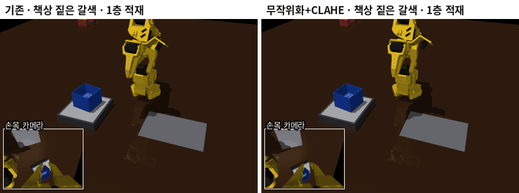

조명이 아주 어두울 때(30%, 옆 단계): 기존은 실패, v6c 는 성공

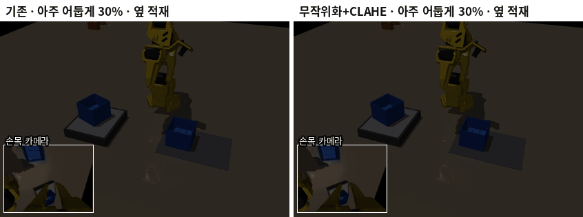

**CLAHE 를 넣으면 오히려 약해짐** — 체크무늬 책상, 옆 단계 (왼쪽 무작위화 + CLAHE 실패, 오른쪽 무작위화만 성공; 11:07 항목)

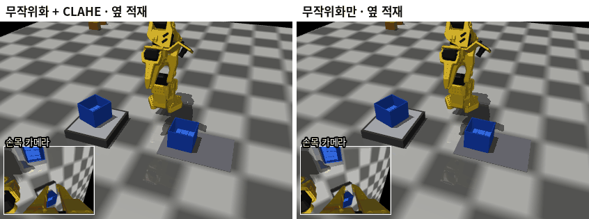

**견고성 한눈에** — 조건별 단계 평균 성공률 (회색: 기존 시연 100, 주황: 시연 1000, 파랑: 무작위화만, 초록: 무작위화 + CLAHE, `*` = 무작위화 범위 밖) — 파랑(CLAHE 없음)이 거의 모든 조건에서 가장 오른쪽

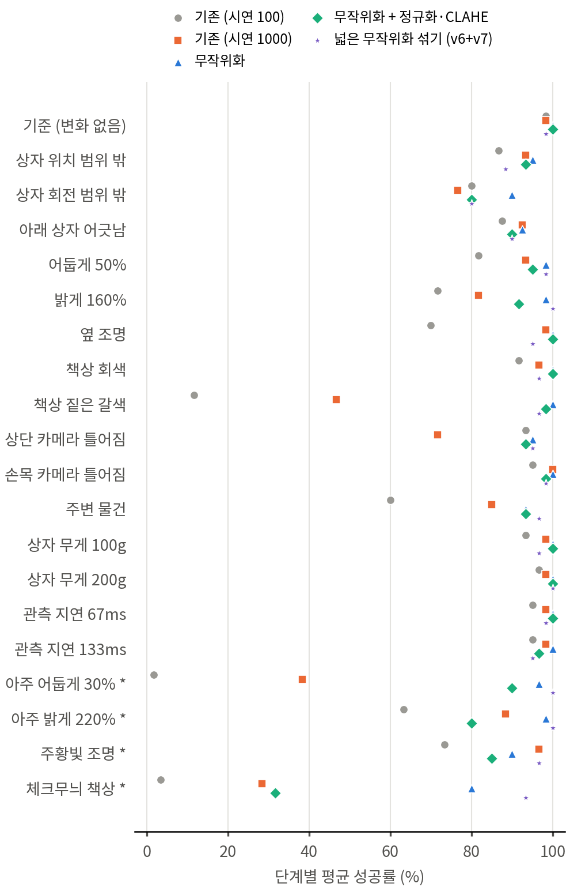

**시연 수에 따른 성공률** (논문 그림 4) — 시연 100 에서 이미 포화. 회색 점선은 잡는 벽이 바뀌던 v2 시연의 연속 성공률

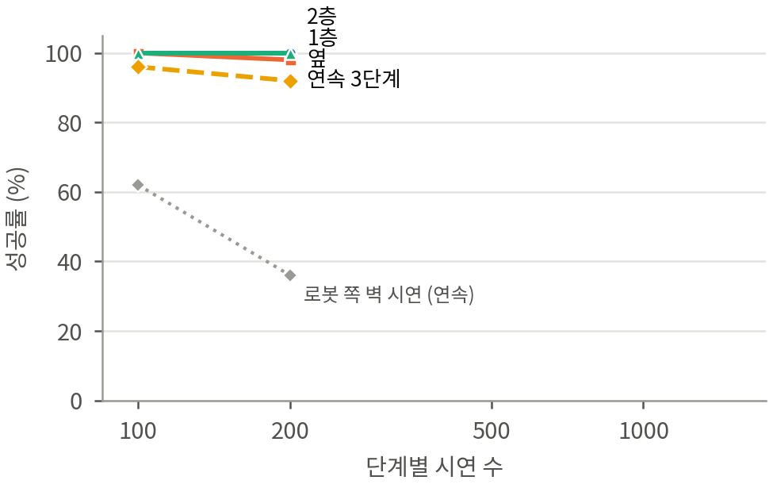

**평가 GIF (작은 창 3개: 전체 / 손목 / 상단 카메라)**

| 시연 500 연속 ooo | 시연 1000 연속 ooo | 무작위화+CLAHE 연속 ooo |
|---|---|---|
| 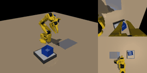 | 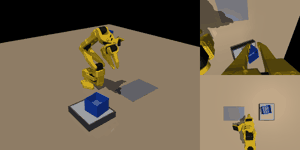 |  |

| 조건 (1층) | 기존 (v4 n100) | 무작위화 + CLAHE (v6c) |
|---|---|---|
| 책상 짙은 갈색 | 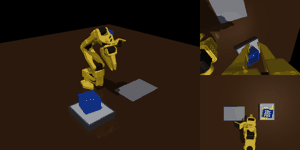 | 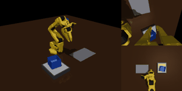 |
| 아주 어둡게 30% | 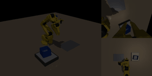 | 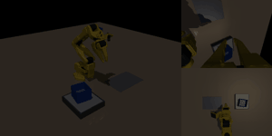 |
| 옆 조명 | 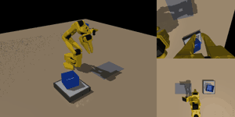 | 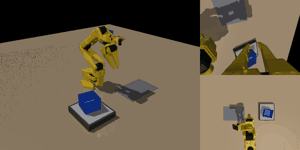 |

**2×2 두 층 팔레타이징 — 전문가가 8칸을 다 쌓은 모습** (배치 x 0.20 / y 0.03)

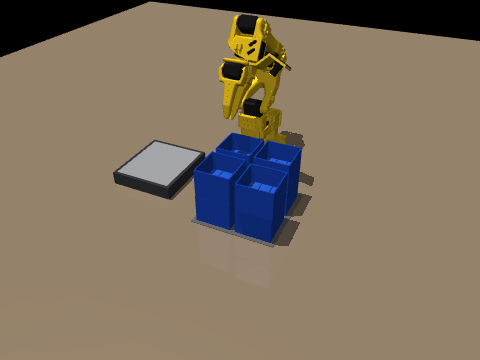

## 어제(10/7)까지 요약

| 항목 | 결과 |
|---|---|
| 최종 설계 (④: 여유 9mm + 늘 같은 벽 + 2층은 놓은 뒤 물러나기), 시연 100 | 단계별 100 / 100 / 100%, 연속 96% (50회) |
| 같은 모델 200회 (CPU) | 연속 99.0% (95% CI 96.4–99.7) |
| + 저울 확인 후 재시도 | **연속 200/200 = 100%** (95% CI 98.1–100) |
| 기존 모델 견고성 | 책상 어두우면 0~30%, 아주 어둡게·체크무늬 책상 0~5% → 무작위화·CLAHE 학습 중 |
| 팔레타이징 | 2×3 은 팔이 닿는 범위 밖이라 불가 → 2×2 두 층 배치 확정, 시연 생성 중 |

## 00:09 v5 n500 — 연속 98%

| 최종 설계 (④) | 1층 | 옆 | 2층 | 연속 |
|---|---|---|---|---|
| 시연 100 | 100% | 100% | 100% | 96% |
| 시연 200 | 100% | 98% | 100% | 92% |
| **시연 500** | **100%** | **98%** | **100%** | **98%** |

- 연속 실패 1건은 **1층 단계에서 통을 집지 못한 것**이다 (통이 저울에 남음, 위치 오차 268mm). 저울 재시도로 잡히는 종류다.
- 단계별 옆 실패 1건은 통 B 는 제자리(2.4mm)에 놓았지만 통 A 를 10mm 넘게 밀친 경우다.
- 1층·옆 정책은 v4 데이터의 n500, 2층은 v5 데이터의 n500 이다.

## 03:44 무작위화 + 정규화·CLAHE 모델 (v6c, 시연 1000) — 기본 환경에서도 연속 96%

| 모델 (기본 환경, 각 50회) | 1층 | 옆 | 2층 | 연속 |
|---|---|---|---|---|
| ④ 시연 100 (무작위화 없음) | 100% | 100% | 100% | 96% |
| ④ 시연 500 | 100% | 98% | 100% | 98% |
| **④ + 무작위화 + 정규화·CLAHE, 시연 1000 (v6c)** | **98%** | **100%** | **96%** | **96%** |

- 조명·책상 색·카메라 장착·주변 물건·넓은 위치 범위를 시연마다 바꿔 학습했는데도 **기본 환경 성능이 거의 그대로**다. 무작위화가 본 과제 성능을 깎지 않는다.
- 견고성 20조건 측정을 바로 시작했다 (CPU 3개, 조건·단계마다 20회). 기존 모델(v4 n100)과 같은 조건이다.
- 팔레타이징 시연: 칸 4·5·6·7 완성 (2층 칸은 시연 1개 약 100초), 칸 1·2·3·8 생성 중.

## 05:16 견고성 — 무작위화 + 정규화·CLAHE 로 대부분 회복 (v6c)

같은 20조건, 단계별 20회, **1층 / 옆 / 2층** (%). 기존 = v4 n100(무작위화 없음), v6c = ④ + 무작위화 + 정규화·CLAHE, 시연 1000.

| 조건 | 기존 | **v6c** | 조건 | 기존 | **v6c** |
|---|---|---|---|---|---|
| 기준 (변화 없음) | 100 / 100 / 95 | **100 / 100 / 100** | 책상 회색 | 95 / 95 / 85 | **100 / 100 / 100** |
| 어둡게 50% | 80 / 80 / 85 | **100 / 95 / 90** | **책상 짙은 갈색** | **0 / 5 / 30** | **100 / 95 / 100** |
| 밝게 160% | 65 / 70 / 80 | **100 / 100 / 75** | 상단 카메라 틀어짐 | 100 / 95 / 85 | 100 / 90 / 90 |
| **옆 조명** | 60 / 80 / 70 | **100 / 100 / 100** | 손목 카메라 틀어짐 | 100 / 100 / 85 | **100 / 95 / 100** |
| **주변 물건** | 45 / 70 / 65 | **95 / 85 / 100** | 상자 위치 범위 밖 | 95 / 90 / 75 | 90 / 100 / 90 |
| 상자 무게 100g | 100 / 100 / 80 | **100 / 100 / 100** | 상자 회전 범위 밖 | 90 / 85 / 65 | 70 / 95 / 75 |
| 상자 무게 200g | 100 / 100 / 90 | **100 / 100 / 100** | 아래 상자 어긋남 | — / 100 / 75 | — / 100 / 80 |
| 관측 지연 67ms | 100 / 100 / 85 | **100 / 100 / 100** | 관측 지연 133ms | 100 / 100 / 85 | 100 / 100 / 90 |
| *아주 어둡게 30%* | *0 / 0 / 5* | ***100 / 100 / 70*** | *아주 밝게 220%* | *60 / 65 / 65* | *60 / 100 / 80* |
| *주황빛 조명* | *90 / 70 / 60* | *90 / 90 / 75* | ***체크무늬 책상*** | ***0 / 5 / 5*** | ***45 / 15 / 35*** |

(*기울임* = v6 무작위화 범위 밖 조건)

- **크게 회복:** 책상 색, 어두운·옆 조명, 주변 물건이 0~70% 에서 90~100% 로 올랐다. 무게·지연·카메라 틀어짐은 원래 강했고 그대로 강하다.
- **남은 약점 = 학습 때 본 적 없는 종류의 변화:** 무늬 있는 책상(15~45%), 색이 섞인 조명, 아주 밝은 조명의 1층(60%), 2층이 몇몇 조명 조건에서 70~75%.
- 상자 회전 범위 밖의 1층(70%)은 무작위화 범위(±30°) 안인데도 낮다. 극단 회전·모서리 조합은 전문가도 실패가 있어(14~15/16) 시연이 적은 영역이다.

**다음 (v7): 무작위화를 한 단계 넓힌다.** 책상에 무작위 무늬(체크·줄무늬·얼룩)와 색, 조명에 색 섞기와 0.25~2.5배 세기를 넣는다. 상자 색은 그대로 파란색이다.

## 05:20 v7 — 무작위화를 한 단계 넓힘 (무늬 책상, 색 조명, 0.25~2.5배 밝기)

`StackEnv.randomize(level=2)`, `gen_data.py --dr-level 2` (`gen_v7.sh`, 서비스 `act-gen7`). v6 와 비교해 바뀐 것:

| 항목 | v6 | **v7** |
|---|---|---|
| 조명 세기 | 0.45~1.7배 | **0.25~2.5배** |
| 조명 색 | 흰색 | **절반은 색 섞기 (채널마다 0.55~1.3배)** |
| 조명 방향 | 위에서 0~30° | 0~35° |
| 책상 | 75% 임의 단색, 25% 원래 나무색 | **40% 임의 단색, 40% 무작위 무늬(체크·줄무늬·얼룩, 두 가지 임의 색), 20% 나무색** |
| 카메라 장착·주변 물건·넓은 위치 범위 | 같음 | 같음 |
| 상자 색 | 파란색 고정 | 파란색 고정 |

(v7 무작위 장면 8개 + 마지막은 원래 장면으로 되돌린 모습. 각 칸 왼쪽은 상단 카메라, 오른쪽은 손목 카메라.)

- 체크무늬 책상(견고성 시험의 범위 밖 조건)도 이제 무작위화에 들어가는 종류다. 그래서 v7 의 "체크무늬" 결과는 범위 밖 시험이 아니라 "예상해서 넣은 변수"로 해석한다.
- 학습·평가: `run_queue11.sh` (서비스 `act-queue11`) — v7 시연이 준비되면 3단계를 학습한다(정규화·CLAHE, 시연 1000). 남은 우선순위 낮은 학습보다 먼저 들어가도록 GPU 학습을 5개까지 허용한다. 학습이 끝나면 기본 평가와 견고성 20조건을 자동으로 돌린다.

## 05:36 시연 수 1000 — 시연 100 부터 이미 포화

| 최종 설계 (④), 각 50회 | 1층 | 옆 | 2층 | 연속 |
|---|---|---|---|---|
| 시연 100 | 100% | 100% | 100% | 96% |
| 시연 200 | 100% | 98% | 100% | 92% |
| 시연 500 | 100% | 98% | 100% | 98% |
| 시연 1000 | 100% | 98% | 100% | 94% |

- 시연 100~1000 의 연속 92~98% 는 50회 평가의 오차 범위 안이다. **시연 설계를 제대로 하면 팀 조건인 시연 100번으로 충분하다.**
- 남은 연속 실패는 두 종류다.
  1. 집기 실패 (통이 저울에 남음): n200 의 9번, n500 의 28번. 저울 재시도로 잡힌다.
  2. **옆 단계에서 통 B 가 넘어지거나 어긋남**: 시연 수와 상관없이 50회 중 2~3번 남는다.

### 옆 단계 실패의 원인 — 1층 통 A 가 옆 칸 쪽으로 밀려 놓일 때

1층이 성공한 시퀀스만 모아, 그 뒤 옆 단계 결과를 1층 통 A 의 위치와 맞춰 봤다.

| | A 가 옆 칸 쪽(+y)으로 밀린 거리 |
|---|---|
| 옆 단계 성공 (전체) | 평균 2.2mm, 표준편차 3.8mm, 4mm 넘음 29% |
| **옆 단계에서 B 가 넘어진 경우** | **9.2 ~ 11.2mm** (n200 의 30·49번, n1000 의 49번, v4 n200 의 26·30·49번) |

- 옆 칸 목표는 고정이고 통 사이 간격은 8mm 다. A 가 8mm 넘게 밀리면 B 가 A 의 벽 위에 걸쳐 놓이다가 넘어진다.
- 전문가도 같다 (각 10회): A 를 0 / 6 / 10 / 12mm 밀어 놓으면 v4 전문가는 10 / 9 / **5** / **1** 번 성공했다.

### 시연 설계 v8 (옆 단계만) — 실제 A 위치를 보고 간격 6mm 확보

- B 를 놓을 목표의 y 를 `max(옆 칸 목표, 실제 A 위치 + 64mm + 6mm)` 로 둔다. A 가 제자리면 원래 목표 그대로다. 성공 기준(옆 칸 목표 ±15mm, A 를 10mm 넘게 밀지 않기)은 바꾸지 않았다.
- 시연 장면에서 A 를 옆 칸 쪽으로 최대 13mm 까지 밀어 놓아, 정책이 이 상황을 보고 배우게 했다.
- **전문가 시험:** A 를 0 / 6 / 10 / 12mm 밀어도 **10 / 10 / 10 / 10** 번 성공했다.
- 반영 (자동):
  1. 최종 모델 v8 n100 = 1층 v4 + **옆 v8** + 2층 v5 (`run_queue12.sh`): 50회 평가 + 200회 평가 + 저울 재시도 200회
  2. 넓은 무작위화 v7 의 옆 단계 시연도 v8 규칙으로 다시 만든다 (`gen_v7.sh` 재시작)

## 05:56 견고성 — 시연만 늘린 모델(시연 1000)과 비교

단계별 20회, 1층 / 옆 / 2층 (%).

| 조건 | 기존 (③, 시연 100) | 시연 1000 (④, 무작위화 없음) | **무작위화 + CLAHE (v6c, 1000)** |
|---|---|---|---|
| 기준 | 100 / 100 / 95 | 100 / 95 / 100 | **100 / 100 / 100** |
| 어둡게 50% | 80 / 80 / 85 | 90 / 95 / 95 | **100 / 95 / 90** |
| 밝게 160% | 65 / 70 / 80 | 95 / 60 / 90 | **100 / 100 / 75** |
| 옆 조명 | 60 / 80 / 70 | 100 / 100 / 95 | **100 / 100 / 100** |
| 책상 회색 | 95 / 95 / 85 | 100 / 100 / 90 | **100 / 100 / 100** |
| **책상 짙은 갈색** | 0 / 5 / 30 | **85 / 20 / 35** | **100 / 95 / 100** |
| 주변 물건 | 45 / 70 / 65 | 80 / 90 / 85 | **95 / 85 / 100** |
| 상단 카메라 틀어짐 | 100 / 95 / 85 | 90 / 60 / 65 | **100 / 90 / 90** |
| 손목 카메라 틀어짐 | 100 / 100 / 85 | 100 / 100 / 100 | 100 / 95 / 100 |
| 상자 위치 범위 밖 | 95 / 90 / 75 | 100 / 90 / 90 | 90 / 100 / 90 |
| 상자 회전 범위 밖 | 90 / 85 / 65 | 95 / 65 / 70 | 70 / 95 / 75 |
| 아래 상자 어긋남 | — / 100 / 75 | — / 95 / 90 | — / 100 / 80 |
| 상자 무게 100 / 200g | 100 / 100 / 80~90 | 100 / 95 / 100 | **100 / 100 / 100** |
| 관측 지연 67 / 133ms | 100 / 100 / 85 | 100 / 95 / 100 | 100 / 100 / 90~100 |

- **시연만 늘려도** 조명(옆 조명 60~80 → 95~100%)과 주변 물건(45~70 → 80~90%)에는 강해진다.
- 하지만 **배경(책상 색)이 바뀌면 여전히 무너지고**(옆 단계 20%), 상단 카메라가 틀어지는 것에는 오히려 약해졌다(60~65%). 장면이 늘 같았던 시연을 더 많이 보면서 배경과 카메라 위치에 더 기대게 된 것으로 보인다.
- **무작위화 + 정규화·CLAHE** 는 이 두 가지까지 90~100% 로 올린다. → 논문 표 4 의 핵심 비교.
- 상자 회전 범위 밖은 세 모델 모두 65~95% 로 비슷하다. 시연 범위(±20°, 무작위화 ±30°)의 끝에서 전문가 시연 자체가 적은 영역이다.

## 06:14 시연 1000 + 저울 재시도 — 효과 없음 (실패 종류가 다름)

| ④ 시연 1000, 연속 50 시퀀스 | 1층까지 | 옆까지 | 2층까지 |
|---|---|---|---|
| 첫 시도만 | 100% | 94% | 94% |
| 저울 확인 후 재시도 | 100% | 94% | 94% |

- 이 모델의 연속 실패 3건은 **통을 집은 뒤 옆 칸에 놓다가 넘어지거나 어긋난 것**이라 통이 저울에 없다. 저울로는 잡을 수 없는 실패이고, 위 05:36 절의 분석(1층 통 A 가 옆 칸 쪽으로 밀림)과 맞는다. → v8 이 필요한 이유.

## 07:00 논문 5쪽으로 다시 맞춤

시연 수 그래프가 들어가면서 6쪽(참고문헌 대부분이 넘침)이 되어 줄였다.

| 바꾼 것 | 내용 |
|---|---|
| 뺀 것 | 적재 장면 그림(일지에 큰 GIF 가 있음), 파지 허용오차 표(수치는 본문 한 문장으로) |
| 다시 쓴 것 | 4.2: "실패 재생 → 원인 → 설계 수정" 흐름으로 ①→④ (연속 28 → 96%, 200회 99%, 재시도 100%) + 시연 수 포화 + ⑤(v8) 자리. 4.3: 시연만 늘리면 배경 변화에 약하고, 무작위화 + CLAHE 가 필요하다는 핵심만 |
| 번호 | 표 1 무게 인식, 표 2 적재 성공률, 표 3 환경 변화별 성공률, 그림 1 시스템, 2 시뮬레이션 셀, 3 실패와 통 회전각, 4 시연 수 |

- 결과: 5쪽, 마지막 쪽이 참고문헌으로 꽉 참. v8·DART·v7 결과가 들어갈 때 다시 조정한다.

## 07:10 진행 현황 (약 63%)

| 항목 | 진행 | 남은 것 |
|---|---|---|
| 데이터 생성 | 약 90% | v7 (넓은 무작위화) 40% → 약 9:30 |
| 학습 | 약 50% | 학습 중 4개(v6 2층, CLAHE 만 1층·옆, v8 옆) + 남은 24개(CLAHE 만 2층, DART 6, 카메라 비교 6, v7c 3, 팔레타이징 8) |
| 평가 | 약 55% | v8 최종 모델, v6, DART, 카메라 비교, v7c·견고성, 팔레타이징 |
| 분석·그림 | 약 70% | 견고성 표 완성, 팔레타이징 그림·GIF |
| 논문 | 약 85% | 남은 숫자, 결론 갱신 |

예상 (11:10 갱신, CPU 포화로 늦어짐): v8 결과 정오 전후 → v7 결과 10/9 새벽 → 팔레타이징 10/9 정오 → 카메라 비교·DART 10/9 저녁 → 10/10 원고 마무리 → 10/11~12 여유.

## 11:03 순서 조정 — 2×2 팔레타이징을 앞으로

CPU 가 꽉 차서(8코어에 부하 28) 학습 1개가 6~7시간 걸림. 남은 학습 24개 중 중요한 순서로 앞당김:
**v7 (넓은 무작위화) → 2×2×2 팔레타이징 8칸 → 카메라 비교 6개 → DART 200 (3개)**.
`run_queue9`·`run_queue10` 발사 루프를 잠시 멈추고(SIGSTOP, 돌고 있는 학습은 그대로), 팔레타이징 큐를 바로 시작(`act-queue-pal2`, `PAL_NOW=1`).
팔레타이징 8칸이 모두 시작되면 자동으로 다시 풀림(`act-resume910`).

## 11:07 v6 (무작위화만, CLAHE 없음) — CLAHE 를 빼는 쪽이 더 강함

**기본 평가 (각 50회, GPU)**: 1층 100% · 옆 98% · 2층 98% → **연속 98%** (v6c 96%, 시연 1000 94%)

**견고성 (조건별 단계 평균, %, 각 단계 20회)** — 굵게 = CLAHE 없는 v6 가 더 높음

| 조건 | 시연 1000 (무작위화 X) | v6 무작위화만 | v6c 무작위화 + CLAHE |
|---|---|---|---|
| 기준 (변화 없음) | 98 | 100 | 100 |
| 상자 위치 범위 밖 | 93 | **95** | 93 |
| 상자 회전 범위 밖 | 77 | **90** | 80 |
| 아래 상자 어긋남 | 92 | **92** | 90 |
| 어둡게 50% | 93 | **98** | 95 |
| 밝게 160% | 82 | **98** | 92 |
| 옆 조명 | 98 | 100 | 100 |
| 책상 회색 | 97 | 100 | 100 |
| 책상 짙은 갈색 | 47 | **100** | 98 |
| 상단 카메라 틀어짐 | 72 | **95** | 93 |
| 손목 카메라 틀어짐 | 100 | **100** | 98 |
| 주변 물건 | 85 | 93 | 93 |
| 상자 무게 100g / 200g | 98 / 98 | 100 / 100 | 100 / 100 |
| 관측 지연 67ms / 133ms | 98 / 98 | 100 / **100** | 100 / 97 |
| 아주 어둡게 30% * | 38 | **97** | 90 |
| 아주 밝게 220% * | 88 | **98** | 80 |
| 주황빛 조명 * | 97 | **90** | 85 |
| 체크무늬 책상 * | 28 | **80** | 32 |

- 20개 조건 중 **v6 가 13개에서 더 높고 7개는 같음, 낮은 조건은 0개**. 변화 15조건 평균 **98%** (v6c 95%, 시연 1000 89%)
- 가장 큰 차이는 **체크무늬 책상 80% vs 32%**. CLAHE 는 작은 영역마다 대비를 키우므로 책상 무늬까지 진하게 만들어 통이 묻힌 것으로 보임
- 아주 밝게(220%)에서도 CLAHE 쪽이 낮음(98 vs 80): 밝기 늘이기(1~99 백분위)가 포화된 화면을 오히려 잡음처럼 키움
- **결론: 무작위화를 하면 CLAHE 는 필요 없고 오히려 손해.** 조명 변화는 무작위화가 이미 흡수함
- 주황빛 조명만은 무작위화 없는 시연 1000 모델(97)이 v6(90)보다 높음 → v7 (색 조명까지 무작위화)에서 확인

**조치**: 11:08 v7 학습을 **CLAHE 없이** 다시 시작 (`s1_v7c_n1000` 은 6분 만에 중단, `act-queue11b`).
논문 3.2·4.3·초록도 "무작위화 98%, CLAHE 를 더하면 95% 로 하락" 으로 고침 (표 2 에 ④+무작위화 행, 표 3 에 v7 열 예정). 5쪽 유지.

체크무늬 책상 (`make_showcase.py compare --cond table_checker`, 단계별 평가 장면 0번). 왼쪽 = 무작위화 + CLAHE, 오른쪽 = 무작위화만:

1층 — 왼쪽은 목표에서 19mm 벗어나 실패, 오른쪽 성공

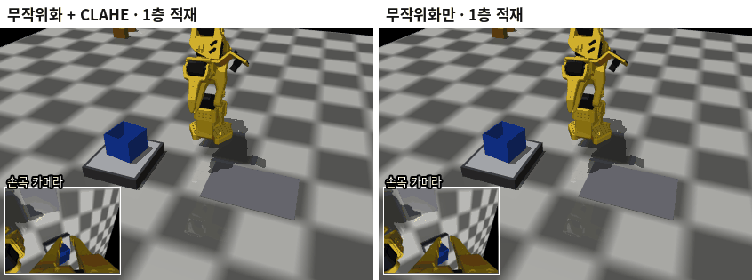

옆 단계 — 왼쪽은 통을 저울에서 제대로 옮기지 못해 실패, 오른쪽은 A 옆에 정확히 놓음

## 13:01 v8 최종 모델 결과 — 오히려 낮아짐 → 최종은 ④(v5) 유지

v8 = 옆 단계에서 실제 1층 통 A 위치를 보고 6mm 간격을 확보하도록 옆 통 B 를 옮겨 놓는 시연 (1·2층은 ④ 와 같은 모델).

| 평가 | ④ v5 (최종) | ⑤ v8 |
|---|---|---|
| 기본 50회 (GPU): 1층 / 옆 / 2층 | 100 / 100 / 100 | 100 / **94** / 100 |
| 기본 50회 연속 | 96% | 94% |
| 확장 200회 (CPU): 1층 / 옆 / 2층 | 100 / 100 / 99.5 | 100 / **95.0** / 99.5 |
| 확장 200회 연속 (95% CI) | **99.0%** (96.4–99.7) | 96.0% (92.3–98.0) |
| 저울 재시도 200회 연속 | **100%** (200/200) | 95.5% (재시도 0회 — 저울로는 못 잡는 실패) |

**원인**: 옆 단계 실패 10건이 **모두 통은 똑바로 섰지만 목표에서 15.6~20.6mm 벗어난 경우**. 넘어진 건 0건.
v8 은 A 가 옆 칸 쪽으로 밀렸을 때 B 를 그만큼 바깥으로 옮기도록 가르쳤는데, 정책이 이 이동량을 정확히 맞추지 못해 B 위치가 더 넓게 흩어짐
(목표 대비 평균 +5.8mm·표준편차 5.3mm, v5 는 +4.0mm·3.5mm) → 판정 기준(15mm)을 넘음. **판정 기준은 그대로 두었으므로 v8 은 탈락.**

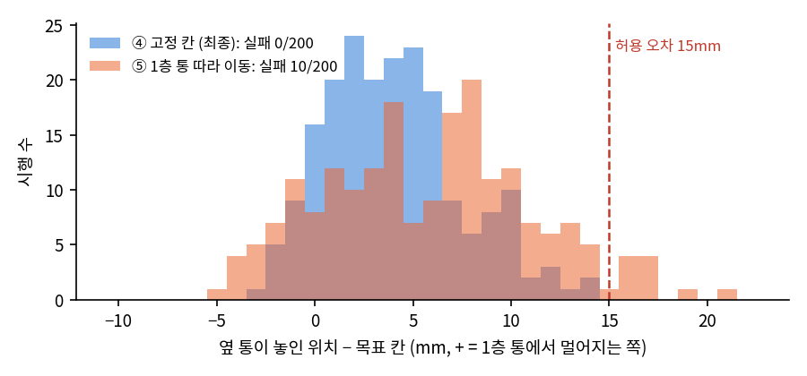

- v8 이 노린 실패(A 가 9~11mm 밀렸을 때 넘어짐)는 시연 500·1000 모델에서 보인 것이고, 최종 v5 n100 의 200회 평가에는 없었음
- **최종 모델은 ④ v5 n100 그대로**: 200회 99.0%, 저울 재시도 포함 **200/200 = 100%**
- 논문: 표 2 의 ⑤ 행을 빼고 4.2 에 한 문장으로 정리 (5쪽 유지)

## 13:04 v7 옆 단계 시연 다시 생성 (v8 규칙 → v4 규칙)

v7(넓은 무작위화) 옆 단계 시연도 v8 규칙으로 만들어 두었기 때문에, 같은 문제를 피하려고 **v4 규칙(옆 통은 항상 고정 칸)으로 다시 생성**
(`gen_v7b.sh`, 같은 시드, 200개 × 5 병렬). 35분 돌던 `s2_v7_n1000` 은 중단, 기존 데이터는 `data/v7v8_stage2.jpk.npz` 로 보관.
새 데이터가 나오면 `run_queue11c.sh` 가 옆 단계를 학습하고, 1·2층(`act-queue11b`)이 끝나면 v7 평가 + 견고성 20조건까지 자동 진행.

## 13:25 CLAHE 만 적용 (v5c, 무작위화 없음, 시연 200) — CLAHE 단독도 효과 없음

같은 시연(④, 200개)에서 CLAHE 만 넣고 뺀 두 모델을 조명 조건에서 비교 (단계별 20회, 1층 / 옆 / 2층 %):

| 조건 | v5 n200 (CLAHE 없음) | v5c n200 (CLAHE) |
|---|---|---|
| 기준 | 100 / 100 / 100 | 100 / 100 / 100 |
| 어둡게 50% | 95 / 90 / 90 (평균 92) | 90 / 95 / 100 (평균 95) |
| 밝게 160% | 65 / 85 / 95 (평균 82) | 90 / 95 / 60 (평균 82) |
| 옆 조명 | 85 / 85 / 90 (평균 87) | 65 / 75 / 45 (평균 **62**) |
| **조명 3조건 평균** | **87** | 79 |

- 어둡게는 조금 좋아지지만(92→95), **옆 조명에서 87→62% 로 크게 떨어짐**. 한쪽만 밝은 화면에서 CLAHE 가 그림자 쪽 대비를 과하게 키우는 것으로 보임
- 무작위화와 함께 써도(v6c), 혼자 써도(v5c) CLAHE 는 이득이 없음 → **최종 결론: CLAHE 제외, 무작위화만**
- 14:25 기본 환경 평가(각 50회): v5c 96 / 100 / 100%, 연속 96% — v5 n200(100 / 98 / 100%, 연속 92%)과 차이 2건으로 오차 범위 안(95% CI 겹침). 기본 환경에서는 CLAHE 가 해가 되지는 않지만, 조명이 바뀌면 손해

**논문 갱신 (5쪽 유지)**
- 4.3: "무작위화 없이 CLAHE 만 쓴 경우도 조명 세 조건 평균 79% 로 쓰지 않은 경우(87%)보다 낮았다" 추가
- 결론: 옛 숫자(28→82%)를 최종 숫자로 교체 → "연속 28% → **99.0%** (95% CI 96.4–99.7), 저울 재시도 포함 **100%**, 무작위화로 환경 변화 15조건 평균 **98%**, CLAHE 는 오히려 낮춤"
- 3.2·4.3 의 겹치는 설명을 줄여 5쪽에 맞춤

## 15:15 DART 1000 — 시연 1000 과 차이 없음

DART = 시연 중 실제 관절 목표에 작은 상관 잡음(σ=0.005rad)을 넣고, 정답은 원래 궤적으로 기록 → 궤도에서 벗어났다가 돌아오는 동작을 함께 학습.

| 평가 (각 50회, GPU) | 1층 | 옆 | 2층 | 연속 (95% CI) |
|---|---|---|---|---|
| ④ 시연 1000 | 100 | 98 | 100 | 94% (84–98) |
| ④ + DART 1000 | 100 | 96 | 100 | 96% (87–99) |
| ④ 시연 100 (최종) | 100 | 100 | 100 | 96% (87–99) |

- 실패 유형: 옆 단계 단독 2건은 목표에서 24~25mm 벗어남(1건은 A 를 건드림), 연속 2건은 2층에서 15~16.5mm·기울기 3~5° 로 판정 경계 바로 밖
- **DART 로도 개선 없음** — 남은 실패는 궤도 이탈 회복 문제가 아니라 놓는 위치의 작은 흩어짐. 시연 100 에서 이미 포화된 것과 같은 결론
- 논문 4.2 에 "DART 잡음 주입(1000회)도 96% 로 차이가 없었다" 추가 (5쪽 유지)

DART 1000 연속 평가 1번 장면 (1층 → 옆 → 2층 모두 성공):

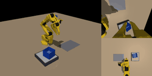

## 18:08 v7 (넓은 무작위화, CLAHE 없음) — 체크무늬는 좋아졌지만 정밀도가 떨어짐

v7 = 조명 0.25~2.5배 + 색 조명, 책상 무늬(체크·줄무늬·얼룩) 까지 무작위화한 시연 1000개/단계 (옆 단계는 v4 규칙으로 다시 만든 것).

**기본 평가 (각 50회)**: 1층 98% · 옆 92% · 2층 94% → **연속 82%** (v6 98%)

**견고성 (조건별 단계 평균, %, 각 단계 20회)**

| 조건 | v6 무작위화 | v7 넓은 무작위화 |
|---|---|---|
| 기준 | 100 | 97 |
| 상자 위치 / 회전 범위 밖 | 95 / 90 | 90 / 75 |
| 어둡게 / 밝게 / 옆 조명 | 98 / 98 / 100 | 95 / 98 / 95 |
| 책상 회색 / 짙은 갈색 | 100 / 100 | 93 / 95 |
| 상단 / 손목 카메라 틀어짐 | 95 / 100 | 88 / 95 |
| 주변 물건 | 93 | 93 |
| 아주 어둡게 / 아주 밝게 * | 97 / 98 | 93 / 93 |
| 주황빛 조명 * | 90 | 90 |
| **체크무늬 책상 *** | 80 | **90** |
| **20조건 평균** | **96.4** | 92.6 |

- 체크무늬 책상만 80→90% 로 좋아지고 나머지는 대부분 조금씩 낮아짐. **약한 곳은 거의 모두 옆 단계**(70~95%)
- 원인: 실패는 v8 때처럼 **통은 똑바로 섰지만 15~21mm 벗어남**. 놓는 위치가 전체적으로 바깥쪽(+y)으로 치우침
  (기본 평가 1층 +6.9mm, 옆 +7.3mm ± 5.1 / v6 은 1층 +2.0mm). 학습 손실은 v6 과 같음(0.076~0.082) → 덜 배운 게 아니라
  화면 변화 범위가 너무 넓어 위치를 덜 정확히 읽는 것 (넓이와 정밀도의 맞교환)
- 논문 4.3 에 한 문장 추가, 표 3 에 v7 열 (CLAHE 열은 본문 숫자로 대신하고 뺌), 표 2 에서 그림 4 와 겹치는 ④ 200·500 행 정리 → 5쪽 유지

v7 옆 단계 — 왼쪽: 체크무늬 책상에서 성공 / 오른쪽: 평범한 회색 책상에서 바깥쪽으로 치우쳐 실패:

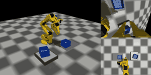 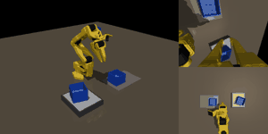

**다음 시도 — v67 (v6 + v7 시연 섞기, 2000개/단계)**: v6 의 정밀도와 v7 의 넓은 범위를 함께 얻으려는 것.
CPU 가 한가해져서(부하 5.6) 팔레타이징 학습 옆에 바로 시작 (`run_queue13.sh`, `act-queue13`, 18:10). 학습 → 평가 → 견고성 20조건 자동.

## 19:55 판정 기준 민감도 — 15mm 기준이 숫자를 얼마나 좌우하나

"98%·100% 는 어떤 기준인가" 질문에 답하면서, 최종 모델(④ v5 n100) 200회 평가를 **같은 실행 결과에 기준만 바꿔** 다시 판정:

| 수평 허용 오차 | 1층 | 옆 | 2층 | 연속 |
|---|---|---|---|---|
| **15mm (사용 기준)** | 100 | 100 | 99.5 | **99.0** |
| 10mm | 99.5 | 93.5 | 92.0 | 87.5 |
| 7.5mm | 92.5 | 83.5 | 75.0 | 60.0 |
| 5mm | 78.5 | 65.0 | 42.0 | 20.0 |

- 평균 위치 오차 1층 3.6 / 옆 4.4 / 2층 5.9mm (최대 15.0mm)
- 공인 벤치마크가 아니라 이 연구에서 정한 과제·기준이므로, 모델끼리 비교하는 용도. 판정 기준은 처음부터 바꾸지 않음
- **논문 4.2 에 "평균 위치 오차 3.6, 4.4, 5.9mm, 허용 오차를 10mm 로 줄이면 87.5%" 추가** (기준에 따른 과장 오해 방지), 표 2 설명 문장을 줄여 5쪽 유지

## 19:40 실제 ACT 시연 데이터 찾기 — 없음

사람이 조종한 시연(LeRobot 데이터셋)으로 시뮬레이션 비교가 가능한지 찾아봄:
`kakabab12` 저장소 9개(포트폴리오 스마트팩토리 비전검사 폴더 전체 + 커밋 기록 11개 포함), 공동작업 저장소 5개, Hugging Face 공개 데이터셋 — **시연 데이터(.parquet, meta/info.json, 영상)와 ACT 체크포인트 없음**.
코드에 남은 이름은 평가 기록 `cjfgn/eval_floor1`(1회분) 뿐. 팀원 Jetson·학습 PC·비공개 Hugging Face 에 있을 가능성 → 나오면 사람 시연 재생 분석 추가, 없으면 현재 구성(인식부 실측 + 시뮬레이션 정량 평가) 유지.

## 20:12 모방학습이 맞는지 검증 — 코드·데이터·실험 4가지

"지금까지 한 게 정말 모방학습인가" 확인 요청에 대해, 설명이 아니라 코드와 데이터를 직접 검사함.

| 확인 항목 | 방법 | 결과 |
|---|---|---|
| ① 학습 데이터에 정답(통 위치)이 없는가 | 학습 데이터 파일(`*.jpk.npz`) 열어 보기 | `state`(관절 6) · `action`(관절 목표 6) · 카메라 영상(JPEG) 만 있음. **통 위치 없음** (적재·DR·팔레트 데이터 모두 동일) |
| ② 평가 때 로봇을 움직이는 게 ACT 인가 | `eval_act.py` `run_stage` | 매 스텝 `policy.select_action(관절 + 영상 2개)` 로만 움직임. 스크립트는 시작 자세(홈) 계산에만 사용. 통 위치는 **판정·기록용**으로만 읽음 |
| ③ 평가 장면이 학습 장면과 다른가 | 난수 시드 범위 비교 | 시연 101,000~331,004 / 평가 501,000~503,199·590,000~590,199 / 팔레트 시연 22,000~29,000·평가 800,000~ → **겹침 없음** |
| ④ 정말 카메라를 보고 움직이는가 (실험) | 최종 모델로 같은 장면을 ⓐ정상 ⓑ**카메라 화면을 검게 가리고** 실행 (`verify_il.py`, 단계별 10회) | ⓐ 30/30 성공 → ⓑ **0/30, 한 번도 통을 잡지 못함** |
| ④-2 집는 위치가 통을 따라가는가 | 200회 평가 기록: 실제 통 위치 vs 그리퍼가 닫힌 위치 | 통이 40mm 범위에서 움직일 때 기울기 **0.91~1.11**, 상관 **0.84~0.99** (1이면 정확히 따라감) |

**결론: 모방학습(행동 복제)이 맞음.** 정답을 아는 건 시연을 만드는 스크립트뿐이고, 학습된 ACT 는 카메라 영상과 관절 각도만 보고 통 위치를 스스로 찾아 움직임.
사람 시연이 아니라 스크립트 시연이라는 점만 실제 팀 실험과 다름 (논문에 한계로 명시).

참고: 저울 재시도의 "통이 아직 저울 위인가" 판단은 실제 셀의 무게 값 대신 시뮬레이터의 통 위치로 대신함 — 정책 입력이 아니라 시스템 쪽 재실행 판단에만 쓰임.
7-segment 인식은 모방학습이 아니라 YOLO 객체 탐지(지도학습).

논문 4.2 에 "영상을 가리면 세 단계 모두 0/10 으로, 정책은 영상에서 통을 찾아 움직였다" 추가 (DART·추론 시간 문장을 줄여 5쪽 유지).

## 한 일

| 시각 | 한 일 |
|---|---|
| 00:09 | v5 n500 평가 끝 (연속 98%) |
| 00:30~03:44 | n1000(1층·옆), v6c 3단계, v6(1층) 학습 끝, 팔레타이징 시연 칸 4~7 완성 |
| 03:44 | v6c 평가 (연속 96%) → 견고성 20조건 측정 시작 |
| 05:14 | 팔레타이징 시연 8칸 모두 완성 |
| 05:16 | v6c 견고성: 책상 짙은 갈색 0→100%, 아주 어둡게 0→100%(1층), 체크무늬는 여전히 약함 → v7 결정 |
| 05:20 | v7 무작위화 구현·장면 확인, v7 시연 생성(`act-gen7`)과 학습·평가 큐(`act-queue11`) 시작 |
| 05:36 | v5 n1000 평가 (연속 94%) → 옆 단계 실패 원인 분석 (A 가 9~11mm 밀림) |
| 05:56 | 시연 1000 모델 견고성 완료 → 세 모델 비교 |
| 06:00 | v8 (옆 단계 간격 확보) 전문가 시험 10/10 → v8 시연 생성, 최종 모델 평가 큐(`act-queue12`), v7 옆 단계 다시 생성 |
| 06:08 | v8 옆 단계 시연 200개 완성 → 학습 시작 |
| 06:14 | 시연 1000 + 저울 재시도: 94% 그대로 (넘어짐은 저울로 못 잡음) |
| 06:23 | 시연 1000·v6c 의 무작위화 범위 밖 견고성 완료 |
| 07:00 | 논문 5쪽으로 압축 (그림·표 정리, 4.2·4.3 재작성) |
| 07:40 | 견고성 비교 큰 GIF(책상 짙은 갈색, 아주 어둡게), 견고성 그림, 평가 GIF 를 일지 맨 위에 추가 |
| 10:45 | v7 시연 3단계 완성 (넓은 무작위화) |
| 11:03 | 학습 순서 조정: v7 → 팔레타이징 → 카메라 비교 → DART 200 |
| 11:07 | v6 평가 (연속 98%)·견고성: CLAHE 없는 쪽이 13조건 우세 → v7 을 CLAHE 없이 재시작, 논문 수정 |
| 13:01 | v8 최종 평가: 옆 단계 95% (B 위치가 15mm 넘게 흩어짐) → 탈락, 최종은 v5 유지 (재시도 포함 100%) |
| 13:04 | v7 옆 단계 시연을 v4 규칙으로 다시 생성, 자동 학습·평가 큐(`act-queue11c`) |
| 13:25 | CLAHE 단독(v5c) 견고성: 조명 평균 79% < 87% → CLAHE 제외 확정, 논문 4.3·결론 갱신 (5쪽) |
| 13:44 | 2×2×2 팔레타이징 1번 칸 학습 시작 |
| 13:51 | v7 옆 단계 시연(v4 규칙) 1000개 완성 (전문가 성공률 93.5~98.5%) → 학습 시작 |
| 14:25 | v5c 기본 평가: 연속 96% (v5 n200 92%, 오차 범위 안) |
| 14:30 | DART 1000 학습 끝, 팔레타이징 2번 칸 학습 시작 |
| 15:15 | DART 1000 평가: 연속 96% (시연 1000 94%) — 차이 없음, 논문 4.2 갱신 |
| 15:20 | DART 200 취소 (효과 없음 확인) → 카메라 비교가 팔레타이징 다음으로 |
| 13:44~17:18 | 팔레타이징 1~6번 칸 학습 시작 (1·2번 칸 완료) |
| 16:38 | v7 학습 끝 → 평가·견고성 |
| 18:08 | v7: 연속 82%, 20조건 평균 92.6% (체크무늬만 90% 로 개선) → v6 이 최종 견고 모델, 논문 갱신 |
| 18:10 | v67 (v6 + v7 섞기, 2000개/단계) 학습 시작 |
| 19:40 | 실제 ACT 시연 데이터 탐색 (깃허브·HF) → 없음 |
| 19:55 | 판정 기준 민감도 분석, 논문에 평균 위치 오차·10mm 기준 결과 추가 (5쪽) |
| 20:12 | 모방학습 검증 (데이터·코드·시드·카메라 가림 실험 0/30) → 논문 반영 |

## 다음에 할 것

- [x] v5 n1000, v6c 결과와 견고성 비교
- [x] v8 최종 모델 (옆 단계 간격 확보) → 95% 로 낮아져 탈락, 최종은 v5 (200/200)
- [x] v6 (무작위화만) → CLAHE 를 더하면 오히려 낮아짐 확인 (98 vs 95%)
- [x] CLAHE 만 적용(v5c n200) → 조명 평균 79% (CLAHE 없이 87%), 단독으로도 효과 없음
- [x] v7 (넓은 무작위화) → 체크무늬 80→90% 지만 정밀도 하락 (연속 82%, 평균 92.6%)
- [ ] v67 (v6 + v7 섞기) → 정밀도와 범위 둘 다 되는지
- [x] DART 1000 → 연속 96%, 시연 1000 과 차이 없음
- [x] DART 200 → **취소** (DART 1000 도 효과가 없어서, 그 시간(학습 3개 ≈ 6시간)을 카메라 비교·팔레타이징에 씀)
- [ ] 카메라 비교 (손목만 / 상단만) — 팔레타이징 8칸이 모두 시작되면 자동 시작
- [ ] 2×2 두 층 팔레타이징 학습·평가, GIF
- [ ] 논문 숫자 채우기·결론 갱신 (5쪽 유지)
