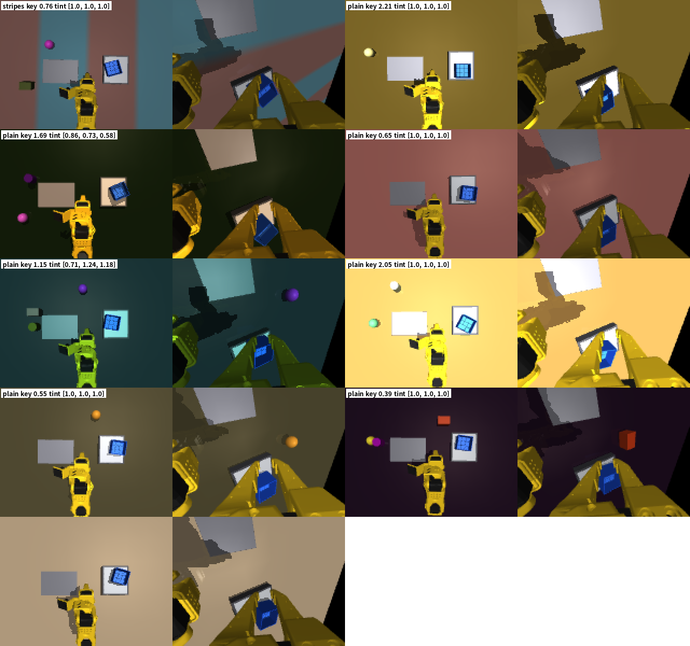

# 2026-10-08 시연 수·견고성·카메라 비교 결과, 2×2 두 층 팔레타이징

> 한 줄 요약: (진행하며 채움)

## 어제(10/7)까지 요약

| 항목 | 결과 |
|---|---|
| 최종 설계 (④: 여유 9mm + 늘 같은 벽 + 2층은 놓은 뒤 물러나기), 시연 100 | 단계별 100 / 100 / 100%, 연속 96% (50회) |
| 같은 모델 200회 (CPU) | 연속 99.0% (95% CI 96.4–99.7) |
| + 저울 확인 후 재시도 | **연속 200/200 = 100%** (95% CI 98.1–100) |
| 기존 모델 견고성 | 책상 어두우면 0~30%, 아주 어둡게·체크무늬 책상 0~5% → 무작위화·CLAHE 학습 중 |
| 팔레타이징 | 2×3 은 팔이 닿는 범위 밖이라 불가 → 2×2 두 층 배치 확정, 시연 생성 중 |

## 00:09 v5 n500 — 연속 98%

| 최종 설계 (④) | 1층 | 옆 | 2층 | 연속 |
|---|---|---|---|---|
| 시연 100 | 100% | 100% | 100% | 96% |
| 시연 200 | 100% | 98% | 100% | 92% |
| **시연 500** | **100%** | **98%** | **100%** | **98%** |

- 연속 실패 1건은 **1층 단계에서 통을 집지 못한 것**이다 (통이 저울에 남음, 위치 오차 268mm). 저울 재시도로 잡히는 종류다.
- 단계별 옆 실패 1건은 통 B 는 제자리(2.4mm)에 놓았지만 통 A 를 10mm 넘게 밀친 경우다.
- 1층·옆 정책은 v4 데이터의 n500, 2층은 v5 데이터의 n500 이다.

## 03:44 무작위화 + 정규화·CLAHE 모델 (v6c, 시연 1000) — 기본 환경에서도 연속 96%

| 모델 (기본 환경, 각 50회) | 1층 | 옆 | 2층 | 연속 |
|---|---|---|---|---|
| ④ 시연 100 (무작위화 없음) | 100% | 100% | 100% | 96% |
| ④ 시연 500 | 100% | 98% | 100% | 98% |
| **④ + 무작위화 + 정규화·CLAHE, 시연 1000 (v6c)** | **98%** | **100%** | **96%** | **96%** |

- 조명·책상 색·카메라 장착·주변 물건·넓은 위치 범위를 시연마다 바꿔 학습했는데도 **기본 환경 성능이 거의 그대로**다. 무작위화가 본 과제 성능을 깎지 않는다.
- 견고성 20조건 측정을 바로 시작했다 (CPU 3개, 조건·단계마다 20회). 기존 모델(v4 n100)과 같은 조건이다.
- 팔레타이징 시연: 칸 4·5·6·7 완성 (2층 칸은 시연 1개 약 100초), 칸 1·2·3·8 생성 중.

## 05:16 견고성 — 무작위화 + 정규화·CLAHE 로 대부분 회복 (v6c)

같은 20조건, 단계별 20회, **1층 / 옆 / 2층** (%). 기존 = v4 n100(무작위화 없음), v6c = ④ + 무작위화 + 정규화·CLAHE, 시연 1000.

| 조건 | 기존 | **v6c** | 조건 | 기존 | **v6c** |
|---|---|---|---|---|---|
| 기준 (변화 없음) | 100 / 100 / 95 | **100 / 100 / 100** | 책상 회색 | 95 / 95 / 85 | **100 / 100 / 100** |
| 어둡게 50% | 80 / 80 / 85 | **100 / 95 / 90** | **책상 짙은 갈색** | **0 / 5 / 30** | **100 / 95 / 100** |
| 밝게 160% | 65 / 70 / 80 | **100 / 100 / 75** | 상단 카메라 틀어짐 | 100 / 95 / 85 | 100 / 90 / 90 |
| **옆 조명** | 60 / 80 / 70 | **100 / 100 / 100** | 손목 카메라 틀어짐 | 100 / 100 / 85 | **100 / 95 / 100** |
| **주변 물건** | 45 / 70 / 65 | **95 / 85 / 100** | 상자 위치 범위 밖 | 95 / 90 / 75 | 90 / 100 / 90 |
| 상자 무게 100g | 100 / 100 / 80 | **100 / 100 / 100** | 상자 회전 범위 밖 | 90 / 85 / 65 | 70 / 95 / 75 |
| 상자 무게 200g | 100 / 100 / 90 | **100 / 100 / 100** | 아래 상자 어긋남 | — / 100 / 75 | — / 100 / 80 |
| 관측 지연 67ms | 100 / 100 / 85 | **100 / 100 / 100** | 관측 지연 133ms | 100 / 100 / 85 | 100 / 100 / 90 |
| *아주 어둡게 30%* | *0 / 0 / 5* | ***100 / 100 / 70*** | *아주 밝게 220%* | *60 / 65 / 65* | *60 / 100 / 80* |
| *주황빛 조명* | *90 / 70 / 60* | *90 / 90 / 75* | ***체크무늬 책상*** | ***0 / 5 / 5*** | ***45 / 15 / 35*** |

(*기울임* = v6 무작위화 범위 밖 조건)

- **크게 회복:** 책상 색, 어두운·옆 조명, 주변 물건이 0~70% 에서 90~100% 로 올랐다. 무게·지연·카메라 틀어짐은 원래 강했고 그대로 강하다.
- **남은 약점 = 학습 때 본 적 없는 종류의 변화:** 무늬 있는 책상(15~45%), 색이 섞인 조명, 아주 밝은 조명의 1층(60%), 2층이 몇몇 조명 조건에서 70~75%.
- 상자 회전 범위 밖의 1층(70%)은 무작위화 범위(±30°) 안인데도 낮다. 극단 회전·모서리 조합은 전문가도 실패가 있어(14~15/16) 시연이 적은 영역이다.

**다음 (v7): 무작위화를 한 단계 넓힌다.** 책상에 무작위 무늬(체크·줄무늬·얼룩)와 색, 조명에 색 섞기와 0.25~2.5배 세기를 넣는다. 상자 색은 그대로 파란색이다.

## 05:20 v7 — 무작위화를 한 단계 넓힘 (무늬 책상, 색 조명, 0.25~2.5배 밝기)

`StackEnv.randomize(level=2)`, `gen_data.py --dr-level 2` (`gen_v7.sh`, 서비스 `act-gen7`). v6 와 비교해 바뀐 것:

| 항목 | v6 | **v7** |
|---|---|---|
| 조명 세기 | 0.45~1.7배 | **0.25~2.5배** |
| 조명 색 | 흰색 | **절반은 색 섞기 (채널마다 0.55~1.3배)** |
| 조명 방향 | 위에서 0~30° | 0~35° |
| 책상 | 75% 임의 단색, 25% 원래 나무색 | **40% 임의 단색, 40% 무작위 무늬(체크·줄무늬·얼룩, 두 가지 임의 색), 20% 나무색** |
| 카메라 장착·주변 물건·넓은 위치 범위 | 같음 | 같음 |
| 상자 색 | 파란색 고정 | 파란색 고정 |

(v7 무작위 장면 8개 + 마지막은 원래 장면으로 되돌린 모습. 각 칸 왼쪽은 상단 카메라, 오른쪽은 손목 카메라.)

- 체크무늬 책상(견고성 시험의 범위 밖 조건)도 이제 무작위화에 들어가는 종류다. 그래서 v7 의 "체크무늬" 결과는 범위 밖 시험이 아니라 "예상해서 넣은 변수"로 해석한다.
- 학습·평가: `run_queue11.sh` (서비스 `act-queue11`) — v7 시연이 준비되면 3단계를 학습한다(정규화·CLAHE, 시연 1000). 남은 우선순위 낮은 학습보다 먼저 들어가도록 GPU 학습을 5개까지 허용한다. 학습이 끝나면 기본 평가와 견고성 20조건을 자동으로 돌린다.

## 05:36 시연 수 1000 — 시연 100 부터 이미 포화

| 최종 설계 (④), 각 50회 | 1층 | 옆 | 2층 | 연속 |
|---|---|---|---|---|
| 시연 100 | 100% | 100% | 100% | 96% |
| 시연 200 | 100% | 98% | 100% | 92% |
| 시연 500 | 100% | 98% | 100% | 98% |
| 시연 1000 | 100% | 98% | 100% | 94% |

- 시연 100~1000 의 연속 92~98% 는 50회 평가의 오차 범위 안이다. **시연 설계를 제대로 하면 팀 조건인 시연 100번으로 충분하다.**
- 남은 연속 실패는 두 종류다.
  1. 집기 실패 (통이 저울에 남음): n200 의 9번, n500 의 28번. 저울 재시도로 잡힌다.
  2. **옆 단계에서 통 B 가 넘어지거나 어긋남**: 시연 수와 상관없이 50회 중 2~3번 남는다.

### 옆 단계 실패의 원인 — 1층 통 A 가 옆 칸 쪽으로 밀려 놓일 때

1층이 성공한 시퀀스만 모아, 그 뒤 옆 단계 결과를 1층 통 A 의 위치와 맞춰 봤다.

| | A 가 옆 칸 쪽(+y)으로 밀린 거리 |
|---|---|
| 옆 단계 성공 (전체) | 평균 2.2mm, 표준편차 3.8mm, 4mm 넘음 29% |
| **옆 단계에서 B 가 넘어진 경우** | **9.2 ~ 11.2mm** (n200 의 30·49번, n1000 의 49번, v4 n200 의 26·30·49번) |

- 옆 칸 목표는 고정이고 통 사이 간격은 8mm 다. A 가 8mm 넘게 밀리면 B 가 A 의 벽 위에 걸쳐 놓이다가 넘어진다.
- 전문가도 같다 (각 10회): A 를 0 / 6 / 10 / 12mm 밀어 놓으면 v4 전문가는 10 / 9 / **5** / **1** 번 성공했다.

### 시연 설계 v8 (옆 단계만) — 실제 A 위치를 보고 간격 6mm 확보

- B 를 놓을 목표의 y 를 `max(옆 칸 목표, 실제 A 위치 + 64mm + 6mm)` 로 둔다. A 가 제자리면 원래 목표 그대로다. 성공 기준(옆 칸 목표 ±15mm, A 를 10mm 넘게 밀지 않기)은 바꾸지 않았다.
- 시연 장면에서 A 를 옆 칸 쪽으로 최대 13mm 까지 밀어 놓아, 정책이 이 상황을 보고 배우게 했다.
- **전문가 시험:** A 를 0 / 6 / 10 / 12mm 밀어도 **10 / 10 / 10 / 10** 번 성공했다.
- 반영 (자동):
  1. 최종 모델 v8 n100 = 1층 v4 + **옆 v8** + 2층 v5 (`run_queue12.sh`): 50회 평가 + 200회 평가 + 저울 재시도 200회
  2. 넓은 무작위화 v7 의 옆 단계 시연도 v8 규칙으로 다시 만든다 (`gen_v7.sh` 재시작)

## 05:56 견고성 — 시연만 늘린 모델(시연 1000)과 비교

단계별 20회, 1층 / 옆 / 2층 (%).

| 조건 | 기존 (③, 시연 100) | 시연 1000 (④, 무작위화 없음) | **무작위화 + CLAHE (v6c, 1000)** |
|---|---|---|---|
| 기준 | 100 / 100 / 95 | 100 / 95 / 100 | **100 / 100 / 100** |
| 어둡게 50% | 80 / 80 / 85 | 90 / 95 / 95 | **100 / 95 / 90** |
| 밝게 160% | 65 / 70 / 80 | 95 / 60 / 90 | **100 / 100 / 75** |
| 옆 조명 | 60 / 80 / 70 | 100 / 100 / 95 | **100 / 100 / 100** |
| 책상 회색 | 95 / 95 / 85 | 100 / 100 / 90 | **100 / 100 / 100** |
| **책상 짙은 갈색** | 0 / 5 / 30 | **85 / 20 / 35** | **100 / 95 / 100** |
| 주변 물건 | 45 / 70 / 65 | 80 / 90 / 85 | **95 / 85 / 100** |
| 상단 카메라 틀어짐 | 100 / 95 / 85 | 90 / 60 / 65 | **100 / 90 / 90** |
| 손목 카메라 틀어짐 | 100 / 100 / 85 | 100 / 100 / 100 | 100 / 95 / 100 |
| 상자 위치 범위 밖 | 95 / 90 / 75 | 100 / 90 / 90 | 90 / 100 / 90 |
| 상자 회전 범위 밖 | 90 / 85 / 65 | 95 / 65 / 70 | 70 / 95 / 75 |
| 아래 상자 어긋남 | — / 100 / 75 | — / 95 / 90 | — / 100 / 80 |
| 상자 무게 100 / 200g | 100 / 100 / 80~90 | 100 / 95 / 100 | **100 / 100 / 100** |
| 관측 지연 67 / 133ms | 100 / 100 / 85 | 100 / 95 / 100 | 100 / 100 / 90~100 |

- **시연만 늘려도** 조명(옆 조명 60~80 → 95~100%)과 주변 물건(45~70 → 80~90%)에는 강해진다.
- 하지만 **배경(책상 색)이 바뀌면 여전히 무너지고**(옆 단계 20%), 상단 카메라가 틀어지는 것에는 오히려 약해졌다(60~65%). 장면이 늘 같았던 시연을 더 많이 보면서 배경과 카메라 위치에 더 기대게 된 것으로 보인다.
- **무작위화 + 정규화·CLAHE** 는 이 두 가지까지 90~100% 로 올린다. → 논문 표 4 의 핵심 비교.
- 상자 회전 범위 밖은 세 모델 모두 65~95% 로 비슷하다. 시연 범위(±20°, 무작위화 ±30°)의 끝에서 전문가 시연 자체가 적은 영역이다.

## 한 일

| 시각 | 한 일 |
|---|---|
| 00:09 | v5 n500 평가 끝 (연속 98%) |
| 00:30~03:44 | n1000(1층·옆), v6c 3단계, v6(1층) 학습 끝, 팔레타이징 시연 칸 4~7 완성 |
| 03:44 | v6c 평가 (연속 96%) → 견고성 20조건 측정 시작 |
| 05:14 | 팔레타이징 시연 8칸 모두 완성 |
| 05:16 | v6c 견고성: 책상 짙은 갈색 0→100%, 아주 어둡게 0→100%(1층), 체크무늬는 여전히 약함 → v7 결정 |
| 05:20 | v7 무작위화 구현·장면 확인, v7 시연 생성(`act-gen7`)과 학습·평가 큐(`act-queue11`) 시작 |
| 05:36 | v5 n1000 평가 (연속 94%) → 옆 단계 실패 원인 분석 (A 가 9~11mm 밀림) |
| 05:56 | 시연 1000 모델 견고성 완료 → 세 모델 비교 |
| 06:00 | v8 (옆 단계 간격 확보) 전문가 시험 10/10 → v8 시연 생성, 최종 모델 평가 큐(`act-queue12`), v7 옆 단계 다시 생성 |

## 다음에 할 것

- [ ] v5 n1000, 무작위화(v6)·무작위화+CLAHE(v6c) 결과와 견고성 비교
- [ ] DART, 카메라 비교, CLAHE 만 적용
- [ ] 2×2 팔레타이징 학습·평가
- [ ] 논문 숫자 채우기, 5쪽 맞추기
