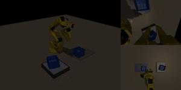
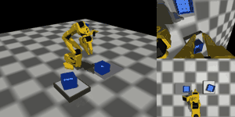

# 2026-10-09 v67 결과, 2×2 두 층 팔레타이징·카메라 비교, 논문 마무리

> 한 줄 요약 (00:30 기준): v6 + v7 시연을 섞은 v67 은 학습 범위 밖 환경에서 가장 강했지만(평균 98%) 연속 성공률은 88% 로 v6(98%)보다 낮아,
> 넓은 대응 범위와 정밀도 사이의 맞교환이 남았다. 팔레타이징 8칸 학습이 거의 끝났고(평가 01:30경), 카메라 비교(손목만 / 상단만)는 새벽 4시경 끝난다.

어제까지의 흐름은 [10/8 일지](2026-10-08.md) 참고. 최종 정리: 적재 정밀도 = ④ v5 n100 (200회 99.0%, 재시도 100%) / 일반 환경 견고성 = v6 / 극한 환경 = v67.

## 00:02 v67 (v6 + v7 시연 섞기, 2000개/단계) — 극한 환경 최강, 연속은 v6 보다 낮음

**기본 평가 (각 50회)**: 1층 100% · 옆 98% · 2층 100% → **연속 88%** (v6 98%, v7 82%)

| 조건 (단계 평균 %) | v6 무작위화 | v7 넓은 무작위화 | **v67 섞기** |
|---|---|---|---|
| 기준 | 100 | 97 | 98 |
| 위치 / 회전 범위 밖 / 아래 통 어긋남 | 95 / 90 / 92 | 90 / 75 / 88 | 88 / 80 / 90 |
| 어둡게 / 밝게 / 옆 조명 | 98 / 98 / 100 | 95 / 98 / 95 | 98 / **100** / 95 |
| 책상 회색 / 짙은 갈색 | 100 / 100 | 93 / 95 | 97 / 97 |
| 상단 / 손목 카메라 틀어짐 | 95 / 100 | 88 / 95 | 95 / 98 |
| 주변 물건 | 93 | 93 | **97** |
| 무게 100 / 200g, 지연 67 / 133ms | 100 / 100 / 100 / 100 | 92 / 97 / 98 / 97 | 97 / 100 / 98 / 95 |
| **아주 어둡게 30% *** | 97 | 93 | **100** |
| **아주 밝게 220% *** | 98 | 93 | **100** |
| **주황빛 조명 *** | 90 | 90 | **97** |
| **체크무늬 책상 *** | 80 | 90 | **93** |
| 범위 안 15조건 평균 | **97.5** | 92.6 | 95.0 |
| 범위 밖 4조건 평균 | 91 | 92 | **98** |

- **범위 밖(학습 때 본 적 없는) 환경에서는 v67 이 가장 강함** — 아주 어둡게·아주 밝게 100%, 주황빛 97%, 체크무늬 93%
- 하지만 **연속 88%**: 1층 통이 옆 칸 쪽으로 평균 +3.9mm 치우쳐(v6 +2.0) 놓이고, 연속 실패 6건 중 5건에서 옆 통이 1층 통을 건드림 (그중 3건은 1층 통이 10~13mm 밀려 있던 경우)
- 결론: **넓게 보면 덜 정밀해지는 맞교환** 이 섞어도 남음. 용도별 정리 → 정밀도·일반 환경 = v6, 극한 환경 = v67
- 논문: 표 3 의 v7 열 → v67 열, 표 2 의 v7 행 → v67 행, 4.3 에 "섞으면 범위 밖 평균 98%(v6 91%)로 가장 높았으나 연속은 88% 로, 범위와 정밀도가 맞교환" 추가. 표 2 의 ②(200) 행은 본문 숫자로 대신하고 뺌 → 5쪽 유지

v67 — 아주 어둡게(30%) 옆 단계 성공 / 체크무늬 책상 옆 단계 성공:

 

## 진행 중 (00:15)

| 작업 | 상태 | 예상 |
|---|---|---|
| 2×2×2 팔레타이징 (8칸 각 100 시연) | **8칸 학습 완료 (00:15)**, 40회 연속 평가 중 (2 × 20회) | 02:00경 |
| 카메라 비교 — 손목 카메라만 (v5w) | 1층 완료, 옆 24,000, 2층 14,000 스텝 | 평가 02:00경 |
| 카메라 비교 — 상단 카메라만 (v5t) | 1층 4,000 스텝, 옆·2층 대기 | 평가 03:30~04:00경 |

## 한 일

| 시각 | 한 일 |
|---|---|
| 00:02 | v67 평가·견고성 완료: 연속 88%, 범위 밖 4조건 평균 98% (최고) → 논문 표 2·3 의 v7 을 v67 로 교체, 4.3 에 맞교환 문장 추가 (5쪽) |
| 00:15 | 팔레타이징 8칸 학습 완료 → 평가 시작했으나 프로세스 4개가 정책 32개를 한꺼번에 올려 메모리 상한(8GB)에 걸려 강제 종료 (다른 작업은 무사) |
| 00:20 | 팔레타이징 평가를 2개 × 20회, 각각 5GB 상한으로 다시 시작 (프로세스당 약 3.5GB) |
| 00:30 | 일지 정리: 10/8 요약을 하루 마감 기준으로 갱신, 10/9 일지 시작 |

## 다음에 할 것

- [ ] 2×2 두 층 팔레타이징 평가 (40회) + GIF → 90% 이상이면 논문 결론에 한 문장
- [ ] 카메라 비교 (손목만 / 상단만) → 논문 4.2 에 한 문장
- [ ] 교수님 답 (시뮬레이션 제출 가능 여부, 공저자 구성) 반영
- [ ] 논문 최종 점검 (숫자·그림·참고문헌·5쪽)
