# 2026-10-09 v67 결과, 2×2 두 층 팔레타이징·카메라 비교, 논문 마무리

> 한 줄 요약 (00:30 기준): v6 + v7 시연을 섞은 v67 은 학습 범위 밖 환경에서 가장 강했지만(평균 98%) 연속 성공률은 88% 로 v6(98%)보다 낮아,
> 넓은 대응 범위와 정밀도 사이의 맞교환이 남았다. 팔레타이징 8칸 학습이 거의 끝났고(평가 01:30경), 카메라 비교(손목만 / 상단만)는 새벽 4시경 끝난다.

어제까지의 흐름은 [10/8 일지](2026-10-08.md) 참고. 최종 정리: 적재 정밀도 = ④ v5 n100 (200회 99.0%, 재시도 100%) / 일반 환경 견고성 = v6 / 극한 환경 = v67.

## 00:02 v67 (v6 + v7 시연 섞기, 2000개/단계) — 극한 환경 최강, 연속은 v6 보다 낮음

**기본 평가 (각 50회)**: 1층 100% · 옆 98% · 2층 100% → **연속 88%** (v6 98%, v7 82%)

| 조건 (단계 평균 %) | v6 무작위화 | v7 넓은 무작위화 | **v67 섞기** |
|---|---|---|---|
| 기준 | 100 | 97 | 98 |
| 위치 / 회전 범위 밖 / 아래 통 어긋남 | 95 / 90 / 92 | 90 / 75 / 88 | 88 / 80 / 90 |
| 어둡게 / 밝게 / 옆 조명 | 98 / 98 / 100 | 95 / 98 / 95 | 98 / **100** / 95 |
| 책상 회색 / 짙은 갈색 | 100 / 100 | 93 / 95 | 97 / 97 |
| 상단 / 손목 카메라 틀어짐 | 95 / 100 | 88 / 95 | 95 / 98 |
| 주변 물건 | 93 | 93 | **97** |
| 무게 100 / 200g, 지연 67 / 133ms | 100 / 100 / 100 / 100 | 92 / 97 / 98 / 97 | 97 / 100 / 98 / 95 |
| **아주 어둡게 30% *** | 97 | 93 | **100** |
| **아주 밝게 220% *** | 98 | 93 | **100** |
| **주황빛 조명 *** | 90 | 90 | **97** |
| **체크무늬 책상 *** | 80 | 90 | **93** |
| 범위 안 15조건 평균 | **97.5** | 92.6 | 95.0 |
| 범위 밖 4조건 평균 | 91 | 92 | **98** |

- **범위 밖(학습 때 본 적 없는) 환경에서는 v67 이 가장 강함** — 아주 어둡게·아주 밝게 100%, 주황빛 97%, 체크무늬 93%
- 하지만 **연속 88%**: 1층 통이 옆 칸 쪽으로 평균 +3.9mm 치우쳐(v6 +2.0) 놓이고, 연속 실패 6건 중 5건에서 옆 통이 1층 통을 건드림 (그중 3건은 1층 통이 10~13mm 밀려 있던 경우)
- 결론: **넓게 보면 덜 정밀해지는 맞교환** 이 섞어도 남음. 용도별 정리 → 정밀도·일반 환경 = v6, 극한 환경 = v67
- 논문: 표 3 의 v7 열 → v67 열, 표 2 의 v7 행 → v67 행, 4.3 에 "섞으면 범위 밖 평균 98%(v6 91%)로 가장 높았으나 연속은 88% 로, 범위와 정밀도가 맞교환" 추가. 표 2 의 ②(200) 행은 본문 숫자로 대신하고 뺌 → 5쪽 유지

v67 — 아주 어둡게(30%) 옆 단계 성공 / 체크무늬 책상 옆 단계 성공:

 

## 2×2 두 층 팔레타이징 — 지금까지 있는 그림

8칸(1층 4칸 + 2층 4칸), 칸마다 ACT 정책 1개(시연 100개). 팔 도달 범위 때문에 2×3 은 불가(10/7 일지), 배치는 x 0.20 / y 0.03.

**스크립트(전문가) 시연 — 8칸 쌓기 영상** (1층 4칸을 채우고 2층 다섯 번째 통을 옮기는 중)

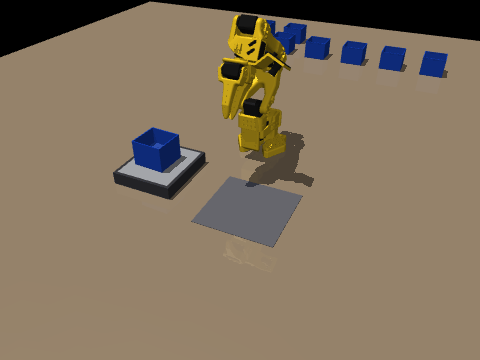

**스크립트 시연이 8칸을 다 쌓은 모습**

**학습한 ACT 정책의 GIF** 는 평가(40회) 중 처음 2회를 녹화 → 평가가 끝나는 02:00경 여기에 추가.

## 00:30 물체 폴더 — 로봇팔 구매·출력용 STL 모음

나중에 로봇팔을 다시 구매·출력할 때를 위해 [물체/](../물체/) 폴더를 만듦 (31MB).

| 폴더 | 내용 |
|---|---|
| `물체/로봇팔_SO101/` | 공식 SO-ARM100 저장소(Apache-2.0)의 SO-101 부품: 팔로워·리더 판 파일(Prusa, Bambu A1 mini), 부품별 15개, 손목·상단 카메라 마운트(32×32 USB 카메라), 출력 게이지, LICENSE |
| `물체/실험물체/` | 시뮬레이션과 같은 크기의 분류 통(64×64×52mm, 벽 2mm, 윗면 열림)과 큐브(18mm) — `make_object_stl.py` 로 생성, 닫힌 메시 검사 통과 |

- 키트를 사면 팔 부품은 출력 불필요 → 카메라 마운트와 실험물체만 출력
- 모터·보드 구성(팔로워: STS3215 C001 × 6 등)과 출력 설정은 [물체/README.md](../물체/README.md) 에 정리
- 컨베이어(MakerWorld, Brian3D)는 라이선스상 다시 올리지 않고 원본 링크만

## 01:15 팔레타이징 7번 칸 — 원인과 고치기

**중간 결과 (평가 18회)**: 8칸 모두 성공 11회. 실패는 대부분 **7번 칸**(위층·먼 줄·저울 쪽 열, 로봇에서 27cm — 팔이 닿는 끝), 같은 자리 아래층(3번 칸)도 가끔.

**원인 찾기**
- 7번 칸 **스크립트 시연은 100/100 성공, 위치 오차 1.6mm** → 시연 문제 아님. 학습 손실도 다른 칸과 같음(0.059)
- 7번 칸만 따로 반복(`pallet_slot_check.py`, 앞 칸들은 시연 때처럼 ±3mm 로 놓음): **11회 중 6회 실패**
- 실패 모습: 통이 **로봇에서 먼 쪽으로 9~11mm 더 나가** 아래 통의 2mm 벽 위에 못 얹히고 **기울거나(36~54°) 떨어짐**. 성공할 때도 6~7mm 치우침
- → 팔이 닿는 끝자리의 위층이라 **정밀도 여유가 거의 없는데 정책의 오차가 그보다 큼**

**고치기 (동시에 시험)**
1. **시연 늘리기**: 7번 칸 시연 200개 추가(새 시드, 4 × 50) → 300개로 다시 학습(`pal_s7b`) → 단독 20회 → 팔레트 전체 40회 (`run_pallet_fix.sh`, `act-palfix`)
2. **실행 방식**: 학습은 그대로 두고 ① ACT 시간 앙상블(매 스텝 예측을 겹쳐 평균) ② 25스텝마다 다시 예측 — 각각 7번 칸 단독 12회

## 01:25 학회 제출 요건 검토 (대한전자공학회 2026 추계학술대회)

출처: [conf.theieie.org/2026f](https://conf.theieie.org/2026f/) (논문제출 안내, 학부생 논문경진대회, 최우수논문상, 발표 안내, 참가등록 페이지)

| 항목 | 내용 | 우리 논문 |
|---|---|---|
| 일정 | 학술대회 11/27(금)~28(토), 곤지암리조트 / **논문 마감 10/19(월)** / 심사 결과 10/26 | 현재 계획(10/12 완성)보다 1주 여유 |
| 분량·양식 | 2단(Double Column) **1~5쪽**, MS Word 또는 한글 | **5쪽**, 공식 양식 파일과 **바이트 단위로 같은 양식** 사용 ✔ |
| 제출 부문 | 일반 세션 / 특별 세션 / **학부생 논문경진대회** (상금 총 300만 원) / **최우수논문상** (총 500만 원) | 부문 선택 필요 |
| 학부생 경진대회 자격 | 제1저자 = 국내 대학 재학 학부생, 저자 중 1명 이상 학회 회원 | 이지용(학부연구생) 제1저자 ✔, 회원 여부 확인 필요 |
| 최우수논문상 자격 | 주 저자 = 학회 **학생회원**인 학부·대학원생 | 회원 가입 필요 여부 확인 |
| 수상 부문 추가 파일 | **서면 심사용 4쪽** (전자공학회 논문지 양식, **저자·소속 표기 금지**, 국·영문 요약, 키워드 5개 이하, 그림·표 영문 제목, 영문 참고문헌) | **새로 만들어야 함** |
| 수상 부문 조건 | 마감일 기준 **국내외 공개 출판물(온라인 포함)에 발표되지 않은 결과** | 하계학술대회 초안은 **제출하지 않고 쓰다 만 것** (사용자 확인) → 문제 없음. ⚠ 공개 깃허브(LAB-1309)에 논문·결과가 올라가 있는 점만 확인 필요 |
| 발표 | 구두 10~15분(질의 포함, USB) / 포스터 100×180cm | — |
| 등록 | 논문당 저자 1명 필수. 학생회원 사전등록 16만 원(비회원 18만 원), 사전등록 10/13~11/16 | — |
| 분야 선택 | 시스템 및 제어 → **지능로봇** (또는 인공지능 신호처리 → 로봇지능) 추천 | — |

## 02:51 팔레타이징 평가 (40회) 결과와 다음 시도

**원래 방식 (100스텝 청크를 끝까지 실행)**: 8칸 모두 성공 **23/40 = 57.5%**

| 칸 | 1 | 2 | 3 | 4 | 5 | 6 | 7 | 8 |
|---|---|---|---|---|---|---|---|---|
| 성공률 (%) | 100 | 100 | 90 | 92 | **82** | 100 | **75** | 85 |

- 5번 칸(위층·가장 먼 모서리, 로봇에서 약 29cm): 실패 7건이 모두 **15~19mm 로 기준을 살짝 넘음**. 이 칸은 스크립트 시연부터 위치 오차 평균 9mm (다른 칸 1.5~2mm) → 팔이 닿는 끝
- 7번 칸: 옆 열 쪽(+y)으로 평균 6~7mm 치우쳐 놓이거나 놓을 때 넘어짐
- 3·4·8번 칸: 가끔 넘어지거나 이웃 통을 건드림
- → **위층 먼 줄이 팔이 닿는 한계(약 29cm)에 걸쳐 있는 것이 근본 원인**

**7번 칸 단독 시험 (20 / 12회)**

| 실행 방식 | 성공 |
|---|---|
| 100스텝 청크 끝까지 (기존) | 13/20 (65%) |
| **25스텝마다 다시 예측** | **11/12 (92%)** |
| 시간 앙상블 (매 스텝 예측) | 11/12 (92%) — 계산 25배라 CPU 30Hz 불가 |

**진행 중**: ① 모든 칸 25스텝 재예측으로 40회 다시 평가 (02:51 시작, `act-palk25`) ② 7번 칸 시연 300개 재학습 (`act-palfix`).
그래도 100% 에 못 미치면 → 팔레트를 로봇 쪽으로 1~2cm 당겨 8칸 시연·학습 다시 (6~8시간).

## 04:16 카메라 비교 — 상단 카메라가 핵심

같은 ④ 시연 200개로, 카메라를 하나씩 빼고 학습 (`train_act.py --cams`). 각 50회.

| 카메라 | 1층 | 옆 | 2층 | 연속 |
|---|---|---|---|---|
| 손목 + 상단 (v5 n200) | 100 | 98 | 100 | 92% |
| **상단만** (v5t) | 100 | 100 | 98 | **96%** |
| 손목만 (v5w) | 100 | 92 | **56** | 70% |

- 손목만: 2층 실패 22건 모두 **똑바로 섰지만 1층 통 위에서 16~20mm 비켜 놓임** — 들고 있는 통이 손목 카메라 앞을 가려 아래 통 위치를 못 봄
- 상단만으로도 두 개와 차이 없음 (96 vs 92%, 오차 범위 안) → **상단 카메라가 핵심**, 실물 구매 때 꼭 필요
- 논문 4.2 에 한 문장 추가. 5쪽을 넘어 v8(옆 통을 1층 통에 맞춰 옮기기, 효과 없음) 문장은 빼고 일지(10/8)에만 남김

2층 단계, 같은 장면 — 왼쪽 **손목 카메라만** (1층 통 위에서 비켜 놓여 실패) / 오른쪽 **상단 카메라만** (성공). 작은 창 = 전체 / 손목 / 상단 화면

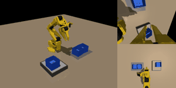 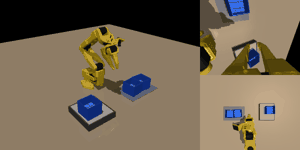

## 04:48 팔레타이징 — 25스텝마다 다시 예측 (40회)

| 실행 방식 | 8칸 모두 성공 | 칸별 성공률 (1~8, %) |
|---|---|---|
| 100스텝 청크 끝까지 | 23/40 (57.5%) | 100 100 90 92 82 100 75 85 |
| **25스텝마다 다시 예측** | **28/40 (70%)** | 100 92 90 90 92 100 90 88 |

- 7번 칸 75→90%, 5번 칸 82→92% 로 개선. 대신 2번 칸이 100→92% (15.1~15.7mm 로 기준 살짝 넘음)
- 남은 실패: 대부분 **15.1~15.8mm 로 기준을 아주 조금 넘김**, 일부는 놓다가 넘어지거나 이웃 통을 건드림
- 8칸을 연속으로 다 성공해야 하므로 칸마다 96% 여도 전체 72% → **100% 에 가까우려면 칸마다 거의 100% 필요**

같은 장면(평가 0번)의 8칸 연속 — 왼쪽 **100스텝 끝까지 실행** (7번 칸 실패, `ooooooxo`) / 오른쪽 **25스텝마다 다시 예측** (8칸 모두 성공)

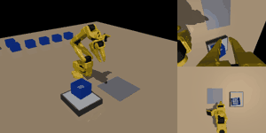 

**다음**: 7번 칸 시연 300개 결과(09시경)로 시연을 늘리는 효과 확인. 효과가 있으면 바로 쓸 수 있게 약한 칸(2·3·4·5·8)의 시연 200개씩을 미리 생성 중 (`gen_pallet_more.sh`, `act-genpalmore`).

## 05:48~07:14 팔레타이징 — 시연 늘리기는 효과 없음, 배치를 바꿔 다시 (v2)

**7번 칸 시연 300개** (`pal_s7b`, 25스텝 재예측): 단독 16/20 (80%) — 시연 100개(11/12)보다 낫지 않음.
옆 열 쪽(+y) 치우침이 평균 +4.5mm 로 그대로이고, 실패 4건 중 3건이 **옆 열에 이미 쌓인 통(1·5번)을 건드림** → 시연 수로는 해결 안 됨. 약한 칸 시연 추가 생성은 중단.

**원인 두 가지**: ① 정책이 옆 열 쪽으로 ~5mm 치우치는데 열 사이 간격이 8mm 뿐 → 부딪힘, ② 5번 칸(위층 먼 모서리)이 팔이 닿는 끝 → 스크립트 시연부터 오차 8.8mm.

7번 칸 통이 놓인 위치 — 설정을 바꿔도 **옆 열 쪽(+)으로 5mm 안팎 치우친 채** 퍼짐. v1 은 옆 열 통까지 8mm 라 오른쪽 끝에서 부딪힘

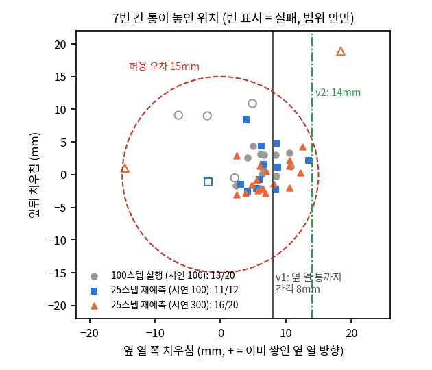

**스크립트 시연으로 배치 비교** (각 6~8회, 8칸 연속):

| 배치 (x0 / y0 / 열 간격) | 8칸 모두 성공 | 5번 칸 오차 평균 | 비고 |
|---|---|---|---|
| 20 / 3.0cm / 8mm (기존) | 7/8 | 8.8mm | 8번 칸 한 번 넘어짐 |
| 20 / 2.4cm / 14mm | 8/8 | 8.8mm | 간격만 넓힘 |
| 20 / 2.2cm / 16mm | 8/8 | 8.8mm | |
| 19.5 / 1.7cm / 14mm | 5/6 | 3.3mm | 위층 가까운 줄이 가끔 넘어짐 |
| 19 / 1.7cm / 14mm | 1/6 | 2.1mm | 너무 가까움 |
| **20 / 1.7cm / 14mm** | **6/6** | **5.1mm** | **선택** |
| 20 / 1.0cm / 14mm | 5/6 | 3.6mm | 6번 칸 한 번 넘어짐 |

→ **팔레트 v2 = x0 20cm, y0 1.7cm, 열 간격 14mm** 로 8칸 시연(각 100개) 다시 생성 → 학습(`pal2_s1~8`) → 25스텝 재예측으로 40회 평가 (`run_pallet_v2.sh`, `act-palv2`, 07:14 시작, 저녁 끝 예상)

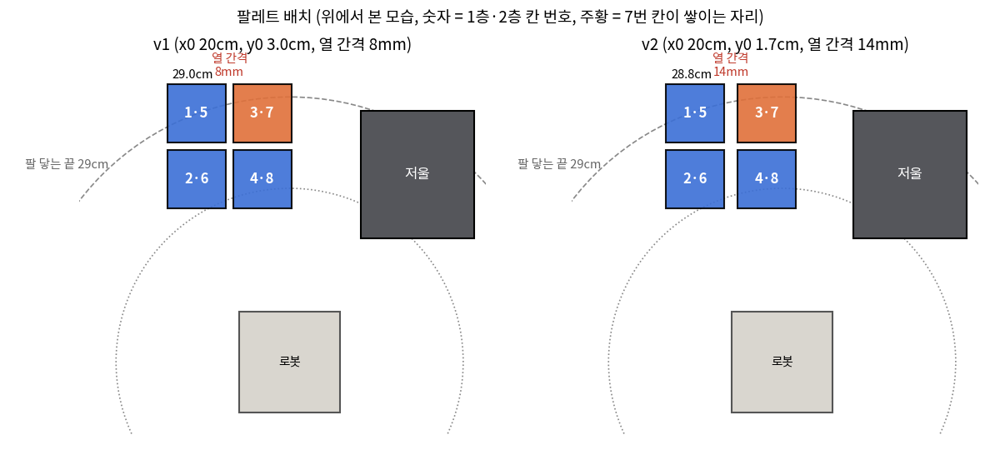

v2 배치 스크립트 시연 — 8칸 모두 성공 (왼쪽: 쌓는 과정, 오른쪽: 완성)

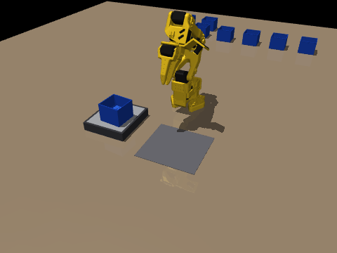 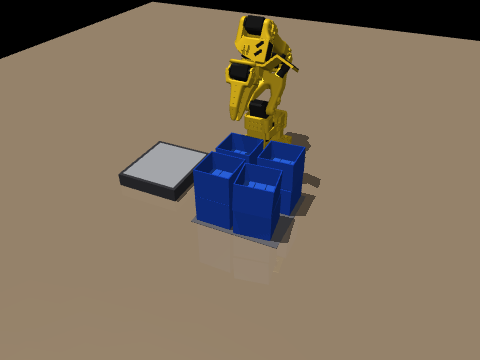

## 11:18 팔레타이징 v2 — 시연 8칸 완성, 학습 시작

스크립트 시연 품질 (칸별 100개, 성공한 것만 남김):

| 칸 | 1 | 2 | 3 | 4 | 5 | 6 | 7 | 8 |
|---|---|---|---|---|---|---|---|---|
| 성공/시도 | 100/100 | 100/100 | 100/100 | 100/100 | 100/100 | 100/121 | 100/100 | 100/105 |
| 평균 위치 오차 (mm) | 1.8 | 1.8 | 1.7 | 1.8 | **6.2** (v1 9.0) | 1.8 | 1.7 | 1.7 |

- 5번 칸(위층 먼 모서리) 오차가 9.0 → 6.2mm 로 줄어 기준(15mm)까지 여유가 생김
- 열 간격 14mm (v1 8mm) 로 7번 칸이 옆 열 통과 부딪힐 여유도 커짐
- 8칸 학습 `pal2_s1~8` (동시에 5개) → 17:30경 끝 → 25스텝 재예측으로 40회 평가 → 19시경 결과

## 16:40 교수님 답변 — 시뮬레이션으로 제출 가능, "아이디어를 부각하라"

> 학부생 논문이라 실제 로봇이 아니라 시뮬레이션에서만 해도 괜찮을 것 같다. 기존 알고리즘을 그냥 적용해 보는 게 아니라 조금이라도 아이디어가 있다면 그 부분을 부각시켜 작성해 보도록 해라.

**논문에서 부각할 아이디어 (원고는 실험이 다 끝난 뒤 한 번에 고침)**

| | 아이디어 | 근거 | 추가 작업 |
|---|---|---|---|
| ① 핵심 | **실패 분석으로 도출한 연속 적재용 시연 설계 규칙 3가지** — 집게 9mm 여유(잡히는 범위의 가운데), 늘 같은 벽, 2층은 놓고 5mm 물러났다 올라가기 | 연속 28 → 62 → 82 → 96% (200회 99.0%). 시연 1000개·DART 로는 개선 없음 → 시연 수보다 설계 | 규칙 설명 그림 |
| ② 보조 | **저울 무게로 성공 확인 → 재시도** — 무게 판정용 저울을 "제대로 집었나" 확인에도 사용, 논문의 두 부분(인식·적재)을 이어 줌 | 99.0 → 100% | **시뮬레이션 저울의 실제 무게(접촉력)로 판정하도록 바꿔 200회 재평가 (진행 중)** |
| ③ 확장 | **정밀한 자리에서는 더 자주 다시 예측 (25스텝)** — 8칸 팔레트로 확장 | 팔레트 57.5 → 70% (v1), v2 결과 대기 | v2 평가 |
| ④ 여유 있으면 | 시연 일관성 자동 점검 | 벽 전환 구간 분석 | — |

**시뮬레이션 저울**: 저울 몸체에 걸리는 수직 접촉력을 g 로 바꿔 7-segment 표시값처럼 사용 (`eval_retry.py --trigger weight`). 확인: 통이 저울 위에 있으면 **123.0g**, 옮긴 뒤 **0.0g**. 실행 후 60g 이상이면 "못 집음" → 같은 단계 재실행 (최대 3번).

## 16:55 관련 논문 검토 → 새 아이디어 A: 학습 전 시연 점검 지표

**우리 결과를 받쳐 주는 연구**
- [Data Quality in Imitation Learning](https://arxiv.org/abs/2306.02437) (Belkhale 외, NeurIPS 2023): 같은 상황에서 시연 동작이 서로 다르면(action divergence) 실패 → 규칙 ②(같은 벽)가 고친 문제
- [Geometric Entropy](https://arxiv.org/abs/2606.20871) (IROS 2026): 시연 다양성이 "전략 애매함"을 만들면 오히려 성능 하락 (역U자)
- [T-STAR](https://proceedings.mlr.press/v164/lee22a/lee22a.pdf) (CoRL 2021): 이어 붙인 기술에서 앞 기술의 끝 상태를 뒤 기술이 처음 봐서 실패 → 연속 적재·팔레트의 오차 누적
- [Bidirectional Decoding](https://arxiv.org/abs/2408.17355) (ICLR 2025): 청크를 통째로 실행하면 반응성 저하 → 25스텝 재예측 결과의 근거
- [DemInf](https://arxiv.org/html/2502.08623) (RSS 2025), [CUPID](https://arxiv.org/abs/2506.19121) (CoRL 2025): 학습 전 시연 자동 선별

**아이디어 A — 잡는 순간의 손목 각도로 "전략이 두 갈래인가" 학습 전에 점검** (`demo_audit.py`, 기존 시연 200개씩)

| 단계 | ② 벽 전환 있는 시연: 가장 넓은 빈 구간 / 작은 쪽 | ③·④ 같은 벽 시연: 빈 구간 |
|---|---|---|
| 1층 | **53°** / 26% | 1.5° |
| 옆 | **46°** / 24% | 3.9° |
| 2층 | **51°** / 20% | 1.3° |

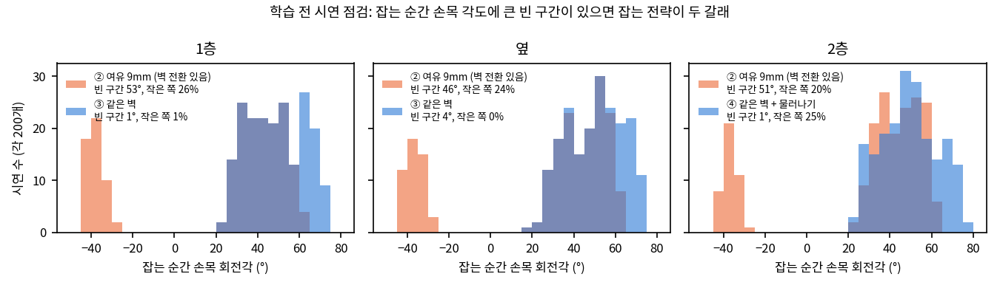

- 벽을 바꾸는 시연은 손목 각도가 −40° 부근과 +20~60° 로 **두 무리로 갈라짐** (사이 46~53° 가 비어 있음), 같은 벽 시연은 하나로 이어짐
- 이 점검만으로 **학습 전에** ② 시연이 위험하다는 걸 알 수 있었음 — 실제로 ② 모델의 실패 25건 중 24건이 이 전환 구간 (그림 3)
- 논문에서: "실패 분석 → 규칙" 을 "**점검 지표로 찾고 → 규칙으로 고친다**" 는 절차로 정리 (다른 과제에도 적용 가능)

**아이디어 B (대기)** — 팔레트 위 칸 시연을 "앞 칸 정책이 실제로 남기는 위치 분포"에서 시작하게 만들기 (T-STAR·DAgger 와 같은 발상). 팔레트 v2 결과가 100% 에 못 미치면 진행.

## 16:49 → 결과: 시뮬레이션 저울 무게로 재시도 판정 — 200/200 = 100%

- 저울 위 접촉력을 g 으로 바꿔 (가득 찬 통 123.0g, 비면 0g) **60g 이상 남아 있으면 같은 단계를 다시 실행**
- 최종 모델 v5_n100, 연속 3단계 200회: 첫 시도 198/200 (99.0%) → **재시도 후 200/200 (100%)**, 재시도는 2번뿐 (옆 단계에서 못 집은 경우)
- 논문 ② "무게 확인·재시도" 의 수치 근거 (위치로 판정했던 이전 결과와 같음: 200/200)

## 17:40~19:20 여러 물체 × 여러 환경 — 컵을 다시 설계 (6각 컵)

교수님 피드백("아이디어 부각")에 맞춰, 시연 설계 규칙이 **다른 물체·다른 배치에서도 통하는지** 확인하는 실험을 준비. 물체 3가지 × 배치 2가지(원래 / 좌우 반전), 각각 "사람처럼 잡기"와 "규칙대로 잡기" 시연을 비교.

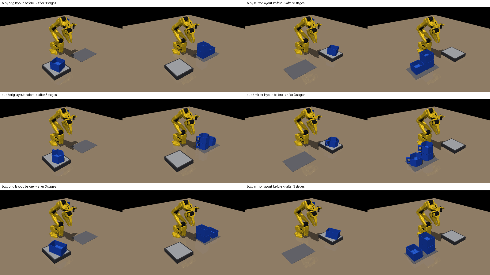

*(위) 통 / 컵 / 직사각형 상자 × 원래·반전 배치. 각 칸 왼쪽 = 시작, 오른쪽 = 스크립트가 1층 → 옆 → 2층 쌓은 뒤*

| 물체 | 잡을 곳이 애매한 이유 | 사람처럼 잡기 | 규칙대로 잡기 |
|---|---|---|---|
| 정사각형 통 | 네 벽이 같아 통이 조금 돌면 로봇과 가까운 벽이 바뀜 | 로봇 쪽 벽 (벽이 바뀜) | 항상 같은 벽 (기존 ③④) |
| 손잡이 컵 | 손잡이가 로봇 쪽에 오면 왼쪽/오른쪽 중 어디를 잡을지 갈림 | 손잡이 옆 가까운 쪽 (좌우가 바뀜) | 항상 손잡이 오른쪽 면 |
| 직사각형 상자 (9×6cm) | 긴 벽 / 짧은 벽 중 어디를 잡느냐에 따라 놓인 방향까지 바뀜 | 로봇 쪽 벽 (긴↔짧은 벽 바뀜) | 항상 같은 벽 |

**컵이 잘 안 잡혀서 원인을 찾아 고침** (스크립트 시연 성공률로 확인)

| 시도 | 문제 | 스크립트 성공 |
|---|---|---|
| 둥근 컵 (24면), 높이 75mm | 컵 안으로 들어가는 손가락(19mm 폭)이 둥근 벽에 **끼어서**, 놓은 뒤에도 컵이 같이 들려 올라감 | 5~15% |
| 12면 / 8면 컵 | 덜 끼지만 놓을 때 모서리에 걸려 컵을 2cm 끌고 감 | 60~85% |
| 높이 75mm | 2층 위치가 팔이 위에서 내려 잡기에 너무 높음 (자세 오차 28mm) → 52mm 로 낮춤 | — |
| **6각 컵, 지름 70mm, 높이 52mm** | 안쪽 면이 38mm 라 손가락이 걸리지 않음 | **95~100%** (원래·반전 배치 1~3단계) |

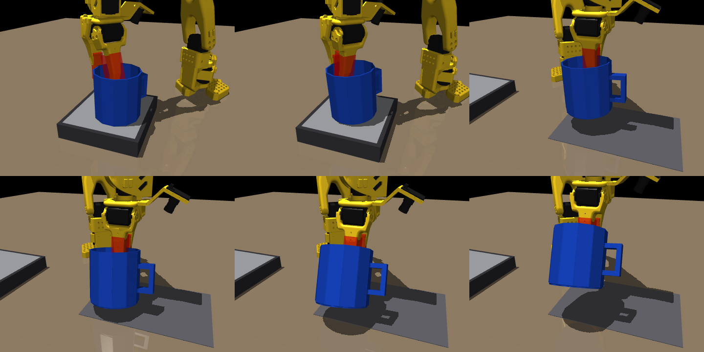

*(위) 둥근 컵일 때: 아랫줄 가운데·오른쪽 — 손가락을 벌렸는데도 컵이 손가락에 끼어 같이 들려 올라감*

- 상자·반전 배치 통: 스크립트 시연 15/15 (반전 배치 옆 단계 15/17)
- 쌓여 있는 컵·상자는 실제로 놓이는 방향(손잡이 방향, 긴 벽 방향)으로 시작하도록 수정 (통은 대칭이라 그대로)
- 실행: `run_general.sh` (`act-general`) — 6조합 × 2설계 × 3단계, 시연 100개씩 → 모델 36개 학습 → 평가

## 18:00 잡동사니 환경 — 주변에 다른 물체가 있어도 쌓을 수 있나

기존 견고성 시험의 "방해물"은 보이기만 하는 가짜(부딪히지 않음)였음. 이번엔 **실제로 부딪히고 밀리는 물체**를 둠.

**1) 팔이 지나가는 곳 지도** (`clutter_map.py`) — 스크립트 시연 120회 (스크립트 성공 119/120) 동안 팔·들고 가는 통이 각 지점 위로 얼마나 낮게 내려왔는지 기록. 물체는 그 높이보다 15mm 이상 낮을 때만, 정해진 여유 거리 밖에 놓음. 현실 셀에서도 "물건 두면 안 되는 구역" 표시로 그대로 쓸 수 있음.

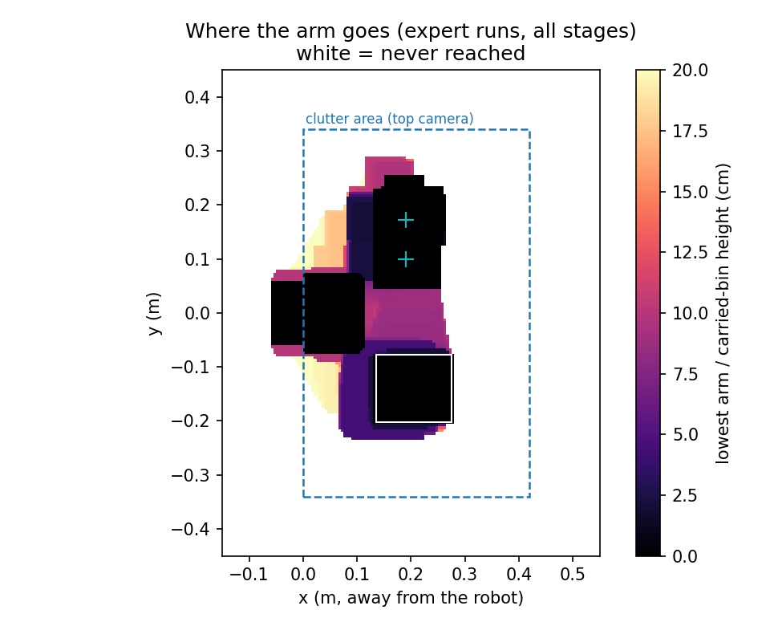

**2) 조건 9가지** (`clutter_eval.py`) — 같은 장면을 모든 모델에 똑같이 적용

| 조건 | 물체 | 팔 경로와 여유 | 닮은 통 | 지나가는 물체 | 조명·책상 무작위 |
|---|---|---|---|---|---|
| none | 0 | — | | | |
| sparse | 4 | 30mm | | | |
| dense | 8 | 12mm | | | |
| decoy | 4 | 30mm | ✓ | | |
| moving | 4 | 30mm | | ✓ | |
| dense_decoy | 8 | 12mm | ✓ | | |
| all | 8 | 12mm | ✓ | ✓ | |
| all_vis | 8 | 12mm | ✓ | ✓ | ✓ |
| tight | 8 | **5mm** (학습보다 가까움) | ✓ | ✓ | |

- 닮은 통 = 통과 똑같이 생긴 **파란색이 아닌 빈 통** (불량품 통처럼), 지나가는 물체 = 작업 중 4~10cm/s 로 왔다 갔다 (사람 손·옆 컨베이어 물건)
- **성공 기준을 더 엄격하게**: 기존 기준(위치 15mm, 높이 8mm, 기울기 10°, 이전 통 안 밀림) + **주변 물체를 10mm 이상 밀거나 쓰러뜨리면 실패**

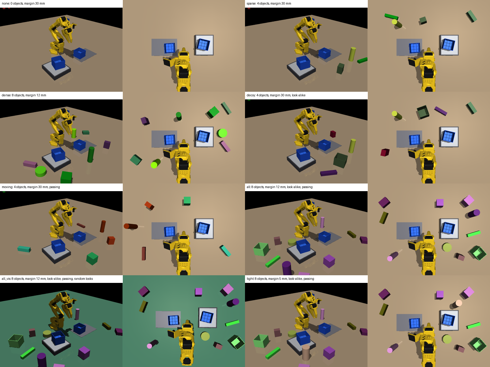

*(위) 같은 장면의 조건별 모습 — 각 칸 왼쪽 전체 화면, 오른쪽 상단 카메라(정책이 보는 화면)*

- 미리 1회 돌려 보니 최종 모델(v5, 무작위화 없음)은 "all" 에서 옆·2층 실패 → 잡동사니 포함 시연 1000개로 v9 학습 (`run_clutter.sh`, `act-clutter`)
- v9 시연 생성: 잡동사니가 있어도 스크립트 성공 거의 100% (60/60, 60/62 …)

## 18:45 팔레타이징 v2 결과 — 8층 완성 35% (v1 70% 보다 낮음), 원인 = 5번 칸 정책

| 칸 | 1 | 2 | 3 | 4 | 5 | 6 | 7 | 8 |
|---|---|---|---|---|---|---|---|---|
| 칸별 성공 (40회) | 90 | 95 | 100 | 100 | **60** | 95 | 95 | 95 |

- v1 의 문제였던 7번 칸은 해결 (95%), 대신 **5번 칸 (먼 모서리 위층)** 이 15~24mm 어긋남
- 5번 칸만 따로 (아래층은 시연과 같은 ±3mm): **2/20** → 앞 칸 오차 누적이 아니라 5번 칸 정책 자체 문제. 100스텝 통째 실행 1/20, 20k 체크포인트 2/20 도 같음
- 시연 점검: 잡는 방식 두 갈래 아님 (빈 구간 4.7°), 스크립트 오차 +5mm 로 작음

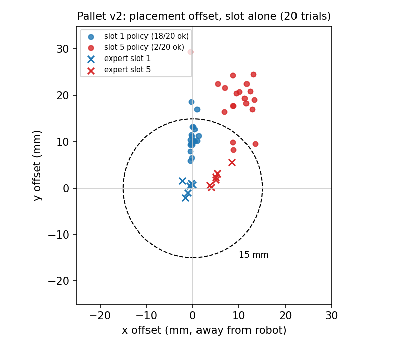 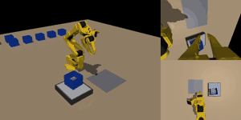

*(왼쪽) ✕ = 스크립트, ● = 학습된 정책. 1번·5번 칸 모두 정책이 **+y (통이 저울에서 오는 방향)** 으로 10~20mm 치우침. (오른쪽) 성공한 8층 완성 예*

- 원래 3단계 실험에서도 같은 방향 치우침(옆 단계 +4mm, v7 +7mm)이 있었음 → **정책이 카메라보다 자기 관절 상태를 따라 하는 경향** 으로 추정
- 시험: 학습 때 관절 상태 입력에 잡음(0.02 / 0.05 rad)을 넣은 5번·1번 칸 정책 (`run_pallet_noise.sh`, `act-palnoise`) → 치우침이 줄면 모든 모델에 적용

## 19:40 통합 실험 계획 — 물체·배치·잡동사니를 모델 하나로

| 단계 | 내용 | 실행 |
|---|---|---|
| ① | 통 + 잡동사니 9조건, 기존 모델 vs 잡동사니 시연 모델(v9) | `act-clutter` (시연 생성 중) |
| ② | 3물체 × 2배치, 사람처럼 vs 규칙대로 잡기 | `act-general` (①의 시연 생성 후 자동 시작) |
| ③ | **3물체 × 2배치 × 잡동사니 + 조명 무작위를 섞은 시연 1800개 → 단계별 모델 하나**, 6조합 × 4조건(none·all·all_vis·tight) 평가 | `act-integrated` (팔 경로 지도 6개 + ②의 시연 생성 후 자동 시작) |

## 진행 중 (19:45)

| 작업 | 상태 | 예상 |
|---|---|---|
| ① 잡동사니 시연 v9 (1000개 × 3단계) | 1층 완료, 옆·2층 생성 중 | 20:30경 → 학습 (약 3.5시간) + 기존 모델 평가 |
| ② 3물체 × 2배치 비교 (모델 36개) | ① 시연 후 시작 | 약 1.5일 |
| ③ 통합 모델 (단계별 1개, 시연 1800개) | 팔 경로 지도 생성 중, ② 시연 후 시작 | 10/14~15 |
| 팔레트 치우침 시험 (관절 상태 잡음) | 학습 중 (5번 칸 2개, 1번 칸 1개) | 약 4시간 |

## 한 일

| 시각 | 한 일 |
|---|---|
| 00:02 | v67 평가·견고성 완료: 연속 88%, 범위 밖 4조건 평균 98% (최고) → 논문 표 2·3 의 v7 을 v67 로 교체, 4.3 에 맞교환 문장 추가 (5쪽) |
| 00:15 | 팔레타이징 8칸 학습 완료 → 평가 시작했으나 프로세스 4개가 정책 32개를 한꺼번에 올려 메모리 상한(8GB)에 걸려 강제 종료 (다른 작업은 무사) |
| 00:20 | 팔레타이징 평가를 2개 × 20회, 각각 5GB 상한으로 다시 시작 (프로세스당 약 3.5GB) |
| 00:30 | 일지 정리: 10/8 요약을 하루 마감 기준으로 갱신, 10/9 일지 시작 |
| 00:35 | 물체 폴더: SO-101 공식 STL(팔·카메라 마운트·게이지) + 실험용 통·큐브 STL 생성 |
| 00:50~01:10 | 물체 폴더: 시뮬레이션과 같은 Hex-Nut 손목 마운트로 정정, 카메라 4대(적재 연구엔 3대)·배치도·구매 목록 |
| 01:15 | 팔레타이징 7번 칸 원인 분석(먼 줄 위층, 9~11mm 넘어가 기울어짐) → 시연 300개 재학습 + 실행 방식 시험 시작 |
| 01:25 | 학회 사이트 검토: 마감 10/19, 5쪽 2단 양식 일치, 수상 부문은 4쪽 블라인드 논문지 양식 추가 필요 |
| 01:30~02:00 | 서면 심사용 4쪽 초안 생성기, 포스터 규정·견본 확인, 윈도우 이전 방법 정리 |
| 02:51 | 팔레타이징 40회: 8칸 모두 57.5%, 7번 칸 단독 25스텝 재예측 92% → 전체 재평가 시작 |
| 03:28~04:16 | 카메라 비교: 상단만 96%, 손목만 70% (2층 56%) → 논문 4.2 반영 (v8 문장 빼서 5쪽 유지) |
| 04:02 | 7번 칸 시연 300개 완성 → 재학습(`pal_s7b`), 끝나면 25스텝 재예측으로 평가하도록 변경(`act-palfix2`) |
| 04:48 | 팔레타이징 25스텝 재예측 40회: 70% (57.5% → 70%) → 약한 칸 시연 200개씩 미리 생성 시작 |
| 05:48 | 7번 칸 시연 300개: 효과 없음 (16/20) → 추가 생성 중단, 원인(옆 열 쪽 치우침 + 팔 끝 모서리) 확인 |
| 06:00~07:14 | 스크립트로 배치 7가지 비교 → v2 (열 간격 14mm, 옆으로 1.3cm 당김) 선택, 처음부터 다시 시작 |
| 11:18 | 팔레타이징 v2 시연 8칸 완성 (5번 칸 오차 9.0→6.2mm) → 학습 시작 |
| 16:39 | 팔레타이징 v2 8칸 학습 끝 → 25스텝 재예측 40회 평가 |
| 16:40 | 교수님 답변: 시뮬레이션 OK, 아이디어 부각 → ①시연 설계 규칙 ②무게 확인·재시도 ③재예측 확장으로 정리 |
| 16:49 | 시뮬레이션 저울(접촉력 → g, 123.0g 확인)로 재시도 판정하는 200회 평가 시작 |
| 16:55 | 관련 논문 검토, 아이디어 A (학습 전 시연 점검: 벽 전환 시연은 빈 구간 46~53°, 같은 벽은 1~4°) |
| 16:49→ | 무게(접촉력) 판정 재시도 200회: 첫 시도 99.0% → **재시도 후 200/200 (100%)** |
| 17:40~19:20 | 여러 물체 실험 준비: 컵 끼임 문제 → **6각 컵**(지름 70, 높이 52mm)으로 스크립트 95~100%, 상자·반전 배치 확인 |
| 18:00 | 잡동사니 환경: 팔 경로 지도, 실제로 부딪히는 물체 8종 + 닮은 통 + 지나가는 물체, 조건 9가지, 엄격한 성공 기준 → v9 시연 생성 시작 |
| 18:45 | 팔레타이징 v2: 8층 완성 35% (5번 칸 60%), 5번 칸 단독 2/20 → 정책 +y 치우침 발견 |
| 19:40 | 통합 실험(3물체 × 2배치 × 잡동사니, 모델 하나) 큐 등록, 관절 상태 잡음 시험 시작 |

## 다음에 할 것

- [x] 2×2 두 층 팔레타이징 v2 평가 (40회) → 35%, 5번 칸 치우침 원인 시험 중
- [ ] ① 잡동사니 (v9 학습·평가, 기존 모델 비교) → 100% 근처까지
- [ ] ② 3물체 × 2배치 비교, ③ 통합 모델
- [ ] 팔레트: 관절 상태 잡음 효과 확인 → 전체 칸 재학습 여부 결정
- [x] 카메라 비교 → 상단만 96%, 손목만 70%, 논문 4.2 반영
- [x] 교수님 답: 시뮬레이션 제출 가능 (공저자 구성은 아직 답 없음)
- [ ] 논문 최종 점검 (숫자·그림·참고문헌·5쪽)
- [ ] 서면 심사용 4쪽 파일 최종본 (수상 부문에 낼 경우, `paper/build_review.py`)
- [ ] **포스터** (일반 세션 포스터 발표 예정): 수정용 PPT(45×60cm 설계 → 200% 출력) + 인쇄용 PDF, 학회 규정 패널 100×180cm·제목 25~30mm·본문 7~10mm, GIF 는 QR 코드로 연결
