# 2026-10-10 (토) — 08 개인논문 ACT 적재

목표: **일요일(10/11) 안에** 실험 마무리 + 논문·심사용 4쪽 완성 (포스터 보류)

## 13:40 논문 구조 새로 짜기 (v2) — 기존 원고는 그대로 두고 새 파일

요청: 잘 쓴 논문 기준으로 직접 찾아 공부해서 구조를 새로, 양식 맞춰서.
결과물: [`논문/paper_v2.pdf`](../논문/paper_v2.pdf) · [`paper_v2.docx`](../논문/paper_v2.docx) (학회 `논문양식.docx`, 2단, **5쪽**). 기존 `paper.pdf` 는 한 글자도 안 바뀜 (빌드 결과 비교로 확인).

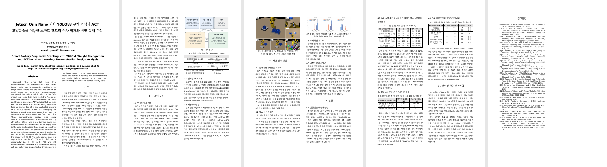

### 참고한 기준
| 출처 | 가져온 원칙 |
|---|---|
| Mensh & Kording, *Ten simple rules for structuring papers* (PLoS Comp. Biol. 2017) | 메시지 하나에 집중 · 문단마다 맥락→내용→결론 · 같은 주제는 한 곳에만 · 초록 = 맥락→빈틈→한 일→결과→의미 · 결과는 "주장" 순서로 |
| S. Peyton Jones, *How to write a great research paper* | 핵심 아이디어 하나, 기여를 먼저 쓰고 반박 가능하게 명시 |
| J. Widom, *Tips for writing technical papers* | 서론 5요소: 문제 / 왜 중요 / 왜 어려움 / 왜 아직 안 풀림 / 내 방법과 결과 + 기여 목록 |
| Mandlekar et al., *What Matters in Learning from Offline Human Demonstrations* (CoRL 2021) | 실험을 질문(도전 과제) 단위로 나누고 각 절이 하나에 답함 |
| Belkhale et al., *Data Quality in Imitation Learning* (NeurIPS 2023) · Zhao et al., ACT (RSS 2023) | 데이터 품질 연구의 서론 흐름(맥락→문제→빈틈→제안), 한계와 결론을 함께 |
| 대한전자공학회 학술대회 안내 | 2단, 1~5쪽, 제공 양식(docx/hwp) |

### 바뀐 점 (v1 → v2)
| | 기존 (v1) | 새 구조 (v2) |
|---|---|---|
| 중심 메시지 | 셀 구현 + 규칙 + 일반화 + 환경이 나란히 | **"연속 적재의 성패는 정책이 아니라 시연 설계가 결정한다"** 하나, 나머지는 이를 뒷받침 |
| 초록 | 수치 나열 (FPS·응답시간 등) | 맥락(저가 로봇·순차 적재) → 빈틈(오차 누적·시연 불일치) → 한 일 → 결과 → 의미 |
| 서론 | 2문단 | 깔때기 4문단 (필요성 → 왜 어려운가(초기 28%) → 기존 연구가 답하지 않은 것 → 본 논문) + **기여 ①②③ 따로 줄** |
| 무게 인식 결과 | Ⅳ장 실험 첫 절 (흐름이 끊김) | Ⅱ장 시스템 구성 안에서 한 번에 (실험장은 중심 주장만 검증) |
| 방법 | 셀·규칙·점검·재시도·환경·평가가 한 장 | Ⅲ장 "시연 설계 방법" = 아이디어만 (규칙·점검·재시도·공장형 시연) |
| 실험 | 주제별 4절 | **질문 Q1~Q4 를 먼저 밝히고** 각 절이 하나씩 답함, 절 제목 = 결론 문장 (예: "Q1: 시연 수가 아니라 시연 설계가 연속 성공률을 결정한다") |
| 아직 안 나온 결과 | 빈칸 | 빈칸 + **결론 문장도 결과에 따라 자동 선택** (좋아지면 주장형 제목, 아니면 중립 제목·한계 문장) → 결과보다 앞서 단정하지 않음 |
| 결론 | 요약 1문단 | 질문에 대한 답 → 확장 근거(팔레트 5번 칸: 칸별 전문가 오차 점검으로 9/20 → 19/20) → 한계(시뮬레이션·스크립트 시연) → 향후 연구 |
| 참고문헌 | 번호 순서 섞임 | **처음 인용된 순서대로 자동 번호** (robomimic 추가, CLAHE 는 본문에서 빠져 제외) |

- 제목은 교수님 확인 대기 중이라 그대로 둠. 메시지를 더 드러내는 제목 후보: "시연 설계가 순차 적재 모방학습을 결정한다: YOLOv8 무게 인식과 ACT 기반 스마트 팩토리 셀"
- 5쪽째 오른쪽 단이 비어 있어 남은 결과(②·③·팔레트)를 채울 여유 있음. 결과가 나오면 `publish.sh` 가 v1·v2 둘 다 자동으로 다시 만듦
- 코드: `코드/paper/content_v2.py` (본문), `build_paper.py --content content_v2`

## 12:50 지금까지 정확도 요약 + 남은 진행도

모두 시뮬레이션. 연속 = 1층 → 옆 → 2층 모두 성공해야 성공.

| 실험 | 정확도 |
|---|---|
| 무게 인식 (YOLOv8n, 7-세그먼트) | mAP50 86.3%, 기준값(118g) 분류 91.7% (55/60) |
| 기본 3단계 적재 — 첫 설계 → 시연 설계 규칙 (v5) | 28% → **99.0%** (200회) |
| + 무게 확인 재시도 | **100%** (200/200) |
| 외관 무작위화 (v6) | 98% |
| 잡동사니 8개 + 닮은 통 + 이동 (v9) | **88%** |
| 잡동사니, 팔 경로 5mm 까지 (v9) | **88%** |
| 공장형 / + 외관 / 최대 (v9) | 44 / 30 / 24% |
| 팔레트 2×2×2 8칸 연속 (예전 v2) | 35% (40회) |
| 팔레트 5번 칸 단독 | 9/20 → **19/20** |
| ② 컵·상자 일반화 / ③ 공장 통합 | 학습 중 |

**ACT 학습 진행: 24개 중 11개 완료, 4개 진행 중, 9개 대기 (step 기준 약 55%)**

| 묶음 | 완료 | 진행 중 | 대기 |
|---|---|---|---|
| ③ 통합 (40k step) | 1층, 옆 | 2층 26k/40k | — |
| 팔레트 칸별 | 2, 3, 5(수정)번 | 4번 4k/30k | 6, 7, 8번 |
| ② 컵·상자 12개 | 1층 4개 | 컵 옆 2개 (26k, 10k) | 6개 |
| 잡음 확인 · 5번 칸 잡음 0.1 | 2개 | — | — |

| 예상 | 시점 |
|---|---|
| ③ 통합 평가 결과 (6조합 × 5조건) | 토 17~18시 |
| 모든 학습 끝 | 토 21시경 |
| ② 컵·상자 결과 | 토 23시경 |
| 팔레트 8칸 연속 (수정 전·후 각 40회) | 일 새벽 1~3시 |
| 논문 5쪽 + 심사용 4쪽 | 일 낮 |

## 10:40 팔레트 5번 칸 — 9/20 → **19/20**

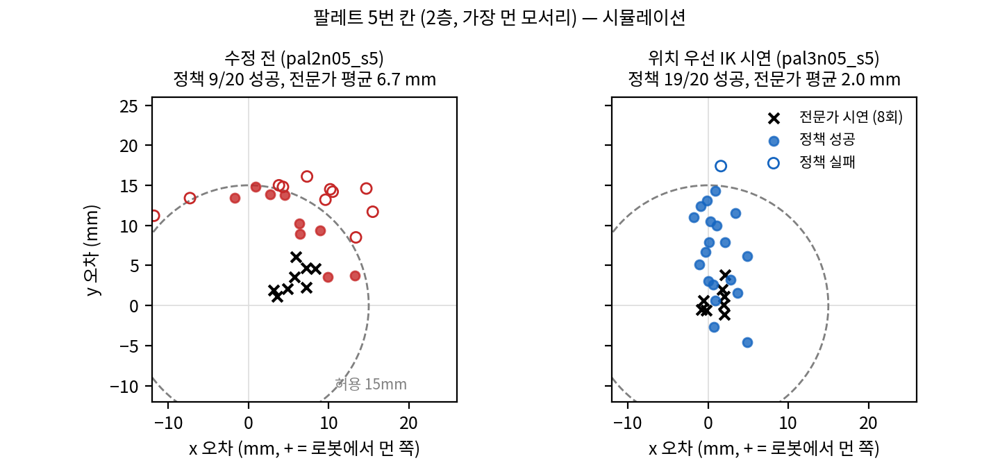

| 5번 칸 | 전문가 시연 평균 오차 | 정책 칸 점검 (20회) | 정책 평균 위치 오차 |
|---|---|---|---|
| 수정 전 (`pal2n05_s5`, 잡음 0.05) | 6.2mm (최대 11.5) | 9/20 | 15.3mm |
| 잡음 0.1 (`pal2n10_s5`) | 6.2mm | 7/20 | — |
| **위치 우선 IK 시연** (`pal3n05_s5`, 잡음 0.05) | **2.0mm** (최대 4.7) | **19/20** | **8.1mm** |

- 시연 100개 100/100 성공, 학습 30k, 칸 점검은 이전과 같은 방식 (앞 칸들은 시연처럼 놓인 상태, 25 step 마다 다시 계획)
- 남은 실패 1회 = y 17.5mm. 정책이 아직 y 쪽으로 평균 +7mm 치우침 (전문가는 +1mm) → 다른 칸 정책들과 이어 붙인 **8칸 연속 평가**에서 최종 확인
- 핵심: 정책을 아무리 손봐도(잡음 0.02~0.1) 안 되던 게 **시연의 정확도**를 고치니 바로 해결 → 논문의 "시연 설계" 주장과 같은 결론 (시연 점검 = 칸마다 전문가 오차 확인)
- 8칸 연속 평가: 오케스트레이터는 예정대로 예전 5번 칸으로 40회 (수정 전 기준값), 새 5번 칸으로 40회 (`pallet4`) — 다른 칸 학습(잡음 0.05)이 끝나면 자동 시작

## 06:00 v9 완료 · 관절 잡음 확인 · 팔레트 5번 칸 원인 찾음

### 1) v9 (잡동사니 시연 1000개) 공장형까지 완료 — 위 04:25 표에 채움

| 조건 | v6 | **v9** |
|---|---|---|
| 잡동사니 8개 + 닮은 통 + 이동 | 58 | **88** |
| 위와 같음, 팔 경로 5mm 까지 | 56 | **88** |
| 공장형 | 10 | **44** |
| 공장형 + 외관 | 10 | **30** |
| 공장형 최대 | 4 | **24** |

- 잡동사니 시연만으로 공장형도 10 → 44% (공장 구조물은 한 번도 안 봤는데도). 하지만 아직 절반 이하 → 실패는 대부분 **옆 단계(2단계)에서 놓는 위치 오차** (첫 실패 단계: 옆 14~19회, 1층 2~14회, 2층 3~12회)
- 남은 단계: ③ 통합 모델 (공장 셀 시연 1800개, 관절 잡음 0.05) 이 공장형을 얼마나 더 올리는지

| v9 — 공장형, 3단계 성공 | v9 — 공장형+외관, 옆 실패 | v9 — 공장형 최대, 3단계 성공 |
|---|---|---|
| 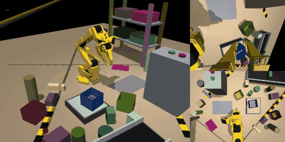 | 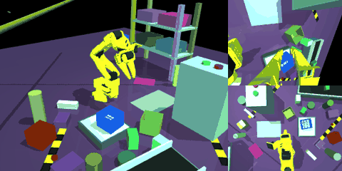 | 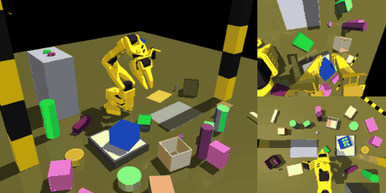 |

### 2) 관절 잡음 확인 (원래 3단계 과제, 옆 단계만 관절 상태에 잡음 0.05 rad 넣고 학습)

| | 1층 | 옆 | 2층 (연속) |
|---|---|---|---|
| v5 (잡음 없음) | 100 | 96 | **96** |
| v5 + 옆 단계 잡음 0.05 | 100 | 98 | **98** |

- 50회 중 1회 차이 → **잡음이 원래 과제를 해치지 않음** → 미리 정한 규칙대로 ③ 통합 모델에 잡음 0.05 적용

### 3) 팔레트 5번 칸 (2층, 가장 먼 모서리) — 원인 찾음

- 잡음을 바꿔도 2/20 → 5 → 9 → **7/20 (0.1 rad)**. 실패는 들쭉날쭉이 아니라 **한쪽으로 치우침** (평균 y +12~15mm, 표준편차 3.5mm)
- 시연 데이터의 전문가 배치 오차를 칸별로 보니:

| 칸 | 1 | 2 | 3 | 4 | **5** | 6 | 7 | 8 |
|---|---|---|---|---|---|---|---|---|
| 전문가 평균 오차 (mm) | 1.8 | 1.8 | 1.7 | 1.8 | **6.2** | 1.8 | 1.7 | 1.7 |

- **전문가부터 6mm 틀림** (최대 11.5mm). 원인 = 팔이 닿는 한계: 2층 먼 모서리에서 역기구학이 "손목 기울기"를 맞추느라 **위치를 4~9mm 포기**함 (관절 추종 오차 0.1mm, 통 미끄러짐 아님)
- 정책은 이 6mm 치우친 시연을 배우고 + 자기 오차까지 더해서 15mm 기준을 넘음
- **수정**: 위치 오차가 2mm 넘는 지점만 손목 기울기 가중치를 낮춰 다시 풀기 (위치 우선) → 전문가 평균 오차 6.7mm → **2.0mm** (8회 모두 성공)

| | 역기구학 오차 | 최종 위치 오차 (x, y mm) |
|---|---|---|
| 수정 전 | 4.3~8.6mm | (3.1~8.3, 1.1~6.1) |
| 수정 후 | 1.9~2.0mm | (−0.8~2.1, −1.1~3.8) |

> **수정 (10:50)**: 이 표를 처음 올릴 때는 진단 스크립트를 팔레트 배치 환경변수 없이 돌려서 **예전 v1 배치**(열 간격 8mm) 값이 들어갔음 (역기구학 오차 6.7~11.4mm). v2 배치로 다시 재서 고침. 시연 생성·학습·칸 점검은 처음부터 올바른 v2 배치로 돌았음

- 진행: 5번 칸 시연 100개 새로 생성 (`run_pallet_s5fix.sh`, 4개 동시) → 잡음 0.05 학습 → 칸 점검 20회 → 좋아지면 8칸 연속 40회 평가. 다른 칸 시연은 그대로 (전문가 오차 1.8mm 로 이미 정확)
- 시연 설계 규칙과 같은 맥락: **"정책보다 먼저 시연이 정확한지"** 를 칸마다 확인하는 점검이 필요했음 (데이터: `결과/수치/slot5_expert_diag.json`)

## 04:25 잡동사니·공장 평가 — v5·v6·v9 (v9 공장형 3조건은 05:40 에 채움)

연속 3단계(1층→옆→2층) 50회씩, 시뮬레이션. 숫자 = 그 단계까지 연속 성공한 비율(%).

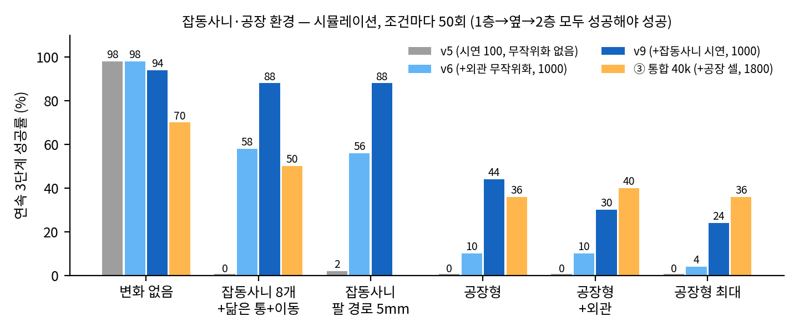

| 조건 | v5 (시연 100, 무작위화 없음) | v6 (+외관 무작위화, 1000) | v9 (+잡동사니 시연, 1000) |
|---|---|---|---|
| 변화 없음 | 100 → 98 → **98** | 100 → 98 → **98** | 100 → 94 → **94** |
| 닮은 통 + 물건 4개 | (22) | — | 100 → 98 → **98** |
| 물건 8개 + 닮은 통 + 지나가는 물체 | 36 → 10 → **0** | 84 → 64 → **58** | 100 → 94 → **88** |
| 위와 같음, 팔 경로 5mm 까지 | 38 → 14 → **2** | 82 → 62 → **56** | 100 → 98 → **88** |
| 공장형 (구조물 + 물건 14개) | 2 → 0 → **0** | 74 → 16 → **10** | 96 → 68 → **44** |
| 공장형 + 외관 무작위화 | 0 → 0 → **0** | 52 → 14 → **10** | 74 → 36 → **30** |
| 공장형 최대 (물건 16개, 5mm, 외관) | 0 → 0 → **0** | 38 → 16 → **4** | 72 → 34 → **24** |

- **실패 원인 (첫 실패 단계 기준)**: 거의 전부 "통을 제대로 못 놓음"(위치·높이·기울기 기준 초과). 물건을 밀어서(1~2회)·구조물에 닿아서(1~3회) 실패한 건 드묾 → 잡동사니에 "부딪혀서"가 아니라 **"보이는 장면이 달라서 헷갈려서"** 실패
- v5 → v6: 외관 무작위화만으로 잡동사니 0 → 58%. 하지만 공장(구조물·케이블·컨베이어)에서는 옆 단계에서 크게 무너짐 (74 → 16)
- v6 → v9: 잡동사니가 있는 시연으로 학습하면 **58 → 88%**, 닮은 통 98%. 깨끗한 환경 성능(94~98%)은 50회 기준 차이 없음 수준
- 공장형은 v9 도 공장 구조물은 본 적이 없음 → **③ 통합 모델(공장 셀 시연 1800개)이 공장형 조건을 얼마나 올리는지**가 남은 핵심. v9 공장형 결과는 오전 중
- 기준은 그대로 (위치 15mm, 높이 8mm, 기울기 10°, 앞 통 10mm, 잡동사니 10mm, 구조물 접촉 없음)

| v9 — 전부 (8개+닮은 통+이동), 3단계 성공 | v9 — 닮은 통, 3단계 성공 | v9 — 전부, 2층 실패 |
|---|---|---|
| 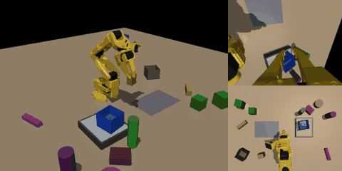 | 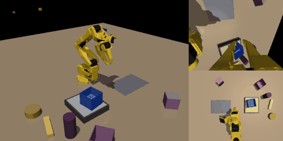 | 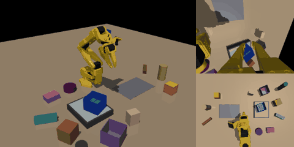 |

| v5 — 공장형, 1층 실패 | v6 — 공장형, 3단계 성공 | v6 — 변화 없음, 3단계 성공 |
|---|---|---|
| 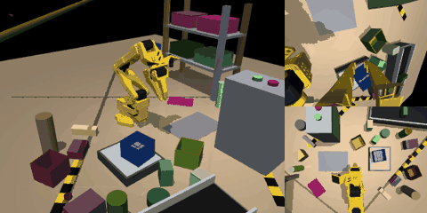 | 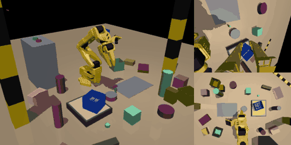 | 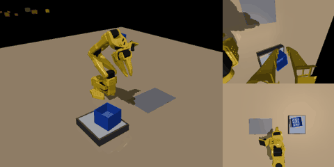 |

**v6 실패 장면** (04:40 추가 — 겹침 고친 평가로 다시 만든 GIF)

| v6 — 전부, 옆 실패 | v6 — 공장형, 옆 실패 | v6 — 공장형+외관, 1층 실패 |
|---|---|---|
| 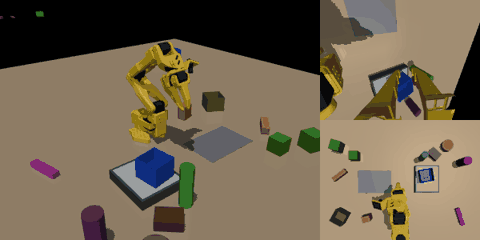 | 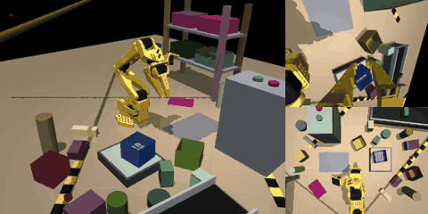 | 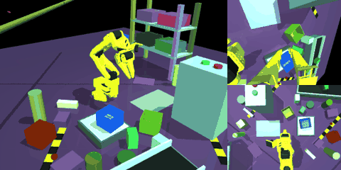 |

| v6 — 팔 경로 5mm, 옆 실패 | v6 — 공장형 최대, 2층 실패 | v6 — 공장형 최대, 1층 실패 |
|---|---|---|
| 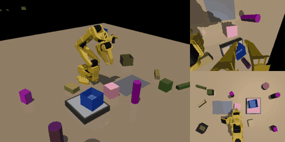 | 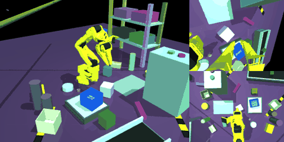 | 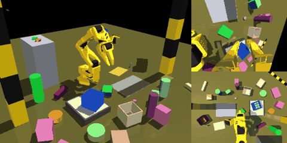 |

*파일 이름 o = 성공, x = 실패, - = 앞 단계 실패로 실행 안 함. 마지막 장면에 통이 겹치지 않는 것 확인*

- 다시 만들다 발견: 공장 조건의 **조명 깜빡임 난수가 시행마다 새로 정해지지 않고 프로세스 전체로 이어짐** → 같은 시드라도 앞에 무엇을 돌렸느냐에 따라 깜빡임이 달라짐 (다시 만든 10개 중 2개가 50회 기록과 결과가 달랐음 → 그 2개는 기록과 일치하는 원래 GIF 사용, 둘 다 겹침 없는 경우). 깜빡임은 원래 무작위 요소라 성공률 계산 방식에는 문제 없지만, 재현이 되도록 **시행마다 고정 시드**(`FLICKER_SEED0 + 시드`)로 고침. v5·v6·v9 공장형 50회는 이전 방식, ③ 통합 평가부터 새 방식

### 정리한 것
- 감시 스크립트 오탐 2건 수정: ① 시연 생성의 bash 껍데기 프로세스를 "멈춤"으로 오인 → 점검 대상에서 제외, ② 다시 시작한 학습 로그에 남은 **예전** 메모리 부족 줄을 새 오류로 오인 → 지난 점검 이후 새로 쓰인 부분만 검사
- 예전 실행 스크립트(`act-clutter`)가 v9 를 표에 없는 추가 조건 5개(드문드문·빽빽·이동만 등, 조건당 약 1.5시간)로 계속 평가하고 있어서 중지 → CPU 를 ③ 공장 시연 생성에 양보. 이미 끝난 v9 결과(변화 없음·닮은 통·전부, 단계별+연속)는 그대로 사용

## 00:50 지금까지 사진·GIF 모음

### 1) 스크립트 시연 — 다른 물체·공장 환경 (학습 데이터가 이렇게 생김)

| 깨끗한 환경 — 6각 손잡이 컵 | 깨끗한 환경 — 직사각형 상자 |
|---|---|
| 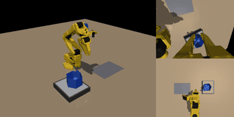 | 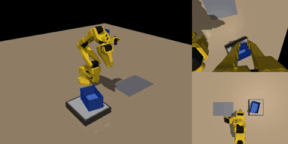 |

| 공장 — 통 | 공장 — 컵 (좌우 반전 배치) | 공장 — 상자 |
|---|---|---|
| 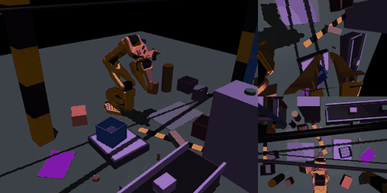 | 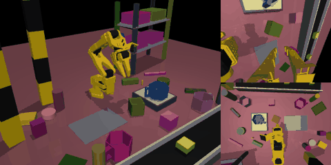 | 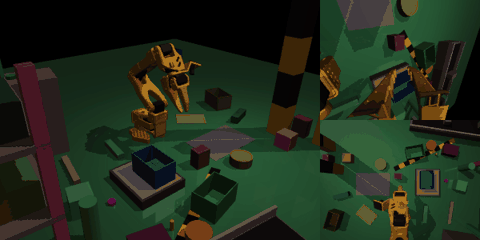 |

*각 GIF: 왼쪽 전체 화면, 오른쪽 위 손목 카메라, 오른쪽 아래 상단 카메라. 5개 모두 1층 → 옆 → 2층 성공*

- 공장 장면은 매번 컨베이어(물건이 흘러감)·선반·기둥·제어함·천장 케이블·경고 테이프·부품·닮은 통·지나가는 물체·깜빡이는 조명이 무작위로 바뀜
- ③ 통합 모델은 이런 시연 1800개(3물체 × 2배치 × 300)로 단계별 모델 하나를 학습

### 2) 첫 정책 결과 — 최종 모델 v5 (무작위화 없음) 를 잡동사니에 그대로 넣으면

| 조건 | 1층 | 옆 | 2층 | **연속 3단계** |
|---|---|---|---|---|
| 잡동사니 없음 (같은 장면) | 100 | 100 | 98 | **98%** |
| 물건 4개 + 닮은 빈 통 | 46 | 70 | 54 | **22%** |
| 물건 8개 + 닮은 통 + 지나가는 물체 | 42 | 22 | 40 | **0%** |

| 잡동사니 없음 — 3단계 성공 | 닮은 통 — 1층 성공, 옆 실패 | 전부 — 1층 성공, 옆 실패 |
|---|---|---|
| 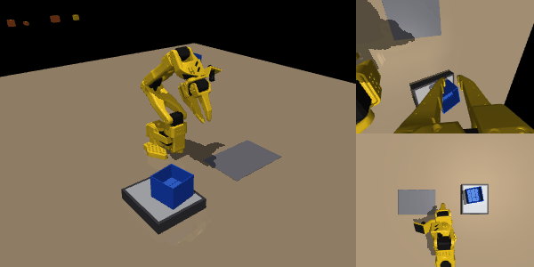 | 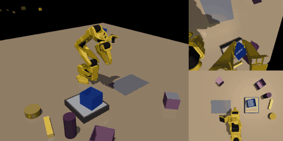 | 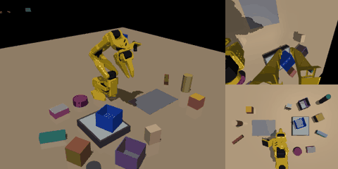 |

> **수정 (01:20)**: 처음 올린 실패 GIF 에서 통이 겹쳐 보였음. 원인 = 연속 평가에서 앞 단계가 통을 못 집어 저울 위에 남았는데도 다음 통을 같은 저울 위에 또 생성한 것 (실제 셀이면 저울에 무게가 남아 다음 통이 오지 않음). 연속 성공률 계산에는 영향 없음 (한 단계라도 실패하면 뒤는 모두 실패로 셈). **앞 단계가 실패하면 그 시퀀스를 거기서 끝내도록** 평가 코드(`eval_act.py`, `clutter_eval.py`, 팔레트는 통이 저울에 남은 경우)를 고치고 GIF 를 다시 만듦. 파일 이름의 `-` = 앞 단계 실패로 실행 안 함.

- 물건을 밀어서 실패한 경우는 0% — **실패는 전부 "헷갈려서" 통을 제대로 못 잡거나 못 놓은 것**
- 깨끗한 환경에서만 배운 모델은 잡동사니에 매우 약함 → 잡동사니 시연 모델(v9)·공장 통합 모델이 이걸 얼마나 회복하는지가 표 4 의 핵심

### 3) 앞서 올린 그림 (10/9)
- 물체·배치: `object_views.png`, 공장 장면: `factory_views.png`, 팔 경로 지도: `clutter_keepout.png`, 시연 점검: `demo_audit_general.png`, 팔레트 치우침: `pallet_state_noise.png` → [10/9 일지](2026-10-09.md)

## 00:35~00:45 GPU 메모리 문제와 재시작

- GPU(11GB)를 학습 6개(각 1.4GB) + 렌더링 작업 십여 개가 나눠 쓰다 **꽉 참** → 팔레트 5번 칸(잡음 0.1) 학습이 메모리 부족으로 시작 실패, 시연 GIF 4개 렌더링 실패
- 고친 것: 렌더링이 실패하면 1분마다 다시 시도(`make_renderer`), 학습은 **동시에 최대 4개 + 여유 3GB 이상일 때만** 시작
- 남은 일을 한 관리 스크립트로 통합 (`orchestrate.py`, `act-orch`): 학습 23개(우선순위: 잡음 확인 → ③ 통합 → 팔레트 v3·② 컵/상자 번갈아), ③ 시연 48묶음, 평가 14개
- ⚠ 기존 실행 스크립트를 멈추는 과정에서 그 안에서 돌던 **컵 1층 학습(16k/30k), 잡음 확인 학습(14k), ③ 시연 6묶음이 같이 꺼짐** → 처음부터 다시 (약 2~3시간 손실, 일요일 마감은 유지)

## 진행 중

→ 맨 위 12:50 요약 참고
