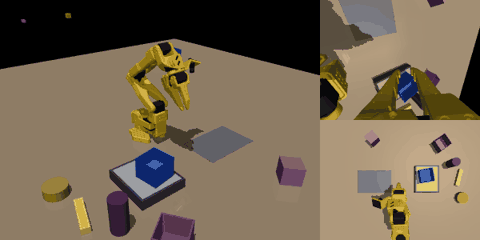
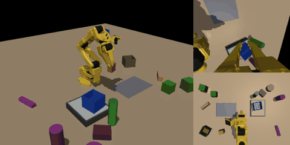

# 2026-10-10 (토) — 08 개인논문 ACT 적재

목표: **일요일(10/11) 안에** 실험 마무리 + 논문·심사용 4쪽 완성 (포스터 보류)

## 00:50 지금까지 사진·GIF 모음

### 1) 스크립트 시연 — 다른 물체·공장 환경 (학습 데이터가 이렇게 생김)

| 깨끗한 환경 — 6각 손잡이 컵 | 깨끗한 환경 — 직사각형 상자 |
|---|---|
|  |  |

| 공장 — 통 | 공장 — 컵 (좌우 반전 배치) | 공장 — 상자 |
|---|---|---|
|  |  |  |

*각 GIF: 왼쪽 전체 화면, 오른쪽 위 손목 카메라, 오른쪽 아래 상단 카메라. 5개 모두 1층 → 옆 → 2층 성공*

- 공장 장면은 매번 컨베이어(물건이 흘러감)·선반·기둥·제어함·천장 케이블·경고 테이프·부품·닮은 통·지나가는 물체·깜빡이는 조명이 무작위로 바뀜
- ③ 통합 모델은 이런 시연 1800개(3물체 × 2배치 × 300)로 단계별 모델 하나를 학습

### 2) 첫 정책 결과 — 최종 모델 v5 (무작위화 없음) 를 잡동사니에 그대로 넣으면

| 조건 | 1층 | 옆 | 2층 | **연속 3단계** |
|---|---|---|---|---|
| 잡동사니 없음 (같은 장면) | 100 | 100 | 98 | **98%** |
| 물건 4개 + 닮은 빈 통 | 46 | 70 | 54 | **22%** |
| 물건 8개 + 닮은 통 + 지나가는 물체 | 42 | 22 | 40 | **0%** |

| 잡동사니 없음 — 성공 | 닮은 통 — 실패 | 전부 — 실패 |
|---|---|---|
|  |  |  |

- 물건을 밀어서 실패한 경우는 0% — **실패는 전부 "헷갈려서" 통을 제대로 못 잡거나 못 놓은 것**
- 깨끗한 환경에서만 배운 모델은 잡동사니에 매우 약함 → 잡동사니 시연 모델(v9)·공장 통합 모델이 이걸 얼마나 회복하는지가 표 4 의 핵심

### 3) 앞서 올린 그림 (10/9)
- 물체·배치: `object_views.png`, 공장 장면: `factory_views.png`, 팔 경로 지도: `clutter_keepout.png`, 시연 점검: `demo_audit_general.png`, 팔레트 치우침: `pallet_state_noise.png` → [10/9 일지](2026-10-09.md)

## 00:35~00:45 GPU 메모리 문제와 재시작

- GPU(11GB)를 학습 6개(각 1.4GB) + 렌더링 작업 십여 개가 나눠 쓰다 **꽉 참** → 팔레트 5번 칸(잡음 0.1) 학습이 메모리 부족으로 시작 실패, 시연 GIF 4개 렌더링 실패
- 고친 것: 렌더링이 실패하면 1분마다 다시 시도(`make_renderer`), 학습은 **동시에 최대 4개 + 여유 3GB 이상일 때만** 시작
- 남은 일을 한 관리 스크립트로 통합 (`orchestrate.py`, `act-orch`): 학습 23개(우선순위: 잡음 확인 → ③ 통합 → 팔레트 v3·② 컵/상자 번갈아), ③ 시연 48묶음, 평가 14개
- ⚠ 기존 실행 스크립트를 멈추는 과정에서 그 안에서 돌던 **컵 1층 학습(16k/30k), 잡음 확인 학습(14k), ③ 시연 6묶음이 같이 꺼짐** → 처음부터 다시 (약 2~3시간 손실, 일요일 마감은 유지)

## 진행 중 (00:50)

| 작업 | 상태 | 예상 |
|---|---|---|
| ① v9 (잡동사니 시연 1000개) 학습 | 1층 24k, 옆·2층 12k / 30k | 03:30 |
| ① 잡동사니·공장 평가 (v5, v6 → v9) | 연속 3단계만, 6조건 | v5·v6 04:00경, v9 07:00경 |
| ③ 공장 통합 시연 | 54묶음 중 6 완료 | 10:00경 |
| 관절 잡음 확인 (원래 3단계 옆 단계) | 학습 재시작 | 06:00경 |
| 팔레트 v3 (8칸 모두 관절 잡음) | 대기열 | 토 저녁 |
| ② 컵·상자 사람식 vs 규칙 (12개) | 대기열 | 토 저녁 |
| ③ 통합 학습 → 평가 | 시연 후 | 토 밤 |
| 논문·심사용 4쪽 | 새 구조 초안 완료, 결과 자동 채움 | 일요일 |
